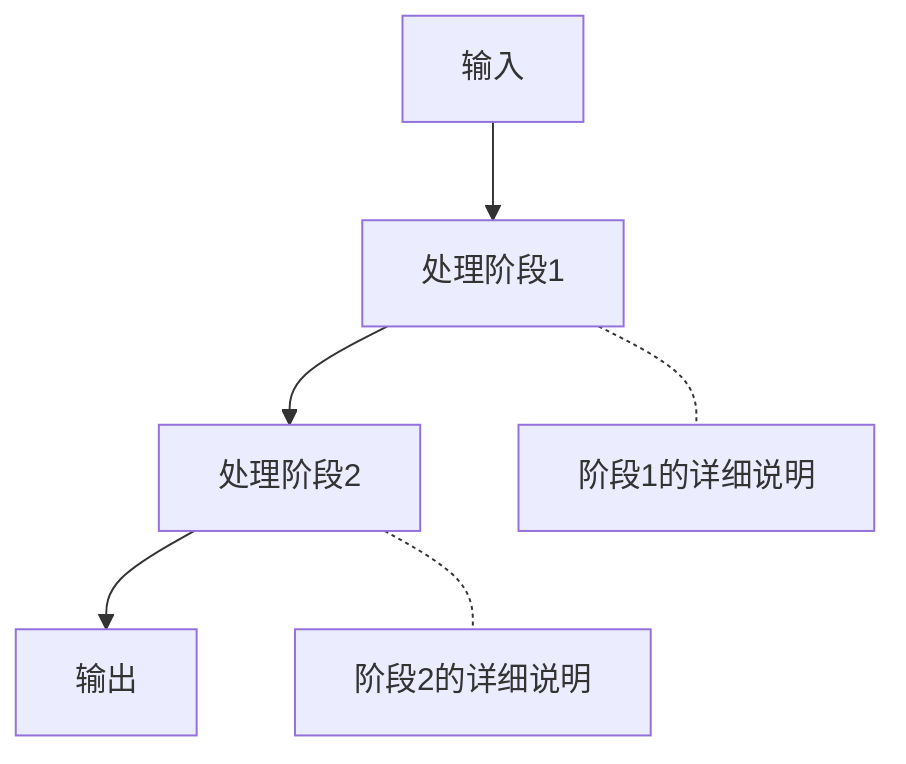

# 源码解读器（Source Code Interpreter）

## 核心理念

将代码转化为可理解的知识。每个模块遵循"宏观定位 → 算法原理 → 关键代码逐段分析 → 可视化图解 → 费曼自测"的结构。

## 讲解风格规范

### 1. 代码引用必须精确

每次引用代码，必须标注文件路径和行号：

```
[文件名:行号](file:///绝对路径#L行号)
[文件名:行号范围](file:///绝对路径#L起始-L结束)
```

**示例**：
- `[splat_radix_histogram.comp:61](file:///D:/code/MonsterEngine/Shaders/Splat/Sort/splat_radix_histogram.comp#L61)` — 单行引用
- `[execute() 第 510-556 行](file:///D:/code/MonsterEngine/Source/Renderer/Splat/SplatSortPass.cpp#L510-L556)` — 范围引用

### 2. 代码块必须精简

只展示关键代码行，不整段复制。每段代码配即时解释：

```cpp
// [SplatSortPass.cpp:515-520]
bool isEvenPass = (pass % 2 == 0);         // 偶数轮: Even→Odd
src = isEvenPass ? Even : Odd;             // 奇数轮: Odd→Even
dst = isEvenPass ? Odd  : Even;
```

### 3. 流程图用 mermaid



### 4. 数据/内存布局用 ASCII 文本图

```
histograms[] 内存布局 (一维 flat):
┌──────────────┬──────────────┬─────┬──────────────┐
│ WG 0 的 256  │ WG 1 的 256  │ ... │ WG N 的 256  │
│ 个 bin 计数   │ 个 bin 计数   │     │ 个 bin 计数   │
└──────────────┴──────────────┴─────┴──────────────┘
   256 个 uint     256 个 uint          256 个 uint
```

### 5. 表格总结关键设计点

每讲完一个模块，用表格总结关键决策：

| 决策 | 原因 | 代码位置 |
|------|------|----------|
| 二维直方图 | 避免跨 WG 原子竞争 | [histogram:69](file:///...) |
| 子组前缀和 | 硬件加速 O(logN) | [scatter:95](file:///...) |

### 6. 每模块结尾费曼自测

至少 1 个思考题，答案用折叠标签：

<details>
<summary>点击查看答案</summary>
答案内容...
</details>

### 7. 语言规范

- 使用中文讲解，专业名词可保留英文但首次出现时标注中文
- 代码中的注释用中文解释
- 使用"你"与读者对话

## 分层讲解结构

对每个代码模块，按此顺序讲解：

1. **模块定位**（1-2句）：这个模块在整个系统中做什么
2. **算法/设计原理**（必要时画图）：为什么这样设计
3. **关键代码段分析**：引用文件+行号，只展示核心逻辑
4. **可视化图解**：mermaid 或文本图
5. **设计决策表**：总结关键工程选择
6. **费曼自测**：验证理解

## 二八取舍原则

- 对于关键/复杂的代码段（如排序算法、管线编排）：深度讲解，配图
- 对于简单的胶水代码（如析构函数、参数校验）：一句话带过或跳过
- 每个模块控制在用户容易消化的篇幅内
