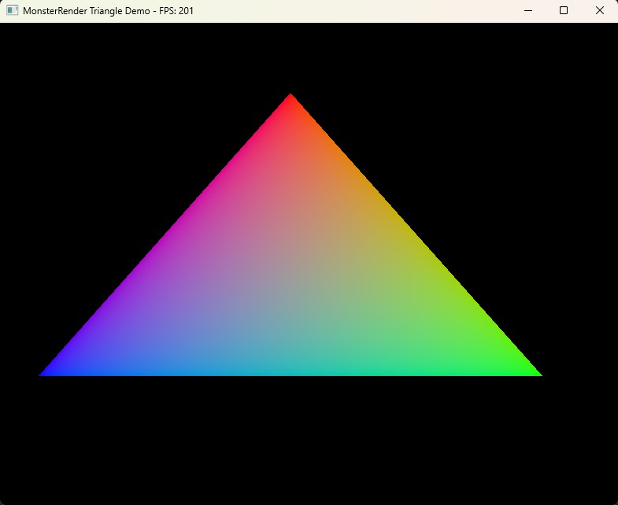
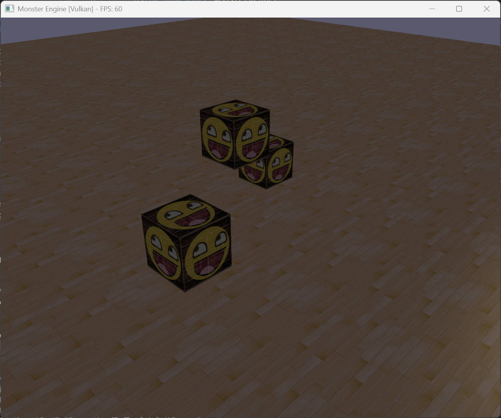

# MonsterEngine


[](https://www.microsoft.com/windows)

[](https://www.android.com)

[](https://en.cppreference.com/w/cpp/20)

[](https://www.vulkan.org)

[](https://www.opengl.org)


MonsterEngine 是一个基于 Vulkan 和 OpenGL 构建的现代 3D 渲染引擎，架构设计参考 Unreal Engine 5。引擎设计目标是跨平台、高性能，并为实时 physically-based rendering 提供丰富的功能支持。


**参考项目**: [Unreal Engine 5](https://github.com/EpicGames/UnrealEngine) | [Google Filament](https://github.com/google/filament)


---


## 下载


MonsterEngine 目前处于活跃开发阶段。使用引擎请按照 [构建说明](#构建) 从源码编译。


如果您想从源码构建 MonsterEngine，请参考我们的 [构建手册](BUILD.md)。


---


## 文档


- **[引擎架构](devDocument/引擎的架构和设计.md)** - 深入讲解引擎架构、RHI 设计和实现细节

- **[Shader 文档](Shaders/README.md)** - Shader 系统概述和着色器编写指南


---


## 示例效果







---


## 功能特性


### APIs


- **Native C++ API** 支持 Windows 和 Android

- **RHI Abstraction Layer** - 跨多个后端的统一渲染接口


### Backends


- **Vulkan 1.0+** 支持 Windows 和 Android（主要后端）

- **OpenGL 4.5+** 支持 Windows

- **OpenGL ES 3.0+** 支持 Android

- 计划支持：**Direct3D 12** for Windows, **Metal** for macOS/iOS


### 核心架构


- **RHI (Render Hardware Interface)** - UE5 风格的硬件抽象层

  - Platform-agnostic rendering commands

  - 基于 RAII 的自动资源生命周期管理

  - Modern command list architecture

  - 高效的 pipeline state management

- **跨平台支持** - Windows, Android（计划支持 Linux 和 macOS）

- **Modern C++20** - 使用最新语言特性和最佳实践

- **自定义内存管理** - FMemory, FMemoryManager, FMallocBinned2

- **自定义容器系统** - TArray, TMap, TSet, FString, FName, FText

- **智能指针系统** - TSharedPtr, TUniquePtr, TWeakPtr


### 渲染系统


- **Physically-Based Rendering (PBR)**

  - Cook-Torrance microfacet specular BRDF

  - Lambertian diffuse BRDF

  - Metallic-roughness workflow

  - Image-based lighting (IBL) support

  - Clear coat materials

  - Normal mapping & ambient occlusion

- **Forward Rendering Pipeline**

  - Clustered forward rendering

  - Multi-pass rendering support

  - Depth pre-pass optimization

- **光照系统**

  - Directional lights with cascaded shadow maps

  - Point lights and spot lights

  - Ambient lighting

  - 动态光源管理

  - Per-pixel lighting calculations

- **阴影渲染**

  - Shadow projection and filtering

  - 可配置的阴影质量

- **材质系统**

  - PBR material parameters (metallic, roughness, reflectance)

  - 纹理支持（base color, metallic-roughness, normal, occlusion, emissive）

  - Material instancing and caching

  - 默认材质回退机制

- **纹理系统**

  - 2D texture support with mipmap generation

  - Texture streaming manager

  - Virtual texture system（计划中）

  - 默认纹理管理（white, black, normal 等）

- **Descriptor Set Management**

  - Per-frame, per-material, per-object descriptor sets

  - 高效的 descriptor pooling and caching

  - 自动 descriptor 更新


### 场景管理


- **Scene Graph** - UE5 风格的场景表示

  - Primitive scene proxies

  - Light scene info and proxies

  - Scene visibility computation

- **相机系统**

  - Camera manager with view target blending

  - FPS camera controller

  - Camera modifiers and effects

  - Orthographic and perspective projection

- **剔除系统**

  - Frustum culling

  - Occlusion culling（计划中）

  - Octree spatial partitioning

- **渲染队列**

  - Mesh batch collection

  - Render command sorting

  - Multi-pass rendering support


### Shader 系统


- **Shader Manager** - 集中式 shader 编译和缓存

  - GLSL shader compilation to SPIR-V

  - Shader hot-reload support

  - Bytecode caching for fast startup

- **Shader 库**

  - PBR shading models

  - BRDF implementations

  - Lighting calculations

  - Shadow mapping utilities

  - Common shader utilities


### 平台层


- **窗口系统** - 基于 GLFW 的跨平台窗口管理

  - Native surface integration for Vulkan

  - Event-driven input handling

  - 多窗口支持

- **输入系统**

  - 键盘和鼠标输入

  - Event callbacks and polling

  - Input mapping and binding

- **内存管理**

  - Vulkan memory manager (VMA-style)

  - GPU resource tracking

  - Memory budget management


### 编辑器与工具


- **ImGui Integration** - 用于调试的即时模式 GUI

  - 渲染统计信息显示

  - 材质参数编辑

  - 场景层级查看器

- **Shader Compiler** - 离线 shader 编译工具

- **资源管线**（计划中）

  - Mesh import (glTF 2.0)

  - Texture import and compression

  - Material authoring


---


## 使用 MonsterEngine 进行渲染


### Windows


创建 `Engine`，初始化 RHI device，并设置 renderer：


```cpp

#include "Engine.h"

#include "RHI/RHI.h"

#include "Renderer/PBR/PBRRenderer.h"


using namespace MonsterEngine;

using namespace MonsterRender::RHI;


// Create engine

auto engine = MakeUnique<Engine>();


// Initialize RHI

RHICreateInfo rhiInfo;

rhiInfo.preferredBackend = ERHIBackend::Vulkan;

rhiInfo.enableValidation = true;

rhiInfo.applicationName = "My Application";

rhiInfo.windowWidth = 1920;

rhiInfo.windowHeight = 1080;


if (!engine->initialize(rhiInfo)) {

    // Handle error

    return false;

}


// Get RHI device

IRHIDevice* device = engine->getRHIDevice();


// Create PBR renderer

auto pbrRenderer = MakeShared<Renderer::FPBRRenderer>();

if (!pbrRenderer->initialize(device)) {

    // Handle error

    return false;

}

```


渲染一帧，设置视图并渲染物体：


```cpp

// Begin frame

pbrRenderer->beginFrame(frameIndex);


// Set camera view

pbrRenderer->setViewMatrices(viewMatrix, projectionMatrix, cameraPosition);

pbrRenderer->setViewport(width, height);


// Set lighting

pbrRenderer->setDirectionalLight(

    Math::FVector(0.0, -1.0, -0.5),  // direction

    Math::FVector(1.0, 1.0, 0.9),     // color

    1.0f);                             // intensity


// Update per-frame buffers

pbrRenderer->updatePerFrameBuffers();


// Get command list

IRHICommandList* cmdList = device->getImmediateCommandList();

cmdList->begin();


// Bind per-frame descriptor set

pbrRenderer->bindPerFrameDescriptorSet(cmdList);


// Set pipeline state

cmdList->setPipelineState(pipelineState);


// Draw objects with materials

pbrRenderer->drawObject(cmdList, material, modelMatrix, 

                        vertexBuffer, indexBuffer, 

                        vertexCount, indexCount);


cmdList->end();


// Present

device->present();


// End frame

pbrRenderer->endFrame();

```


### 创建 PBR 材质


使用 `FPBRMaterial` 类创建材质：


```cpp

#include "Renderer/PBR/PBRMaterial.h"

#include "Engine/Texture/Texture2D.h"


using namespace MonsterEngine::Renderer;


// Create material

auto material = FPBRMaterial::createMetallic(

    device, 

    descriptorManager,

    Math::FVector3f(0.8f, 0.8f, 0.8f),  // base color

    0.3f);                               // roughness


// Set material parameters

material->setMetallic(1.0f);

material->setRoughness(0.2f);

material->setReflectance(0.5f);


// Load and set textures

auto baseColorTex = FTexture2D::createFromFile(device, "textures/albedo.png");

material->setBaseColorTexture(baseColorTex.get());


auto normalTex = FTexture2D::createFromFile(device, "textures/normal.png");

material->setNormalTexture(normalTex.get());


// Update GPU resources

material->updateGPUResources();

```


### 场景管理


使用 primitives 和 lights 构建场景：


```cpp

#include "Renderer/Scene.h"

#include "Engine/Actor.h"


using namespace MonsterEngine::Renderer;


// Create scene

auto scene = MakeShared<FScene>();


// Add primitive to scene

FPrimitiveSceneProxy* proxy = CreateMeshProxy(mesh, material);

scene->AddPrimitive(proxy);


// Add directional light

FLightSceneProxy* lightProxy = CreateDirectionalLightProxy(

    Math::FVector(0, -1, -0.5),  // direction

    Math::FVector(1, 1, 0.9),     // color

    1.0f);                        // intensity

scene->AddLight(lightProxy);


// Update scene

scene->UpdateAllPrimitiveSceneInfos();

```


---


## 构建


### 前置要求


| 软件 | 最低版本 | 推荐版本 | 说明 |

|------|---------|---------|------|

| **CMake** | 3.20 | 3.28+ | 构建系统生成器 |

| **Visual Studio** | 2022 | 2022 | MSVC 编译器（Windows） |

| **Vulkan SDK** | 1.3.x | 1.4.x | 图形 API |

| **Windows SDK** | 10.0 | 10.0.22621.0 | Windows 开发工具 |


**Android (计划支持):**

- Android Studio

- Android NDK r21+

- Vulkan SDK for Android


### 环境变量


确保以下环境变量已正确设置：


```powershell

# 检查 Vulkan SDK

echo $env:VULKAN_SDK

# 应输出: C:\VulkanSDK\1.4.xxx.x


# 检查 CMake

cmake --version

# 应输出: cmake version 3.20 或更高

```


### 快速开始


#### 方法 1: 使用 CMake + Visual Studio 2022 (推荐)


```powershell

# 1. 克隆仓库

git clone https://github.com/yourusername/MonsterEngine.git

cd MonsterEngine


# 2. 创建构建目录

mkdir build

cd build


# 3. 生成 Visual Studio 解决方案

cmake .. -G "Visual Studio 17 2022" -A x64


# 4. 打开生成的解决方案

start MonsterEngine.sln


# 5. 在 Visual Studio 中按 F5 编译并运行

```


#### 方法 2: 使用 CMake 命令行


```powershell

# 1. 创建构建目录

mkdir build

cd build


# 2. 配置项目 (Debug)

cmake .. -G "Visual Studio 17 2022" -A x64 -DCMAKE_BUILD_TYPE=Debug


# 3. 编译项目

cmake --build . --config Debug --parallel 8


# 4. 运行程序

.\bin\Debug\MonsterEngine.exe

```


#### 方法 3: 使用传统 Visual Studio 项目


```powershell

# 1. 在 Visual Studio 2022 中打开 MonsterEngine.sln

# 2. 设置配置为 Debug x64 或 Release x64

# 3. 构建解决方案 (Ctrl+Shift+B)

# 4. 运行应用程序

.\x64\Debug\MonsterEngine.exe

```


### 详细构建说明


完整的构建说明、故障排除和高级选项，请参考 [BUILD.md](BUILD.md)。


### 编译 Shaders


```bash

cd Shaders

compile_shaders.bat

```


这将把所有 GLSL shaders 编译为 SPIR-V bytecode。


---


## 目录结构


本仓库包含 MonsterEngine 核心、支持库和工具。


- `Include/` - 公共头文件

  - `Core/` - 核心引擎系统（Log, Memory, Assert, Application）

  - `Containers/` - 自定义容器类型（TArray, TMap, FString, FName）

  - `Math/` - 数学库（Vector, Matrix, Quaternion）

  - `RHI/` - Render Hardware Interface（抽象渲染 API）

  - `Platform/` - 平台特定实现

    - `Vulkan/` - Vulkan backend implementation

    - `OpenGL/` - OpenGL backend implementation

    - `GLFW/` - GLFW window system

  - `Renderer/` - 高级渲染系统

    - `PBR/` - Physically-based rendering

    - `Scene/` - Scene management

  - `Engine/` - 引擎级系统

    - `Camera/` - Camera management

    - `Shader/` - Shader management

    - `Texture/` - Texture management

    - `Material/` - Material system

  - `Editor/` - 编辑器和工具

    - `ImGui/` - ImGui integration

- `Source/` - 实现文件（镜像 Include 结构）

- `Shaders/` - Shader 源文件

  - `Common/` - Common shader utilities (BRDF, lighting, shadows)

  - `PBR/` - PBR shaders

  - `Forward/` - Forward rendering passes

  - `Material/` - Material shaders

  - `Lighting/` - Lighting shaders

- `3rd-party/` - 第三方库

  - `imgui/` - Dear ImGui

  - `stb/` - STB image library

  - `cgltf/` - glTF loader

- `devDocument/` - 开发文档

- `Tests/` - 单元测试和集成测试


---


## 示例


### 三角形渲染


```cpp

#include "TriangleRenderer.h"


class TriangleApp : public MonsterRender::Application {

    TUniquePtr<TriangleRenderer> m_renderer;

    

    void onInitialize() override {

        m_renderer = MakeUnique<TriangleRenderer>();

        m_renderer->initialize(getEngine()->getRHIDevice());

    }

    

    void onRender() override {

        auto* cmdList = getEngine()->getRHIDevice()->getImmediateCommandList();

        cmdList->begin();

        m_renderer->render(cmdList);

        cmdList->end();

        getEngine()->getRHIDevice()->present();

    }

};

```


### PBR 立方体场景


```cpp

#include "CubeSceneApplication.h"


// Run PBR cube scene with lighting and shadows

auto app = MakeUnique<CubeSceneApplication>();

app->run();

```


---


## 性能考虑


### GPU 性能


- **Descriptor Set Pooling** - 高效的 descriptor 分配和重用

- **Command Buffer Pooling** - 最小化 command buffer 分配开销

- **Pipeline State Caching** - 缓存 pipeline states 以快速查找

- **Resource State Tracking** - 最小化不必要的资源转换


### CPU 性能


- **Multi-threaded Command Recording** - 并行 command list 生成（计划中）

- **Job System** - 基于任务的 CPU 并行工作（计划中）

- **Memory Pooling** - 为频繁分配使用自定义分配器

- **SIMD Math** - 向量化数学运算（计划中）


### 内存性能


- **GPU Memory Manager** - VMA 风格的内存分配

- **Texture Streaming** - 按需加载纹理

- **Resource Budgets** - 跟踪和管理内存使用

- **Smart Pointers** - 自动资源清理


---


## 调试


### RenderDoc 集成


使用 RenderDoc 捕获帧：


```bash

"C:\Program Files\RenderDoc\renderdoccmd.exe" capture --working-dir "E:\MonsterEngine" "E:\MonsterEngine\x64\Debug\MonsterEngine.exe" --cube-scene

```


### Validation Layers


在 debug 构建中启用 Vulkan validation layers：


```cpp

RHICreateInfo rhiInfo;

rhiInfo.enableValidation = true;  // Enable validation

rhiInfo.enableDebugMarkers = true; // Enable debug markers

```


### 日志系统


使用日志系统进行调试：


```cpp

MR_LOG(LogRenderer, Log, "Rendering frame %u", frameIndex);

MR_LOG(LogRenderer, Warning, "Material not found: %s", *materialName.ToString());

MR_LOG(LogRenderer, Error, "Failed to create pipeline state");

```


日志级别：`VeryVerbose`, `Verbose`, `Log`, `Warning`, `Error`, `Fatal`


---


## 贡献


1. 遵循 [编码规范](.windsurf/rules/wind-monster-peoject-rule.md)

2. 所有代码必须在 Visual Studio 2022 中无警告编译

3. 在 Vulkan 和 OpenGL 后端上测试

4. 使用 Doxygen 风格注释记录公共 API

5. 遵循 UE5 命名约定和架构模式

6. 所有代码注释和日志使用英文

7. 确保多线程代码的线程安全

8. 使用 RenderDoc 测试以验证正确渲染


---


## 许可证


本项目用于教育和开发目的。请尊重所有第三方库的许可证。


---


## 依赖项


- **Vulkan SDK** - Graphics API ([Apache 2.0 License](https://www.apache.org/licenses/LICENSE-2.0))

- **GLFW** - Window and input library ([zlib License](https://www.glfw.org/license.html))

- **Dear ImGui** - Immediate mode GUI ([MIT License](https://github.com/ocornut/imgui/blob/master/LICENSE.txt))

- **STB Image** - Image loading ([Public Domain](https://github.com/nothings/stb))

- **cgltf** - glTF loader ([MIT License](https://github.com/jkuhlmann/cgltf))


---


## 致谢


- **Unreal Engine 5** - 架构和设计灵感

- **Google Filament** - PBR 渲染和材质系统参考

- **Vulkan Tutorial** - Vulkan API 学习资源

- **LearnOpenGL** - 图形编程教程

