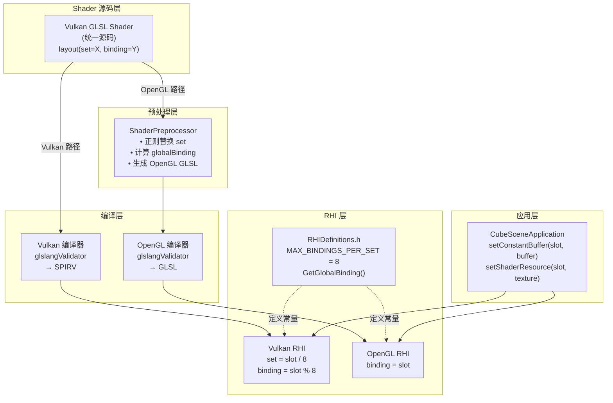
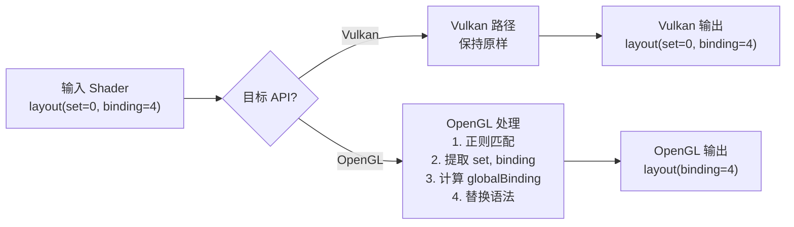

# Descriptor Set 线性展开方案设计规格

**文档版本**: 1.0  
**创建日期**: 2026-04-15  
**作者**: MonsterEngine Team  
**状态**: 已批准

---

## 目录

1. [概述](#概述)
2. [设计目标](#设计目标)
3. [架构设计](#架构设计)
4. [Descriptor Set 布局规范](#descriptor-set-布局规范)
5. [Shader 预处理器设计](#shader-预处理器设计)
6. [RHI 层实现](#rhi-层实现)
7. [实施计划](#实施计划)
8. [验收标准](#验收标准)
9. [风险和缓解措施](#风险和缓解措施)

---

## 概述

### 背景

MonsterEngine 当前使用 `MAX_BINDINGS_PER_SET = 16`，并且维护两套独立的 Shader 文件（Vulkan 和 OpenGL）。这导致：
- Shader 代码重复，维护成本高
- 容易出现 Vulkan 和 OpenGL 版本不同步的问题
- Binding 空间利用率低（大量未使用的 Binding）

### 解决方案

采用**简单线性展开方案**，参考 Godot 4 的设计思路但简化实现：
- 将 `MAX_BINDINGS_PER_SET` 改为 8
- 使用公式 `globalBinding = set * 8 + binding` 进行线性映射
- 统一 Shader 源码（只维护 Vulkan 语法）
- 实现预处理器自动转换为 OpenGL 语法

### 核心优势

1. **单一源码**：只需维护一套 Vulkan 语法的 Shader
2. **实现简单**：线性映射公式简单，无需复杂的偏移表
3. **易于调试**：映射关系透明，可以直接计算和反推
4. **行业验证**：类似方案被 Godot 4、Filament、bgfx 等引擎采用

---

## 设计目标

### 功能目标

1. ✅ 统一 Vulkan 和 OpenGL 的 Shader 源码
2. ✅ 实现自动的 Shader 预处理和转换
3. ✅ 优化 Descriptor Set 布局，提高空间利用率
4. ✅ 保持现有渲染功能不受影响

### 非功能目标

1. ✅ 降低 Shader 维护成本
2. ✅ 提高代码可读性和可维护性
3. ✅ 保持或改善渲染性能
4. ✅ 为未来扩展（D3D12、Metal）打好基础

### 约束条件

1. ⚠️ 必须兼容现有的 Vulkan 和 OpenGL 后端
2. ⚠️ 不能破坏现有的渲染功能
3. ⚠️ 必须符合 OpenGL 的 Binding 数量限制（通常 36-84）
4. ⚠️ 必须符合 Vulkan 的最小保证（4 个 Descriptor Set）

---

## 架构设计

### 系统架构图



### 核心组件

#### 1. RHI 定义层（RHIDefinitions.h）

**职责**：
- 定义 Descriptor Set 布局常量
- 提供线性映射函数
- 定义 Set 用途枚举

**接口**：
```cpp
namespace MonsterRender::RHI {
    constexpr uint32 MAX_BINDINGS_PER_SET = 8;
    constexpr uint32 MAX_DESCRIPTOR_SETS = 4;
    
    enum class EDescriptorSet : uint32 {
        PerFrame = 0,
        PerPass = 1,
        PerMaterial = 2,
        PerObject = 3
    };
    
    constexpr uint32 GetGlobalBinding(uint32 set, uint32 binding);
    constexpr void GetSetAndBinding(uint32 globalBinding, uint32& outSet, uint32& outBinding);
}
```

#### 2. Shader 预处理器（ShaderPreprocessor）

**职责**：
- 解析 Vulkan 语法的 Shader
- 移除 `set` 关键字
- 重新计算 `binding` 值
- 生成 OpenGL 语法的 Shader

**接口**：
```cpp
class FShaderPreprocessor {
public:
    static FString PreprocessShader(
        const FString& source,
        ERHIBackend targetAPI,
        uint32 maxBindingsPerSet = MAX_BINDINGS_PER_SET
    );
    
private:
    static FString ConvertVulkanLayoutToOpenGL(
        const FString& source,
        uint32 maxBindingsPerSet
    );
};
```

#### 3. Vulkan RHI 层

**职责**：
- 将 slot 转换为 (set, binding)
- 更新 Descriptor Set

**关键修改**：
```cpp
void setConstantBuffer(uint32 slot, TSharedPtr<IRHIBuffer> buffer) {
    uint32 set = slot / MAX_BINDINGS_PER_SET;
    uint32 binding = slot % MAX_BINDINGS_PER_SET;
    // 更新 Descriptor Set
}
```

#### 4. OpenGL RHI 层

**职责**：
- 直接使用 slot 作为 binding point

**关键修改**：
```cpp
void setConstantBuffer(uint32 slot, TSharedPtr<IRHIBuffer> buffer) {
    // 直接使用 slot
    glBindBufferBase(GL_UNIFORM_BUFFER, slot, glBufferHandle);
}
```

---

## Descriptor Set 布局规范

### 布局原则

按**更新频率**分组，遵循现代渲染引擎最佳实践（UE5、Godot 4）：
- **Set 0**: Per-Frame 数据（每帧更新 1 次）
- **Set 1**: Per-Pass 数据（每个渲染通道更新）
- **Set 2**: Per-Material 数据（每个材质更新）
- **Set 3**: Per-Object 数据（每个物体更新）

### 详细 Binding 分配表

| Set | Binding | 用途 | 资源类型 | 更新频率 | 全局 Binding | 示例 |
|-----|---------|------|----------|----------|-------------|------|
| **Set 0: Per-Frame** | | | | 每帧 1 次 | | |
| 0 | 0 | ViewUBO | Uniform Buffer | 每帧 | 0 | Camera, Projection |
| 0 | 1 | TimeUBO | Uniform Buffer | 每帧 | 1 | Time, DeltaTime |
| 0 | 2-7 | 预留 | - | - | 2-7 | 未来扩展 |
| **Set 1: Per-Pass** | | | | 每通道 1-N 次 | | |
| 1 | 0 | LightingUBO | Uniform Buffer | 每通道 | 8 | Lights 数据 |
| 1 | 1 | ShadowUBO | Uniform Buffer | 每通道 | 9 | Shadow 参数 |
| 1 | 2 | ShadowMap | Texture | 每通道 | 10 | 阴影贴图 |
| 1 | 3-7 | 预留 | - | - | 11-15 | SSAO, Reflection 等 |
| **Set 2: Per-Material** | | | | 每材质 1 次 | | |
| 2 | 0 | MaterialUBO | Uniform Buffer | 每材质 | 16 | 材质参数 |
| 2 | 1 | AlbedoMap | Texture | 每材质 | 17 | 基础颜色 |
| 2 | 2 | NormalMap | Texture | 每材质 | 18 | 法线贴图 |
| 2 | 3 | MetallicRoughnessMap | Texture | 每材质 | 19 | 金属度/粗糙度 |
| 2 | 4 | EmissiveMap | Texture | 每材质 | 20 | 自发光 |
| 2 | 5-7 | 预留 | - | - | 21-23 | AO, Height 等 |
| **Set 3: Per-Object** | | | | 每物体 1 次 | | |
| 3 | 0 | ObjectUBO | Uniform Buffer | 每物体 | 24 | Model Matrix |
| 3 | 1-7 | 预留 | - | - | 25-31 | Instance 数据等 |

### 线性映射公式

```cpp
// Vulkan (set, binding) → OpenGL binding
globalBinding = set * MAX_BINDINGS_PER_SET + binding

// 示例：
// (set=0, binding=0) → globalBinding = 0*8+0 = 0
// (set=1, binding=1) → globalBinding = 1*8+1 = 9
// (set=2, binding=1) → globalBinding = 2*8+1 = 17
// (set=3, binding=0) → globalBinding = 3*8+0 = 24
```

### 反向映射

```cpp
// OpenGL binding → Vulkan (set, binding)
set = globalBinding / MAX_BINDINGS_PER_SET
binding = globalBinding % MAX_BINDINGS_PER_SET

// 示例：
// globalBinding=9 → set=9/8=1, binding=9%8=1
// globalBinding=17 → set=17/8=2, binding=17%8=1
```

---

## Shader 预处理器设计

### 预处理流程



### 正则表达式模式

```cpp
// 匹配 layout(set = X, binding = Y, ...)
std::regex layoutRegex(
    R"(layout\s*\(\s*set\s*=\s*(\d+)\s*,\s*binding\s*=\s*(\d+)([^)]*)\))"
);

// 捕获组：
// [1] = set 值
// [2] = binding 值
// [3] = 其他限定符（如 ", std140"）
```

### 预处理示例

**输入（Vulkan Shader）：**
```glsl
#version 450

layout(set = 0, binding = 0, std140) uniform ViewUBO {
    mat4 view;
    mat4 projection;
} viewData;

layout(set = 1, binding = 1, std140) uniform ShadowUBO {
    mat4 lightViewProjection;
} shadowData;

layout(set = 2, binding = 1) uniform sampler2D albedoMap;
```

**输出（OpenGL Shader）：**
```glsl
#version 450

layout(binding = 0, std140) uniform ViewUBO {
    mat4 view;
    mat4 projection;
} viewData;

layout(binding = 9, std140) uniform ShadowUBO {
    mat4 lightViewProjection;
} shadowData;

layout(binding = 17) uniform sampler2D albedoMap;
```

**计算过程：**
- `(set=0, binding=0)` → `globalBinding = 0*8+0 = 0`
- `(set=1, binding=1)` → `globalBinding = 1*8+1 = 9`
- `(set=2, binding=1)` → `globalBinding = 2*8+1 = 17`

---

## RHI 层实现

### Vulkan RHI 修改

**关键修改点：**
- `setConstantBuffer()`: 将 slot 转换为 (set, binding)
- `setShaderResource()`: 将 slot 转换为 (set, binding)

**实现逻辑：**
```cpp
void setConstantBuffer(uint32 slot, TSharedPtr<IRHIBuffer> buffer) {
    uint32 set = slot / MAX_BINDINGS_PER_SET;
    uint32 binding = slot % MAX_BINDINGS_PER_SET;
    
    // 验证范围
    if (set >= MAX_DESCRIPTOR_SETS) {
        MR_LOG_ERROR("Set index out of range");
        return;
    }
    
    // 更新 Descriptor Set
    vkUpdateDescriptorSets(...);
}
```

### OpenGL RHI 修改

**关键修改点：**
- `setConstantBuffer()`: 直接使用 slot 作为 binding point
- `setShaderResource()`: 直接使用 slot 作为纹理单元

**实现逻辑：**
```cpp
void setConstantBuffer(uint32 slot, TSharedPtr<IRHIBuffer> buffer) {
    // 直接使用 slot（无需转换）
    glBindBufferBase(GL_UNIFORM_BUFFER, slot, glBufferHandle);
}
```

### 资源绑定流程对比

| 步骤 | Vulkan | OpenGL |
|------|--------|--------|
| **输入** | slot (globalBinding) | slot (globalBinding) |
| **转换** | `set = slot / 8`<br/>`binding = slot % 8` | 无需转换 |
| **绑定** | `vkUpdateDescriptorSets(set, binding)` | `glBindBufferBase(slot)` |
| **复杂度** | 需要计算 | 直接使用 |

---

## 实施计划

### 阶段 1：核心基础设施（2 天）

**目标**：建立基础框架，不影响现有功能

**任务清单：**
1. 修改 `RHIDefinitions.h`
   - 将 `MAX_BINDINGS_PER_SET` 从 16 改为 8
   - 添加 `EDescriptorSet` 枚举
   - 添加 `GetGlobalBinding()` 和 `GetSetAndBinding()` 函数
   
2. 实现 `ShaderPreprocessor` 类
   - 创建 `Include/RHI/ShaderPreprocessor.h`
   - 创建 `Source/RHI/ShaderPreprocessor.cpp`
   - 实现正则表达式替换逻辑
   
3. 添加单元测试
   - 测试预处理器的正则匹配
   - 验证 `GetGlobalBinding()` 计算正确性

**验收标准：**
- 预处理器能正确转换示例 Shader
- 单元测试全部通过
- 不影响现有渲染功能

---

### 阶段 2：迁移 CubeLitShadow Shader（3 天）

**目标**：验证完整流程，从 Shader 到渲染

**任务清单：**
1. 重新规划 `CubeLitShadow.vert/frag`
   - 按新布局调整 `set` 和 `binding`
   - Set 0: ViewUBO (binding 0)
   - Set 1: ShadowUBO (binding 1), ShadowMap (binding 2)
   
2. 集成预处理器到编译流程
   - 修改 Shader 编译代码
   - Vulkan: 保持原样编译
   - OpenGL: 预处理后编译
   
3. 更新 Vulkan RHI
   - 修改 `setConstantBuffer()` 实现 slot 转换
   - 修改 `setShaderResource()` 实现 slot 转换
   
4. 更新 OpenGL RHI
   - 确认直接使用 slot 作为 binding
   
5. 更新 `CubeSceneApplication`
   - 使用新的 slot 值绑定资源

**验收标准：**
- Vulkan 和 OpenGL 都能正确渲染 Cube
- 阴影效果正常
- 无渲染错误或警告

---

### 阶段 3：迁移其他 Shader（4 天）

**目标**：完成所有 Shader 的迁移

**任务清单：**
1. 迁移 PBR Shader
2. 迁移 Forward Rendering Shader
3. 迁移 ImGui Shader
4. 迁移其他辅助 Shader

**验收标准：**
- 所有渲染路径正常工作
- PBR 渲染效果正确
- ImGui 界面显示正常

---

### 阶段 4：清理和优化（2 天）

**目标**：完成迁移，清理冗余代码

**任务清单：**
1. 验证所有 `_GL` Shader 文件
2. 删除 `_GL` Shader 文件
3. 性能测试
4. 文档更新

**验收标准：**
- 代码库清理完成
- 性能无退化
- 文档完整

---

## 验收标准

### 功能验收

1. ✅ Shader 预处理器能正确转换所有 Vulkan Shader
2. ✅ RHI 层资源绑定无错误
3. ✅ 所有渲染路径正常工作

### 性能验收

1. ✅ Shader 预处理时间 < 10ms
2. ✅ 运行时性能无退化
3. ✅ 内存使用无显著增加

### 代码质量验收

1. ✅ 遵循 MonsterEngine 代码规范
2. ✅ 所有测试通过
3. ✅ 文档完整

---

## 风险和缓解措施

### 风险 1：预处理器正则表达式匹配失败

**风险等级**：中

**缓解措施**：
1. 编写全面的单元测试
2. 保留 `_GL` Shader 文件作为参考
3. 添加详细的错误日志

**应急计划**：回退到手动维护 `_GL` Shader

---

### 风险 2：Binding 数量超出 OpenGL 限制

**风险等级**：低

**缓解措施**：
1. 查询 OpenGL 限制
2. 验证总 Binding 数量在限制内
3. 合理规划 Set 布局

**应急计划**：减少 `MAX_BINDINGS_PER_SET` 到 4

---

### 风险 3：现有渲染功能破坏

**风险等级**：中

**缓解措施**：
1. 分阶段实施，逐步验证
2. 每个阶段完成后进行全面测试
3. 保留 git 历史，便于回退

**应急计划**：回退到上一个稳定版本

---

## 附录

### A. 参考资料

1. Godot 4 源码
2. Filament 源码
3. bgfx 源码
4. Vulkan 规范
5. OpenGL 规范

### B. 术语表

| 术语 | 定义 |
|------|------|
| **Descriptor Set** | Vulkan 中一组相关资源的集合 |
| **Binding** | 资源在 Descriptor Set 或 Shader 中的绑定点 |
| **线性展开** | 将多维索引（set, binding）映射到一维索引（globalBinding） |
| **预处理器** | 在编译前转换 Shader 源码的工具 |
| **RHI** | Render Hardware Interface，渲染硬件接口 |

---

**文档结束**
