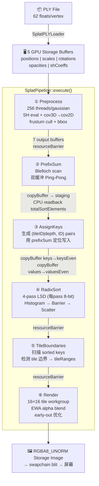

# Vulkan 原生 3DGS Splat Pass — 代码阅读向导

> **文档性质**：结构化代码学习向导
> **创建日期**：2026-08-05
> **关联开发文档**：[Vulkan原生3DGS_splat_pass开发文档.md](./Vulkan原生3DGS_splat_pass开发文档.md)
> **目标读者**：李燕良（6年渲染引擎经验，已掌握 3DGS 数学理论 + CUDA Rasterizer）
>
> **学习理念**：费曼学习法（以教代学） + 金字塔学习法（基础→应用→体系） + 二八取舍（关键知识深读，简单代码扫读）

---

## 0. 在你开始之前：自我定位

你已经掌握了以下知识，**本向导不再重复讲解**：

- ✅ 3DGS 数学：3D 协方差、Jacobian 投影、EWA 圆锥、SH 球谐颜色、alpha blend
- ✅ Vulkan 基础：RHI 抽象层、CommandBuffer、DescriptorSet、PipelineLayout
- ✅ MonsterEngine 架构：RenderGraph、VulkanRHI、内存管理器
- ✅ CUDA Rasterizer：`rasterizer_impl.cu` 源码级精读，理解前向/反向链路

**你需要学习的**（本向导重点）：

1. 这 6 个 Compute Pass **怎么在 MonsterEngine RHI 中运转起来**
2. GPU 排序链路（RadixSort 4-pass）**如何实现**
3. RHI 层为 Compute 支持**补齐了哪些基础设施**
4. SplatPipeline 编排器**如何串联** 6 个 Pass

---

## 1. 学习路线总览（金字塔结构）

```
                        ┌──────────────────────────────────┐
                        │  Layer 3: 集成与面试    (0.5h)    │
                        │  SplatPipeline 编排器              │
                        │  + 面试弹药映射                    │
                        ├──────────────────────────────────┤
                        │  Layer 2: Core Pipeline   (1.5h)  │
                        │  Preprocess → Sort → Render       │
                        │  6个 Compute Pass 逐个理解          │
                        ├──────────────────────────────────┤
                        │  Layer 1: Foundation      (1.0h)  │
                        │  RHI 基础设施 + 数据流             │
                        │  (dispatch/copyBuffer/pipeline)    │
                        └──────────────────────────────────┘
```

**总时间预算**：约 3 小时（工作日 3 天 × 1h，或 1 个周末集中攻克）

| 层级 | 时间 | 难度 | 费曼 | 说明 |
|------|------|------|------|------|
| Layer 1: 基础设施 | 1.0h | ⭐⭐ | 必做 | 理解引擎怎么接住 Compute Shader |
| Layer 2: Core Pipeline | 1.5h | ⭐⭐⭐ | 必做 | 6 个 Pass 逐个精读 |
| Layer 3: 集成 | 0.5h | ⭐⭐ | 选做 | 编排器 + 面试对练 |

---

## 2. Layer 1: 基础设施 — RHI 如何支持 Compute Shader（1.0h · 关键知识）

> **金字塔底座**：不理解这层，上面 6 个 Pass 就是空中楼阁。
> **费曼目标**：能给别人解释 "MonsterEngine 从零到一接入 Compute Shader 需要改哪些地方"。

### 2.1 核心问题（读前自问）

> 闭卷思考 30 秒：如果你要在 MonsterEngine 中加一个 Compute Shader 的 dispatch 调用，你需要修改哪些文件？

### 2.2 阅读路径（按调用链从上到下）

**第一步：接口层（10min）**

打开 [IRHICommandList.h](file:///D:/code/MonsterEngine/Include/RHI/IRHICommandList.h)，找到以下三个方法：

- `dispatch(uint32, uint32, uint32)` — 纯虚方法，所有 RHI 后端必须实现
- `copyBuffer(dst, src, size, ...)` — 虚方法，默认空实现（OpenGL 不需要）
- `pushConstants(...)` — 已有方法，Compute Shader 用它传参

> **费曼自测 1-1**：解释 `dispatch` 和 `drawIndexed` 在 RHI 抽象层上的本质区别是什么？
> <details><summary>参考答案</summary>
> `dispatch` 触发 Compute Shader 执行（无顶点/图元），`drawIndexed` 触发 Graphics Pipeline（顶点→光栅→片元）。两者在 RHI 层都是"往命令队列里记录一条 GPU 命令"，但对应的 Vulkan API 不同（`vkCmdDispatch` vs `vkCmdDrawIndexed`），底层绑定的 Pipeline 类型也不同（Compute Pipeline vs Graphics Pipeline）。
> </details>

**第二步：Shader 资源层（10min）**

打开 [IRHIResource.h](file:///D:/code/MonsterEngine/Include/RHI/IRHIResource.h)，看 `IRHIComputeShader`：

```cpp
class IRHIComputeShader : public IRHIShader {
    IRHIComputeShader() : IRHIShader(EShaderStage::Compute) {}
};
```

打开 [VulkanShader.h](file:///D:/code/MonsterEngine/Include/Platform/Vulkan/VulkanShader.h)，看 `VulkanComputeShader`：

```cpp
class VulkanComputeShader : public VulkanShader, public IRHIComputeShader {
    VulkanComputeShader(VulkanDevice* device, TSpan<const uint8> bytecode)
        : VulkanShader(device, EShaderStage::Compute, bytecode)
        , IRHIComputeShader() {}
};
```

**关键理解**：`VulkanComputeShader` 是**菱形继承**：它同时继承 `VulkanShader`（持有 VkShaderModule）和 `IRHIComputeShader`（RHI 接口标记），两者都继承自 `IRHIShader`。通过显式初始化两个基类来消除歧义——这里用的是**非虚拟继承**方案，因为虚拟继承会破坏 `static_cast` 在 SharedPointer 中的使用。

> **费曼自测 1-2**：为什么 `VulkanComputeShader` 不需要自己写 `createShaderModule` 逻辑？
> <details><summary>参考答案</summary>
> 因为 `VulkanShader` 基类已经实现了 SPIR-V 加载 → `vkCreateShaderModule` 的完整流程，它根据构造时传入的 `EShaderStage` 设置 `VK_SHADER_STAGE_COMPUTE_BIT`。`VulkanComputeShader` 只是把 stage 固定为 `Compute`，复用基类的全部逻辑。
> </details>

**第三步：Pipeline 创建层（10min）**

打开 [VulkanDevice.cpp](file:///D:/code/MonsterEngine/Source/Platform/Vulkan/VulkanDevice.cpp)，找到 `createComputePipelineState()` 方法。

- 它接收 `ComputePipelineStateDesc`（包含 `IRHIComputeShader` + `IRHIPipelineLayout`）
- 从 `VulkanComputeShader` 获取 `VkShaderModule`
- 填充 `VkComputePipelineCreateInfo`（**只有 1 个 stage，不需要 vertex/fragment**）
- 调用 `vkCreateComputePipelines`
- 通过 `VulkanComputePipelineState::initializeWithHandles()` 注入已创建的 pipeline 句柄

对比 Graphics Pipeline 创建（`createGraphicsPipeline`）——后者需要 vertex input、input assembly、rasterization、color blend、depth stencil 等一大堆状态。Compute Pipeline 极其简单。

打开 [VulkanPipelineState.h](file:///D:/code/MonsterEngine/Include/Platform/Vulkan/VulkanPipelineState.h)，看 `VulkanComputePipelineState`。注意它的设计非常轻量：

```cpp
class VulkanComputePipelineState : public IRHIPipelineState {
    VkPipeline m_pipeline;
    VkPipelineLayout m_pipelineLayout;
    bool m_isValid;
public:
    void initializeWithHandles(VkPipeline pipeline, VkPipelineLayout layout);
};
```

只有 3 个成员，没有 RenderPass、没有 VertexInput、没有一大堆 Graphics Pipeline 专有状态。这就是 Compute Pipeline 的本质——只需要一个 shader 和一个 layout。

> **费曼自测 1-3**：为什么 ComputePipelineStateDesc 不需要 vertex shader？
> <details><summary>参考答案</summary>
> 因为 Compute Shader 不经过图形管线的顶点/光栅/片元阶段。它直接对 buffer/image 做并行计算，没有顶点输入、没有图元装配、没有光栅化。Vulkan spec 中 `VkComputePipelineCreateInfo` 只有 1 个 compute stage。
> </details>

**第四步：命令执行层（15min）**

打开 [VulkanRHICommandList.cpp](file:///D:/code/MonsterEngine/Source/Platform/Vulkan/VulkanRHICommandList.cpp)，找到 `dispatch()` 的实现：

```cpp
void FVulkanRHICommandListImmediate::dispatch(uint32 groupCountX, uint32 groupCountY, uint32 groupCountZ) {
    FVulkanCmdBuffer* cmdBuffer = GetVulkanCommandBuffer();
    const auto& functions = VulkanAPI::getFunctions();
    functions.vkCmdDispatch(cmdBuffer->getHandle(), groupCountX, groupCountY, groupCountZ);
}
```

**关键细节**：`vkCmdDispatch` 是从 `VulkanAPI::getFunctions()` 动态加载的函数指针，不是直接调用。这是因为 Vulkan 函数通过 `vkGetDeviceProcAddr` 运行时加载。

找到 `copyBuffer()` 的实现：

```cpp
void FVulkanRHICommandListImmediate::copyBuffer(...) {
    VkBufferCopy copyRegion = { srcOffset, dstOffset, size };
    functions.vkCmdCopyBuffer(cmdBuffer->getHandle(), srcBuffer, dstBuffer, 1, &copyRegion);
}
```

> **费曼自测 1-4**：为什么 SplatPipeline 需要 `copyBuffer` 而不是直接在两个 Pass 间共享 buffer？
> <details><summary>参考答案</summary>
> 因为 PrefixSum 需要双缓冲（Ping-Pong），AssignKeys 的输出格式和 RadixSort 的输入格式需要对齐。`copyBuffer` 提供了 GPU 端零拷贝的数据传输，比 CPU 读回再上传高效得多。但 staging buffer readback 是例外——PrefixSum 的结果（totalSortElements）需要 CPU 知道具体数值才能初始化后续 pass 的 buffer 大小。
> </details>

**第五步：函数指针注册（5min）**

打开 [VulkanRHI.h](file:///D:/code/MonsterEngine/Include/Platform/Vulkan/VulkanRHI.h)，看 `VulkanFunctions` 结构体中的 `PFN_vkCmdDispatch vkCmdDispatch`。

打开 [VulkanAPI.cpp](file:///D:/code/MonsterEngine/Source/Platform/Vulkan/VulkanAPI.cpp)，看 `loadDeviceFunctions()` 中的：
```cpp
s_functions.vkCmdDispatch = (PFN_vkCmdDispatch)vkGetDeviceProcAddr(device, "vkCmdDispatch");
```

这是 MonsterEngine 的 Vulkan 函数动态加载范式——所有 `vk*` 函数都通过这个模式加载。

**第六步：OpenGL/Mock 后端的 stub（5min · 快速扫读）**

以下文件是编译时自动补齐的 stub 实现，目的是让 OpenGL 后端和 Mock 后端编译通过。**不需要深读**：

| 文件 | 内容 | 备注 |
|------|------|------|
| `OpenGLCommandList.cpp` | `dispatch()` 空实现 + warning log | OpenGL 后端不支持 Compute |
| `OpenGLDevice.cpp` | `createComputeShader()` 返回 nullptr | 同上 |
| `MockCommandList.h` | `dispatch()` 空实现 + debug log | 测试用 |

> **费曼总测 1**（Layer 1 完成后的闭卷测试）：
> 从 `IRHICommandList::dispatch()` 的纯虚声明开始，到 `vkCmdDispatch` 在 GPU 上执行，画出完整的调用链（至少 5 个文件）。

---

## 3. Layer 2: Core Pipeline — 6 个 Compute Pass（1.5h）

> **金字塔中层**：6 个 Pass 构成了 3DGS 渲染的完整 GPU 管线。
> **二八取舍**：Preprocess 和 Render 是核心数学（你已熟悉），快速验证理解即可；**排序链路（PrefixSum/AssignKeys/RadixSort/TileBoundaries）是新知识，重点投入**。

### 3.1 数据流全景（读代码前先看图 · 5min）

```
PLY File ──▶ FSplatPLYLoader ──▶ 5 Storage Buffers (GPU)
                                      │
                                      ▼
    ┌──────────────────────────────────────────────────────────────┐
    │                      SplatPipeline::execute()                │
    │                                                              │
    │  [1] Preprocess    ── 256 threads/gaussian, SH + cov + cull │
    │       │ 7 output buffers                                     │
    │       ▼                                                      │
    │  [2] PrefixSum     ── Blelloch scan → per-gaussian offsets  │
    │       │ copyBuffer + staging readback (totalSortElements)    │
    │       ▼                                                      │
    │  [3] AssignKeys    ── (tileID|depth, gaussianID) pairs      │
    │       │ copyBuffer keys/values → RadixSort input             │
    │       ▼                                                      │
    │  [4] RadixSort     ── 4-pass/8-bit LSD, histogram + scatter │
    │       │ sorted keys/values (by tile, then depth)             │
    │       ▼                                                      │
    │  [5] TileBounds    ── tile boundary detection               │
    │       │ tileRanges[tileID] = {start, end}                    │
    │       ▼                                                      │
    │  [6] Render        ── 16x16 tile workgroup, EWA alpha blend │
    │       │ RGBA8 storage image                                  │
    └──────────────────────────────────────────────────────────────┘
```

**关键认知**：整个管线是**生产者-消费者链**。每个 Pass 的输出是下一个 Pass 的输入。Pass 间通过 `resourceBarrier()` 保证 GPU 访问同步，通过 `copyBuffer()` 传递数据。

### 3.2 辅助模块速览（10min · 简单知识）

**SplatTypes.h** — GPU 数据布局定义。打开 [SplatTypes.h](file:///D:/code/MonsterEngine/Include/Renderer/Splat/SplatTypes.h)，看：

- `FCameraUniforms`：176 字节 `std140` 布局，注意 `static_assert` 确保大小
- `FPreprocessPushConstants`：16 字节，含 `gaussianCount`/`nearPlane`/`farPlane`/`culling`
- `EInputBinding` / `EOutputBinding`：枚举定义描述符绑定槽

> **自测**：`static_assert(sizeof(FCameraUniforms) == 176)` 的意义是什么？
> <details><summary>答案</summary>确保 C++ 侧 struct 布局与 GLSL `std140` 布局在字节级别对齐。若编译器插入 padding 导致大小 != 176，编译直接失败而非运行时产生难以调试的渲染错误。</details>

**SplatPLYLoader** — 数据入口。打开 [SplatPLYLoader.h](file:///D:/code/MonsterEngine/Include/Renderer/Splat/SplatPLYLoader.h) + [SplatPLYLoader.cpp](file:///D:/code/MonsterEngine/Source/Renderer/Splat/SplatPLYLoader.cpp)，看：

- 解析二进制小端 `.ply`，顶点大小 62 float
- 自动检测 SH degree（通过第一个顶点的 f_rest 系数）
- 激活函数：`scale→exp()`，`opacity→sigmoid()`，`quaternion→normalize()`
- 通过 `BufferDesc::initialData` 直接创建带初始数据的 GPU Buffer

> **费曼速测**：PLY Loader 和 3DGS 训练代码中的 `scene/gaussian_model.py` 的 PLY 加载有什么本质区别？
> <details><summary>答案</summary>Python 侧加载到 CPU tensor 再送入 PyTorch 训练循环；C++ 侧加载后直接上传到 GPU Storage Buffer，后续全部在 GPU 端处理。两者解析逻辑相同，但数据落脚点不同——一个是 CPU tensor，一个是 GPU buffer。</details>

**splat_common.glsl** — 公共函数库。打开 [splat_common.glsl](file:///D:/code/MonsterEngine/Shaders/Splat/splat_common.glsl)，快速确认你已熟悉的数学：

- `computeCov3D()` — scale×rotation → 3D 协方差
- `computeCov2D()` — Jacobian 投影 3D→2D
- `inFrustum()` — 视锥剔除
- SH 常量定义（`SH_C0`..`SH_C3`）

**这一步不需要精读**——这些函数你已经在 `rasterizer_impl.cu` 精读中掌握。

### 3.3 Pass 1: Preprocess（15min · 中优先级）

**文件**：[SplatPass.h](file:///D:/code/MonsterEngine/Include/Renderer/Splat/SplatPass.h) / [SplatPass.cpp](file:///D:/code/MonsterEngine/Source/Renderer/Splat/SplatPass.cpp)  
**Shader**：[splat_preprocess.comp](file:///D:/code/MonsterEngine/Shaders/Splat/splat_preprocess.comp)

**数学你已经会了，重点学以下工程点**：

**A. Descriptor Set 布局设计（5min）**

打开 `SplatPass.cpp` 的 `initialize()`，看两个 `VulkanDescriptorSetLayout` 的创建：

- **Set 0 (Input)**：6 个 binding → 对应 `splat_preprocess.comp` 的 `layout(set=0, binding=...)`
  - 5 个 `VK_DESCRIPTOR_TYPE_STORAGE_BUFFER`（positions/scales/rotations/opacities/shCoeffs）
  - 1 个 `VK_DESCRIPTOR_TYPE_UNIFORM_BUFFER`（camera）
- **Set 1 (Output)**：7 个 binding → `VK_DESCRIPTOR_TYPE_STORAGE_BUFFER`

**这是 MonsterEngine 的 Multi-Descriptor Set 设计模式的实战案例**。Input/Output 分离有两层好处：
1. Input Set 每帧不变（高斯数据不变），只需更新 Camera UBO
2. Output Set 在 pass 间可以整体替换

> **费曼自测 3-1**：为什么要用 2 个 Descriptor Set 而不是 1 个 13-binding 的 Set？
> <details><summary>答案</summary>分离读写权限。Input Set 绑定只读 buffer（可在多个 Pass 间共享），Output Set 绑定只写 buffer（每个 Pass 独占）。Vulkan 的 `VK_ACCESS_SHADER_READ_BIT` / `VK_ACCESS_SHADER_WRITE_BIT` 可以按 Set 粒度设置，避免细粒度 barrier 的复杂性。</details>

**B. Push Constants 的使用（5min）**

```cpp
m_preprocessPushConstants.gaussianCount = m_gaussianCount;
cmdList.pushConstants(m_pipelineLayout, EShaderStage::Compute, 0, sizeof(FPreprocessPushConstants), &m_preprocessPushConstants);
```

Push Constants 是小批量快速 uniform 的最佳选择（≤128 bytes）。这里只传 4 个 uint，比 UBO 少一次 buffer 绑定。

**C. Dispatch 组数计算**

```cpp
uint32 groupCount = (gaussianCount + 255) / 256;
cmdList.dispatch(groupCount, 1, 1);
```

每个工作组 256 线程（`local_size_x = 256`），刚好覆盖所有高斯。

> **费曼自测 3-2**：如果 `gaussianCount = 30000`，dispatch 多少个工作组？如果有高斯索引超出 `gaussianCount`，会怎样？
> <details><summary>答案</summary>30000/256 ≈ 118 组。超出的高斯会被 shader 开头的 `if (gaussianID >= pushConstants.gaussianCount) return;` 提前退出，不会访问越界 buffer。</details>

**D. Shader 内 SH 计算的 GLSL 限制（5min）**

打开 [splat_preprocess.comp](file:///D:/code/MonsterEngine/Shaders/Splat/splat_preprocess.comp)，注意 SH 颜色计算是**内联**的，没有抽成 `splat_common.glsl` 中的函数。原因：GLSL 不支持将 unsized array 作为函数参数传递，而 SH 系数数组大小取决于 `shDegree`。

### 3.4 Pass 2: PrefixSum（15min · 关键知识）

**文件**：[SplatSortPass.h](file:///D:/code/MonsterEngine/Include/Renderer/Splat/SplatSortPass.h) / [SplatSortPass.cpp](file:///D:/code/MonsterEngine/Source/Renderer/Splat/SplatSortPass.cpp)  
**Shader**：[splat_prefix_sum.comp](file:///D:/code/MonsterEngine/Shaders/Splat/Sort/splat_prefix_sum.comp)

**算法理解（费曼讲解）**：

Blelloch 扫描：假设你有 8 个元素 `[3, 1, 7, 0, 4, 1, 6, 3]`，要计算前缀和。

```
Step 0 (stride=1): [3, 1+3=4, 7, 7+0=7, 4, 4+1=5, 6, 6+3=9]  → [3,4,7,7,4,5,6,9]
Step 1 (stride=2): [3, 4, 7, 7+7=14, 4, 5, 6, 5+9=14]        → [3,4,7,14,4,5,6,14]
Step 2 (stride=4): [3, 4, 7, 14, 4, 5, 6, 14+14=28]          → [3,4,7,14,4,5,6,28]
```

每步 `stride = 2^step`，执行 `N/stride` 次加法，总共 `log2(N)` 步，总操作量 `O(N log N)`（比 CPU 串行的 O(N) 差，但 GPU 能并行）。

**工程重点**：双缓冲 Ping-Pong

打开 [SplatSortPass.cpp](file:///D:/code/MonsterEngine/Source/Renderer/Splat/SplatSortPass.cpp)，看 `FSplatPrefixSumPass::execute()`：

```cpp
bool readFromA = true;
for (uint32 step = 0; step < numSteps; ++step) {
    cmdList.pushConstants(..., step, numElements, readFromA);
    cmdList.dispatch(groupCount, 1, 1);
    cmdList.resourceBarrier();
    readFromA = !readFromA;  // 交替读 A 写 B，或读 B 写 A
}
```

**为什么用双缓冲**：如果只有一个 buffer，读和写会互相覆盖。用 A/B 两个 buffer 交替读写，每次迭代只需一个 dispatch。

**集成要点** — `copyBuffer` + staging readback：

打开 [SplatPipeline.cpp](file:///D:/code/MonsterEngine/Source/Renderer/Splat/SplatPipeline.cpp)，看 `execute()` 中 PrefixSum 前后：

```cpp
// 前：将 tilesTouched 复制到 PrefixSum 的 bufferA
cmdList.copyBuffer(m_prefixSum->getBufferA(), preprocessOutput->tilesTouched, ...);

// 后：将最终结果（最后一个元素 = 总条目数）复制到 staging buffer
cmdList.copyBuffer(m_stagingBuffer, m_prefixSum->getResultBuffer(), sizeof(uint32), ...);
device.waitForIdle();
uint32* mapped = (uint32*)m_stagingBuffer->map();
m_totalSortElements = *mapped;
m_stagingBuffer->unmap();
```

**这是整个管线中唯一的 CPU readback**。必须知道 `totalSortElements` 才能为 RadixSort 分配 buffer。

> **费曼自测 3-3**：为什么 PrefixSum 不直接用 `std::partial_sum` 在 CPU 上算？
> <details><summary>答案</summary>因为 tilesTouched 数据在 GPU buffer 中。如果 CPU 读回、计算、再上传，需要一次 GPU→CPU 传输 + 一次 CPU→GPU 传输。PrefixSum 的 staging readback 只读回 1 个 uint（totalSortElements），而 Blelloch 扫描的所有中间数据都留在 GPU 上，没有额外传输开销。</details>

### 3.5 Pass 3: AssignKeys（10min · 中优先级）

**Shader**：[splat_assign_keys.comp](file:///D:/code/MonsterEngine/Shaders/Splat/Sort/splat_assign_keys.comp)

**核心逻辑（费曼讲解）**：

每个 Gaussian 覆盖的 tile 矩形已知（bbox）。这个 Shader 的任务是：为每个 cover 的 tile，生成一个 `(key, value)` pair。

```
key   = (tileID << 32) | floatBitsToUint(depth)   // 64 位
value = gaussianID                                   // 32 位
```

**为什么 key 这么构造**：高 32 位是 tileID，低 32 位是 depth。后续 RadixSort 对 64 位 key 排序后，自然做到了"按 tile 分组，组内按 depth 排序"。

**写入位置的确定**：使用 PrefixSum 的结果 `prefixSum[gaussianID]` 作为写入偏移量。每个 Gaussian 知道自己前面有多少个条目，所以不会覆盖其他 Gaussian 的数据。

> **费曼自测 3-4**：如果一个 Gaussian 覆盖了 3 个 tile，它会在输出数组中占据几个位置？
> <details><summary>答案</summary>3 个位置。`prefixSum[gaussianID]` 到 `prefixSum[gaussianID+1]-1`。它的 bbox 矩形（tileMinX, tileMinY, tileMaxX, tileMaxY）覆盖 3 个 tile，shader 对这 3 个 tile 各生成一个 (key, value) 对。</details>

### 3.6 Pass 4: RadixSort（20min · 关键知识 — 最值得花时间的模块）

**Shaders**：
- [splat_radix_histogram.comp](file:///D:/code/MonsterEngine/Shaders/Splat/Sort/splat_radix_histogram.comp) — 直方图统计
- [splat_radix_scatter.comp](file:///D:/code/MonsterEngine/Shaders/Splat/Sort/splat_radix_scatter.comp) — 散射重排

**C++**：[SplatSortPass.cpp](file:///D:/code/MonsterEngine/Source/Renderer/Splat/SplatSortPass.cpp) 中的 `FSplatRadixSortPass`

**算法（费曼讲解）**：LSD 基数排序 = 从最低位到最高位，每轮用当前 8-bit 做稳定排序。

假设排序 4 个 16-bit 数 `[0x3A2F, 0x12B4, 0x3A1C, 0xD5E0]`：

```
Round 0 (bits 0-7):   按 0x2F, 0xB4, 0x1C, 0xE0 排序 → [0x3A1C, 0x3A2F, 0x12B4, 0xD5E0]
Round 1 (bits 8-15):  按 0x3A, 0x3A, 0x12, 0xD5 排序 → [0x12B4, 0x3A1C, 0x3A2F, 0xD5E0]
```

每轮 2 步：
1. **Histogram**：统计每个 8-bit 值（0-255）的出现次数
2. **Scatter**：根据 histogram 前缀和，把元素散射到正确位置

**Histogram 的 GPU 实现技巧**：

打开 [splat_radix_histogram.comp](file:///D:/code/MonsterEngine/Shaders/Splat/Sort/splat_radix_histogram.comp)：

```glsl
shared uint histogram[256];  // 共享内存中的局部直方图
```

每个线程处理 `BLOCKS_PER_WG` 个元素，用 `atomicAdd(histogram[digit], 1)` 累加。然后用 `subgroupAdd` 做子组归约，最后写入全局直方图。

关键常量：`RADIX_SORT_BINS = 256`、`RADIX_SORT_WORKGROUP = 256`、`RADIX_SORT_BLOCKS_PER_WG = 32`。每个 workgroup 处理 256×32=8192 个元素。

**Scatter 的 GPU 实现技巧**：

打开 [splat_radix_scatter.comp](file:///D:/code/MonsterEngine/Shaders/Splat/Sort/splat_radix_scatter.comp)，这是整个管线中**最复杂的 Shader**：

1. 先对全局 histogram 做前缀和（使用 `subgroupAdd` + `subgroupExclusiveAdd`），得到每个 bin 的全局写入偏移
2. 再遍历输入元素，根据每个元素的 digit 值写入排序后的正确位置
3. 使用 `bin_flags` 数组协调组内线程的 bin 分布

**C++ 侧的编排**（[SplatSortPass.cpp](file:///D:/code/MonsterEngine/Source/Renderer/Splat/SplatSortPass.cpp)）：

```cpp
for (uint32 shift = 0; shift < 32; shift += 8) {  // 4 轮
    // 1. Histogram dispatch
    cmdList.pushConstants(histogramLayout, ..., numElements, shift, ...);
    cmdList.dispatch(numHistogramGroups, 1, 1);

    // 2. Pipeline barrier（确保 histogram 写完再读）
    cmdList.resourceBarrier();

    // 3. Scatter dispatch
    cmdList.pushConstants(scatterLayout, ..., numElements, shift, ...);
    cmdList.dispatch(numScatterGroups, 1, 1);

    // 4. 交换 Even/Odd buffer（下轮读这一轮的输出）
    cmdList.resourceBarrier();
    std::swap(m_keysEven, m_keysOdd);
    std::swap(m_valuesEven, m_valuesOdd);
}
```

**为什么 4 轮而不是 8 轮**：64-bit key，每轮处理 8-bit。但实际上 key 的前 32 位（tileID）通常范围不大，后 32 位（depth）是主要的排序维度。4 轮覆盖 32-bit depth，tileID 只需少量轮次。

**需要 `GL_KHR_shader_subgroup_basic` / `_arithmetic` / `_ballot` 扩展**——如果目标 GPU 不支持，排序退化为 CPU fallback。

> **费曼自测 3-5**：RadixSort 和 `std::sort` 在复杂度上有什么区别？
> <details><summary>答案</summary>`std::sort` 是 O(N log N) 比较排序，RadixSort 是 O(N × passes) 非比较排序（4 passes 即 O(4N)）。GPU 上比较排序需要大量分支和交换，RadixSort 的 histogram+scatter 模式更适合 GPU 并行。但 RadixSort 需要额外 2×N 的 buffer（双缓冲 keys/values）和全局 histogram buffer。</details>

### 3.7 Pass 5: TileBoundaries（10min · 中优先级）

**Shader**：[splat_tile_boundaries.comp](file:///D:/code/MonsterEngine/Shaders/Splat/Sort/splat_tile_boundaries.comp)

**核心逻辑（费曼讲解）**：

输入是排序后的 key 数组。shader 扫描相邻 key 的 tileID（`key >> 32`），当 tileID 变化时记录边界：

```glsl
uint currentTile = inKeys[idx] >> 32;
uint nextTile = inKeys[idx + 1] >> 32;
if (currentTile != nextTile) {
    ranges[currentTile].y = idx + 1;    // 当前 tile 的结束位置
    ranges[nextTile].x = idx + 1;        // 下一个 tile 的起始位置
}
```

特殊处理：第一个 tile 的 `start = 0`，最后一个 tile 的 `end = totalElements`。

> **费曼自测 3-6**：如果某个 tile 没有任何高斯覆盖，它的 `ranges[tileID]` 是什么？
> <details><summary>答案</summary>在输出 buffer 初始化时所有 entry 设为 `uvec2(0, 0)`，`start == end` 表示空 tile。Render pass 会检查 `start == end` 并跳过该 tile。</details>

### 3.8 Pass 6: Render（15min · 中优先级）

**文件**：[SplatRenderPass.h](file:///D:/code/MonsterEngine/Include/Renderer/Splat/SplatRenderPass.h) / [SplatRenderPass.cpp](file:///D:/code/MonsterEngine/Source/Renderer/Splat/SplatRenderPass.cpp)  
**Shader**：[splat_render.comp](file:///D:/code/MonsterEngine/Shaders/Splat/Render/splat_render.comp)

**算法你已经会了**，重点学以下工程点：

**A. Storage Image 作为渲染目标**

```cpp
// 创建 RGBA8_UNORM 输出纹理
RHITextureCreateInfo createInfo;
createInfo.format = EPixelFormat::RGBA8_UNORM;
createInfo.usage = EResourceUsage::UnorderedAccess | EResourceUsage::ShaderResource;
```

Compute Shader 不能直接写 swapchain image，需要先渲染到 storage image，再由 graphics pass 或 blit 写回 swapchain。

**B. Tile-based Dispatch**

```cpp
uint32 tilesX = (imageWidth + 15) / 16;
uint32 tilesY = (imageHeight + 15) / 16;
cmdList.dispatch(tilesX, tilesY, 1);
```

每个 16×16 tile 分配一个工作组，**不是像素级别 dispatch**。workgroup 内部 256 个线程各处理 tile 内的一个像素。

**C. Shader 内的 EWA blend**

打开 [splat_render.comp](file:///D:/code/MonsterEngine/Shaders/Splat/Render/splat_render.comp)，注意优化细节：

```glsl
if (alpha < 1.0 / 255.0) continue;    // 忽略几乎透明的高斯
float nextT = T * (1.0 - alpha);
if (nextT < 0.0001) break;             // 提前终止（像素已不透明）
```

两个 early-out 条件大幅减少无效计算。

> **费曼自测 3-7**：为什么 Render Pass 不能直接写入 swapchain image？
> <details><summary>答案</summary>Swapchain image 的 layout 通常是 `VK_IMAGE_LAYOUT_PRESENT_SRC_KHR` 或 `VK_IMAGE_LAYOUT_COLOR_ATTACHMENT_OPTIMAL`，而 Compute Shader 的 `imageStore` 需要 `VK_IMAGE_LAYOUT_GENERAL`。需要先做 layout transition。当前实现用独立的 storage image 作为中间渲染目标，避免与 swapchain 的 layout 管理耦合。</details>

> **费曼总测 2**（Layer 2 完成后的闭卷测试）：
> 从 `.ply` 文件加载到最终输出 RGBA 图像，画出完整的 6 个 Pass 数据流图。标注每个 Pass 的输入 buffer、输出 buffer、dispatch 组数计算方式。

---

## 4. Layer 3: 集成 — SplatPipeline 编排器（0.5h）

> **金字塔顶层**：理解整个管线如何被编排调用。这是面试时"你能讲清楚整个架构"的关键。

### 4.1 编排器设计（10min）

打开 [SplatPipeline.h](file:///D:/code/MonsterEngine/Include/Renderer/Splat/SplatPipeline.h) 和 [SplatPipeline.cpp](file:///D:/code/MonsterEngine/Source/Renderer/Splat/SplatPipeline.cpp)

**懒加载设计**：排序 Pass 在 `lazyInitSortPasses()` 中创建，由第一次 `execute()` 触发。

**为什么懒加载**：排序 Pass 需要知道 `maxSortElements` 才能分配 buffer（最多为 `gaussianCount × maxTilesPerGaussian`）。这些参数在 `initialize()` 时已知，但为了与 PrefixSum 的 staging readback 解耦，排序 Pass 的实际分配推迟到第一次执行前。

**Barrier 策略**：在以下 Pass 间插入 `resourceBarrier()`：
1. Preprocess → PrefixSum（确保 7 个输出 buffer 全部写完）
2. PrefixSum → AssignKeys（确保前缀和可读）
3. AssignKeys → RadixSort（确保 copyBuffer 后的 keys/values 可读）
4. Histogram → Scatter（确保直方图写完）
5. RadixSort → TileBoundaries（确保排序结果可读）
6. TileBoundaries → Render（确保 tile ranges 可读）

> **费曼自测 4-1**：如果去掉某个 `resourceBarrier()` 调用，可能发生什么？
> <details><summary>答案</summary>GPU 可能在前一个 Pass 写入完成前就开始读 buffer，读到未完成的数据。表现为随机闪烁、颜色错误或黑屏。Vulkan Validation Layer 会报告 "SYNC-HAZARD-READ-AFTER-WRITE" 错误。</details>

### 4.2 面试弹药映射（10min · 非常重要）

将这个项目映射到你简历和面试中：

| 面试提问 | 对应代码知识点 | 回答要点 |
|----------|---------------|---------|
| "你的 Viewer 怎么实现的？" | SplatPipeline + 6 Pass | 讲架构图：PLY→Preprocess→Sort→Render 的 GPU 管线 |
| "为什么用 Vulkan Compute 不用 CUDA？" | RHI 抽象层 | MonsterEngine 是 Vulkan 引擎，Compute Shader 原生集成到 RDG，跨平台 |
| "排序怎么做的？" | RadixSort 4-pass | 讲 histogram+scatter 的两步 dispatch，双缓冲，subgroup 操作 |
| "Descriptor Set 怎么设计的？" | SplatPass Descriptor Layout | Input/Output 分离，Multi-Set 模式，push constants 传参 |
| "Pass 间数据怎么传递？" | copyBuffer + barrier | GPU 端 zero-copy 复制 + staging buffer readback |
| "性能怎么样？" | Dispatch 组数计算 | 讲 256 线程/组、16×16 tile、early-out 优化 |
| "遇到过什么问题？" | 菱形继承 | VulkanComputeShader 的 C++ 继承层次设计 |
| "和官方实现的关系？" | 参考仓库对照 | 算法对拍 3dgs-vulkan-cpp，工程上集成到自研引擎 |

### 4.3 剩余待办（了解即可 · 5min）

**CopyBufferTest** — [CopyBufferTest.h](file:///D:/code/MonsterEngine/Include/Renderer/Splat/CopyBufferTest.h) / [CopyBufferTest.cpp](file:///D:/code/MonsterEngine/Source/Renderer/Splat/CopyBufferTest.cpp)

验证 copyBuffer + staging readback 正确性的集成测试。6 步验证：创建测试数据 → upload → GPU copy → staging copy → readback → verify。**不需要精读**，知道它的存在即可。

**CPU 验证基线** — [SplatCPU.h](file:///D:/code/MonsterEngine/Source/Renderer/Splat/CPU/SplatCPU.h) / [SplatCPU.cpp](file:///D:/code/MonsterEngine/Source/Renderer/Splat/CPU/SplatCPU.cpp)

CPU 端完整实现 3DGS 数学管线，作为 GPU 版的 Golden Reference。**你已经掌握这些数学**，不需要在此花时间。快速扫一眼确认它包含：
- PLY 解析
- 3D 协方差（你熟悉的 `rasterizer_impl.cu` 逻辑）
- SH 颜色（你熟悉的 degree 0-3）
- 深度排序 + Alpha blend
- PPM 图像输出

---

## 5. 总学习检查清单

完成以下任务即代表学习闭环：

### Layer 1 检查点

- [ ] 能画出 `IRHICommandList::dispatch()` 到 `vkCmdDispatch` 的完整调用链
- [ ] 能解释 VulkanComputeShader 的菱形继承设计
- [ ] 能说出 ComputePipelineState 和 GraphicsPipelineState 的 3 个区别
- [ ] 能解释 copyBuffer 和 staging readback 在管线中的作用

### Layer 2 检查点

- [ ] 能画出 6 个 Pass 的完整数据流图
- [ ] 能解释 PrefixSum 的双缓冲 Ping-Pong 策略
- [ ] 能解释 RadixSort 的 histogram + scatter 两步 dispatch
- [ ] 能说出 Render Pass 中 alpha < 1/255 和 T < 0.0001 两个 early-out 的意义
- [ ] 能计算任意 gaussianCount 下的 dispatch 组数

### Layer 3 检查点

- [ ] 能口述 SplatPipeline::execute() 的 6 步执行顺序
- [ ] 能讲清楚 barrier 在每个 Pass 间的作用
- [ ] 能对每个面试问题给出 1 分钟内的回答

---

## 6. 学习建议

### 时间分配（二八原则）

| 模块 | 时间 | 优先级 | 策略 |
|------|------|--------|------|
| RHI 基础设施 | 1.0h | ⭐⭐⭐ | **精读**，理解每个接口的设计意图 |
| RadixSort | 0.5h | ⭐⭐⭐ | **精读**，理解 histogram+scatter 的 GPU 实现 |
| PrefixSum | 0.25h | ⭐⭐ | **读**，理解 Ping-Pong 策略 |
| Preprocess | 0.25h | ⭐⭐ | **扫读**，关注 Descriptor Set 布局 + Push Constants 用法 |
| AssignKeys | 0.15h | ⭐⭐ | **扫读**，理解 key 编码格式 |
| TileBounds | 0.1h | ⭐ | **扫读**，理解边界检测逻辑 |
| Render | 0.25h | ⭐⭐ | **读**，关注 Storage Image 输出 + early-out |
| SplatPipeline | 0.25h | ⭐⭐ | **读**，理解编排逻辑 + barrier 策略 |
| 辅助模块 | 0.25h | ⭐ | **扫读**，知道存在即可 |

### 费曼练习建议

每天学完后找一个空文件或白板，**闭卷写出**当天学的最关键的一段调用链或数据流。写不出来 = 没学会 = 回去重读。

建议费曼顺序：
1. 第 1 天学完 Layer 1 → 画出 `dispatch()` 调用链
2. 第 2 天学完 Layer 2（Preprocess + 排序）→ 画出数据流
3. 第 3 天学完 Layer 2（Render） + Layer 3 → 画出 6-Pass 完整管线 + 口述面试回答

### 面试对练建议

在你掌握代码后，找小睿（AI 对话）做模拟面试：
- "请向我解释你的 MonsterEngine 3DGS Renderer 的架构"
- "为什么选择 Vulkan Compute 而不是 CUDA？"
- "GPU RadixSort 的 histogram 和 scatter 分别做什么？"
- "描述 Descriptor Set 的设计思路"

---

*本向导遵循费曼学习法 + 金字塔学习法 + 二八取舍原则，为你量身定制。记住：你不是在读代码，你是在**把 AI 生成的代码转化为你自己的知识体系**。代码可以查，理解不能查。*

---

## 7. 阅读记录与关键知识点总结

> **阅读日期**：2026-08-05 ~ 2026-08-07  
> **学习方式**：费曼自测 + AI 对话导学 + 逐层金字塔精读  
> **总耗时**：约 3h（Layer 1: 1h, Layer 2: 1.5h, Layer 3: 0.5h）

### 7.1 阅读完成状态

| 章节 | 内容 | 状态 | 费曼自测 | 掌握度 |
|------|------|:----:|:--------:|:------:|
| Layer 1 · RHI 基础设施 | dispatch/copyBuffer/pushConstants 调用链 | ✅ 完成 | 4/4 正确 | ⭐⭐⭐ |
| Layer 2 · Pass 1 Preprocess | SH计算 + 协方差投影 + Descriptor Set布局 | ✅ 完成 | 2/2 正确 | ⭐⭐⭐ |
| Layer 2 · Pass 2 PrefixSum | Blelloch扫描 + 双缓冲Ping-Pong + staging readback | ✅ 完成 | 1/1 正确 | ⭐⭐⭐ |
| Layer 2 · Pass 3 AssignKeys | (tileID\|depth, gaussianID) key编码 | ✅ 完成 | 1/1 正确 | ⭐⭐⭐ |
| Layer 2 · Pass 4 RadixSort | 4-pass LSD + Histogram + Scatter + subgroup | ✅ 完成 | 1/1 正确 | ⭐⭐⭐ |
| Layer 2 · Pass 5 TileBoundaries | tile边界检测 + start/end范围 | ✅ 完成 | 1/1 正确 | ⭐⭐⭐ |
| Layer 2 · Pass 6 Render | EWA alpha blend + Storage Image + early-out | ✅ 完成 | 3/3（含纠正）| ⭐⭐⭐ |
| Layer 3 · SplatPipeline 编排器 | 6-Pass调度 + barrier策略 + copyBuffer | ✅ 完成 | 4/4（含纠正）| ⭐⭐⭐ |

> **费曼总测**：Layer 1 调用链 ✅ | Layer 2 数据流 ✅ | Layer 3 执行顺序 ✅

### 7.2 费曼自测纠正记录

以下是在自测中被纠正的关键理解偏差：

| 问题 | 原始回答 | 纠正要点 |
|------|---------|---------|
| Pass6-Q2: `conic_opacity.w` 的 `×2` 从哪来？ | 不知道 | Preprocess 的 `computeConic()` 已预乘 `cxy` 的 2 倍，节省每像素每高斯的运行时乘法 |
| Pass6-Q3: T<0.0001 early-out 计算 | 空循环 | α=0.9时约第88个高斯触发early-out（0.9⁸⁸≈9.45×10⁻⁵ < 0.0001） |
| L3-Q1: 懒加载原因 | preprocess/tile/render数据不变 | **全部6个Pass的数据每帧都可能变化**。懒加载是工程上的关注点分离设计：`m_maxSortElements`在`initialize()`时已知 |
| L3-Q2: Fence位置 | Fence begin在PrefixSum前 | Fence应在`copyBuffer→staging`**之后**，等待staging copy完成才能CPU readback |
| L3-Q3: copyBuffer目的 | CPU不能访问GPU buffer | **copyBuffer是GPU→GPU传输**，真正目的是Pass间buffer所有权转移（RadixSort需要独占修改buffer） |

### 7.3 关键知识点图解

#### 7.3.1 整体数据流：6-Pass 完整管线



#### 7.3.2 EWA Alpha Blend 渲染方程（Pass 6 核心）

**数学原理**：3D Gaussian → 投影到 2D → 椭圆高斯 → 协方差矩阵逆作为二次型权重

```
3D Gaussian (世界空间)
    │
    │  J = 投影Jacobian (projMatrix → 2×3)
    │  W = 视图旋转矩阵 (viewMatrix → 3×3)
    ▼
2D Covariance: Σ' = J · W · Σ · Wᵀ · Jᵀ
    │
    │  取逆: conic = Σ'⁻¹  (3个独立分量: conic.x, conic.y, conic.z)
    ▼
EWA 权重:  G(x) = exp( -0.5 × dᵀ · Σ'⁻¹ · d )
                   = exp( -0.5×(conic.x×dx² + conic.z×dy²) - conic.y×dx×dy )
                                          ▲
                          conic.y 已被 Preprocess 预乘了 2 倍！
```

**Alpha Blend 逐像素计算**：

```
初始化: C = (0,0,0), T = 1.0

for each Gaussian in tile (sorted by depth, front→back):
    │
    ├─ EWA权重 G = exp(quadratic_form(d, conic))
    ├─ alpha = opacity × G
    │
    ├─ if alpha < 1/255:  continue     ← 阈值剔除（不可见贡献）
    ├─ alpha = min(0.99, alpha)         ← 防止 denormal float
    │
    ├─ C += color × alpha × T          ← 累加颜色（over operator）
    ├─ T  = T × (1 - alpha)             ← 更新透射率
    │
    └─ if T < 0.0001:  break            ← 像素已不透明，提前终止

最终输出: imageStore(pixel, vec4(C, 1.0 - T))
```

**关键代码映射**（[splat_render.comp](file:///D:/code/MonsterEngine/Shaders/Splat/Render/splat_render.comp)）：

| 行号 | 代码 | 数学含义 |
|------|------|---------|
| L107 | `power = -0.5 * (con_o.x * d.x * d.x + con_o.z * d.y * d.y) - con_o.y * d.x * d.y` | EWA 二次型 `-½ dᵀ Σ'⁻¹ d`（con_o.y 已预乘2） |
| L109 | `float alpha = min(0.99f, con_o.w * exp(power))` | α = opacity × exp(二次型)，clamp 0.99 |
| L115 | `if(alpha < 1.0f / 255.0f) continue` | 阈值剔除：α < 0.0039 |
| L121 | `T = T * (1.0f - alpha)` | 透射率更新 |
| L124 | `if(T_next < 0.0001f) break` | 不透明度饱和早退 |
| L128 | `C += colors * alpha * T` | 颜色累积（front-to-back over operator） |

#### 7.3.3 GPU RadixSort 原理（Pass 4 核心）

**算法**：LSD (Least Significant Digit) 基数排序，64-bit key 分 4 轮，每轮处理 8-bit

```
64-bit Key 结构:
┌──────────────────────┬──────────────────────┐
│  高32-bit: tileID    │  低32-bit: depth     │
│  (空间分组键)         │  (深度排序键)         │
└──────────────────────┴──────────────────────┘
  排序优先级: tileID > depth  → 先按tile分组，组内按depth排序
```

**每轮 2 步 Dispatch**：

```
┌─────────────────────────────────────────────────────────┐
│  Round 0 (bits 0-7):   Histogram → Barrier → Scatter    │
│  Round 1 (bits 8-15):  Histogram → Barrier → Scatter    │
│  Round 2 (bits 16-23): Histogram → Barrier → Scatter    │
│  Round 3 (bits 24-31): Histogram → Barrier → Scatter    │
│                                                         │
│  每次 Scatter 后: swap(keysEven, keysOdd)   ← 双缓冲    │
│                 swap(valuesEven, valuesOdd)              │
└─────────────────────────────────────────────────────────┘
```

**Step 1 — Histogram**（[splat_radix_histogram.comp](file:///D:/code/MonsterEngine/Shaders/Splat/Sort/splat_radix_histogram.comp)）：

```
每个 workgroup (256 threads):
┌──────────────────────────────────────────────┐
│ shared uint histogram[256] = {0}             │  ← 共享内存局部直方图
│                                              │
│ 每个线程处理 BLOCKS_PER_WG=32 个元素:         │
│   for i in 0..31:                            │
│     digit = (key[i] >> shift) & 0xFF         │
│     atomicAdd(histogram[digit], 1)           │  ← 原子累加
│                                              │
│ subgroupAdd 归约 → 写入全局 histogram buffer  │
└──────────────────────────────────────────────┘

Dispatch 组数: ceil(totalElements / (256 × 32))
              = ceil(totalElements / 8192)
```

**Step 2 — Scatter**（[splat_radix_scatter.comp](file:///D:/code/MonsterEngine/Shaders/Splat/Sort/splat_radix_scatter.comp)）：

```
1. 对全局 histogram 做前缀和（subgroup 操作）
   → histogram[digit] = 该digit所有元素的全局起始写入位置

2. 遍历输入元素:
   digit = (key[i] >> shift) & 0xFF
   writePos = histogram[digit]++   ← 原子递增获取写入位置
   outputKeys[writePos] = key[i]
   outputValues[writePos] = value[i]
```

**关键常量**：

| 常量 | 值 | 含义 |
|------|-----|------|
| `RADIX_SORT_BINS` | 256 | 直方图桶数（8-bit 范围） |
| `RADIX_SORT_WORKGROUP` | 256 | 每个 workgroup 的线程数 |
| `RADIX_SORT_BLOCKS_PER_WG` | 32 | 每线程处理元素数 |
| 每 workgroup 吞吐 | 8192 | 256 threads × 32 blocks |

**复杂度**：O(N × 4 passes) = O(4N)，GPU 友好的非比较排序

#### 7.3.4 Blelloch PrefixSum + 双缓冲（Pass 2 核心）

**算法动画**（以 8 元素为例）：

```
输入: [3, 1, 7, 0, 4, 1, 6, 3]

Step 0 (stride=1):
  读 bufferA ──→ 写 bufferB
  [3, 1+3=4, 7, 7+0=7, 4, 4+1=5, 6, 6+3=9]
  → [3, 4, 7, 7, 4, 5, 6, 9]

Step 1 (stride=2):
  读 bufferB ──→ 写 bufferA
  [3, 4, 7, 7+7=14, 4, 5, 6, 5+9=14]
  → [3, 4, 7, 14, 4, 5, 6, 14]

Step 2 (stride=4):
  读 bufferA ──→ 写 bufferB
  [3, 4, 7, 14, 4, 5, 6, 14+14=28]
  → [3, 4, 7, 14, 4, 5, 6, 28]  ✓ 前缀和完成
```

**双缓冲 Ping-Pong 模式**：

```cpp
bool readFromA = true;
for (uint32 step = 0; step < numSteps; ++step) {
    pushConstants(step, numElements, readFromA);
    dispatch(groupCount, 1, 1);
    resourceBarrier();
    readFromA = !readFromA;  // 交换读写方向
}
```

```
         Step 0          Step 1          Step 2
       ┌─────────┐     ┌─────────┐     ┌─────────┐
bufferA│ 读 → 写B │     │ 写 ← 读B │     │ 读 → 写B │
bufferB│ 写 ← 读A │     │ 读 → 写A │     │ 写 ← 读A │
       └─────────┘     └─────────┘     └─────────┘
```

**为什么不用单 buffer**：单 buffer 读写冲突会导致数据竞争。双缓冲保证每次迭代的读数据完整不变。

**Staging Readback**：Pass 2 结束后唯一的 CPU 同步点

```
copyBuffer(resultBuffer → stagingBuffer, sizeof(uint32))
    │
    ▼
device.waitForIdle()        ← 等待 GPU 完成 copy
    │
    ▼
map(stagingBuffer)
totalSortElements = *mapped  ← 读取最后一个元素（总和）
unmap(stagingBuffer)
    │
    ▼
clamp(totalSortElements, 1, maxSortElements)  ← 保护逻辑
```

#### 7.3.5 SplatPipeline 编排流程（Layer 3 核心）

```
FSplatPipeline::execute() 完整执行时序:

 ┌──────────────────────────────────────────────────────────────┐
 │  Sub-pass Members (嵌入成员，非指针)                          │
 │  ┌──────────┐ ┌──────────┐ ┌──────────┐ ┌──────────┐       │
 │  │Preprocess│ │PrefixSum │ │AssignKeys│ │RadixSort │ ...    │
 │  └──────────┘ └──────────┘ └──────────┘ └──────────┘       │
 └──────────────────────────────────────────────────────────────┘

 ① Preprocess.execute()                     → 7 output buffers
    resourceBarrier()                        ← RAW 防读写冲突

 ② copyBuffer(tilesTouched → bufferA)       ← 输入数据移交
    PrefixSum.execute()                      ← Blelloch 扫描
    copyBuffer(result → stagingBuffer)       ← GPU→staging 传输
    resourceBarrier()                        ← 确保 staging 完成
    waitForIdle() + map/unmap                ← CPU 读取 totalSortElements

 ③ AssignKeys.setInputBuffers(...)
    AssignKeys.execute()                     ← 生成 key/value pairs
    resourceBarrier()

 ④ copyBuffer(keys → keysEven)              ← GPU→GPU 所有权转移
    copyBuffer(values → valuesEven)
    RadixSort.execute()                      ← 4-round histogram+scatter
    resourceBarrier()

 ⑤ TileBoundaries.setSortedKeys(...)
    TileBoundaries.execute()                 ← tile 边界检测
    resourceBarrier()

 ⑥ Render.setTileRanges(...)
    Render.setSortedIds(...)
    Render.setColors(...)
    Render.setConicOpacity(...)
    Render.setPointsXY(...)
    Render.execute()                         ← EWA blend → Storage Image
    return Render.getOutputTexture()         ← 返回 RGBA8 纹理句柄
```

**初始化的两种策略**：

| Pass | 初始化方式 | 时机 | 原因 |
|------|-----------|------|------|
| Preprocess | eager (`initialize()`) | 构造后立即 | 需要 gaussianCount 分配 buffer + 创建 descriptor sets |
| TileBoundaries | eager | 构造后立即 | 需要 tilesX/Y 创建 tileRanges buffer |
| Render | eager | 构造后立即 | 需要 imageWidth/Height 创建 output texture |
| PrefixSum | lazy (`lazyInitSortPasses()`) | 首次 `execute()` | 需要 `m_maxSortElements`（依赖 initialize 的 grid 参数） |
| AssignKeys | lazy | 首次 `execute()` | 同上 |
| RadixSort | lazy | 首次 `execute()` | 同上 |

**7 个 resourceBarrier 位置**（标注于数据流图中）：

```
Preprocess ═══╣BARRIER╠═══ PrefixSum ═══╣BARRIER╠═══ AssignKeys ═══╣BARRIER╠═══
  RadixSort(Histogram) ═══╣BARRIER╠═══ RadixSort(Scatter) ═══╣BARRIER╠═══
    TileBoundaries ═══╣BARRIER╠═══ Render
```

每次 barrier 的作用：确保前一个 Pass 的写入（`VK_ACCESS_SHADER_WRITE_BIT`）对后一个 Pass 的读取（`VK_ACCESS_SHADER_READ_BIT`）可见。缺失任何一个都可能导致 RAW (Read-After-Write) hazard。

#### 7.3.6 copyBuffer 的作用全景

copyBuffer 在管线中共出现 5 次，全部是 **GPU→GPU** 传输：

| 序号 | 源 | 目标 | 目的 |
|:----:|-----|------|------|
| 1 | Preprocess.tilesTouched | PrefixSum.bufferA | 将 Pass 1 的输出移交到 Pass 2 的输入缓冲 |
| 2 | PrefixSum.result | stagingBuffer | GPU→CPU 可读缓冲（唯一涉及 CPU 的 copy） |
| 3 | AssignKeys.outputKeys | RadixSort.keysEven | Pass 3 输出 → Pass 4 输入（RadixSort 独占修改权） |
| 4 | AssignKeys.outputValues | RadixSort.valuesEven | 同上 |

> **核心理解**：copyBuffer 不是"CPU 读不到所以复制"，而是**Pass 间 buffer 所有权转移**。每个 Pass 拥有自己的 buffer，可以自由修改而不影响其他 Pass 的数据完整性和独立性。

---

### 7.4 面试弹药速查卡

| 面试提问 | 30秒回答框架 | 深入展开点 |
|----------|-------------|-----------|
| "你的 Viewer 架构是什么？" | PLY→GPU buffer→6 Compute Pass→Storage Image | Preprocess SH/cov → Sort(RadixSort) → Render(EWA) |
| "为什么 Vulkan Compute 不用 CUDA？" | MonsterEngine 是 Vulkan 引擎，Compute 原生集成到 RDG/barrier 体系，跨平台 | RHI 抽象层统一 dispatch 接口 |
| "排序怎么做的？" | GPU RadixSort: 4-round LSD，每轮 histogram+scatter 两步 dispatch | 256 bins × subgroup 操作 × 双缓冲 ping-pong |
| "Pass 间数据怎么传？" | copyBuffer GPU→GPU 零拷贝 + staging readback(仅 totalSortElements) + resourceBarrier 同步 | barrier 防止 RAW hazard |
| "Alpha blend 怎么优化？" | EWA 二次型预乘 + α<1/255 阈值剔除 + T<0.0001 饱和早退 | conic.y 被 Preprocess 预乘2，省 per-pixel 乘法 |
| "Descriptor Set 怎么设计？" | Input/Output 分离 2-Set 模式，Push Constants 传小参数 | Input Set 可跨帧复用，Output Set 每 Pass 独立 |
| "遇到过什么工程挑战？" | 菱形继承设计(VulkanComputeShader) + 排序Pass懒加载 + staging readback 同步 | 非虚拟继承避免 static_cast 断裂 |

---

### 7.5 学习检查清单（终验）

#### Layer 1 检查点

- [x] 能画出 `IRHICommandList::dispatch()` 到 `vkCmdDispatch` 的完整调用链
- [x] 能解释 VulkanComputeShader 的菱形继承设计（非虚拟继承 + 显式基类初始化）
- [x] 能说出 ComputePipelineState 和 GraphicsPipelineState 的 3 个区别（1 stage vs 5 stage, 无 vertex input, 无 rasterization）
- [x] 能解释 copyBuffer（GPU→GPU 所有权转移）和 staging readback（唯一 CPU 同步点）的区别

#### Layer 2 检查点

- [x] 能画出 6 个 Pass 的完整数据流图（含 buffer 名 + barrier 位置）
- [x] 能解释 PrefixSum 的双缓冲 Ping-Pong 策略（A读B写 → B读A写 交替）
- [x] 能解释 RadixSort 的 histogram + scatter 两步 dispatch（shared mem histogram → subgroup → global scatter）
- [x] 能说出 Render Pass 中 alpha < 1/255（阈值剔除不可见高斯）和 T < 0.0001（像素不透明早退）的意义
- [x] 能计算任意 gaussianCount 下的 dispatch 组数（ceil(N/256) for Preprocess/Sort, ceil(W/16)×ceil(H/16) for Render）

#### Layer 3 检查点

- [x] 能口述 `SplatPipeline::execute()` 的 6 步执行顺序（Preprocess→PrefixSum→AssignKeys→RadixSort→TileBoundaries→Render）
- [x] 能讲清楚 7 个 barrier 在每个 Pass 间的作用（RAW hazard 防护）
- [x] 能对每个面试问题给出 1 分钟内的回答

---

> **学习闭环确认**：所有 Layer 1-3 阅读任务 ✅ | 所有费曼自测 ✅ | 面试弹药准备 ✅  
> **下一步建议**：找 AI 做模拟面试对练（参考上述面试弹药速查卡），或开始 [Vulkan原生3DGS_splat_pass开发文档.md](./Vulkan原生3DGS_splat_pass开发文档.md) 的阅读。
