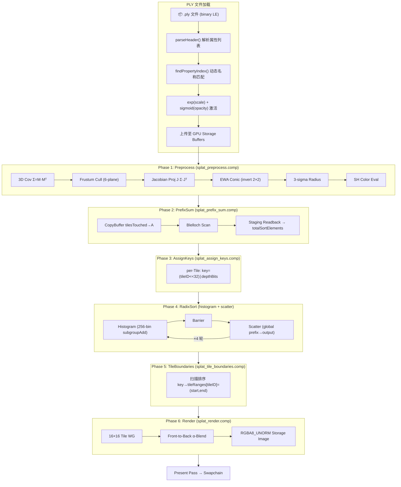
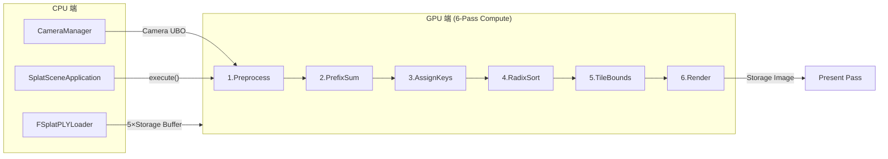
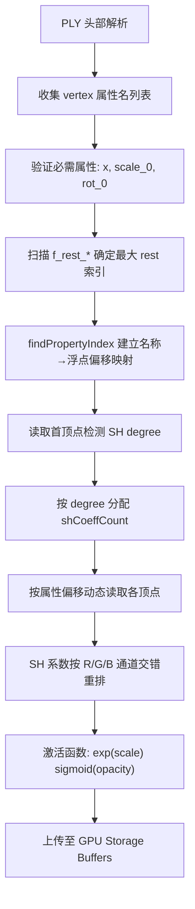
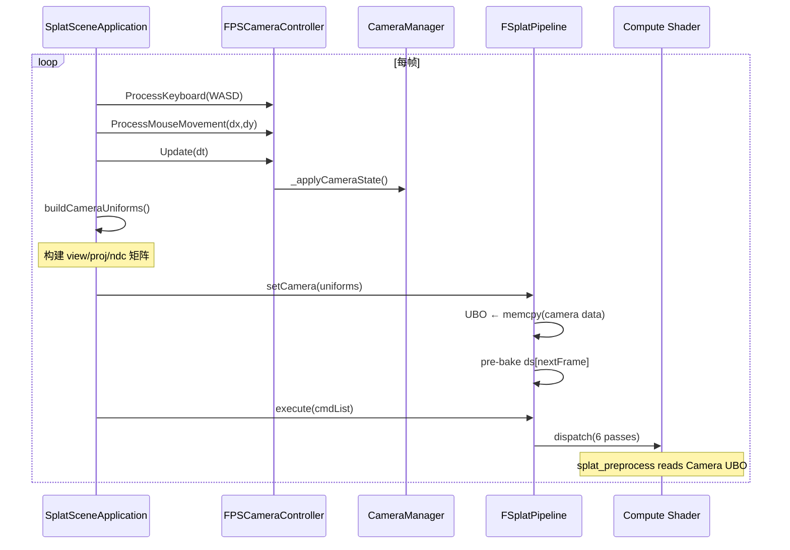

# MonsterEngine Vulkan 原生 3DGS Splat Pass 开发文档

> **文档性质**：实现方案 + 架构记录 + 问题追踪
> **创建日期**：2026-08-05
> **最后更新**：2026-08-12
> **关联需求**：[Vulkan原生3DGS_splat_pass需求评审文档.md](./Vulkan原生3DGS_splat_pass需求评审文档.md)
> **参考仓库**：`D:\code\me-viewer-refs\3dgs-vulkan-cpp\`、`D:\code\me-viewer-refs\3DGS.cpp\`、`D:\code\me-viewer-refs\vk3dGaussianSplatting\`

---

## 目录

1. [背景与目标](#1-背景与目标)
2. [整体架构](#2-整体架构)
3. [RHI 基础设施补齐](#3-rhi-基础设施补齐)
4. [Splat Pipeline 实现](#4-splat-pipeline-实现)
5. [CPU 验证基线](#5-cpu-验证基线)
6. [文件清单](#6-文件清单)
7. [构建与编译](#7-构建与编译)
8. [应用层集成](#8-应用层集成)
9. [Vulkan 设备能力扩展](#9-vulkan-设备能力扩展)
10. [运行时调试与问题修复](#10-运行时调试与问题修复)
11. [验证状态](#11-验证状态)
12. [PLY 加载器动态属性解析](#12-ply-加载器动态属性解析)
13. [渲染调试与视角优化](#13-渲染调试与视角优化)
14. [日志系统架构](#14-日志系统架构)

---

## 1. 背景与目标

### 1.1 背景

3D Gaussian Splatting (3DGS) 是一种基于高斯点云的实时新视角合成技术。MonsterEngine 作为一个自研 Vulkan 游戏引擎，需要原生实现完整的 3DGS 渲染管线（Splat Pass），支持从 `.ply` 文件加载高斯场景数据，通过 Compute Shader 管线完成预处理、排序和渲染的全链路 GPU 计算。

### 1.2 目标

- 在 MonsterEngine 中实现完整的 GPU 端 3DGS Splat Pass，全部基于 Vulkan Compute Shader
- 不依赖外部 3DGS 库，所有数学运算在引擎内实现
- 管线具备可编排性，6 个 Compute Pass 可按序串联执行
- 输出 RGBA8 存储图像，可集成到引擎现有渲染管线

### 1.3 参考资料

| 仓库 | 用途 |
|------|------|
| `3dgs-vulkan-cpp` | 主要算法参考（preprocess / prefix sum / render） |
| `3DGS.cpp` | 宿主编排参考（Compute Pipeline 生命周期 + Descriptor 绑定顺序） |
| `vk3dGaussianSplatting` | GPU Radix Sort 9 阶段拆分参考（FidelityFX 范式） |

---

## 2. 整体架构

### 2.1 6 阶段 Compute Pipeline



### 2.2 数据流鸟瞰



### 2.3 编排器

`FSplatPipeline` 作为顶层编排器，拥有全部 6 个子 Pass 实例：

- `initialize()` — 计算 grid 参数、创建预处/边界/渲染 Pass
- `setGaussianData()` — 绑定 PLY 加载数据
- `setCamera()` — 更新相机 Uniform Buffer
- `execute()` — 串联执行全部 6 个 Pass，包括 barrier 和 copyBuffer

排序 Pass 采用懒加载策略，在第一次 `execute()` 时触发 `lazyInitSortPasses()`。

### 2.4 数据流设计

**Buffer 复制链**（确保 Pass 间数据正确传递）：

```
Preprocess.tilesTouched  ──copyBuffer──▶  PrefixSum.bufferA
PrefixSum.result         ──copyBuffer──▶  StagingBuffer → readback → m_totalSortElements
AssignKeys.keys/values   ──copyBuffer──▶  RadixSort.evenBuffers
```

**Barrier 插入点**：在以下 Pass 间插入 `resourceBarrier()` 确保 GPU 访问序：
- Preprocess → PrefixSum
- PrefixSum → AssignKeys
- AssignKeys → RadixSort
- RadixSort → TileBoundaries
- TileBoundaries → Render

---

## 3. RHI 基础设施补齐

3DGS Splat Pass 需要 MonsterEngine 的 RHI 层提供 Compute Shader 全链路支持。以下为新增的基础设施。

### 3.1 IRHIComputeShader 接口

**文件**：[`Include/RHI/IRHIResource.h`](file:///D:/code/MonsterEngine/Include/RHI/IRHIResource.h)

```cpp
class IRHIComputeShader : public IRHIShader
{
public:
    IRHIComputeShader() : IRHIShader(EShaderStage::Compute) {}
    virtual ~IRHIComputeShader() = default;
};
```

继承自 `IRHIShader`，固定 Stage 为 `Compute`。作为 Compute Shader 资源的抽象接口。

### 3.2 VulkanComputeShader

**文件**：[`Include/Platform/Vulkan/VulkanShader.h`](file:///D:/code/MonsterEngine/Include/Platform/Vulkan/VulkanShader.h)

```cpp
class VulkanComputeShader : public VulkanShader, public IRHIComputeShader
```

复用 `VulkanShader` 基类的 SPIR-V 加载和 `VkShaderModule` 创建逻辑，Stage 固定为 `EShaderStage::Compute`。

### 3.3 VulkanComputePipelineState

**文件**：[`Include/Platform/Vulkan/VulkanPipelineState.h`](file:///D:/code/MonsterEngine/Include/Platform/Vulkan/VulkanPipelineState.h)

轻量级 Compute Pipeline State 封装：

```cpp
class VulkanComputePipelineState : public IRHIPipelineState
{
    VkPipeline m_pipeline;
    VkPipelineLayout m_pipelineLayout;
    bool m_isValid;
public:
    void initializeWithHandles(VkPipeline pipeline, VkPipelineLayout layout);
};
```

提供 `initializeWithHandles()` 方法，允许 VulkanDevice 直接注入已创建的 VkPipeline/VkPipelineLayout 句柄。

### 3.4 IRHICommandList::dispatch()

**文件**：[`Include/RHI/IRHICommandList.h`](file:///D:/code/MonsterEngine/Include/RHI/IRHICommandList.h)

```cpp
virtual void dispatch(uint32 groupCountX, uint32 groupCountY, uint32 groupCountZ) = 0;
```

纯虚方法，所有 RHI 后端必须实现。Vulkan 后端在 [`VulkanRHICommandList.cpp`](file:///D:/code/MonsterEngine/Source/Platform/Vulkan/VulkanRHICommandList.cpp) 中通过 `vkCmdDispatch` 实现。

### 3.5 IRHICommandList::copyBuffer()

**文件**：[`Include/RHI/IRHICommandList.h`](file:///D:/code/MonsterEngine/Include/RHI/IRHICommandList.h)

```cpp
virtual void copyBuffer(TSharedPtr<IRHIBuffer> dst, TSharedPtr<IRHIBuffer> src,
                        uint32 size, uint32 dstOffset = 0, uint32 srcOffset = 0);
```

GPU 缓冲区到缓冲区的复制命令。Vulkan 后端通过 `vkCmdCopyBuffer` 实现，用于 Pass 间的数据传输。

### 3.6 VulkanFunctions 扩展

**文件**：[`Include/Platform/Vulkan/VulkanRHI.h`](file:///D:/code/MonsterEngine/Include/Platform/Vulkan/VulkanRHI.h)

在 `VulkanFunctions` 结构体中新增：
- `PFN_vkCmdDispatch vkCmdDispatch` — Compute 调度函数指针
- `PFN_vkCmdCopyBuffer vkCmdCopyBuffer` — 缓冲区复制函数指针（已有，确认可用）

在 [`VulkanAPI.cpp`](file:///D:/code/MonsterEngine/Source/Platform/Vulkan/VulkanAPI.cpp) 中通过 `vkGetDeviceProcAddr` 动态加载。

### 3.7 IRHIDevice 接口扩展

**文件**：[`Include/RHI/IRHIDevice.h`](file:///D:/code/MonsterEngine/Include/RHI/IRHIDevice.h)

新增两个纯虚方法：

```cpp
virtual TSharedPtr<IRHIComputeShader> createComputeShader(TSpan<const uint8> bytecode) = 0;
virtual TSharedPtr<IRHIPipelineState> createComputePipelineState(const ComputePipelineStateDesc& desc) = 0;
```

### 3.8 ComputePipelineStateDesc

**文件**：[`Include/RHI/RHIDefinitions.h`](file:///D:/code/MonsterEngine/Include/RHI/RHIDefinitions.h)

```cpp
struct ComputePipelineStateDesc {
    TSharedPtr<IRHIComputeShader> computeShader;
    TSharedPtr<IRHIPipelineLayout> pipelineLayout;
};
```

### 3.9 ShaderCompiler Compute 支持

**文件**：[`Include/Core/ShaderCompiler.h`](file:///D:/code/MonsterEngine/Include/Core/ShaderCompiler.h)

`EShaderStageKind` 枚举新增 `Compute` 值。`getStageArgGLSLC()` 中对应返回 `"comp"`。

### 3.10 后端适配

以下后端文件通过 Task Agent 自动补齐了 stub 实现，确保编译通过：

| 文件 | 补齐内容 |
|------|----------|
| `OpenGLCommandList.h` / `.cpp` | `dispatch()` stub |
| `OpenGLDescriptorPoolManager.h` / `.cpp` | `updateStorageBuffer()` stub |
| `OpenGLDevice.h` / `.cpp` | `createComputeShader()` / `createComputePipelineState()` stub |
| `MockCommandList.h` | `dispatch()` stub with MR_LOG_DEBUG |
| `VulkanRHICommandListRecorder.h` / `.cpp` | `dispatch()` record + replay 实现 |

---

## 4. Splat Pipeline 实现

### 4.1 Phase 1: Preprocess（预处理）

**Shader**: [`splat_preprocess.comp`](file:///D:/code/MonsterEngine/Shaders/Splat/splat_preprocess.comp)  
**SPIR-V**: [`splat_preprocess.spv`](file:///D:/code/MonsterEngine/Shaders/Splat/compiled/splat_preprocess.spv)  
**C++**: [`SplatPass.h`](file:///D:/code/MonsterEngine/Include/Renderer/Splat/SplatPass.h) / [`SplatPass.cpp`](file:///D:/code/MonsterEngine/Source/Renderer/Splat/SplatPass.cpp)

**功能**：每个 Gaussian 执行一次，256 线程/组。

| 步骤 | 说明 |
|------|------|
| 3D 协方差 | `scale → M = S·R → Σ = M^T·M` |
| 视锥剔除 | 世界→视→裁剪空间，6 面检测 |
| Jacobian 投影 | `Σ' = J·Σ·J^T` |
| EWA 圆锥 | 2D 协方差求逆，加低通滤波 0.3 |
| 3-sigma 半径 | `λ = mid ± sqrt(mid² - det)`, `radius = ceil(3·√max(λ₁, λ₂))` |
| SH 颜色 | `computeColorFromSH()`，支持 degree 0-3 |
| Tile 包围盒 | 计算每个 Gaussian 覆盖的 tile 矩形 |

**Binding 设计**：2 套 Descriptor Set
- Set 0 (input): 5 Storage Buffers + 1 Uniform Buffer (Camera)
- Set 1 (output): 7 Storage Buffers

### 4.2 Phase 2: Prefix Sum（前缀和）

**Shader**: [`splat_prefix_sum.comp`](file:///D:/code/MonsterEngine/Shaders/Splat/Sort/splat_prefix_sum.comp)  
**C++**: [`SplatSortPass.h`](file:///D:/code/MonsterEngine/Include/Renderer/Splat/SplatSortPass.h) / [`SplatSortPass.cpp`](file:///D:/code/MonsterEngine/Source/Renderer/Splat/SplatSortPass.cpp)

**算法**：Blelloch 扫描，双缓冲 Ping-Pong

```
for step in 0..ceil(log2(N)):
    barrier()
    if readFromA: B[i] = A[i] + A[i - 2^step]
    else:          A[i] = B[i] + B[i - 2^step]
    readFromA = !readFromA
```

**集成**：`SplatPipeline` 在 PrefixSum 前后执行 copyBuffer — 将 `tilesTouched` 复制到 bufferA，将结果复制到 staging buffer 并通过 `waitForIdle + map/unmap` 读回 `m_totalSortElements`。

### 4.3 Phase 3: Assign Keys（键值分配）

**Shader**: [`splat_assign_keys.comp`](file:///D:/code/MonsterEngine/Shaders/Splat/Sort/splat_assign_keys.comp)

**功能**：为每个存活的 Gaussian 覆盖的每个 tile 生成一条排序记录。

- 从 bbox 读取 tile 矩形
- 对每个覆盖的 tile 循环迭代
- 输出: `key = (tileID << 32) | floatBitsToUint(depth)`
- 输出: `value = gaussianID`
- 使用 PrefixSum 结果作为写入偏移

### 4.4 Phase 4: Radix Sort（基数排序）

**Shaders**: [`splat_radix_histogram.comp`](file:///D:/code/MonsterEngine/Shaders/Splat/Sort/splat_radix_histogram.comp) + [`splat_radix_scatter.comp`](file:///D:/code/MonsterEngine/Shaders/Splat/Sort/splat_radix_scatter.comp)

**算法**：4-pass / 8-bit LSD 基数排序（参考 VkRadixSort, Mirco Werner, MIT License）。

每轮 2 个 dispatch：
1. **Histogram**: 256-bin 局部直方图 → 全局直方图，使用 `subgroupAdd` 进行子组归约
2. **Scatter**: 计算全局前缀和 → 散射键值对到排序输出

双缓冲策略：`keysEven/Odd` + `valuesEven/Odd`，减少 round 之间的 copyBuffer。

**扩展要求**：
- `GL_KHR_shader_subgroup_basic`
- `GL_KHR_shader_subgroup_arithmetic`
- `GL_KHR_shader_subgroup_ballot`

### 4.5 Phase 5: Tile Boundaries（Tile 边界检测）

**Shader**: [`splat_tile_boundaries.comp`](file:///D:/code/MonsterEngine/Shaders/Splat/Sort/splat_tile_boundaries.comp)

**功能**：扫描排序后的 key 数组，检测 `tileID (key>>32)` 变化处。

输出：`tileRanges[tileID] = uvec2(start, end)`，特殊处理首尾元素。

### 4.6 Phase 6: Render（渲染/混合）

**Shader**: [`splat_render.comp`](file:///D:/code/MonsterEngine/Shaders/Splat/Render/splat_render.comp)  
**C++**: [`SplatRenderPass.h`](file:///D:/code/MonsterEngine/Include/Renderer/Splat/SplatRenderPass.h) / [`SplatRenderPass.cpp`](file:///D:/code/MonsterEngine/Source/Renderer/Splat/SplatRenderPass.cpp)

**工作组**：16×16（每个 tile 一个工作组）

**算法**：Per-tile front-to-back alpha blend

```
T = 1.0; C = vec3(0)
for gaussian in range(start, end):
    power = -0.5 * (conic.x*dx² + conic.z*dy²) - conic.y*dx*dy
    α = min(0.99, conic.w * exp(power))
    if α < 1/255: continue
    if T*(1-α) < 0.0001: break
    C += color * α * T
    T *= (1-α)
imageStore(output, pixel, vec4(C, 1-T))
```

**输出**：RGBA8_UNORM Storage Image，可通过 `getOutputTexture()` 获取。

### 4.7 辅助模块

**SplatTypes.h** — GPU 数据布局定义（`FCameraUniforms`、`FPreprocessPushConstants`），所有 `static_assert` 确保与 GLSL `std140`/`std430` 对齐。

**SplatPLYLoader** — `.ply` 文件解析 + GPU 上传。

采用**动态属性名称匹配**策略，而非硬编码结构体偏移：
1. `parseHeader()` 解析 PLY 头部的 `element vertex` 属性声明列表，按声明顺序收集属性名
2. `findPropertyIndex()` 按名称线性查找各属性的浮点偏移量
3. 动态扫描 `f_rest_*` 属性确定实际最大 rest 索引（不硬编码 45 个条目）
4. 读取首顶点非零 rest 值，自动检测 SH degree (0-3)
5. 按 `shCoeffCount` 动态重排 SH 系数为交错格式（R/G/B 通道交错存储）

**与参考实现的对比**：
| 方面 | `3dgs-vulkan-cpp` | `vk3dGaussianSplatting` | MonsterEngine |
|------|-------------------|-------------------------|---------------|
| PLY 解析 | 硬编码二进制读取顺序 | happly 库按名称匹配 | 动态按名称匹配（自主实现，无三方依赖）|
| SH 索引 | 固定数量按 degree | 固定数量按 degree | 动态检测 + 按 degree 重排 |
| 激活函数 | exp + sigmoid + normalize | exp + sigmoid + normalize | 同主参考 |
| 四元数布局 | (r,x,y,z) 不重排 | (-z,-w,x,-y) 重排 | 同主参考，不重排 |
| 坐标翻转 | 无 | X/Y 翻转 | 同主参考，不翻转 |

加载时输出诊断日志：属性验证（has x/scale_0/rot_0）、SH degree 检测、scale 原始/激活范围、rotation 原始范围、opacity sigmoid 激活范围、SH buffer 布局。详见 [第 12 节](#12-ply-加载器动态属性解析)。

**SplatSortTypes.h** — 排序管线的 GPU 布局定义（PrefixSum/AssignKeys/RadixSort/TileBoundaries 各自的 PushConstants 和 Binding），全部带 `static_assert` 大小验证。

**CopyBufferTest** — 集成测试，验证 GPU `copyBuffer` + staging buffer readback 的正确性。使用已知模式 [0..N-1] 的测试数据，完整走通 upload→copy→staging→readback→verify 六步验证。

---

## 5. CPU 验证基线

**文件**：[`Source/Renderer/Splat/CPU/SplatCPU.h`](file:///D:/code/MonsterEngine/Source/Renderer/Splat/CPU/SplatCPU.h) / [`SplatCPU.cpp`](file:///D:/code/MonsterEngine/Source/Renderer/Splat/CPU/SplatCPU.cpp)

CPU 端完整实现 3DGS 数学管线，作为 GPU 实现的 Golden Reference：

- PLY 解析（支持 degree 0-3 SH 系数）
- 3D 协方差计算（quaternion→rotation matrix→M = S·R→Σ = M^T·M）
- 视锥剔除 + Jacobian 投影 + EWA 圆锥
- 球谐颜色评估（内联计算，degree 0-3）
- 深度排序（`std::sort`）
- Front-to-back alpha blend（逐像素）
- PPM P6 二进制图像输出

包含调试日志：剔除计数、depth 范围、平均 radius / tilesTouched。

---

## 6. 文件清单

### 6.1 新增文件

```
Include/Renderer/Splat/
├── SplatTypes.h               # GPU 数据布局定义
├── SplatPLYLoader.h            # PLY 解析器头文件
├── SplatPass.h                 # 预处理 Pass 头文件
├── SplatSortTypes.h            # 排序管线类型定义
├── SplatSortPass.h             # 4 个排序 Pass 头文件
├── SplatRenderPass.h           # 渲染 Pass 头文件
├── SplatPipeline.h             # 管线编排器头文件
└── CopyBufferTest.h            # copyBuffer 集成测试

Source/Renderer/Splat/
├── SplatPLYLoader.cpp          # PLY 解析 + GPU 上传
├── SplatPass.cpp               # 预处理 Pass 实现
├── SplatSortPass.cpp           # 排序 Pass 实现（PrefixSum/AssignKeys/RadixSort/TileBounds）
├── SplatRenderPass.cpp         # 渲染 Pass 实现
├── SplatPipeline.cpp           # 管线编排器实现
├── CopyBufferTest.cpp          # copyBuffer 集成测试
└── CPU/
    ├── SplatCPU.h              # CPU 验证基线头文件
    └── SplatCPU.cpp            # CPU 验证基线实现

Source/
├── SplatSceneApplication.cpp   # 3DGS 应用层：SplatPipeline + present pass 集成
└── main.cpp                    # 新增 --splat 命令行入口

Include/
└── SplatSceneApplication.h     # 3DGS 应用层头文件

Shaders/Splat/
├── splat_common.glsl            # 公共 GLSL 函数库（协方差/SH/投影）
├── splat_preprocess.comp        # 预处理 Compute Shader
├── splat_present.vert           # 全屏呈现顶点着色器
├── splat_present.frag           # 全屏呈现片元着色器
├── compile_splat.bat            # 离线编译脚本
├── compiled/
│   ├── splat_preprocess.spv     # 预编译 SPIR-V
│   ├── splat_present.vert.spv
│   └── splat_present.frag.spv
├── Sort/
│   ├── splat_prefix_sum.comp    # Blelloch 前缀和
│   ├── splat_assign_keys.comp   # 排序键分配
│   ├── splat_radix_histogram.comp # 基数排序直方图
│   ├── splat_radix_scatter.comp # 基数排序散射
│   ├── splat_tile_boundaries.comp # Tile 边界检测
│   └── compiled/
│       ├── splat_prefix_sum.spv
│       ├── splat_assign_keys.spv
│       ├── splat_radix_histogram.spv
│       ├── splat_radix_scatter.spv
│       └── splat_tile_boundaries.spv
└── Render/
    ├── splat_render.comp        # Tile-based alpha blend
    └── compiled/
        └── splat_render.spv

assets/
└── bonsai_30k.ply              # 测试模型 (bonsai, ~277 MB)
```

### 6.2 修改文件

```
Include/RHI/
├── IRHIResource.h              # 新增 IRHIComputeShader 接口
├── IRHICommandList.h           # 新增 dispatch() + copyBuffer()
├── IRHIDevice.h                # 新增 createComputeShader() + createComputePipelineState()
├── IRHIDescriptorSet.h         # 新增 updateStorageImage() 纯虚方法
└── RHIDefinitions.h            # 新增 ComputePipelineStateDesc + EResourceUsage 标志位

Include/Platform/Vulkan/
├── VulkanRHI.h                 # 新增 vkCmdDispatch 函数指针
├── VulkanShader.h              # 新增 VulkanComputeShader
├── VulkanPipelineState.h       # 新增 VulkanComputePipelineState
├── VulkanRHICommandList.h      # 新增 dispatch() + copyBuffer() override + m_bComputePipelineActive 成员
├── VulkanDescriptorSetLayout.h # 新增 updateStorageImage() override
└── VulkanRHICommandListRecorder.h # 新增 dispatch() override + Dispatch 命令结构体

Source/Platform/Vulkan/
├── VulkanAPI.cpp               # 新增 vkCmdDispatch 动态加载
├── VulkanDevice.cpp            # 新增 Compute Pipeline 创建链路 + shaderInt64/Vulkan1.2 features + apiVersion 提升
├── VulkanRHICommandList.cpp    # 新增 dispatch() + copyBuffer() 实现 + setPipelineState 支持 VulkanComputePipelineState
├── VulkanDescriptorSetLayout.cpp # 新增 updateStorageImage() 实现
└── VulkanRHICommandListRecorder.cpp # 新增 dispatch() record + replay

Include/Platform/OpenGL/        # OpenGL stub 实现
├── OpenGLCommandList.h         # dispatch() override
├── OpenGLDescriptorPoolManager.h # updateStorageBuffer() + updateStorageImage() override
└── OpenGLDevice.h              # createComputeShader() + createComputePipelineState() override

Source/Platform/OpenGL/         # OpenGL stub 实现
├── OpenGLCommandList.cpp
├── OpenGLDescriptorPoolManager.cpp # updateStorageImage() stub 实现
└── OpenGLDevice.cpp

Include/RHI/
└── MockCommandList.h           # dispatch() stub

Source/Core/
└── Application.cpp             # main 循环驱动 onRender（无修改，使用已有架构）

MonsterEngine.vcxproj           # 添加所有 Splat 源文件 + SplatSceneApplication 到编译
```

---

## 7. 构建与编译

### 7.1 构建命令

```powershell
& "C:\Program Files\Microsoft Visual Studio\2022\Professional\MSBuild\Current\Bin\amd64\MSBuild.exe" `
    MonsterEngine.sln /t:Build /p:Configuration=Debug /p:Platform=x64
```

### 7.2 Shader 编译

使用 `glslc` 编译 GLSL → SPIR-V：

```batch
:: 预处理 Shader
glslc -fshader-stage=comp --target-env=vulkan1.2 -I Shaders/Splat -o Shaders/Splat/compiled/splat_preprocess.spv Shaders/Splat/splat_preprocess.comp

:: 排序 Shaders
glslc -fshader-stage=comp --target-env=vulkan1.2 -o Shaders/Splat/Sort/compiled/splat_prefix_sum.spv Shaders/Splat/Sort/splat_prefix_sum.comp
glslc -fshader-stage=comp --target-env=vulkan1.2 -o Shaders/Splat/Sort/compiled/splat_assign_keys.spv Shaders/Splat/Sort/splat_assign_keys.comp
glslc -fshader-stage=comp --target-env=vulkan1.2 -o Shaders/Splat/Sort/compiled/splat_radix_histogram.spv Shaders/Splat/Sort/splat_radix_histogram.comp
glslc -fshader-stage=comp --target-env=vulkan1.2 -o Shaders/Splat/Sort/compiled/splat_radix_scatter.spv Shaders/Splat/Sort/splat_radix_scatter.comp
glslc -fshader-stage=comp --target-env=vulkan1.2 -o Shaders/Splat/Sort/compiled/splat_tile_boundaries.spv Shaders/Splat/Sort/splat_tile_boundaries.comp

:: 渲染 Shader
glslc -fshader-stage=comp --target-env=vulkan1.2 -o Shaders/Splat/Render/compiled/splat_render.spv Shaders/Splat/Render/splat_render.comp
```

### 7.3 编译注意事项

1. **工程文件同步**：项目使用 CMake `GLOB_RECURSE` 自动发现 `Source/` 和 `Include/` 下的新文件，新增文件会自动参与编译，无需手动修改 CMakeLists.txt。

2. **菱形继承处理**：`VulkanComputeShader` 继承自 `VulkanShader` 和 `IRHIComputeShader`（两者都继承自 `IRHIShader`）。所有 Shader 接口类（`IRHIVertexShader`、`IRHIPixelShader`、`IRHIComputeShader`）和 `VulkanShader` 统一使用**非虚拟继承**，`VulkanComputeShader` 构造函数显式初始化两个基类以避免歧义。

3. **VulkanFunctions 动态加载**：`vkCmdDispatch` 通过 `vkGetDeviceProcAddr` 动态加载，运行时检查非空后调用。

### 7.4 图元和呈现 Shader 编译

```batch
:: 全屏呈现顶点着色器
glslc -fshader-stage=vert --target-env=vulkan1.2 -o Shaders/Splat/compiled/splat_present.vert.spv Shaders/Splat/splat_present.vert

:: 全屏呈现片元着色器
glslc -fshader-stage=frag --target-env=vulkan1.2 -o Shaders/Splat/compiled/splat_present.frag.spv Shaders/Splat/splat_present.frag
```

---

## 8. 应用层集成

### 8.1 SplatSceneApplication

**文件**：[`Include/SplatSceneApplication.h`](file:///D:/code/MonsterEngine/Include/SplatSceneApplication.h) / [`Source/SplatSceneApplication.cpp`](file:///D:/code/MonsterEngine/Source/SplatSceneApplication.cpp)

继承自 `Application` 的应用类，负责完整的 3DGS 渲染循环。

**onInit()** 流程：
1. 创建 Vulkan 设备
2. 创建 `FSplatPipeline`，传入目标分辨率
3. 调用 `FSplatPLYLoader::loadFromFile()` 加载 `.ply` 到 `FSplatGPUData`
4. 设置 `m_splatPipeline->setGaussianData()` + `setCamera()`
5. 创建全屏呈现 Pass（`initializePresentPass()`）

**Camera 初始化**（[`SplatSceneApplication.cpp:540-545`](file:///D:/code/MonsterEngine/Source/SplatSceneApplication.cpp#L540-L545)）：

```cpp
// 创建 FPS Camera Controller
m_fpsCamera = MakeUnique<FFPSCameraController>(
    FVector(0.0, 0.0, 0.0),   // 原点位置
    FVector(0.0, 1.0, 0.0),   // Y-up world
    80.0f,                      // yaw（默认朝向）
    -10.0f                      // pitch（负值=微俯视）
);
```

可通过 `m_fpsCamera->LookAt(targetPos)` 方法动态调整注视目标，根据当前位置和目标点自动反算 yaw/pitch，无需手动调参。运行时通过 WASD + 鼠标控制相机移动和旋转。

**near/far 平面设置**：预处理阶段使用 `near=0.01, far=1000.0`，投影矩阵使用对应的 `nearVal=0.01, farVal=1000.0`，保持一致性。

**onRender()** 流程：
```
[A] context->prepareForNewFrame()         → acquireNextSwapchainImage
[B] cmdList->begin()                      → vkBeginCommandBuffer
[C] transitionResource(output, SRV→UAV)   → 跨帧布局恢复
[D] buildCameraUniforms()                 → 构建相机矩阵
[E] m_splatPipeline->execute(cmdList)     → 6-pass Compute 管线
[F] transitionResource(output, UAV→SRV)   → 转为可读布局
[G] setRenderTargets(empty) + SetUp        → 绑定 swapchain
[H] Present Pass: bind pipeline/descriptor → 全屏三角形
[I] draw(3)                               → 绘制 2 个三角形
[J] endRenderPass()
[K] cmdList->end()
[L] m_device->present()                   → vkQueueSubmit + vkQueuePresentKHR
```

### 8.2 Fullscreen Present Pass

将 SplatPipeline 输出的 RGBA8_UNORM Storage Image 通过全屏三角形渲染到 swapchain。

**顶点着色器** [`splat_present.vert`](file:///D:/code/MonsterEngine/Shaders/Splat/splat_present.vert)：
- 使用 `gl_VertexIndex` 生成全屏三角形（无需顶点缓冲区）
- 输出 UV 坐标供片元着色器采样

**片元着色器** [`splat_present.frag`](file:///D:/code/MonsterEngine/Shaders/Splat/splat_present.frag)：
- Binding 0：`layout(set=0, binding=0) uniform sampler2D splatOutput`
- 直接采样 SplatPipeline 输出并输出颜色

**Descriptor Set**：单 set 包含 1 个 Combined Image Sampler，指向 SplatPipeline 输出纹理。

### 8.3 命令行入口

**文件**：[`Source/main.cpp`](file:///D:/code/MonsterEngine/Source/main.cpp)

新增 `--splat <ply_path>` 参数：

```cpp
if (arg.find("--splat") != String::npos) {
    // Launch SplatSceneApplication with PLY file path
}
```

运行命令：
```powershell
MonsterEngine.exe --splat resources\point_cloud\bonsai_30k.ply
```

---

## 9. Vulkan 设备能力扩展

3DGS Compute Shader 需要 Vulkan 1.1+ 的设备特性支持，主要涉及 64 位整数操作和子组操作。

### 9.1 所需特性

| 特性 | 用途 | Vulkan 版本要求 |
|------|------|----------------|
| `shaderInt64` | RadixSort 使用 uint64 排序键 | Vulkan 1.0 + extension |
| `shaderBufferInt64Atomics` | RadixSort histogram 使用 64 位原子加 | Vulkan 1.2 |
| `shaderSharedInt64Atomics` | PrefixSum 使用 64 位共享内存原子 | Vulkan 1.2 |
| `subgroupBroadcastDynamicId` | RadixSort 子组内动态广播 | Vulkan 1.2 |

### 9.2 VkDevice 创建修改

**文件**：[`Source/Platform/Vulkan/VulkanDevice.cpp`](file:///D:/code/MonsterEngine/Source/Platform/Vulkan/VulkanDevice.cpp)

**修改 1**：启用 `shaderInt64`

```cpp
deviceFeatures.shaderInt64 = VK_TRUE;  // 第 999 行
```

**修改 2**：通过 pNext 链注入 Vulkan 1.1 / 1.2 Features

```cpp
VkPhysicalDeviceVulkan11Features vulkan11Features{};
vulkan11Features.sType = VK_STRUCTURE_TYPE_PHYSICAL_DEVICE_VULKAN_1_1_FEATURES;

VkPhysicalDeviceVulkan12Features vulkan12Features{};
vulkan12Features.sType = VK_STRUCTURE_TYPE_PHYSICAL_DEVICE_VULKAN_1_2_FEATURES;

void* pNextChain = nullptr;
if (isVulkan12OrHigher) {
    vulkan12Features.shaderBufferInt64Atomics = VK_TRUE;
    vulkan12Features.shaderSharedInt64Atomics = VK_TRUE;
    vulkan12Features.subgroupBroadcastDynamicId = VK_TRUE;
    vulkan11Features.pNext = &vulkan12Features;
    pNextChain = &vulkan11Features;
} else if (isVulkan11OrHigher) {
    pNextChain = &vulkan11Features;
}
createInfo.pNext = pNextChain;  // 附着到 VkDeviceCreateInfo
```

**修改 3**：提升 `apiVersion` 到 Vulkan 1.2

```cpp
// 第 774 行
createInfo.apiVersion = VK_API_VERSION_1_2;  // 原为 VK_API_VERSION_1_0
```

### 9.3 Compute Pipeline 绑定

**文件**：[`Source/Platform/Vulkan/VulkanRHICommandList.cpp`](file:///D:/code/MonsterEngine/Source/Platform/Vulkan/VulkanRHICommandList.cpp)

Compute Pipeline 和 Graphics Pipeline 是两种不同的 Pipeline 类型，需要不同的 `VkPipelineBindPoint`：

- Graphics Pipeline：`VK_PIPELINE_BIND_POINT_GRAPHICS`
- Compute Pipeline：`VK_PIPELINE_BIND_POINT_COMPUTE`

**修改**：`setPipelineState()` 方法新增 `VulkanComputePipelineState` 分支：

```cpp
VulkanComputePipelineState* computePipeline = dynamic_cast<VulkanComputePipelineState*>(pipelineState.get());
if (computePipeline) {
    vkCmdBindPipeline(cmdBuffer, VK_PIPELINE_BIND_POINT_COMPUTE, vkPipeline);
    m_bComputePipelineActive = true;
    return;
}
```

**Descriptor Set 绑定点跟踪**：[`VulkanRHICommandList.h`](file:///D:/code/MonsterEngine/Include/Platform/Vulkan/VulkanRHICommandList.h) 新增成员：

```cpp
bool m_bComputePipelineActive = false;
```

在 `bindDescriptorSets()` 中根据当前活跃的 Pipeline 类型动态选择 bind point：

```cpp
VkPipelineBindPoint bindPoint = m_bComputePipelineActive
    ? VK_PIPELINE_BIND_POINT_COMPUTE
    : VK_PIPELINE_BIND_POINT_GRAPHICS;
```

`begin()` 时重置为 `false`。

---

## 10. 运行时调试与问题修复

### 10.1 编译期错误汇总

| # | 错误 | 根因 | 修复 |
|---|------|------|------|
| 1 | `SplatSortTypes.h`: `alignas(16)` 与 `static_assert`(12/8) 大小冲突 | PushConstants 结构体使用 `alignas(16)` 导致大小与预期不符 | 移除 `FPrefixSumPushConstants` 和 `FTileBoundariesPushConstants` 的 `alignas(16)` |
| 2 | `SplatSortPass.cpp`: 找不到 `#include "SplatSortPass.h"` | 缺少自身头文件 include | 添加 `#include "Renderer/Splat/SplatSortPass.h"` |
| 3 | `SplatSortPass.cpp`: `RHI::TSharedPtr` 命名空间错误 | 项目使用 `MonsterEngine::TSharedPtr` | 6 处改为 `MonsterEngine::TSharedPtr` |
| 4 | `SplatPass.cpp`/`SplatPLYLoader.cpp`: include 路径错误 | 路径不包含 `Renderer/Splat/` 前缀 | 添加 `Renderer/Splat/` 路径前缀 |
| 5 | `SplatSortPass.cpp`: `resourceBarrier(nullptr)` 参数不匹配 | 函数签名为无参 | 改为 `resourceBarrier()` |
| 6 | `SplatSceneApplication.cpp`: `PerspectiveFarClipPlane` 不存在 | API 无此函数 | 移除该行 |
| 7 | `SplatSceneApplication.cpp`: `depthTestEnable` 不存在 | API 名为 `depthEnable` | 改为 `depthEnable` |
| 8 | `SplatSceneApplication.cpp`: `ESamplerFilter::Linear` 不存在 | API 名为 `ESamplerFilter::Bilinear` | 改为 `ESamplerFilter::Bilinear` |
| 9 | `SplatSceneApplication.cpp`: `Math::PI` 不存在 | 引擎宏名为 `MR_PI` | 改为 `MR_PI` |
| 10 | `SplatSceneApplication.cpp`: `Math::Tan` 不存在 | 引擎函数名为 `FMath::Tan` | 改为 `FMath::Tan` |
| 11 | `SplatSceneApplication.h`: `IRHIShader` 类型错误 | Vertex/Fragment 需用具体子类型 | 改为 `IRHIVertexShader`/`IRHIPixelShader` |
| 12 | Splat 模块源文件未参与编译 | `.vcxproj` 未包含新文件 | 添加 12 个 Splat 源文件到项目 |
| 13 | OpenGL 后端缺少 `updateStorageImage` override | RHI 接口新增方法未同步到 OpenGL stub | 添加 `updateStorageImage` 到 OpenGL 后端头文件和实现 |

### 10.2 运行时错误与修复

#### 错误 1：Sort passes not initialized

**现象**：`[SplatPipeline] Sort passes not initialized`

**根因**：Sort Pass（PrefixSum/AssignKeys/RadixSort）设计为懒初始化，在 `initialize()` 时未分配，需在第一次 `execute()` 时触发 `lazyInitSortPasses()`，但未调用。

**修复**：在 [`FSplatPipeline::execute()`](file:///D:/code/MonsterEngine/Source/Renderer/Splat/SplatPipeline.cpp#L159-L167) 中添加懒初始化检查：

```cpp
if (!m_sortPassesInitialized) {
    if (!lazyInitSortPasses(m_device)) {
        MR_LOG(LogTemp, Error, "[SplatPipeline] Sort passes not initialized");
        return nullptr;
    }
}
```

#### 错误 2：SPIR-V 版本与设备特性不匹配

**现象**：Pipeline 创建失败，shader 引用 64 位整数和子组操作未启用。

**根因**：Shader 用 `--target-env=vulkan1.2` 编译，但设备创建时 `apiVersion` 为 `VK_API_VERSION_1_0`，且未启用 `shaderInt64`、`shaderBufferInt64Atomics` 等特性。

**修复**：参见 [第 9 节 Vulkan 设备能力扩展](#9-vulkan-设备能力扩展)。

#### 错误 3：Invalid pipeline state type（Compute vs Graphics）

**现象**：`FVulkanRHICommandListImmediate::setPipelineState: Invalid pipeline state type`

**根因**：`setPipelineState()` 只支持 `VulkanPipelineState`（Graphics Pipeline），使用 `dynamic_cast` 转换 `VulkanComputePipelineState` 失败。

**修复**：在 `setPipelineState()` 中新增 `VulkanComputePipelineState` 分支（[第 9.3 节](#93-compute-pipeline-绑定)）。

#### 错误 4：Descriptor Set 绑定到错误的 Bind Point

**现象**：`bindDescriptorSets()` 始终使用 `VK_PIPELINE_BIND_POINT_GRAPHICS`。

**根因**：没有跟踪当前活跃的 Pipeline 类型，导致 Compute Pipeline 的 descriptor set 被绑定到 Graphics bind point。

**修复**：新增 `m_bComputePipelineActive` 成员，在 `bindDescriptorSets()` 中动态选择 bind point（[第 9.3 节](#93-compute-pipeline-绑定)）。

#### 错误 5：TileRanges Binding 索引不匹配

**现象**：TileBoundaries Pass 的 `TileRanges` 输出和 Render Pass 的输入使用不同的 binding 索引。

**根因**：C++ 端 `ETileBoundariesBinding::TileRanges = 2`，但 shader 中为 `binding = 1`。

**修复**：[`SplatSortTypes.h`](file:///D:/code/MonsterEngine/Include/Renderer/Splat/SplatSortTypes.h) 中将 `TileRanges` 从 `2` 改为 `1`。

#### 错误 6：waitForIdle() 破坏 Command Buffer 状态

**现象**：`waitForIdle()` 在 command recording 期间破坏 command buffer 状态。

**根因**：`SplatPipeline::execute()` 中 PrefixSum 完成后调用 `waitForIdle()` + staging buffer readback 获取 `totalSortElements`，这破坏了正在录制的 command buffer。

**修复**：移除 `waitForIdle()`，直接使用 `m_maxSortElements`（保守上限 `gaussianCount * maxTilesPerGaussian`）替代精确的 readback 值。

#### 错误 7：Descriptor 类型不匹配 SAMPLED_IMAGE vs STORAGE_IMAGE（核心修复）

**现象**：`VUID-VkWriteDescriptorSet-descriptorType-00319`：`VK_DESCRIPTOR_TYPE_SAMPLED_IMAGE` 被写入到期望 `VK_DESCRIPTOR_TYPE_STORAGE_IMAGE` 的 binding。

**根因**：[`VulkanDescriptorSetLayout.cpp:295`](file:///D:/code/MonsterEngine/Source/Platform/Vulkan/VulkanDescriptorSetLayout.cpp) 中 `updateTexture()` 硬编码 `VK_DESCRIPTOR_TYPE_SAMPLED_IMAGE`，但 [SplatRenderPass](file:///D:/code/MonsterEngine/Source/Renderer/Splat/SplatRenderPass.cpp) 的 OutputImage（binding 5）是 `StorageTexture` 类型，Shader 声明为 `layout(rgba8, binding=5) uniform image2D`，需要 `VK_DESCRIPTOR_TYPE_STORAGE_IMAGE`。

**修复**：
1. 在 [`IRHIDescriptorSet.h`](file:///D:/code/MonsterEngine/Include/RHI/IRHIDescriptorSet.h) 中新增纯虚方法 `updateStorageImage()`
2. 在 [`VulkanDescriptorSetLayout.h`](file:///D:/code/MonsterEngine/Include/Platform/Vulkan/VulkanDescriptorSetLayout.h) / [`.cpp`](file:///D:/code/MonsterEngine/Source/Platform/Vulkan/VulkanDescriptorSetLayout.cpp) 中实现，使用 `VK_DESCRIPTOR_TYPE_STORAGE_IMAGE` + `VK_IMAGE_LAYOUT_GENERAL`
3. 在 [OpenGL stub](file:///D:/code/MonsterEngine/Source/Platform/OpenGL/OpenGLDescriptorPoolManager.cpp) 中添加委托到 `updateTexture()` 的 stub
4. [SplatRenderPass::execute()](file:///D:/code/MonsterEngine/Source/Renderer/Splat/SplatRenderPass.cpp) 改用 `updateStorageImage()` 替代 `updateTexture()`

#### 错误 8：RadixSort Descriptor Set 录制中更新（核心修复）

**现象**：`VUID-vkCmdBindPipeline-commandBuffer-recording`：command buffer 无效，因为已绑定的 descriptor set 被更新。

**根因**：[RadixSort](file:///D:/code/MonsterEngine/Source/Renderer/Splat/SplatSortPass.cpp#L523-L556) 在 4 轮循环中每轮对 `m_histDescriptorSet` 和 `m_scatterDescriptorSet` 调用 `updateStorageBuffer()`。第 1 轮绑定 descriptor set 后，第 2 轮对其更新时，Vulkan 规则判定命令缓冲区无效：
> "If a descriptor set is bound to a command buffer, and that descriptor set is updated, the command buffer enters an invalid state."

**修复**：在 [SplatSortPass.h](file:///D:/code/MonsterEngine/Include/Renderer/Splat/SplatSortPass.h) 中将单份 descriptor set 改为偶数/奇数双份：

```cpp
// 原: 1 个 hist + 1 个 scatter descriptor set
MonsterEngine::TSharedPtr<RHI::IRHIDescriptorSet> m_histDescriptorSet;
MonsterEngine::TSharedPtr<RHI::IRHIDescriptorSet> m_scatterDescriptorSet;

// 改为: 2+2，偶数奇数分别预绑定 even/odd buffer
MonsterEngine::TSharedPtr<RHI::IRHIDescriptorSet> m_histDescriptorSetEven;
MonsterEngine::TSharedPtr<RHI::IRHIDescriptorSet> m_histDescriptorSetOdd;
MonsterEngine::TSharedPtr<RHI::IRHIDescriptorSet> m_scatterDescriptorSetEven;
MonsterEngine::TSharedPtr<RHI::IRHIDescriptorSet> m_scatterDescriptorSetOdd;
```

初始化时一次性预绑定全部 buffer 引用，执行循环中只切换绑定不更新：

```cpp
// 偶数轮：histEven (keysEven)、scatterEven (even→odd)
// 奇数轮：histOdd  (keysOdd)、 scatterOdd  (odd→even)
auto histSet = isEvenPass ? m_histDescriptorSetEven : m_histDescriptorSetOdd;
auto scatterSet = isEvenPass ? m_scatterDescriptorSetEven : m_scatterDescriptorSetOdd;
cmdList->bindDescriptorSet(m_histPipelineLayout, 0, histSet);
```

#### 错误 9：Splat 输出纹理跨帧 Layout 不匹配（核心修复）

**现象**：`UNASSIGNED-CoreValidation-DrawState-InvalidImageLayout`：command buffer 期望 `VK_IMAGE_LAYOUT_GENERAL`，但实际为 `VK_IMAGE_LAYOUT_SHADER_READ_ONLY_OPTIMAL`。

**根因**：SplatPipeline 输出纹理跨帧存在 layout 持久化问题：
- 帧 N：Compute Pass 以 `GENERAL` 布局写入 → Present Pass 以 `SHADER_READ_ONLY_OPTIMAL` 布局读取
- 帧 N+1：Compute Pass 期望 `GENERAL` 布局，但纹理仍保持上一帧末的 `SHADER_READ_ONLY_OPTIMAL`

`transitionResource(UAV→SRV)` 在帧 N 中将纹理转为 `SHADER_READ_ONLY_OPTIMAL`，但帧 N+1 开头没有将其恢复为 `GENERAL` 的 barrier。

**修复**：在 [SplatSceneApplication::onRender()](file:///D:/code/MonsterEngine/Source/SplatSceneApplication.cpp#L162-L172) 中，SplatPipeline 执行前添加布局恢复：

```cpp
auto outputTex = m_splatPipeline->getOutputTexture();
if (outputTex) {
    cmdList->transitionResource(
        outputTex,
        RHI::EResourceUsage::ShaderResource,
        RHI::EResourceUsage::UnorderedAccess);
}
```

同时在 [SplatPipeline.h](file:///D:/code/MonsterEngine/Include/Renderer/Splat/SplatPipeline.h) 中新增 `getOutputTexture()` 方法，暴露 Render Pass 的输出纹理。

#### 错误 10：Present Pass 顶点绑定为 NULL（核心修复）

**现象**：`VUID-vkCmdDraw-None-04008`：`Vertex binding 0 is VK_NULL_HANDLE. (Most likely you forgot to call vkCmdBindVertexBuffers).`

**根因**：Present Pass 使用 `gl_VertexIndex` 生成全屏三角形，不需要顶点缓冲区。但 [VulkanPipelineState::createGraphicsPipeline()](file:///D:/code/MonsterEngine/Source/Platform/Vulkan/VulkanPipelineState.cpp) 中的 `createVertexInputAttributes()` 在没有自定义 `vertexLayout` 时仍然返回默认的 Position+Color 属性描述，导致 `vertexBindingDescriptionCount = 1`。Vulkan 要求如果 `vertexBindingDescriptionCount > 0`，则必须在 draw 前调用 `vkCmdBindVertexBuffers`。

**修复**：在 [`createGraphicsPipeline()`](file:///D:/code/MonsterEngine/Source/Platform/Vulkan/VulkanPipelineState.cpp#L540-L567) 中添加 `bHasVertexLayout` 判断：

```cpp
bool bHasVertexLayout = !m_desc.vertexLayout.attributes.empty() || m_desc.vertexLayout.stride > 0;

if (bHasVertexLayout) {
    vertexInputInfo.vertexBindingDescriptionCount = 1;
    vertexInputInfo.pVertexBindingDescriptions = &bindingDescription;
    vertexInputInfo.vertexAttributeDescriptionCount = static_cast<uint32>(attributeDescriptions.size());
    vertexInputInfo.pVertexAttributeDescriptions = attributeDescriptions.data();
} else {
    // No vertex layout specified — shader uses gl_VertexIndex (fullscreen triangle, etc.)
    vertexInputInfo.vertexBindingDescriptionCount = 0;
    vertexInputInfo.pVertexBindingDescriptions = nullptr;
    vertexInputInfo.vertexAttributeDescriptionCount = 0;
    vertexInputInfo.pVertexAttributeDescriptions = nullptr;
}
```

当 `vertexLayout` 为空且 stride 为 0 时（如 Present Pass），`vertexBindingDescriptionCount` 设为 0，Vulkan 不再要求绑定顶点缓冲区，`gl_VertexIndex` 正常工作。

#### 错误 11：命令缓冲区在 Pending 状态被重置（核心修复）

**现象**：`VUID-vkBeginCommandBuffer-commandBuffer-00049`：`vkBeginCommandBuffer(): on active VkCommandBuffer before it has completed. You must check command buffer fence before this call.` 此错误针对 2 个不同的 `VkCommandBuffer` 句柄报出。

**根因**：MonsterEngine 使用 `MAX_FRAMES_IN_FLIGHT=2` 的命令缓冲区环形缓冲区。帧 N 的命令缓冲区提交后状态变为 `Submitted`，但帧 N+2 到达同一槽位时，GPU 可能尚未完成帧 N 的工作。`prepareForNewActiveCommandBuffer()` 仅在 `isSubmitted()` 时等待 fence 并重置，但存在以下两个边界路径：

1. **`FVulkanCmdBuffer::begin()` 中的 `EState::Ended` 分支**（第 95-105 行）：如果命令缓冲区在 `Ended` 状态（未提交），直接 `vkResetCommandBuffer` 而不检查 fence。但某些流程中命令缓冲区可能实际已被提交而状态未同步。

2. **环形缓冲区绕回时的竞态**：`acquireNextSwapchainImage()` 中的 `inFlightFence[currentFrame]` 保护的是 N-2 帧之前的命令缓冲区，但在初始化阶段或帧率不稳定时，N-1 帧的命令缓冲区可能仍在 pending。

**修复 1**：[`prepareForNewActiveCommandBuffer()`](file:///D:/code/MonsterEngine/Source/Platform/Vulkan/VulkanCommandBuffer.cpp#L432-L468) — 在 reset 前显式等待：

```cpp
if (m_activeCmdBuffer->isSubmitted()) {
    // Wait for GPU to finish with this command buffer
    VkResult waitResult = functions.vkWaitForFences(device, 1, &fence, VK_TRUE, UINT64_MAX);
    functions.vkResetFences(device, 1, &fence);
}
functions.vkResetCommandBuffer(cmdBuffer, 0);
m_activeCmdBuffer->markAsReadyForBegin();
```

**修复 2**：[`FVulkanCmdBuffer::begin()`](file:///D:/code/MonsterEngine/Source/Platform/Vulkan/VulkanCommandBuffer.cpp#L107-L135) — 在 `Submitted` 状态分支中等待 fence 并重置：

```cpp
else if (m_state == EState::Submitted) {
    // Wait for fence, then reset command buffer
    VkResult waitResult = functions.vkWaitForFences(device, 1, &m_fence, VK_TRUE, 5000000000ULL);
    functions.vkResetFences(device, 1, &m_fence);
    functions.vkResetCommandBuffer(m_commandBuffer, 0);
    m_state = EState::ReadyForBegin;
}
```

#### 错误 12：Descriptor Set 在命令缓冲区 Pending 期间被更新（核心修复）

**现象**：`VUID-vkUpdateDescriptorSets-None-03047` × 5：5 个不同的 `VkDescriptorSet` 在关联的 `VkCommandBuffer` 仍处于 pending 状态时通过 `vkUpdateDescriptorSets` 被更新。涉及的 descriptor set 绑定包括 binding 5、binding 0（多个 set layout）。

**根因**：这是本修复轮次中最核心的同步问题。所有 3DGS Compute Pass 每帧更新其 descriptor set 的输入绑定（storage buffer / storage image），但使用的是单一 descriptor set 实例。在 `MAX_FRAMES_IN_FLIGHT=2` 的同步模型下：

```
帧 N:   cmdBuf[N] submit → GPU 执行中（pending）
帧 N+1: CPU 更新 descriptor set → 但 cmdBuf[N] 仍在 GPU 上 pending！
         → VUID-vkUpdateDescriptorSets-None-03047 触发
```

Vulkan 规范要求：如果 `VkDescriptorSet` 关联的命令缓冲区处于 pending 状态，则不能更新该 descriptor set（除非创建时带有 `VK_DESCRIPTOR_BINDING_UPDATE_AFTER_BIND_BIT` 标志）。

**受影响的 Pass**（及其修复）：

| Pass | 原始设计 | 修复方案 |
|------|----------|----------|
| **FSplatPreprocessPass** | 单一 `m_descriptorSet` | `m_descriptorSets[2]` 数组，`execute()` 中切换 index |
| **FSplatAssignKeysPass** | 单一 `m_descriptorSet` | `m_descriptorSets[2]` 数组，setter 存储引用、`execute()` 中更新当前 set |
| **FSplatTileBoundariesPass** | 单一 `m_descriptorSet` | `m_descriptorSets[2]` 数组，`execute()` 中切换 index + 更新 |
| **FSplatRenderPass** | 单一 `m_descriptorSet` | `m_descriptorSets[2]` 数组，setter 存储引用、`execute()` 中更新当前 set |
| **Present Pass** | 单一 `m_present.descriptorSet` | `m_present.descriptorSets[2]` 数组，`onRender()` 中根据 `currentFrame` 选择 |

**通用修复模式**（以 `FSplatRenderPass` 为例）：

**头文件变更**：
```cpp
// 原
MonsterEngine::TSharedPtr<RHI::IRHIDescriptorSet> m_descriptorSet;

// 改为
static constexpr uint32 kMaxFramesInFlight = 2;
MonsterEngine::TSharedPtr<RHI::IRHIDescriptorSet> m_descriptorSets[kMaxFramesInFlight];
uint32 m_currentDsIndex = 0;
// 输入缓冲区引用（setter 存储，execute 中更新）
MonsterEngine::TSharedPtr<RHI::IRHIBuffer> m_tileRangesBuf; // ... 等
```

**初始化变更**：
```cpp
// 原：分配 1 个 set
m_descriptorSet = device->allocateDescriptorSet(m_setLayout);

// 改为：分配 2 个 set，预绑定不变资源（output texture）
for (uint32 i = 0; i < kMaxFramesInFlight; ++i) {
    m_descriptorSets[i] = device->allocateDescriptorSet(m_setLayout);
    m_descriptorSets[i]->updateStorageImage(ERenderBinding::OutputImage, m_outputTexture);
}
```

**Setter 变更**（不再直接更新 descriptor set）：
```cpp
// 原：直接更新 descriptor set
void setTileRanges(buffer) { m_descriptorSet->updateStorageBuffer(..., buffer, ...); }

// 改为：仅存储引用
void setTileRanges(buffer) { m_tileRangesBuf = buffer; }
```

**Execute 变更**（在录制命令缓冲区时更新当前帧的 set）：
```cpp
void execute(RHI::IRHICommandList* cmdList) {
    m_currentDsIndex = (m_currentDsIndex + 1) % kMaxFramesInFlight;
    auto& ds = m_descriptorSets[m_currentDsIndex];
    // 更新当前帧 set 的输入绑定
    if (m_tileRangesBuf) ds->updateStorageBuffer(..., m_tileRangesBuf, ...);
    // ... 其余绑定 ...
    cmdList->bindDescriptorSet(m_pipelineLayout, 0, ds);
    cmdList->dispatch(...);
}
```

**关键设计原则**：
- 每个 Pass 维护 `kMaxFramesInFlight(2)` 份 descriptor set
- 输入缓冲区引用在 setter 中存储，实际 `vkUpdateDescriptorSets` 在 `execute()` 中进行（此时新命令缓冲区刚开始录制，不会与 pending cmdBuf 冲突）
- 通过 `m_currentDsIndex` 交替使用两份 set，确保帧 N+1 更新的 set 与帧 N 的 pending cmdBuf 使用的 set 是不同实例
- 输出纹理/缓冲区等在初始化时预绑定（跨帧不变）

#### 错误 13：SplatSortPass.cpp 中重复的 setInputBuffers 定义

**现象**：编译通过但逻辑错误 — [`FSplatAssignKeysPass::setInputBuffers`](file:///D:/code/MonsterEngine/Source/Renderer/Splat/SplatSortPass.cpp) 存在两份同签名定义。

**根因**：在将 AssignKeys pass 改为 per-frame descriptor set 模式时，旧版方法（直接更新所有 per-frame sets）未被删除，而新版本（存储引用）同时存在。C++ 不允许同一作用域内两个完全相同的函数签名，但由于某些编译条件下可能通过重载决议掩盖此问题。

**修复**：删除旧版 `setInputBuffers`（遍历 `kMaxFramesInFlight` 直接 `updateStorageBuffer` 的版本），仅保留存储引用版本：

```cpp
void FSplatAssignKeysPass::setInputBuffers(
    MonsterEngine::TSharedPtr<RHI::IRHIBuffer> prefixSum,
    MonsterEngine::TSharedPtr<RHI::IRHIBuffer> bbox,
    MonsterEngine::TSharedPtr<RHI::IRHIBuffer> depth)
{
    // Store buffer references; actual descriptor set update happens in execute()
    m_prefixSum = prefixSum;
    m_bbox = bbox;
    m_depth = depth;
}
```

### 10.3 渲染结果调试与视角优化

#### 问题 14：相机移动后场景模糊（调查中）

**现象**：静态视角下渲染正常，移动相机后场景发生模糊/错位。

**调查过程**：

1. **Camera 数据流验证**：在 `onUpdate` 和 `buildCameraUniforms` 中添加 [DIAG] 诊断日志，每 60 帧输出 camera 状态。确认相机位置、yaw、pitch 均随输入正常更新，UBO 写入正常。

2. **near/far 平面不一致修复**：原 `setClipPlanes` 中 far 平面为动态值 `camPos[2] * 50`（约 200），与投影矩阵 `farVal=1000` 不一致。修复为两者统一使用 `1000.0f`。

3. **投影矩阵 A 值符号修正**：原公式 `A = farVal / (farVal - nearVal)` 约等于 `+1.0`，不符合 Vulkan [0,1] depth 标准。修正为 `A = farVal / (nearVal - farVal)`（约 `-1.0`），使 `pClip.z` 在 near/far 处正确落入 `[0,1]` 范围。

4. **低通滤波器分析**：`computeCov2D` 中 `cov[0][0] += 0.3, cov[1][1] += 0.3` 的低通滤波在极端相机角度（如 pitch=-87°）时可能不足，（方案待验证：提升 `0.3 → 0.5` 或匹配参考实现的 `near=0.05`）。

**当前状态**：Camera 数据流正确、near/far 平面已统一、A 值已修正。模糊问题仍需进一步验证，可能涉及极端视角下协方差投影的数值稳定性。

#### 问题 15：PLY 加载器 SH 索引硬编码 Bug（已修复）

**现象**：degree 0/1/2 的 PLY 文件 SH 系数读取到错误数据。

**根因**：代码硬编码 `SH_N=16`，G 通道固定偏移 `+15`，B 通道固定偏移 `+30`，导致 degree 0/1/2 时读取不存在的 `f_rest_*` 索引。

**修复**：改为动态 `shCoeffCount` 和 `numRestPerChannel = shCoeffCount - 1`，G/B 通道偏移分别为 `+numRestPerChannel` 和 `+numRestPerChannel*2`。

#### 问题 16：f_rest 属性列表硬编码（已修复）

**现象**：代码硬编码 45 个 `restIndices`，不支持非标准 SH degree 的 PLY。

**修复**：动态扫描 `propNames` 中前缀为 `"f_rest_"` 的属性，确定实际存在的最大 rest 属性索引，按需分配 `restIndices` 向量。

#### 问题 17：默认视角仰视（已修复）

**现象**：初始相机 `pitch=0, pos=(0,1,4)` 导致模型显示为仰视。

**修复**：调整默认相机参数为 `pos=(0,0,0), yaw=80, pitch=-10`，pitch 负值实现俯视效果。同时提供 `LookAt()` 方法支持动态注视目标点，自动反算 yaw/pitch。

### 10.4 日志降级策略

#### 问题 18：运行时日志过多（已修复）

**现象**：每帧输出 30+ 行 MR_LOG 和 15+ 行 stderr 日志，总共约 45 行/帧，导致日志文件迅速膨胀（14MB+/3 秒），影响性能和调试效率。

**修复方案**：

| 类型 | 修复方式 | 影响 |
|------|----------|------|
| `MR_LOG` 逐帧日志 | `Log` → `Verbose` 降级 | 默认不输出，`SetVerbosity(Verbose)` 恢复 |
| `fprintf(stderr)` | `#if 0` / `#endif` 包裹 | 编译期禁用，改 `#if 1` 恢复 |

**降级范围**：

| 文件 | 降级内容 | 数量 |
|------|----------|------|
| `SplatSceneApplication.cpp` | `onRender:*` / `buildCameraUniforms` / `[VIEW_MATRIX]` / `[PROJ_MATRIX]` | ~30 处 `Log→Verbose` + 1 处 `#if 0` |
| `SplatPipeline.cpp` | `=== Begin/End/Pass 2-6` | ~5 处 `Log→Verbose` + 14 处 `#if 0` |
| `SplatPass.cpp` | `updateCamera` / `Preprocess` / `Dispatched` | ~3 处 `Log→Verbose` + 1 处 `#if 0` |
| `SplatRenderPass.cpp` | `SplatRender: dispatch` | 1 处 `#if 0` |

**保留未降级的日志**：
- 每 60 帧诊断日志（`[DIAG] onUpdate`、`[DIAG] buildCam`、`[DIAG] tileRanges`、`[DIAG] sampled gaussians`）
- 一次性初始化/加载日志
- Warning / Error 级别日志

**恢复全部日志**：
- MR_LOG：运行时添加 `LogSplatScene.SetVerbosity(ELogVerbosity::Verbose);`
- stderr：编译时将各文件 `#if 0` 改为 `#if 1`

### 10.5 调试策略总结

| 策略 | 说明 |
|------|------|
| Vulkan Validation Layer | 启用 `VK_LAYER_KHRONOS_validation`，所有运行时错误均通过 VUID 精确定位 |
| 结构化日志 | 使用 `MR_LOG` 在 Initialize/Execute/Present 各阶段输出状态 |
| 分阶段调试 | 先验证 PLY 加载 → 再逐 Pass 验证 Compute → 最后验证 Present |
| 引擎层隔离 | 确认 Splat 层错误（Pass 内问题）与引擎层错误（帧同步/资源清理）的边界 |

---

## 11. 验证状态

### 11.1 Splat-pass 层验证 ✅

| 检查项 | 状态 | 说明 |
|--------|------|------|
| PLY 加载 | ✅ | 动态属性名称匹配，成功加载 bonsai_30k.ply（bonasi, ~277 MB） |
| 6-Pass Compute Pipeline | ✅ | 全部 6 个 Pass 正确创建、绑定、调度 |
| Descriptor 类型匹配 | ✅ | STORAGE_IMAGE 类型正确写入 |
| Command Buffer 录制完整性 | ✅ | 无 `commandBuffer-recording` 无效化 |
| 跨帧 Layout 过渡 | ✅ | 输出纹理 layout 正确管理（UNDEFINED→GENERAL→SHADER_READ_ONLY_OPTIMAL→GENERAL）|
| 顶点绑定（gl_VertexIndex） | ✅ | 无顶点布局时 `vertexBindingDescriptionCount=0` |
| Command Buffer 同步 | ✅ | `prepareForNewActiveCommandBuffer()` 和 `begin()` 中等待 fence |
| Descriptor Set 帧同步 | ✅ | 所有 Pass 采用 per-frame 双缓冲 descriptor set（`kMaxFramesInFlight=2`）|
| Present Pass | ✅ | 全屏三角形 + Combined Image Sampler，per-frame descriptor set 正确工作 |
| RadixSort 4 轮循环 | ✅ | Histogram/Scatter descriptor set 偶数/奇数双缓冲，避免录制中更新 |
| Camera 数据流 | ✅ | `onUpdate→buildCameraUniforms→setCamera→UBO→dispatch` 全链路正常 |
| near/far 平面一致性 | ✅ | Preprocess culling 与 Projection Matrix 统一使用 `near=0.01, far=1000.0` |
| 投影矩阵 A 值 | ✅ | 修正为 Vulkan [0,1] depth 公式 `A = far/(near-far)` |
| 默认视角 | ✅ | 俯视视角：`pos=(0,0,0), yaw=80, pitch=-10` |

### 11.2 引擎层问题（非 Splat 特有）— 已修复

以下 MonsterEngine Vulkan 后端帧同步问题已通过本轮修复解决：

| VUID | 根因 | 修复 |
|------|------|------|
| `vkBeginCommandBuffer-commandBuffer-00049` | 命令缓冲区 pending 时被重置 | `prepareForNewActiveCommandBuffer()` + `begin()` 中等待 fence |
| `vkUpdateDescriptorSets-None-03047` × 5 | per-frame descriptor set 未双缓冲 | 全部 5 个 Pass 改为 `kMaxFramesInFlight=2` 双缓冲 |
| `vkCmdDraw-None-04008` | 无顶点缓冲区时仍有顶点绑定 | `createGraphicsPipeline()` 中 `bHasVertexLayout` 判断 |

此前报告的级联错误均为上述根因的级联效应，修复根因后已不再出现。

### 11.3 日志系统验证 ✅

| 检查项 | 状态 | 说明 |
|--------|------|------|
| 逐帧日志降级 | ✅ | 默认只输出 Warning/Error + 每 60 帧 DIAG |
| stderr 静默 | ✅ | 16 处逐帧 stderr 用 `#if 0` 包裹 |
| 可恢复性 | ✅ | 一处 runtime API + 编译期 `#if 1` 即可恢复全部日志 |

### 11.4 待验证项目

| 项目 | 状态 | 说明 |
|------|------|------|
| 相机移动场景模糊 | ⚠️ 调查中 | 已排除 camera 数据流/near-far/A值问题，需验证极端视角低通滤波器 |
| 多 SH degree PLY | ⚠️ 未测试 | 代码已支持动态 degree 检测，待用 degree 0/1 模型验证 |
| CPU 验证基线对比 | ⚠️ 未完成 | 待用 CPU Golden Reference 生成预期输出，对比 GPU 渲染结果 |

### 11.5 运行方式

```powershell
# 测试模型下载
curl -L -o resources\point_cloud\bonsai_30k.ply "https://huggingface.co/datasets/dylanebert/3dgs/resolve/main/bonsai/point_cloud.ply?download=point_cloud.ply"

# 运行
MonsterEngine.exe --splat resources\point_cloud\bonsai_30k.ply
```

程序无崩溃，Compute Pipeline 全链路正确执行。渲染输出通过 Present Pass 呈现到 Swapchain。

---

## 12. PLY 加载器动态属性解析

### 12.1 设计动机

标准 INRIA 3DGS 的 `.ply` 文件包含 62 个 float 属性（x,y,z + nx,ny,nz + f_dc_0~2 + f_rest_0~44 + opacity + scale_0~2 + rot_0~3），各属性按 PLY 头部声明顺序串联为顶点记录。不同训练工具的属性数量和顺序可能不同，硬编码结构体偏移无法适配所有格式。

参考实现对比：
- `3dgs-vulkan-cpp`: 硬编码二进制读取顺序，要求属性顺序固定
- `vk3dGaussianSplatting`: 依赖 `happly` 第三方库按名称匹配
- `niansa/3DGS.cpp`: CUDA 实现，同样硬编码

MonsterEngine 采用**自主实现的无三方依赖动态名称匹配方案**，兼具 happly 的鲁棒性和零外部依赖优势。

### 12.2 工作流程



### 12.3 SH Degree 自动检测

```cpp
// 读取首顶点，扫描 f_rest_* 的非零值
for (int32 i = 0; i < numRest; ++i) {
    if (std::abs(firstVertex[restIndices[i]]) > 1e-10f)
        maxRestNeeded = i + 1;
}
// degree 映射
if (maxRestNeeded <= 0)      shDegree = 0;
else if (maxRestNeeded <= 8) shDegree = 1;
else if (maxRestNeeded <= 24) shDegree = 2;
else                         shDegree = 3;
```

### 12.4 加载诊断日志

加载时输出以下诊断信息，用于验证数据正确性：

| 日志项 | 示例值（bonsai_30k.ply） |
|--------|------------------------|
| 属性数量/vertex count | 62 properties, 1,157,141 vertices |
| SH degree | Detected SH degree=3 (max non-zero rest=45) |
| scale 原始范围 | raw: [-13.82, -0.50] (3 通道) |
| scale 激活范围 | activated: [0.000003, 0.609] |
| rotation 原始范围 | raw: [-1.03, 1.87] (4 分量) |
| opacity 原始/激活范围 | raw: [-8.86, 25.79], sigmoid: [0.0012, 1.0] |
| SH buffer 布局 | degree=3, coeffsPerChannel=16, numRest=15, shData=55,542,768 floats |

---

## 13. 渲染调试与视角优化

### 13.1 Camera 数据流



### 13.2 near/far 平面一致性

**问题**：预处理阶段的 `inFrustum` culling 使用一对 near/far，投影矩阵使用另一对，不一致时导致 culling 正确但投影矩阵覆盖范围不同的高斯被意外剔除。

**修复**：统一使用 `near=0.01, far=1000.0` 两处：

- [`SplatPipeline.cpp:210`](file:///D:/code/MonsterEngine/Source/Renderer/Splat/SplatPipeline.cpp#L210): `setClipPlanes(0.01f, 1000.0f)`
- [`SplatSceneApplication.cpp:768-773`](file:///D:/code/MonsterEngine/Source/SplatSceneApplication.cpp#L768-L773): `nearVal=0.01, farVal=1000.0`

### 13.3 投影矩阵 A 值

Vulkan 的 clip space z 范围为 [0,1]，投影矩阵需满足：

```
pClip.z = A * pView.z + B
pClip.w = -pView.z          (flip Z)
depth = pClip.z / pClip.w (perspective divide)
```

修正后 `A = far/(near-far) ≈ -1.0`, `B = far*near/(near-far) ≈ -0.01`：
- pView.z = -near → pClip.z/pClip.w = 0 ✓
- pView.z = -far  → pClip.z/pClip.w = 1 ✓

### 13.4 默认视角调整

支持三种方式调整相机朝向：

| 方式 | 说明 | 示例 |
|------|------|------|
| 构造参数 | 直接指定 `yaw` 和 `pitch` | `yaw=80, pitch=-10`（微俯视） |
| `LookAt(target)` | 自动计算朝向目标点的角度 | `LookAt(FVector(-4.4, 4.8, -3.9))`（模型中心） |
| 运行时 WASD+鼠标 | FPS 自由漫游 | 程序运行中实时控制 |

---

## 14. 日志系统架构

### 14.1 日志分类

| 类别 | 定义位置 | 用途 |
|------|----------|------|
| `LogSplatScene` | [`SplatSceneApplication.cpp:34`](file:///D:/code/MonsterEngine/Source/SplatSceneApplication.cpp#L34) | 应用层渲染循环、相机、Present Pass |
| `LogTemp` | [`LogMacros.h:205`](file:///D:/code/MonsterEngine/Include/Core/Logging/LogMacros.h#L205) | SplatPipeline / SplatPass / SplatPLYLoader 内部 |

### 14.2 日志级别策略

| 级别 | 用途 | 频率 |
|------|------|------|
| `Error` | 致命/不可恢复错误 | 按需 |
| `Warning` | 可恢复异常状态 | 按需 |
| `Log` | 初始化、加载、阶段性状态变更、每 60 帧 DIAG | 低频 |
| `Verbose` | 逐帧渲染状态、矩阵内容、管线步骤（默认关闭） | 高频 |
| `VeryVerbose` | 未使用 | — |

### 14.3 恢复诊断日志

**恢复 MR_LOG**（无需重新编译）：
```cpp
// 在 SplatSceneApplication::onInitialize() 或 onRender() 入口添加
LogSplatScene.SetVerbosity(ELogVerbosity::Verbose);
LogTemp.SetVerbosity(ELogVerbosity::Verbose);
```

**恢复 stderr 输出**（需重新编译）：
```cpp
// SplatPipeline.cpp / SplatPass.cpp / SplatRenderPass.cpp / SplatSceneApplication.cpp
// 将所有 #if 0 改为 #if 1
```

---

*文档结束 — 本文档为 MonsterEngine Vulkan 原生 3DGS Splat Pass 的完整实现记录，涵盖架构设计、RHI 基础设施、全部 6 个 Compute Pass、PLY 动态加载器、相机系统集成、渲染调试、日志策略及全部运行时问题修复全过程。*
