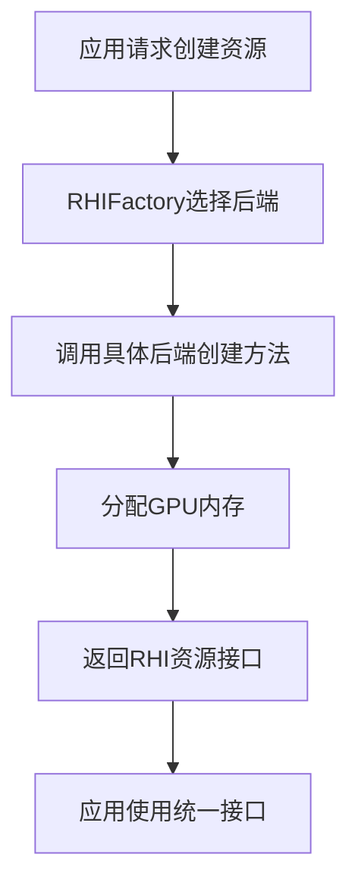
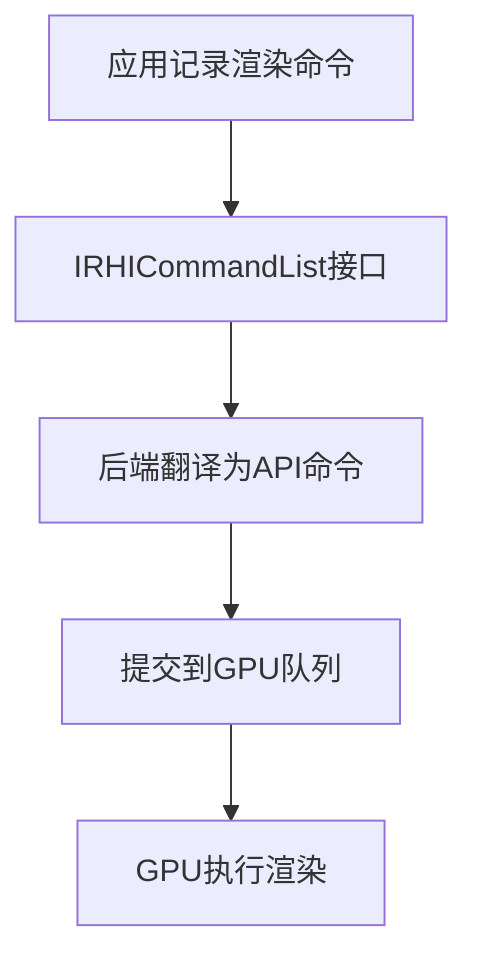

# MonsterRender 总体架构设计

## 概述

MonsterRender是一个基于虚幻引擎5 (UE5) RHI架构的现代渲染引擎。采用分层架构设计，支持多图形API后端，使用现代C++20特性构建。

## 核心设计理念

### 1. 分层抽象
引擎采用严格的分层架构，每一层只与相邻层交互：

```
应用层 (Application Layer)
    ↓
引擎层 (Engine Layer) 
    ↓
渲染器层 (Renderer Layer)
    ↓
RHI层 (RHI Layer)
    ↓
平台实现层 (Platform Implementation Layer)
    ↓
图形API层 (Graphics API Layer)
```

### 2. 接口导向设计
所有关键组件都定义了抽象接口：
- `IRHIDevice` - 设备抽象
- `IRHIResource` - 资源抽象
- `IRHICommandList` - 命令列表抽象

### 3. 工厂模式
使用工厂模式支持运行时选择不同的图形API后端：

```cpp
auto device = RHIFactory::createDevice(createInfo);
```

## 模块架构

### Core 模块
提供基础设施服务：

```cpp
namespace MonsterRender {
    // 类型系统
    template<typename T> using TSharedPtr = std::shared_ptr<T>;
    template<typename T> using TArray = std::vector<T>;
    
    // 日志系统
    class Logger;
    
    // 断言系统
    #define MR_ASSERT(condition)
}
```

**职责**：
- 基础类型定义和别名
- 日志记录和调试支持
- 内存管理和智能指针
- 断言和错误处理

### RHI 模块
渲染硬件接口抽象层：

```cpp
namespace MonsterRender::RHI {
    class IRHIDevice;       // 设备接口
    class IRHIResource;     // 资源基类
    class IRHICommandList;  // 命令列表
    class RHIFactory;       // 后端工厂
}
```

**职责**：
- 定义图形API无关的接口
- 管理资源生命周期
- 提供统一的渲染命令接口
- 支持多后端切换

### Platform 模块
特定图形API的实现：

```cpp
namespace MonsterRender::RHI::Vulkan {
    class VulkanDevice : public IRHIDevice;
    class VulkanBuffer : public IRHIBuffer;
    class VulkanCommandList : public IRHICommandList;
}
```

**职责**：
- 实现RHI接口的具体功能
- 管理API特定的资源
- 处理平台差异

## 数据流架构

### 资源创建流程


### 渲染命令流程


## 内存管理策略

### 智能指针使用
- `TSharedPtr<T>` - 用于共享资源（如纹理、缓冲区）
- `TUniquePtr<T>` - 用于独占资源（如设备、工厂对象）
- `TWeakPtr<T>` - 用于避免循环引用

### RAII 原则
所有资源都遵循RAII（Resource Acquisition Is Initialization）：

```cpp
class IRHIResource {
public:
    IRHIResource();          // 获取资源
    virtual ~IRHIResource(); // 释放资源
    
    // 禁止拷贝，允许移动
    IRHIResource(const IRHIResource&) = delete;
    IRHIResource(IRHIResource&&) = default;
};
```

## 线程安全设计

### 命令列表线程安全
- 每个线程可以拥有独立的命令列表
- 支持并行命令记录
- 使用线程安全的资源管理

### 资源共享
- 资源创建线程安全
- 使用引用计数管理生命周期
- 避免数据竞争

## 扩展性设计

### 添加新的RHI后端
1. 继承RHI接口类
2. 在工厂中注册后端
3. 实现平台特定功能

### 添加新的资源类型
1. 继承`IRHIResource`
2. 定义资源描述符
3. 在各后端中实现

## 性能考虑

### CPU性能
- 最小化虚函数调用开销
- 使用内存池减少分配
- 批处理渲染命令

### GPU性能
- 资源状态跟踪
- 合理的资源屏障
- 并行命令执行

## 调试支持

### 验证层集成
```cpp
RHICreateInfo createInfo;
createInfo.enableValidation = true;  // 开启验证
createInfo.enableDebugMarkers = true; // 开启调试标记
```

### 日志系统集成
```cpp
MR_LOG_INFO("Creating RHI device");
MR_LOG_ERROR("Failed to create buffer");
```

## 未来扩展计划

### 短期目标
- 完整的Vulkan后端实现
- 基础渲染管线
- 简单几何体渲染

### 中期目标
- Direct3D 12后端
- 高级渲染特性（阴影、后处理）
- 多线程渲染

### 长期目标
- 光线追踪支持
- 计算着色器集成
- 跨平台支持完善

---

## 相关文档
- [模块依赖关系](ModuleDependencies.md)
- [设计模式和原则](DesignPatterns.md)
- [RHI概述](../RHI/RHIOverview.md)
