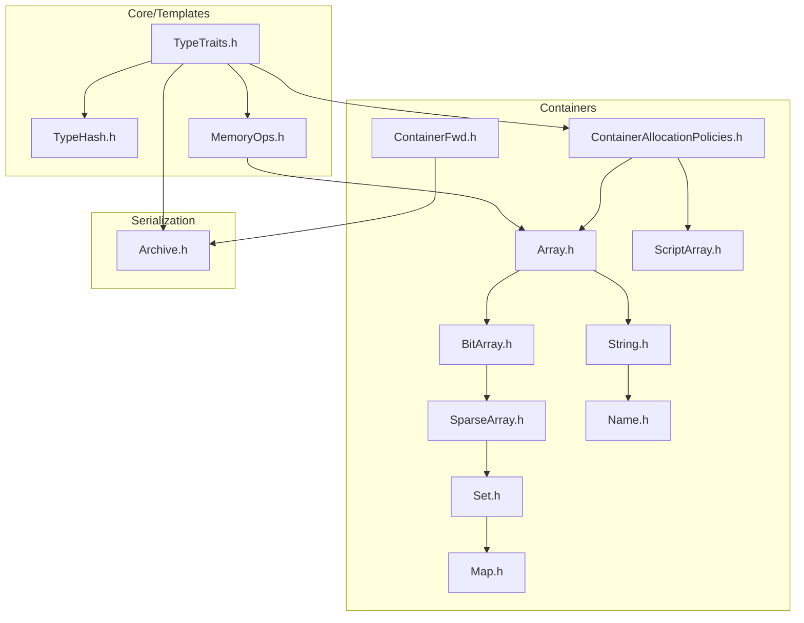
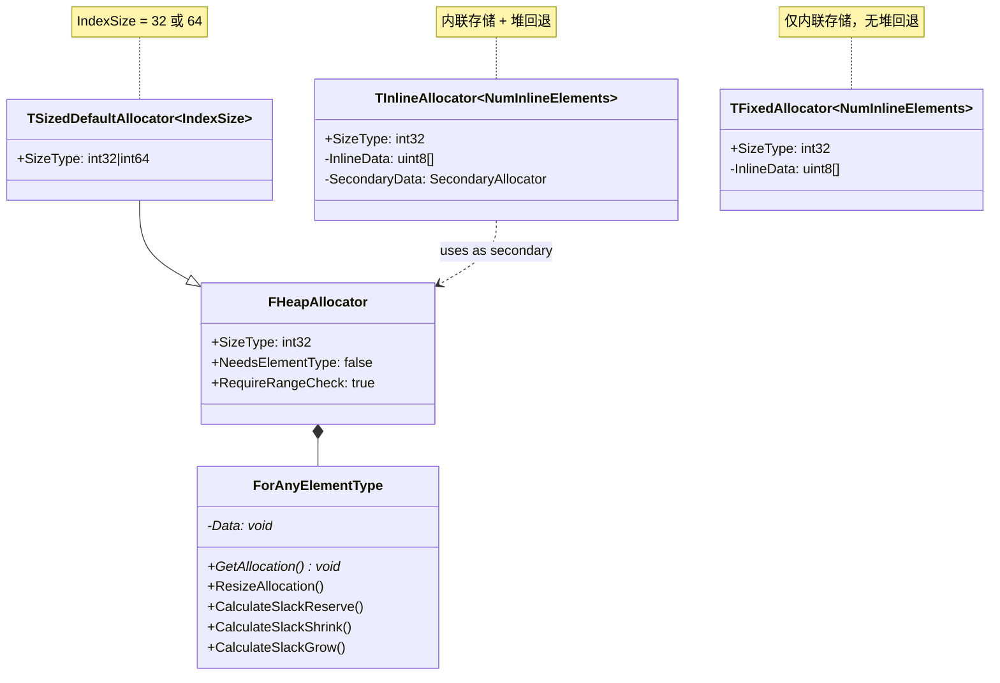
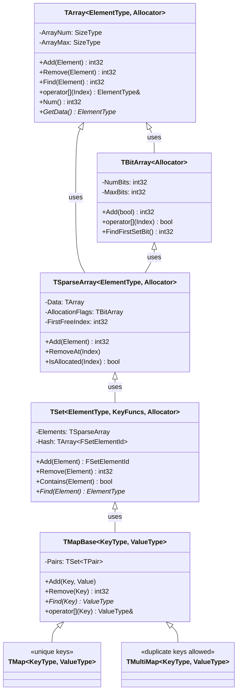
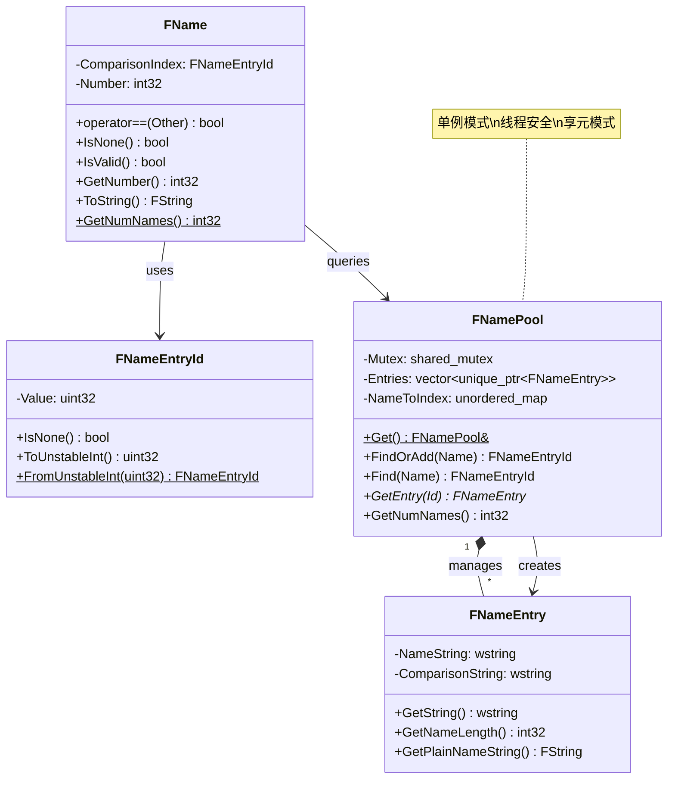
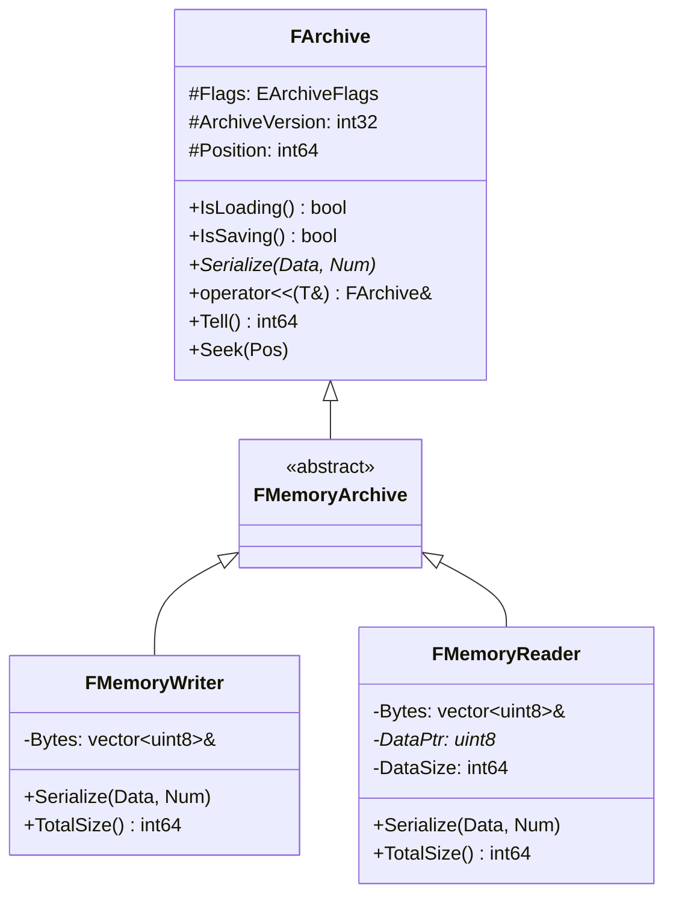
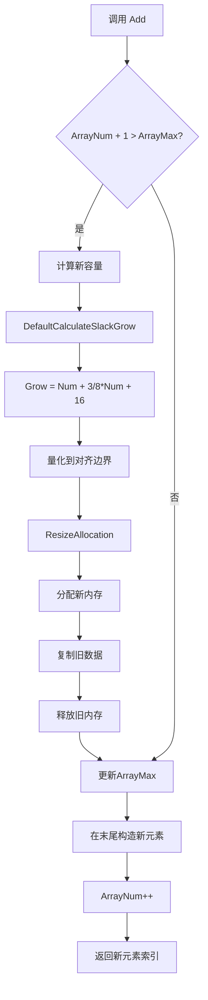
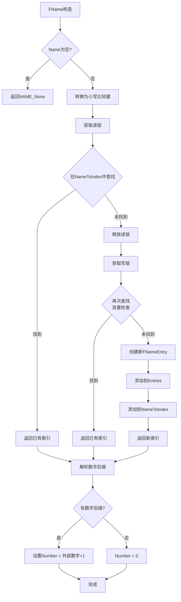
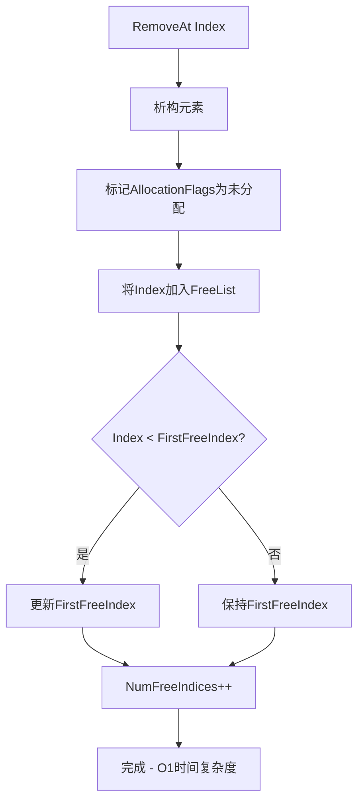
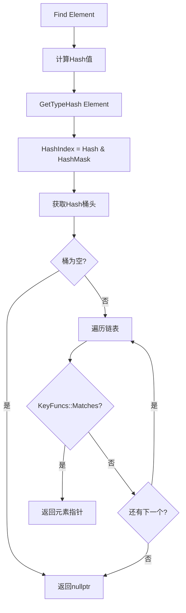

# MonsterEngine UE5风格自定义容器系统开发文档

## 目录

1. [概述](#概述)
2. [代码结构图](#代码结构图)
3. [UML类图](#uml类图)
4. [设计模式实现](#设计模式实现)
5. [核心特性详解](#核心特性详解)
6. [流程图](#流程图)
7. [API参考](#api参考)

---

## 概述

MonsterEngine容器系统参照UE5架构设计，提供高性能、类型安全的容器实现。主要特点：

- **模板元编程优化**：编译期类型萃取，自动选择最优内存操作
- **可配置分配器**：策略模式实现，支持堆分配、内联存储、固定大小等
- **Slack机制**：智能预分配，减少内存重分配次数
- **享元模式FName**：全局名称去重，O(1)比较
- **统一序列化接口**：FArchive风格，支持双向序列化

---

## 代码结构图

```
MonsterEngine/
├── Include/
│   ├── Core/Templates/                    # 模板元编程基础设施
│   │   ├── TypeTraits.h                   # 类型萃取工具
│   │   ├── TypeHash.h                     # 哈希函数和GetTypeHash()
│   │   └── MemoryOps.h                    # 内存操作优化
│   │
│   ├── Containers/                        # 容器实现
│   │   ├── ContainerFwd.h                 # 前向声明
│   │   ├── ContainerAllocationPolicies.h  # 分配器策略
│   │   ├── Array.h                        # TArray动态数组
│   │   ├── BitArray.h                     # TBitArray位数组
│   │   ├── SparseArray.h                  # TSparseArray稀疏数组
│   │   ├── Set.h                          # TSet哈希集合
│   │   ├── Map.h                          # TMap/TMultiMap哈希映射
│   │   ├── String.h                       # FString动态字符串
│   │   ├── Name.h                         # FName全局名称表
│   │   ├── ScriptArray.h                  # TScriptArray反射容器
│   │   └── Containers.h                   # 统一包含头文件
│   │
│   └── Serialization/
│       └── Archive.h                      # FArchive序列化接口
│
└── Source/Tests/
    └── ContainerTest.cpp                  # 容器测试套件
```

### 模块依赖关系图



---

## UML类图

### 分配器类层次结构



### 容器类层次结构



### FName系统类图



### 序列化系统类图



---

## 设计模式实现

### 1. 策略模式 (Strategy Pattern)

**应用位置**: 分配器策略 (`ContainerAllocationPolicies.h`)

策略模式允许在运行时或编译时选择不同的分配策略，而不改变容器的核心逻辑。

```cpp
// 策略接口：分配器基类
class FHeapAllocator
{
public:
    using SizeType = int32;
    
    class ForAnyElementType
    {
    public:
        // 策略方法：分配/释放内存
        void ResizeAllocation(SizeType PreviousNumElements, 
                              SizeType NumElements, 
                              size_t NumBytesPerElement, 
                              uint32 AlignmentOfElement);
        
        // 策略方法：计算Slack
        SizeType CalculateSlackGrow(SizeType NumElements, 
                                    SizeType NumAllocatedElements, 
                                    size_t NumBytesPerElement, 
                                    uint32 AlignmentOfElement) const;
    };
};

// 具体策略1：32位索引分配器
using FDefaultAllocator = TSizedDefaultAllocator<32>;

// 具体策略2：64位索引分配器（支持超大数组）
using FDefaultAllocator64 = TSizedDefaultAllocator<64>;

// 具体策略3：内联分配器（小数组优化）
template<uint32 NumInlineElements, typename SecondaryAllocator = FDefaultAllocator>
class TInlineAllocator { ... };

// 具体策略4：固定大小分配器（栈上分配）
template<uint32 NumInlineElements>
class TFixedAllocator { ... };
```

**使用示例**:

```cpp
// 使用默认堆分配器
TArray<int32> HeapArray;

// 使用内联分配器（前16个元素在栈上）
TArray<int32, TInlineAllocator<16>> InlineArray;

// 使用固定大小分配器（最多100个元素，全部在栈上）
TArray<int32, TFixedAllocator<100>> FixedArray;
```

---

### 2. 模板元编程 (Template Metaprogramming)

**应用位置**: `TypeTraits.h`, `MemoryOps.h`

利用编译期类型萃取，自动选择最优的内存操作路径。

```cpp
// TypeTraits.h - 类型萃取

/**
 * TIsTriviallyCopyable - 检查类型是否可以安全memcpy
 * 这是容器优化的关键trait
 */
template<typename T>
struct TIsTriviallyCopyable
{
    enum { Value = std::is_trivially_copyable_v<T> };
};

/**
 * TIsPODType - 检查类型是否为POD（Plain Old Data）
 * POD类型可以安全memcpy且不需要构造/析构
 */
template<typename T>
struct TIsPODType
{
    enum { Value = std::is_standard_layout_v<T> && std::is_trivial_v<T> };
};

/**
 * TIsZeroConstructType - 可以用memset(0)初始化的类型
 */
template<typename T>
struct TIsZeroConstructType
{
    enum { Value = TIsArithmetic<T>::Value || 
                   TIsPointer<T>::Value || 
                   TIsEnum<T>::Value };
};

/**
 * TCallTraits - 确定最优参数传递方式
 * 小类型按值传递，大类型按const引用传递
 */
template<typename T>
struct TCallTraits
{
private:
    static constexpr bool PassByValue = 
        TIsArithmetic<T>::Value || 
        TIsPointer<T>::Value || 
        TIsEnum<T>::Value ||
        (sizeof(T) <= sizeof(void*) * 2 && TIsTriviallyCopyable<T>::Value);

public:
    using ParamType = TConditional_T<PassByValue, T, const T&>;
};
```

**编译期优化示例**:

```cpp
// MemoryOps.h - 根据类型特性选择最优操作

template<typename DestinationElementType, typename SourceElementType>
FORCEINLINE void ConstructItems(void* Dest, const SourceElementType* Source, int32 Count)
{
    if constexpr (TIsTriviallyCopyConstructible<DestinationElementType>::Value)
    {
        // 快速路径：直接memcpy
        std::memcpy(Dest, Source, sizeof(SourceElementType) * Count);
    }
    else
    {
        // 慢速路径：逐个调用拷贝构造函数
        DestinationElementType* DestPtr = static_cast<DestinationElementType*>(Dest);
        for (int32 i = 0; i < Count; ++i)
        {
            new (DestPtr + i) DestinationElementType(Source[i]);
        }
    }
}
```

---

### 3. 享元模式 (Flyweight Pattern)

**应用位置**: `FName` + `FNamePool` (`Name.h`)

享元模式通过共享相同的字符串实例来减少内存使用，并实现O(1)比较。

```cpp
// 享元工厂：全局名称池（单例）
class FNamePool
{
public:
    static FNamePool& Get()
    {
        static FNamePool Instance;
        return Instance;
    }
    
    // 查找或添加名称条目
    FNameEntryId FindOrAdd(const wchar_t* Name)
    {
        // 创建比较键（小写）
        std::wstring ComparisonKey = Name;
        for (wchar_t& C : ComparisonKey)
        {
            if (C >= L'A' && C <= L'Z')
                C += L'a' - L'A';
        }
        
        // 快速路径：读锁查找
        {
            std::shared_lock<std::shared_mutex> ReadLock(Mutex);
            auto It = NameToIndex.find(ComparisonKey);
            if (It != NameToIndex.end())
            {
                return FNameEntryId::FromUnstableInt(It->second);
            }
        }
        
        // 慢速路径：写锁添加
        std::unique_lock<std::shared_mutex> WriteLock(Mutex);
        
        // 双重检查
        auto It = NameToIndex.find(ComparisonKey);
        if (It != NameToIndex.end())
        {
            return FNameEntryId::FromUnstableInt(It->second);
        }
        
        // 添加新条目（享元对象）
        uint32 NewIndex = static_cast<uint32>(Entries.size());
        Entries.push_back(std::make_unique<FNameEntry>(Name));
        NameToIndex[ComparisonKey] = NewIndex;
        
        return FNameEntryId::FromUnstableInt(NewIndex);
    }
    
private:
    mutable std::shared_mutex Mutex;  // 读写锁，支持并发读
    std::vector<std::unique_ptr<FNameEntry>> Entries;  // 享元对象池
    std::unordered_map<std::wstring, uint32> NameToIndex;  // 快速查找表
};

// 享元客户端：FName
class FName
{
public:
    // O(1) 比较：只比较索引，不比较字符串
    FORCEINLINE bool operator==(const FName& Other) const
    {
        return ComparisonIndex == Other.ComparisonIndex && 
               Number == Other.Number;
    }
    
private:
    FNameEntryId ComparisonIndex;  // 指向享元对象的索引
    int32 Number;                   // 数字后缀
};
```

**内存节省示例**:

```cpp
// 创建1000个相同名称的FName
for (int i = 0; i < 1000; ++i)
{
    FName Name(L"PlayerCharacter");  // 只存储一份字符串
}

// 内存使用：
// - 传统方式：1000 * sizeof("PlayerCharacter") ≈ 16KB
// - FName方式：1 * sizeof("PlayerCharacter") + 1000 * 8字节 ≈ 8KB
```

---

### 4. 代理模式 (Proxy Pattern)

**应用位置**: `TScriptArray` (`ScriptArray.h`)

TScriptArray作为TArray的无类型代理，用于反射系统在运行时操作未知类型的数组。

```cpp
// 代理类：TScriptArray
template<typename AllocatorType = FDefaultAllocator>
class TScriptArray : protected AllocatorType::ForAnyElementType
{
public:
    // 代理方法：需要元素大小和对齐信息
    SizeType Add(SizeType Count, 
                 SizeType NumBytesPerElement, 
                 uint32 AlignmentOfElement)
    {
        const SizeType OldNum = ArrayNum;
        
        if ((ArrayNum += Count) > ArrayMax)
        {
            ResizeGrow(OldNum, NumBytesPerElement, AlignmentOfElement);
        }
        
        return OldNum;
    }
    
    // 代理方法：获取元素指针
    void* GetElementPtr(SizeType Index, SizeType NumBytesPerElement)
    {
        return static_cast<uint8*>(GetData()) + Index * NumBytesPerElement;
    }
    
protected:
    SizeType ArrayNum;
    SizeType ArrayMax;
};

// 辅助类：提供类型擦除的访问接口
class FScriptArrayHelper
{
public:
    FScriptArrayHelper(FScriptArray* InArray, 
                       int32 InElementSize, 
                       uint32 InElementAlignment)
        : Array(InArray)
        , ElementSize(InElementSize)
        , ElementAlignment(InElementAlignment)
    {
    }
    
    // 类型擦除的操作
    void* GetRawPtr(int32 Index)
    {
        return Array->GetElementPtr(Index, ElementSize);
    }
    
    int32 AddUninitializedValue()
    {
        return Array->Add(1, ElementSize, ElementAlignment);
    }
    
private:
    FScriptArray* Array;
    int32 ElementSize;
    uint32 ElementAlignment;
};
```

**反射系统使用示例**:

```cpp
// 反射系统获取属性信息
UProperty* ArrayProperty = ...;
void* ArrayPtr = ArrayProperty->GetValuePtr(Object);

// 创建代理访问器
FScriptArrayHelper Helper(
    static_cast<FScriptArray*>(ArrayPtr),
    ArrayProperty->GetElementSize(),
    ArrayProperty->GetElementAlignment()
);

// 通过代理操作数组
int32 NewIndex = Helper.AddUninitializedValue();
void* ElementPtr = Helper.GetRawPtr(NewIndex);
```

---

### 5. CRTP (Curiously Recurring Template Pattern)

**应用位置**: `TMapBase` (`Map.h`)

CRTP用于在基类中实现通用逻辑，同时允许派生类定制行为。

```cpp
// CRTP基类
template<typename KeyType, 
         typename ValueType, 
         typename SetAllocator, 
         typename KeyFuncs>
class TMapBase
{
public:
    using ElementType = TPair<KeyType, ValueType>;
    
protected:
    // 内部使用TSet存储键值对
    using SetType = TSet<ElementType, 
                         TDefaultMapKeyFuncs<KeyType, ValueType, false>, 
                         SetAllocator>;
    SetType Pairs;
    
public:
    // 通用实现：添加键值对
    ValueType& Add(const KeyType& Key, const ValueType& Value)
    {
        return Emplace(Key, Value);
    }
    
    // 通用实现：查找
    ValueType* Find(const KeyType& Key)
    {
        if (auto* Pair = Pairs.Find(Key))
        {
            return &Pair->Value;
        }
        return nullptr;
    }
    
    // 通用实现：迭代
    auto begin() { return Pairs.begin(); }
    auto end() { return Pairs.end(); }
};

// 派生类1：TMap（唯一键）
template<typename KeyType, 
         typename ValueType, 
         typename SetAllocator = FDefaultAllocator, 
         typename KeyFuncs = TDefaultMapKeyFuncs<KeyType, ValueType, false>>
class TMap : public TMapBase<KeyType, ValueType, SetAllocator, KeyFuncs>
{
    // 继承基类所有功能
    // 可以添加TMap特有的方法
};

// 派生类2：TMultiMap（允许重复键）
template<typename KeyType, 
         typename ValueType, 
         typename SetAllocator = FDefaultAllocator, 
         typename KeyFuncs = TDefaultMapKeyFuncs<KeyType, ValueType, true>>
class TMultiMap : public TMapBase<KeyType, ValueType, SetAllocator, KeyFuncs>
{
    // 继承基类所有功能
    // KeyFuncs模板参数允许重复键
};
```

---

## 核心特性详解

### 1. 分配器抽象

#### TSizedDefaultAllocator

支持32位和64位索引的默认分配器：

```cpp
template<int IndexSize>
class TSizedDefaultAllocator : public FHeapAllocator
{
public:
    // 根据IndexSize选择int32或int64
    using SizeType = TConditional_T<IndexSize == 64, int64, int32>;
    
    static_assert(IndexSize == 32 || IndexSize == 64, 
                  "IndexSize must be 32 or 64");
};

// 预定义类型别名
using FDefaultAllocator = TSizedDefaultAllocator<32>;    // 最大2^31个元素
using FDefaultAllocator64 = TSizedDefaultAllocator<64>;  // 最大2^63个元素
```

#### TInlineAllocator

内联存储 + 堆回退：

```cpp
template<uint32 NumInlineElements, typename SecondaryAllocator = FDefaultAllocator>
class TInlineAllocator
{
    template<typename ElementType>
    class ForElementType
    {
        // 内联存储
        alignas(ElementType) uint8 InlineData[sizeof(ElementType) * NumInlineElements];
        
        // 堆存储（当超过内联容量时使用）
        typename SecondaryAllocator::template ForElementType<ElementType> SecondaryData;
        
        ElementType* GetAllocation() const
        {
            // 优先返回堆存储，否则返回内联存储
            ElementType* SecondaryAlloc = SecondaryData.GetAllocation();
            if (SecondaryAlloc)
                return SecondaryAlloc;
            return reinterpret_cast<ElementType*>(InlineData);
        }
    };
};
```

#### TFixedAllocator

固定大小内联存储（无堆回退）：

```cpp
template<uint32 NumInlineElements>
class TFixedAllocator
{
    template<typename ElementType>
    class ForElementType
    {
        alignas(ElementType) uint8 InlineData[sizeof(ElementType) * NumInlineElements];
        
        void ResizeAllocation(...)
        {
            // 固定分配器不能扩展，调用者必须确保不超过容量
        }
    };
};
```

---

### 2. Slack机制

Slack（松弛）机制通过预分配额外空间来减少内存重分配次数。

#### 增长公式

```cpp
template<typename SizeType>
FORCEINLINE SizeType DefaultCalculateSlackGrow(
    SizeType NumElements,           // 需要的元素数
    SizeType NumAllocatedElements,  // 当前分配的元素数
    size_t BytesPerElement,         // 每个元素的字节数
    bool bAllowQuantize,            // 是否量化到对齐边界
    uint32 Alignment = 16)
{
    constexpr size_t FirstGrow = 4;      // 首次分配的最小容量
    constexpr size_t ConstantGrow = 16;  // 常量增长因子
    
    size_t Grow = FirstGrow;
    
    if (NumAllocatedElements > 0)
    {
        // 增长公式：size + 3/8 * size + 16
        // 这提供了约37.5%的额外空间
        Grow = NumElements + 3 * NumElements / 8 + ConstantGrow;
    }
    else if (NumElements > Grow)
    {
        Grow = NumElements;
    }
    
    // 量化到对齐边界
    if (bAllowQuantize)
    {
        size_t QuantizedSize = (Grow * BytesPerElement + Alignment - 1) 
                               & ~(Alignment - 1);
        return QuantizedSize / BytesPerElement;
    }
    
    return Grow;
}
```

#### 收缩策略

```cpp
template<typename SizeType>
FORCEINLINE SizeType DefaultCalculateSlackShrink(
    SizeType NumElements,
    SizeType NumAllocatedElements,
    size_t BytesPerElement,
    bool bAllowQuantize,
    uint32 Alignment = 16)
{
    const SizeType CurrentSlackElements = NumAllocatedElements - NumElements;
    const size_t CurrentSlackBytes = CurrentSlackElements * BytesPerElement;
    
    // 收缩条件：
    // 1. 浪费超过16KB，或
    // 2. 使用率低于66%（3*Num < 2*Max）
    const bool bTooManySlackBytes = CurrentSlackBytes >= 16384;
    const bool bTooManySlackElements = 3 * NumElements < 2 * NumAllocatedElements;
    
    if ((bTooManySlackBytes || bTooManySlackElements) && 
        (CurrentSlackElements > 64 || !NumElements))
    {
        return NumElements;  // 收缩到实际大小
    }
    
    return NumAllocatedElements;  // 保持当前容量
}
```

---

### 3. FName系统

#### 核心特性

| 特性 | 说明 |
|------|------|
| **全局唯一** | 相同字符串只存储一份 |
| **O(1)比较** | 比较索引而非字符串内容 |
| **大小写不敏感** | "Actor" == "ACTOR" == "actor" |
| **数字后缀** | 自动解析 "Actor_5" 为 Actor + 5 |
| **线程安全** | 使用读写锁保护名称池 |

#### 数字后缀解析

```cpp
void FName::Init(const wchar_t* Name)
{
    std::wstring NameStr = Name;
    size_t UnderscorePos = NameStr.rfind(L'_');
    
    if (UnderscorePos != std::wstring::npos && 
        UnderscorePos < NameStr.length() - 1)
    {
        // 检查下划线后是否全是数字
        bool bIsNumber = true;
        int32 ParsedNumber = 0;
        
        for (size_t i = UnderscorePos + 1; i < NameStr.length(); ++i)
        {
            wchar_t C = NameStr[i];
            if (C >= L'0' && C <= L'9')
            {
                ParsedNumber = ParsedNumber * 10 + (C - L'0');
            }
            else
            {
                bIsNumber = false;
                break;
            }
        }
        
        if (bIsNumber)
        {
            // 分离名称和数字
            std::wstring BaseName = NameStr.substr(0, UnderscorePos);
            ComparisonIndex = FNamePool::Get().FindOrAdd(BaseName.c_str());
            Number = ParsedNumber + 1;  // 内部数字 = 外部数字 + 1
            return;
        }
    }
    
    // 无数字后缀
    ComparisonIndex = FNamePool::Get().FindOrAdd(Name);
    Number = 0;
}
```

---

### 4. 序列化接口

#### FArchive基类

```cpp
class FArchive
{
public:
    // 状态查询
    bool IsLoading() const { return !!(Flags & EArchiveFlags::Loading); }
    bool IsSaving() const { return !!(Flags & EArchiveFlags::Saving); }
    
    // 核心序列化方法（派生类重写）
    virtual void Serialize(void* Data, int64 Num) { }
    
    // 运算符重载：基本类型
    FArchive& operator<<(int32& Value)
    {
        Serialize(&Value, sizeof(Value));
        return *this;
    }
    
    FArchive& operator<<(float& Value)
    {
        Serialize(&Value, sizeof(Value));
        return *this;
    }
    
protected:
    EArchiveFlags Flags;
    int32 ArchiveVersion;
    int64 Position;
};
```

#### 容器序列化

```cpp
// TArray序列化
template<typename ElementType, typename Allocator>
FArchive& operator<<(FArchive& Ar, TArray<ElementType, Allocator>& Array)
{
    int32 Num = Array.Num();
    Ar << Num;
    
    if (Ar.IsLoading())
    {
        Array.SetNumUninitialized(Num);
    }
    
    // 编译期优化：POD类型使用批量序列化
    if constexpr (TCanBulkSerialize<ElementType>::Value)
    {
        if (Num > 0)
        {
            Ar.Serialize(Array.GetData(), Num * sizeof(ElementType));
        }
    }
    else
    {
        // 非POD类型逐个序列化
        for (int32 i = 0; i < Num; ++i)
        {
            Ar << Array[i];
        }
    }
    
    return Ar;
}
```

---

### 5. 脚本容器

#### TScriptArray

无类型数组，用于反射系统：

```cpp
template<typename AllocatorType = FDefaultAllocator>
class TScriptArray : protected AllocatorType::ForAnyElementType
{
public:
    // 所有操作都需要元素大小和对齐信息
    SizeType Add(SizeType Count, 
                 SizeType NumBytesPerElement, 
                 uint32 AlignmentOfElement);
    
    void Remove(SizeType Index, 
                SizeType Count, 
                SizeType NumBytesPerElement, 
                uint32 AlignmentOfElement);
    
    void* GetElementPtr(SizeType Index, 
                        SizeType NumBytesPerElement);
    
protected:
    SizeType ArrayNum;  // 元素数量
    SizeType ArrayMax;  // 分配容量
};
```

#### FScriptArrayHelper

类型擦除的访问辅助类：

```cpp
class FScriptArrayHelper
{
public:
    FScriptArrayHelper(FScriptArray* InArray, 
                       int32 InElementSize, 
                       uint32 InElementAlignment);
    
    // 类型擦除的操作
    int32 Num() const;
    bool IsEmpty() const;
    void* GetRawPtr(int32 Index);
    int32 AddUninitializedValue();
    void RemoveValues(int32 Index, int32 Count = 1);
    void Resize(int32 NewNum);
    
private:
    FScriptArray* Array;
    int32 ElementSize;
    uint32 ElementAlignment;
};
```

---

## 流程图

### TArray::Add 流程



### FName查找/创建流程



### 序列化流程

```mermaid
flowchart TD
    A[Ar << Object] --> B{Ar.IsLoading()?}
    
    B -->|是 - 读取| C[读取数据长度]
    C --> D[分配内存/调整大小]
    D --> E{是POD类型?}
    E -->|是| F[批量读取: Serialize]
    E -->|否| G[逐个读取元素]
    F --> H[完成]
    G --> H
    
    B -->|否 - 写入| I[获取数据长度]
    I --> J[写入长度]
    J --> K{是POD类型?}
    K -->|是| L[批量写入: Serialize]
    K -->|否| M[逐个写入元素]
    L --> H
    M --> H
```

### TSparseArray删除流程



### TSet查找流程



---

## API参考

### TArray

| 方法 | 说明 | 复杂度 |
|------|------|--------|
| `Add(Element)` | 添加元素到末尾 | O(1)摊销 |
| `Insert(Element, Index)` | 在指定位置插入 | O(n) |
| `Remove(Element)` | 删除第一个匹配元素 | O(n) |
| `RemoveAt(Index)` | 删除指定位置元素 | O(n) |
| `RemoveSwap(Index)` | 与末尾交换后删除 | O(1) |
| `Find(Element)` | 查找元素索引 | O(n) |
| `Contains(Element)` | 检查是否包含 | O(n) |
| `Sort()` | 排序 | O(n log n) |
| `Reserve(Num)` | 预分配容量 | O(n) |
| `Shrink()` | 收缩到实际大小 | O(n) |

### TSet

| 方法 | 说明 | 复杂度 |
|------|------|--------|
| `Add(Element)` | 添加元素 | O(1)平均 |
| `Remove(Element)` | 删除元素 | O(1)平均 |
| `Contains(Element)` | 检查是否包含 | O(1)平均 |
| `Find(Element)` | 查找元素指针 | O(1)平均 |
| `Intersect(Other)` | 交集 | O(n) |
| `Union(Other)` | 并集 | O(n) |
| `Difference(Other)` | 差集 | O(n) |

### TMap

| 方法 | 说明 | 复杂度 |
|------|------|--------|
| `Add(Key, Value)` | 添加键值对 | O(1)平均 |
| `Remove(Key)` | 删除键 | O(1)平均 |
| `Find(Key)` | 查找值指针 | O(1)平均 |
| `Contains(Key)` | 检查键是否存在 | O(1)平均 |
| `operator[](Key)` | 获取或创建值 | O(1)平均 |
| `GetKeys()` | 获取所有键 | O(n) |
| `GetValues()` | 获取所有值 | O(n) |

### FName

| 方法 | 说明 | 复杂度 |
|------|------|--------|
| `operator==` | 比较相等 | O(1) |
| `operator<` | 比较大小 | O(1) |
| `IsNone()` | 是否为空 | O(1) |
| `IsValid()` | 是否有效 | O(1) |
| `GetNumber()` | 获取数字后缀 | O(1) |
| `ToString()` | 转换为字符串 | O(n) |
| `GetNumNames()` | 全局名称数量 | O(1) |

---

## 总结

MonsterEngine容器系统通过以下设计实现高性能：

1. **编译期优化**：模板元编程自动选择最优代码路径
2. **内存效率**：Slack机制减少重分配，享元模式减少字符串重复
3. **灵活性**：策略模式支持多种分配策略
4. **可扩展性**：CRTP和代理模式支持反射和脚本系统
5. **线程安全**：FName使用读写锁支持并发访问

这套容器系统为MonsterEngine提供了与UE5相当的容器功能和性能特性。
