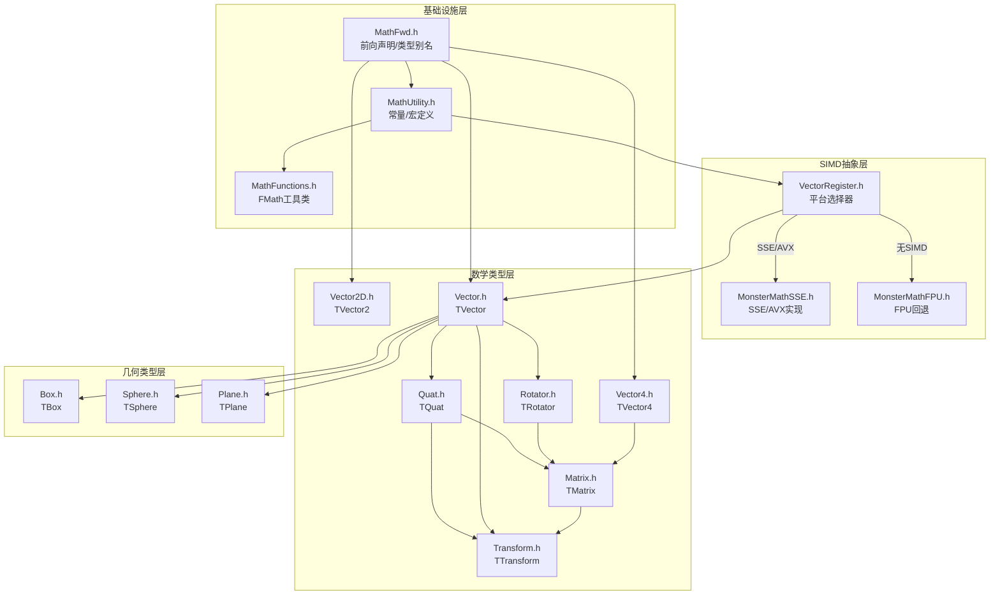
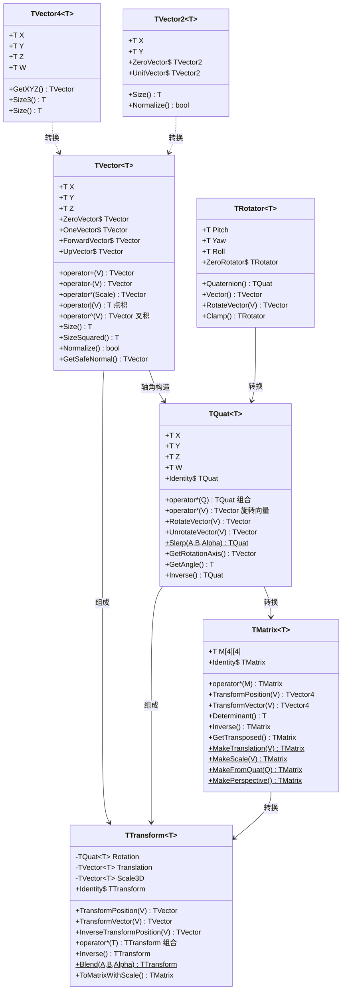
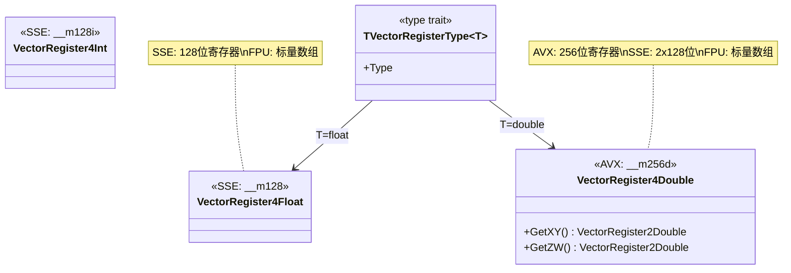
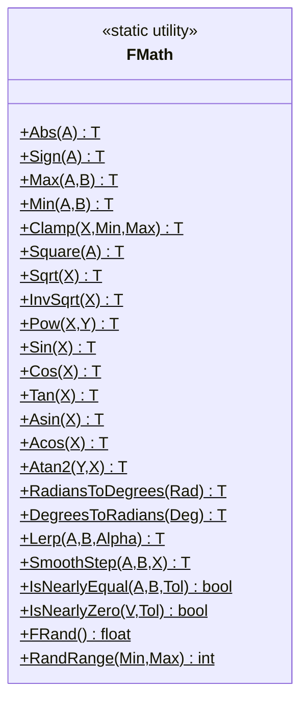
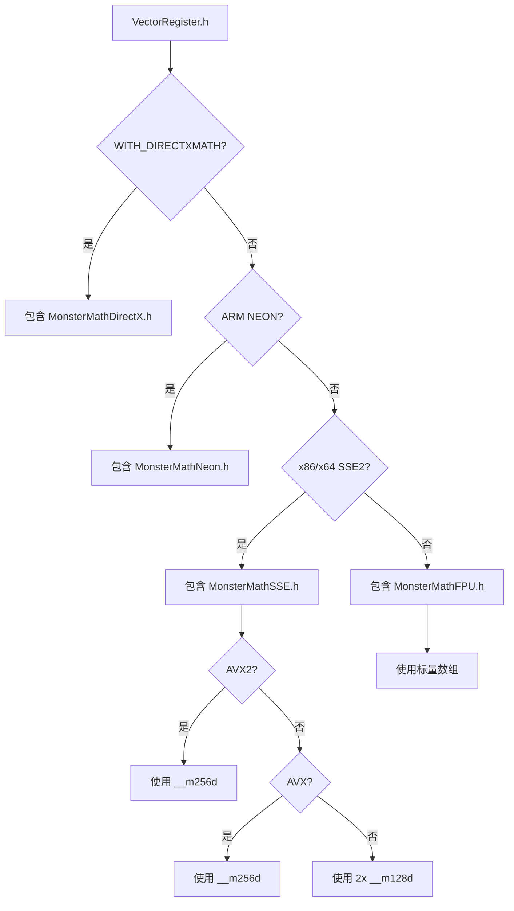
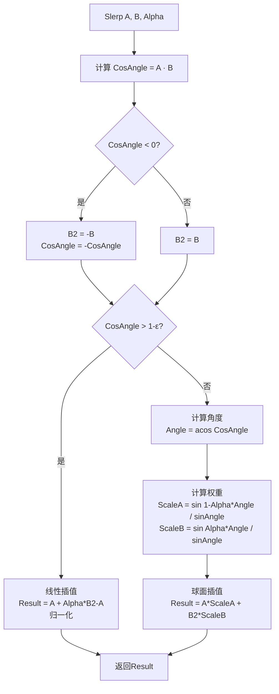
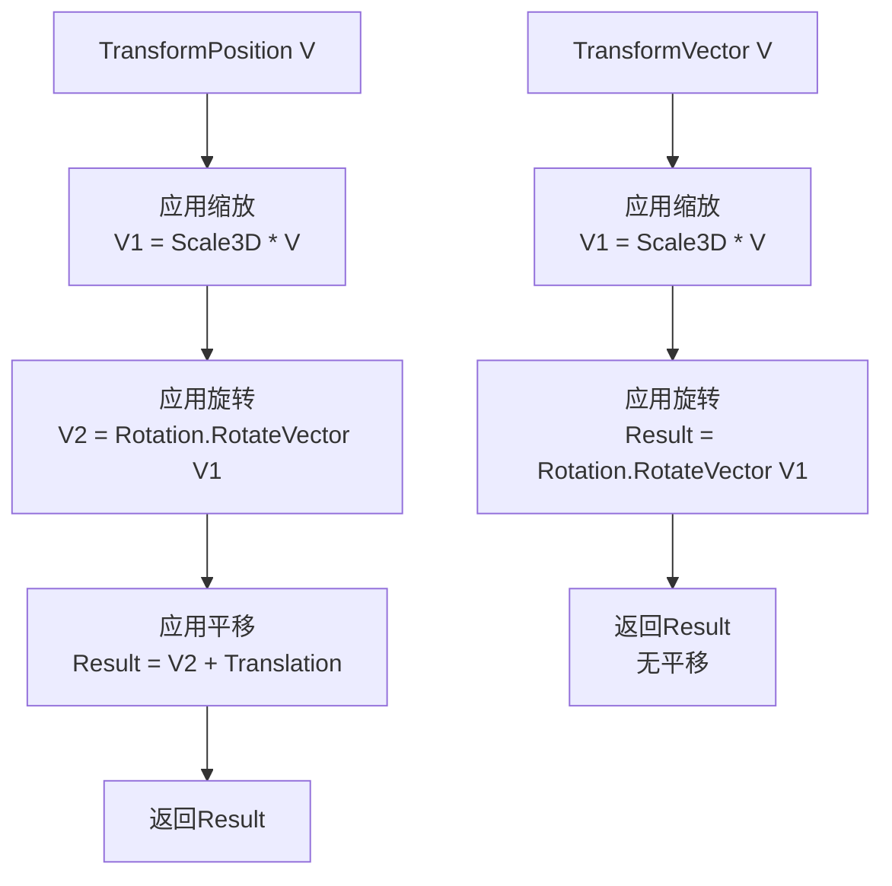
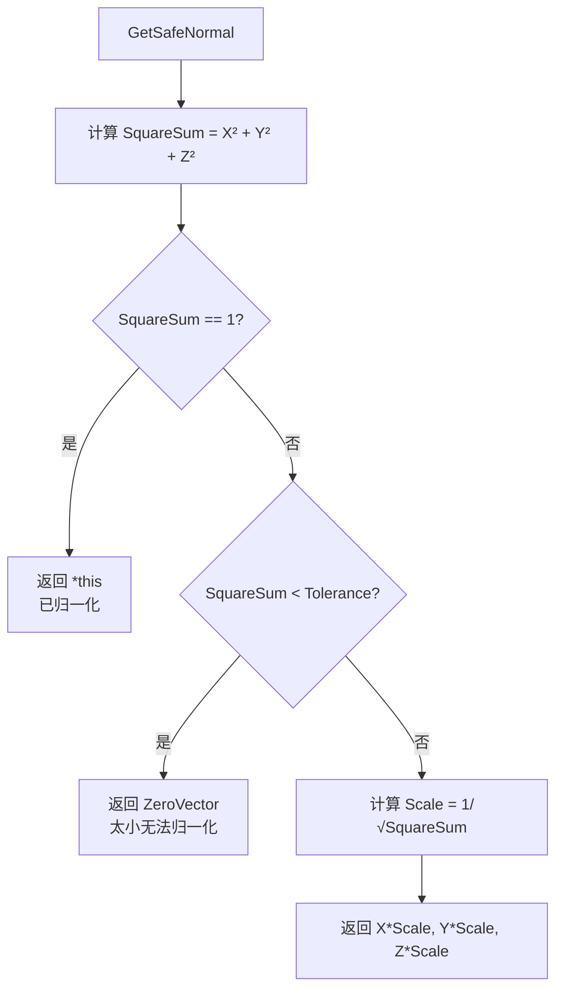
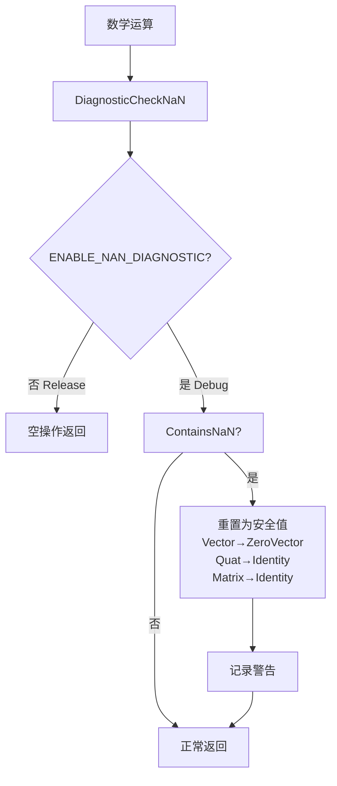

# MonsterEngine UE5风格数学库开发文档

## 目录

1. [概述](#概述)
2. [代码结构图](#代码结构图)
3. [UML类图](#uml类图)
4. [设计特点详解](#设计特点详解)
5. [核心类型详解](#核心类型详解)
6. [流程图](#流程图)
7. [API参考](#api参考)

---

## 概述

MonsterEngine数学库参照UE5架构设计，提供高性能、跨平台的数学运算支持。主要特点：

- **模板化精度支持** - 所有类型支持 `float` 和 `double`，默认使用 `double` (LWC支持)
- **SIMD透明抽象** - 自动检测SSE/AVX/NEON，上层代码无需关心
- **内存对齐优化** - `alignas(16/32)` 保证SIMD效率
- **NaN诊断** - Debug模式下自动检测无效值
- **UE5风格API** - 操作符重载、静态常量、工具函数

---

## 代码结构图

```
Include/Math/
├── MathFwd.h              # 前向声明和类型别名
├── MathUtility.h          # 数学常量和宏定义
├── MathFunctions.h        # FMath静态工具类
├── VectorRegister.h       # SIMD平台选择器
├── MonsterMathSSE.h       # SSE/AVX SIMD实现
├── MonsterMathFPU.h       # 纯C++ FPU回退实现
├── Vector.h               # TVector<T> 3D向量
├── Vector2D.h             # TVector2<T> 2D向量
├── Vector4.h              # TVector4<T> 4D向量
├── Quat.h                 # TQuat<T> 四元数
├── Rotator.h              # TRotator<T> 欧拉角
├── Matrix.h               # TMatrix<T> 4x4矩阵
├── Transform.h            # TTransform<T> 组合变换
├── Box.h                  # TBox<T> 轴对齐包围盒
├── Sphere.h               # TSphere<T> 边界球
├── Plane.h                # TPlane<T> 平面
└── MonsterMath.h          # 统一入口头文件

Source/Tests/
└── MathLibraryTest.cpp    # 数学库测试文件
```

### 模块依赖关系图



---

## UML类图

### 数学类型继承关系



### SIMD抽象层类图



### FMath工具类



---

## 设计特点详解

### 1. 模板化精度支持

所有数学类型都是模板类，支持 `float` 和 `double` 精度：

```cpp
// MathFwd.h - 类型别名定义

// 前向声明
template<typename T> struct TVector;
template<typename T> struct TQuat;
template<typename T> struct TMatrix;
template<typename T> struct TTransform;

// 默认精度别名 (double for LWC - Large World Coordinates)
using FVector       = TVector<double>;    // 默认double精度
using FVector3f     = TVector<float>;     // 显式float精度
using FVector3d     = TVector<double>;    // 显式double精度

using FQuat         = TQuat<double>;
using FQuat4f       = TQuat<float>;
using FQuat4d       = TQuat<double>;

using FMatrix       = TMatrix<double>;
using FMatrix44f    = TMatrix<float>;
using FMatrix44d    = TMatrix<double>;

using FTransform    = TTransform<double>;
using FTransform3f  = TTransform<float>;
using FTransform3d  = TTransform<double>;
```

**精度转换**:

```cpp
// Vector.h - 不同精度间的转换

template<typename T>
struct TVector
{
    // 从不同精度构造
    template<typename FArg, typename = std::enable_if_t<!std::is_same_v<T, FArg>>>
    explicit FORCEINLINE TVector(const TVector<FArg>& V)
        : X(static_cast<T>(V.X))
        , Y(static_cast<T>(V.Y))
        , Z(static_cast<T>(V.Z))
    {
        DiagnosticCheckNaN();
    }
};

// 使用示例
FVector3f FloatVec(1.0f, 2.0f, 3.0f);
FVector3d DoubleVec(FloatVec);  // float -> double 转换
```

---

### 2. SIMD透明抽象

SIMD实现对上层代码完全透明，通过编译期平台检测自动选择最优实现：

```cpp
// VectorRegister.h - 平台检测和选择

// SIMD能力检测
#if defined(__AVX2__)
    #define MR_PLATFORM_MATH_USE_AVX2 1
#endif

#if defined(__AVX__) || MR_PLATFORM_MATH_USE_AVX2
    #define MR_PLATFORM_MATH_USE_AVX 1
#endif

#if defined(_M_X64) || defined(__x86_64__) || defined(__SSE2__)
    #define MR_PLATFORM_ENABLE_VECTORINTRINSICS 1
#endif

#if defined(__ARM_NEON) || defined(__ARM_NEON__)
    #define MR_PLATFORM_ENABLE_VECTORINTRINSICS_NEON 1
#endif

// 根据平台包含对应实现
#if MR_WITH_DIRECTXMATH
    #include "MonsterMathDirectX.h"
#elif MR_PLATFORM_ENABLE_VECTORINTRINSICS_NEON
    #include "MonsterMathNeon.h"
#elif MR_PLATFORM_ENABLE_VECTORINTRINSICS
    #include "MonsterMathSSE.h"
#else
    #include "MonsterMathFPU.h"
#endif
```

**SSE实现示例**:

```cpp
// MonsterMathSSE.h - SSE/AVX SIMD实现

// 4 floats packed in 128-bit register
typedef __m128  VectorRegister4Float;

// 4 doubles - AVX uses 256-bit, SSE uses 2x128-bit
struct alignas(32) VectorRegister4Double
{
#if !MR_PLATFORM_MATH_USE_AVX
    VectorRegister2Double XY;
    VectorRegister2Double ZW;
#else
    union
    {
        struct { VectorRegister2Double XY; VectorRegister2Double ZW; };
        __m256d XYZW;
    };
#endif
};

// SIMD加法 - float
FORCEINLINE VectorRegister4Float VectorAdd(
    const VectorRegister4Float& Vec1, 
    const VectorRegister4Float& Vec2)
{
    return _mm_add_ps(Vec1, Vec2);  // SSE指令
}

// SIMD加法 - double (AVX)
FORCEINLINE VectorRegister4Double VectorAdd(
    const VectorRegister4Double& Vec1, 
    const VectorRegister4Double& Vec2)
{
#if MR_PLATFORM_MATH_USE_AVX
    VectorRegister4Double Result;
    Result.XYZW = _mm256_add_pd(Vec1.XYZW, Vec2.XYZW);
    return Result;
#else
    return VectorRegister4Double(
        _mm_add_pd(Vec1.XY, Vec2.XY),
        _mm_add_pd(Vec1.ZW, Vec2.ZW)
    );
#endif
}
```

**FPU回退实现**:

```cpp
// MonsterMathFPU.h - 纯C++标量实现

struct alignas(16) VectorRegister4Float
{
    float V[4];
    
    FORCEINLINE VectorRegister4Float(float X, float Y, float Z, float W)
    {
        V[0] = X; V[1] = Y; V[2] = Z; V[3] = W;
    }
};

// 标量加法
FORCEINLINE VectorRegister4Float VectorAdd(
    const VectorRegister4Float& Vec1, 
    const VectorRegister4Float& Vec2)
{
    return VectorRegister4Float(
        Vec1.V[0] + Vec2.V[0],
        Vec1.V[1] + Vec2.V[1],
        Vec1.V[2] + Vec2.V[2],
        Vec1.V[3] + Vec2.V[3]
    );
}
```

---

### 3. 内存对齐优化

所有SIMD相关类型都使用 `alignas` 保证内存对齐：

```cpp
// 对齐常量
#if MR_PLATFORM_MATH_USE_AVX
    constexpr size_t SIMD_FLOAT_ALIGNMENT = 32;   // AVX需要32字节对齐
    constexpr size_t SIMD_DOUBLE_ALIGNMENT = 32;
#else
    constexpr size_t SIMD_FLOAT_ALIGNMENT = 16;   // SSE需要16字节对齐
    constexpr size_t SIMD_DOUBLE_ALIGNMENT = 16;
#endif

// 四元数 - 16字节对齐
template<typename T>
struct alignas(16) TQuat
{
    T X, Y, Z, W;
    // ...
};

// 矩阵 - 16字节对齐
template<typename T>
struct alignas(16) TMatrix
{
    alignas(16) T M[4][4];
    // ...
};

// Transform - 16字节对齐
template<typename T>
struct alignas(16) TTransform
{
    TQuat<T> Rotation;
    TVector<T> Translation;
    TVector<T> Scale3D;
    // ...
};
```

---

### 4. NaN诊断

Debug模式下自动检测并处理NaN值：

```cpp
// MathUtility.h - NaN诊断配置

#ifndef ENABLE_NAN_DIAGNOSTIC
    #if defined(_DEBUG) || defined(DEBUG)
        #define ENABLE_NAN_DIAGNOSTIC 1
    #else
        #define ENABLE_NAN_DIAGNOSTIC 0
    #endif
#endif

// Vector.h - NaN检测实现

template<typename T>
struct TVector
{
    // 检查是否包含NaN
    MR_NODISCARD FORCEINLINE bool ContainsNaN() const
    {
        return !std::isfinite(X) || !std::isfinite(Y) || !std::isfinite(Z);
    }

#if ENABLE_NAN_DIAGNOSTIC
    FORCEINLINE void DiagnosticCheckNaN() const
    {
        if (ContainsNaN())
        {
            // Debug模式：检测到NaN时重置为零向量
            *const_cast<TVector<T>*>(this) = ZeroVector;
        }
    }
#else
    FORCEINLINE void DiagnosticCheckNaN() const {}  // Release模式：空操作
#endif

    // 所有可能产生NaN的操作后都调用诊断
    FORCEINLINE TVector<T>& operator+=(const TVector<T>& V)
    {
        X += V.X; Y += V.Y; Z += V.Z;
        DiagnosticCheckNaN();  // 检查结果
        return *this;
    }
};
```

---

### 5. UE5风格API

#### 操作符重载

```cpp
// Vector.h - UE5风格操作符

template<typename T>
struct TVector
{
    // 点积使用 | 操作符 (UE5约定)
    MR_NODISCARD FORCEINLINE T operator|(const TVector<T>& V) const
    {
        return X * V.X + Y * V.Y + Z * V.Z;
    }

    // 叉积使用 ^ 操作符 (UE5约定)
    MR_NODISCARD FORCEINLINE TVector<T> operator^(const TVector<T>& V) const
    {
        return TVector<T>(
            Y * V.Z - Z * V.Y,
            Z * V.X - X * V.Z,
            X * V.Y - Y * V.X
        );
    }
    
    // 标准算术操作符
    MR_NODISCARD FORCEINLINE TVector<T> operator+(const TVector<T>& V) const;
    MR_NODISCARD FORCEINLINE TVector<T> operator-(const TVector<T>& V) const;
    MR_NODISCARD FORCEINLINE TVector<T> operator*(T Scale) const;
    MR_NODISCARD FORCEINLINE TVector<T> operator/(T Scale) const;
};

// 使用示例
FVector A(1, 0, 0);
FVector B(0, 1, 0);
double Dot = A | B;        // 点积 = 0
FVector Cross = A ^ B;     // 叉积 = (0, 0, 1)
```

#### 静态常量

```cpp
// Vector.h - 静态常量定义

template<typename T>
struct TVector
{
    static const TVector<T> ZeroVector;      // (0, 0, 0)
    static const TVector<T> OneVector;       // (1, 1, 1)
    static const TVector<T> UpVector;        // (0, 0, 1) - Z轴向上
    static const TVector<T> DownVector;      // (0, 0, -1)
    static const TVector<T> ForwardVector;   // (1, 0, 0) - X轴向前
    static const TVector<T> BackwardVector;  // (-1, 0, 0)
    static const TVector<T> RightVector;     // (0, 1, 0) - Y轴向右
    static const TVector<T> LeftVector;      // (0, -1, 0)
    static const TVector<T> XAxisVector;     // (1, 0, 0)
    static const TVector<T> YAxisVector;     // (0, 1, 0)
    static const TVector<T> ZAxisVector;     // (0, 0, 1)
};

// 静态常量初始化
template<typename T> const TVector<T> TVector<T>::ZeroVector(T(0), T(0), T(0));
template<typename T> const TVector<T> TVector<T>::OneVector(T(1), T(1), T(1));
template<typename T> const TVector<T> TVector<T>::UpVector(T(0), T(0), T(1));
// ...
```

#### 强制初始化枚举

```cpp
// MathFwd.h - 初始化控制

enum EForceInit
{
    ForceInit,        // 强制初始化为单位值
    ForceInitToZero   // 强制初始化为零
};

enum ENoInit
{
    NoInit            // 不初始化（性能优化）
};

// 使用示例
TVector<float> Uninitialized;                    // 不初始化（快速）
TVector<float> Zero(ForceInitToZero);            // 初始化为(0,0,0)
TQuat<float> Identity(ForceInit);                // 初始化为单位四元数
```

---

## 核心类型详解

### TVector - 3D向量

```cpp
template<typename T>
struct TVector
{
    T X, Y, Z;
    
    // 长度计算
    MR_NODISCARD FORCEINLINE T Size() const
    {
        return std::sqrt(X * X + Y * Y + Z * Z);
    }
    
    MR_NODISCARD FORCEINLINE T SizeSquared() const
    {
        return X * X + Y * Y + Z * Z;
    }
    
    // 归一化
    FORCEINLINE bool Normalize(T Tolerance = MR_SMALL_NUMBER)
    {
        const T SquareSum = SizeSquared();
        if (SquareSum > Tolerance)
        {
            const T Scale = T(1) / std::sqrt(SquareSum);
            X *= Scale; Y *= Scale; Z *= Scale;
            return true;
        }
        return false;
    }
    
    // 安全归一化（避免除零）
    MR_NODISCARD FORCEINLINE TVector<T> GetSafeNormal(T Tolerance = MR_SMALL_NUMBER) const
    {
        const T SquareSum = SizeSquared();
        if (SquareSum == T(1))
            return *this;
        else if (SquareSum < Tolerance)
            return ZeroVector;
        const T Scale = T(1) / std::sqrt(SquareSum);
        return TVector<T>(X * Scale, Y * Scale, Z * Scale);
    }
    
    // 投影
    MR_NODISCARD FORCEINLINE TVector<T> ProjectOnTo(const TVector<T>& A) const
    {
        return A * (((*this) | A) / (A | A));
    }
    
    // 反射
    MR_NODISCARD FORCEINLINE TVector<T> MirrorByVector(const TVector<T>& MirrorNormal) const
    {
        return *this - MirrorNormal * (T(2) * ((*this) | MirrorNormal));
    }
};
```

### TQuat - 四元数

```cpp
template<typename T>
struct alignas(16) TQuat
{
    T X, Y, Z, W;  // (X,Y,Z)=虚部, W=实部
    
    static const TQuat<T> Identity;  // (0,0,0,1)
    
    // 从轴角构造
    FORCEINLINE TQuat(const TVector<T>& Axis, T AngleRad)
    {
        const T HalfAngle = AngleRad * T(0.5);
        const T S = std::sin(HalfAngle);
        const T C = std::cos(HalfAngle);
        X = S * Axis.X;
        Y = S * Axis.Y;
        Z = S * Axis.Z;
        W = C;
    }
    
    // 四元数乘法（旋转组合）
    // Result = this * Q 表示：先应用Q，再应用this
    MR_NODISCARD FORCEINLINE TQuat<T> operator*(const TQuat<T>& Q) const
    {
        return TQuat<T>(
            W * Q.X + X * Q.W + Y * Q.Z - Z * Q.Y,
            W * Q.Y - X * Q.Z + Y * Q.W + Z * Q.X,
            W * Q.Z + X * Q.Y - Y * Q.X + Z * Q.W,
            W * Q.W - X * Q.X - Y * Q.Y - Z * Q.Z
        );
    }
    
    // 旋转向量（优化实现）
    MR_NODISCARD FORCEINLINE TVector<T> RotateVector(const TVector<T>& V) const
    {
        // v' = q * v * q^-1
        // 使用公式: v' = v + 2*w*(q_xyz × v) + 2*(q_xyz × (q_xyz × v))
        const TVector<T> Q(X, Y, Z);
        const TVector<T> T1 = TVector<T>::CrossProduct(Q, V) * T(2);
        return V + T1 * W + TVector<T>::CrossProduct(Q, T1);
    }
    
    // 球面线性插值
    MR_NODISCARD static TQuat<T> Slerp(const TQuat<T>& A, const TQuat<T>& B, T Alpha)
    {
        T CosAngle = A | B;
        
        // 确保走最短路径
        TQuat<T> B2 = B;
        if (CosAngle < T(0))
        {
            B2 = -B;
            CosAngle = -CosAngle;
        }
        
        // 接近时使用线性插值
        if (CosAngle > T(1) - MR_SMALL_NUMBER)
        {
            TQuat<T> Result = A + (B2 - A) * Alpha;
            Result.Normalize();
            return Result;
        }
        
        // 标准球面插值
        const T Angle = std::acos(CosAngle);
        const T SinAngle = std::sin(Angle);
        const T ScaleA = std::sin((T(1) - Alpha) * Angle) / SinAngle;
        const T ScaleB = std::sin(Alpha * Angle) / SinAngle;
        
        return A * ScaleA + B2 * ScaleB;
    }
};
```

### TMatrix - 4x4矩阵

```cpp
template<typename T>
struct alignas(16) TMatrix
{
    alignas(16) T M[4][4];  // [Row][Column]
    
    static const TMatrix<T> Identity;
    
    // 矩阵乘法
    MR_NODISCARD TMatrix<T> operator*(const TMatrix<T>& Other) const
    {
        TMatrix<T> Result;
        for (int32_t i = 0; i < 4; ++i)
        {
            for (int32_t j = 0; j < 4; ++j)
            {
                Result.M[i][j] = M[i][0] * Other.M[0][j] +
                                 M[i][1] * Other.M[1][j] +
                                 M[i][2] * Other.M[2][j] +
                                 M[i][3] * Other.M[3][j];
            }
        }
        return Result;
    }
    
    // 变换位置（应用平移）
    MR_NODISCARD FORCEINLINE TVector4<T> TransformPosition(const TVector<T>& V) const
    {
        return TransformFVector4(TVector4<T>(V.X, V.Y, V.Z, T(1)));
    }
    
    // 变换方向（忽略平移）
    MR_NODISCARD FORCEINLINE TVector4<T> TransformVector(const TVector<T>& V) const
    {
        return TransformFVector4(TVector4<T>(V.X, V.Y, V.Z, T(0)));
    }
    
    // 工厂方法
    MR_NODISCARD static TMatrix<T> MakeTranslation(const TVector<T>& Translation);
    MR_NODISCARD static TMatrix<T> MakeScale(const TVector<T>& Scale);
    MR_NODISCARD static TMatrix<T> MakeFromQuat(const TQuat<T>& Q);
    MR_NODISCARD static TMatrix<T> MakeLookAt(const TVector<T>& Eye, 
                                               const TVector<T>& Target, 
                                               const TVector<T>& Up);
    MR_NODISCARD static TMatrix<T> MakePerspective(T FovY, T AspectRatio, 
                                                    T NearZ, T FarZ);
};
```

### TTransform - 组合变换

```cpp
template<typename T>
struct alignas(16) TTransform
{
protected:
    TQuat<T> Rotation;      // 旋转
    TVector<T> Translation; // 平移
    TVector<T> Scale3D;     // 缩放
    
public:
    static const TTransform<T> Identity;
    
    // 变换顺序: Scale -> Rotate -> Translate
    
    // 变换位置
    MR_NODISCARD FORCEINLINE TVector<T> TransformPosition(const TVector<T>& V) const
    {
        return Rotation.RotateVector(Scale3D * V) + Translation;
    }
    
    // 变换方向（无平移）
    MR_NODISCARD FORCEINLINE TVector<T> TransformVector(const TVector<T>& V) const
    {
        return Rotation.RotateVector(Scale3D * V);
    }
    
    // 变换组合
    // Result = this * Other 表示：先应用Other，再应用this
    MR_NODISCARD TTransform<T> operator*(const TTransform<T>& Other) const
    {
        TTransform<T> Result;
        Result.Scale3D = Scale3D * Other.Scale3D;
        Result.Rotation = Rotation * Other.Rotation;
        Result.Translation = TransformPosition(Other.Translation);
        return Result;
    }
    
    // 逆变换
    MR_NODISCARD TTransform<T> Inverse() const
    {
        TTransform<T> Result;
        Result.Scale3D = TVector<T>(
            Scale3D.X != T(0) ? T(1) / Scale3D.X : T(0),
            Scale3D.Y != T(0) ? T(1) / Scale3D.Y : T(0),
            Scale3D.Z != T(0) ? T(1) / Scale3D.Z : T(0)
        );
        Result.Rotation = Rotation.Inverse();
        Result.Translation = Result.Rotation.RotateVector(Result.Scale3D * (-Translation));
        return Result;
    }
    
    // 混合插值
    MR_NODISCARD static TTransform<T> Blend(const TTransform<T>& A, 
                                             const TTransform<T>& B, 
                                             T Alpha)
    {
        return TTransform<T>(
            TQuat<T>::Slerp(A.Rotation, B.Rotation, Alpha),
            A.Translation + (B.Translation - A.Translation) * Alpha,
            A.Scale3D + (B.Scale3D - A.Scale3D) * Alpha
        );
    }
};
```

---

## 流程图

### SIMD平台选择流程



### 四元数Slerp插值流程



### Transform变换流程



### 向量归一化流程



### NaN诊断流程



---

## API参考

### FMath 静态函数

| 类别 | 函数 | 说明 |
|------|------|------|
| **基础** | `Abs(A)` | 绝对值 |
| | `Sign(A)` | 符号 (-1, 0, 1) |
| | `Max(A, B)` | 最大值 |
| | `Min(A, B)` | 最小值 |
| | `Clamp(X, Min, Max)` | 钳制到范围 |
| | `Square(A)` | 平方 |
| | `Cube(A)` | 立方 |
| **幂/根** | `Sqrt(X)` | 平方根 |
| | `InvSqrt(X)` | 倒数平方根 |
| | `Pow(X, Y)` | X的Y次幂 |
| | `Exp(X)` | e^X |
| | `Log2(X)` | 以2为底对数 |
| **三角** | `Sin(X)` | 正弦 (弧度) |
| | `Cos(X)` | 余弦 (弧度) |
| | `Tan(X)` | 正切 (弧度) |
| | `Asin(X)` | 反正弦 |
| | `Acos(X)` | 反余弦 |
| | `Atan2(Y, X)` | 反正切 (处理象限) |
| | `SinCos(&S, &C, X)` | 同时计算正弦余弦 |
| **角度** | `RadiansToDegrees(Rad)` | 弧度转角度 |
| | `DegreesToRadians(Deg)` | 角度转弧度 |
| | `ClampAxis(Angle)` | 钳制到 [0, 360) |
| | `NormalizeAxis(Angle)` | 归一化到 [-180, 180) |
| **取整** | `Floor(X)` | 向下取整 |
| | `Ceil(X)` | 向上取整 |
| | `Round(X)` | 四舍五入 |
| | `Trunc(X)` | 截断 |
| | `Frac(X)` | 小数部分 |
| **插值** | `Lerp(A, B, Alpha)` | 线性插值 |
| | `SmoothStep(A, B, X)` | 平滑插值 (3x²-2x³) |
| | `InterpEaseIn(A, B, Alpha, Exp)` | 缓入插值 |
| | `InterpEaseOut(A, B, Alpha, Exp)` | 缓出插值 |
| **比较** | `IsNearlyEqual(A, B, Tol)` | 近似相等 |
| | `IsNearlyZero(V, Tol)` | 近似为零 |
| | `IsFinite(V)` | 是否有限 |
| | `IsNaN(V)` | 是否NaN |
| **随机** | `FRand()` | 随机float [0,1) |
| | `RandRange(Min, Max)` | 随机整数 [Min,Max] |
| | `FRandRange(Min, Max)` | 随机float [Min,Max] |

### TVector 方法

| 方法 | 说明 | 复杂度 |
|------|------|--------|
| `operator\|` | 点积 | O(1) |
| `operator^` | 叉积 | O(1) |
| `Size()` | 长度 | O(1) |
| `SizeSquared()` | 长度平方 | O(1) |
| `Size2D()` | XY平面长度 | O(1) |
| `Normalize()` | 原地归一化 | O(1) |
| `GetSafeNormal()` | 安全归一化 | O(1) |
| `IsNearlyZero()` | 近似为零 | O(1) |
| `IsNormalized()` | 是否已归一化 | O(1) |
| `ProjectOnTo(A)` | 投影到A | O(1) |
| `MirrorByVector(N)` | 关于N反射 | O(1) |
| `RotateAngleAxis(Deg, Axis)` | 绕轴旋转 | O(1) |

### TQuat 方法

| 方法 | 说明 | 复杂度 |
|------|------|--------|
| `operator*` (Quat) | 旋转组合 | O(1) |
| `operator*` (Vector) | 旋转向量 | O(1) |
| `RotateVector(V)` | 旋转向量 | O(1) |
| `UnrotateVector(V)` | 逆旋转向量 | O(1) |
| `Slerp(A, B, Alpha)` | 球面插值 | O(1) |
| `Lerp(A, B, Alpha)` | 线性插值+归一化 | O(1) |
| `Inverse()` | 逆四元数 | O(1) |
| `GetConjugate()` | 共轭 | O(1) |
| `GetRotationAxis()` | 旋转轴 | O(1) |
| `GetAngle()` | 旋转角度 | O(1) |
| `Rotator()` | 转欧拉角 | O(1) |

### TMatrix 方法

| 方法 | 说明 | 复杂度 |
|------|------|--------|
| `operator*` | 矩阵乘法 | O(64) |
| `TransformPosition(V)` | 变换位置 | O(16) |
| `TransformVector(V)` | 变换方向 | O(16) |
| `Determinant()` | 行列式 | O(1) |
| `Inverse()` | 逆矩阵 | O(1) |
| `GetTransposed()` | 转置 | O(16) |
| `GetScaleVector()` | 提取缩放 | O(1) |
| `GetOrigin()` | 提取平移 | O(1) |
| `MakeTranslation(V)` | 创建平移矩阵 | O(1) |
| `MakeScale(V)` | 创建缩放矩阵 | O(1) |
| `MakeFromQuat(Q)` | 从四元数创建 | O(1) |
| `MakeLookAt(...)` | 创建观察矩阵 | O(1) |
| `MakePerspective(...)` | 创建透视矩阵 | O(1) |

### TTransform 方法

| 方法 | 说明 | 复杂度 |
|------|------|--------|
| `TransformPosition(V)` | 变换位置 | O(1) |
| `TransformVector(V)` | 变换方向 | O(1) |
| `InverseTransformPosition(V)` | 逆变换位置 | O(1) |
| `InverseTransformVector(V)` | 逆变换方向 | O(1) |
| `operator*` | 变换组合 | O(1) |
| `Inverse()` | 逆变换 | O(1) |
| `Blend(A, B, Alpha)` | 混合插值 | O(1) |
| `ToMatrixWithScale()` | 转矩阵(含缩放) | O(1) |
| `ToMatrixNoScale()` | 转矩阵(无缩放) | O(1) |
| `GetForwardVector()` | 前向向量 | O(1) |
| `GetRightVector()` | 右向向量 | O(1) |
| `GetUpVector()` | 上向向量 | O(1) |

---

## 总结

MonsterEngine数学库通过以下设计实现高性能：

1. **模板化设计** - 支持float/double双精度，适应LWC大世界坐标
2. **SIMD透明抽象** - 自动选择SSE/AVX/NEON/FPU，上层代码无感知
3. **内存对齐** - alignas(16/32)保证SIMD指令效率
4. **NaN诊断** - Debug模式自动检测数值异常
5. **UE5风格API** - 熟悉的操作符和命名约定

这套数学库为MonsterEngine提供了与UE5相当的数学运算能力和性能特性。
