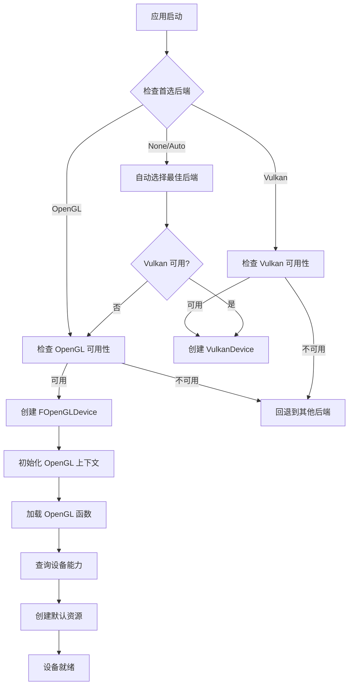
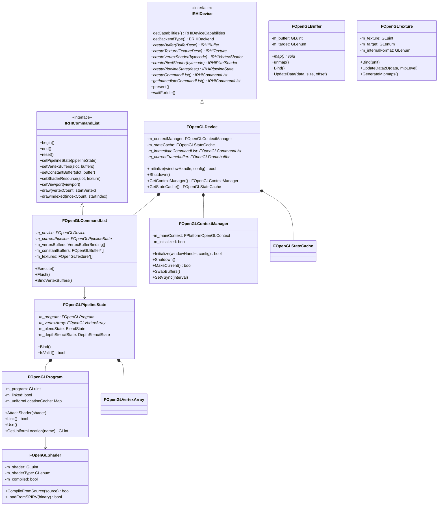
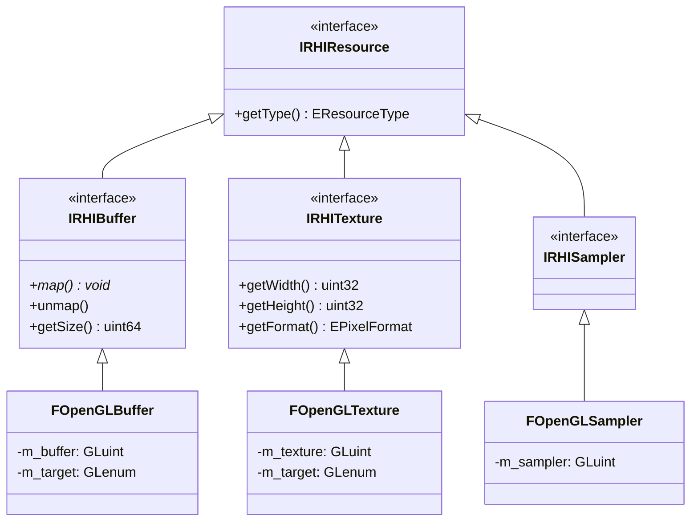
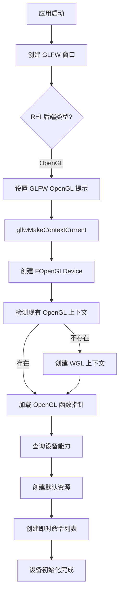
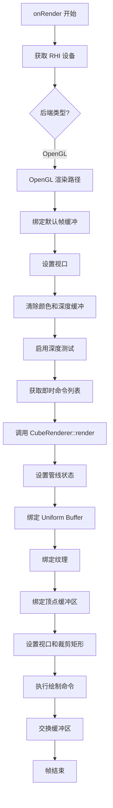
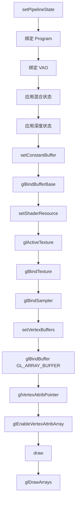

# MonsterEngine OpenGL RHI 开发说明文档

## 目录

1. [概述](#1-概述)
2. [架构设计](#2-架构设计)
3. [类结构图](#3-类结构图)
4. [核心组件详解](#4-核心组件详解)
5. [渲染流程](#5-渲染流程)
6. [使用指南](#6-使用指南)
7. [关键代码示例](#7-关键代码示例)
8. [调试与优化](#8-调试与优化)

---

## 1. 概述

MonsterEngine 的 OpenGL RHI（渲染硬件接口）是一个基于 OpenGL 4.6 的现代渲染后端实现，参考了 UE5 的 OpenGLDrv 模块设计。该模块提供了与 Vulkan 后端统一的抽象接口，使得上层渲染代码可以无缝切换底层图形 API。

### 1.1 设计目标

- **统一接口**：与 Vulkan 后端共享相同的 RHI 抽象层
- **高性能**：利用 OpenGL 4.6 的现代特性（DSA、SPIR-V 支持等）
- **易于调试**：集成调试输出和性能标记
- **跨平台**：支持 Windows 平台（通过 WGL）

### 1.2 文件结构

```
MonsterEngine/
├── Include/Platform/OpenGL/
│   ├── OpenGLDevice.h          # 设备接口
│   ├── OpenGLCommandList.h     # 命令列表
│   ├── OpenGLResources.h       # 资源（Buffer、Texture、Sampler）
│   ├── OpenGLShaders.h         # 着色器管理
│   ├── OpenGLPipeline.h        # 管线状态
│   ├── OpenGLContext.h         # 上下文管理
│   ├── OpenGLDefinitions.h     # OpenGL 常量定义
│   └── OpenGLFunctions.h       # OpenGL 函数指针
└── Source/Platform/OpenGL/
    ├── OpenGLDevice.cpp
    ├── OpenGLCommandList.cpp
    ├── OpenGLResources.cpp
    ├── OpenGLShaders.cpp
    ├── OpenGLPipeline.cpp
    ├── OpenGLContext.cpp
    └── OpenGLFunctions.cpp
```

---

## 2. 架构设计

### 2.1 分层架构图

```
┌─────────────────────────────────────────────────────────────────┐
│                      应用层 (Application)                        │
│                   CubeApplication, CubeRenderer                  │
└─────────────────────────────────────────────────────────────────┘
                                │
                                ▼
┌─────────────────────────────────────────────────────────────────┐
│                      RHI 抽象层 (RHI Interface)                  │
│         IRHIDevice, IRHICommandList, IRHIResource               │
└─────────────────────────────────────────────────────────────────┘
                                │
                ┌───────────────┴───────────────┐
                ▼                               ▼
┌───────────────────────────┐   ┌───────────────────────────┐
│     Vulkan 后端            │   │     OpenGL 后端            │
│   VulkanDevice            │   │   FOpenGLDevice           │
│   VulkanCommandList       │   │   FOpenGLCommandList      │
│   VulkanBuffer/Texture    │   │   FOpenGLBuffer/Texture   │
└───────────────────────────┘   └───────────────────────────┘
                                                │
                                                ▼
                                ┌───────────────────────────┐
                                │   OpenGL 4.6 / WGL        │
                                │   (平台图形驱动)           │
                                └───────────────────────────┘
```

### 2.2 RHI 后端选择流程



---

## 3. 类结构图

### 3.1 UML 类图



### 3.2 资源类继承关系



---

## 4. 核心组件详解

### 4.1 FOpenGLDevice（设备）

`FOpenGLDevice` 是 OpenGL RHI 的核心类，负责：
- 管理 OpenGL 上下文
- 创建各种 RHI 资源
- 提供即时命令列表
- 处理帧呈现

**关键代码：**

```cpp
// Include/Platform/OpenGL/OpenGLDevice.h
class FOpenGLDevice : public MonsterRender::RHI::IRHIDevice
{
public:
    // 初始化设备
    bool Initialize(void* windowHandle, const FOpenGLContextConfig& config);
    
    // 创建资源
    virtual TSharedPtr<IRHIBuffer> createBuffer(const BufferDesc& desc) override;
    virtual TSharedPtr<IRHITexture> createTexture(const TextureDesc& desc) override;
    virtual TSharedPtr<IRHIPipelineState> createPipelineState(const PipelineStateDesc& desc) override;
    
    // 获取即时命令列表
    virtual IRHICommandList* getImmediateCommandList() override;
    
private:
    FOpenGLContextManager m_contextManager;  // 上下文管理器
    FOpenGLStateCache m_stateCache;          // 状态缓存
    TSharedPtr<FOpenGLCommandList> m_immediateCommandList;  // 即时命令列表
};
```

### 4.2 FOpenGLCommandList（命令列表）

OpenGL 不像 D3D12/Vulkan 那样有真正的命令列表，命令是立即执行的。`FOpenGLCommandList` 封装了这一行为，提供统一的接口。

**关键代码：**

```cpp
// Include/Platform/OpenGL/OpenGLCommandList.h
class FOpenGLCommandList : public MonsterRender::RHI::IRHICommandList
{
public:
    // 设置管线状态
    virtual void setPipelineState(TSharedPtr<IRHIPipelineState> pipelineState) override;
    
    // 设置顶点缓冲区
    virtual void setVertexBuffers(uint32 startSlot, TSpan<TSharedPtr<IRHIBuffer>> vertexBuffers) override;
    
    // 设置常量缓冲区（Uniform Buffer）
    virtual void setConstantBuffer(uint32 slot, TSharedPtr<IRHIBuffer> buffer) override;
    
    // 设置纹理资源
    virtual void setShaderResource(uint32 slot, TSharedPtr<IRHITexture> texture) override;
    
    // 绘制命令
    virtual void draw(uint32 vertexCount, uint32 startVertexLocation = 0) override;
    
private:
    FOpenGLPipelineState* m_currentPipeline = nullptr;
    static constexpr uint32 MaxVertexBuffers = 16;
    static constexpr uint32 MaxConstantBuffers = 16;
    static constexpr uint32 MaxTextureSlots = 32;
};
```

### 4.3 FOpenGLContextManager（上下文管理器）

负责 OpenGL 上下文的创建、管理和销毁，包括 WGL 扩展加载。

**关键代码：**

```cpp
// Include/Platform/OpenGL/OpenGLContext.h
struct FOpenGLContextConfig
{
    int32 majorVersion = 4;      // OpenGL 主版本
    int32 minorVersion = 6;      // OpenGL 次版本
    bool coreProfile = true;     // 使用核心配置文件
    bool forwardCompatible = true;
    bool debugContext = false;   // 调试上下文
    int32 colorBits = 32;
    int32 depthBits = 24;
    int32 stencilBits = 8;
    bool doubleBuffer = true;    // 双缓冲
};

class FOpenGLContextManager
{
public:
    bool Initialize(void* windowHandle, const FOpenGLContextConfig& config);
    void Shutdown();
    bool MakeCurrent();           // 设置当前上下文
    void SwapBuffers();           // 交换缓冲区
    void SetVSync(int32 interval);
    
private:
    FPlatformOpenGLContext m_mainContext;
    bool InitializeWGLExtensions();  // 加载 WGL 扩展
    bool CreateCoreContext(const FOpenGLContextConfig& config);
};
```

### 4.4 FOpenGLPipelineState（管线状态）

封装了 OpenGL 的渲染状态，包括着色器程序、混合状态、深度测试状态等。

**关键代码：**

```cpp
// Include/Platform/OpenGL/OpenGLPipeline.h
class FOpenGLPipelineState : public MonsterRender::RHI::IRHIPipelineState
{
public:
    FOpenGLPipelineState(const PipelineStateDesc& desc);
    
    void Bind();  // 绑定管线状态
    FOpenGLProgram* GetProgram();
    FOpenGLVertexArray* GetVertexArray();
    
private:
    bool CreateProgram();      // 创建着色器程序
    void SetupVertexLayout();  // 设置顶点布局
    void ApplyBlendState();    // 应用混合状态
    void ApplyDepthStencilState();  // 应用深度模板状态
    
    TUniquePtr<FOpenGLProgram> m_program;
    TUniquePtr<FOpenGLVertexArray> m_vertexArray;
    
    // 缓存的状态
    struct { bool enabled; GLenum srcColor, dstColor; } m_blendState;
    struct { bool depthEnable; GLenum depthFunc; } m_depthStencilState;
};
```

---

## 5. 渲染流程

### 5.1 初始化流程



### 5.2 帧渲染流程



### 5.3 资源创建流程

```mermaid
flowchart TD
    subgraph Buffer创建
        A1[createBuffer] --> B1[确定 GL Target]
        B1 --> C1[glGenBuffers]
        C1 --> D1[glBindBuffer]
        D1 --> E1[glBufferData/glBufferStorage]
    end
    
    subgraph Texture创建
        A2[createTexture] --> B2[确定 GL Target]
        B2 --> C2[glGenTextures]
        C2 --> D2[glBindTexture]
        D2 --> E2[glTexStorage2D]
        E2 --> F2[glTexSubImage2D 上传数据]
    end
    
    subgraph Shader创建
        A3[createVertexShader] --> B3[glCreateShader]
        B3 --> C3{GLSL 还是 SPIR-V?}
        C3 -->|GLSL| D3[glShaderSource + glCompileShader]
        C3 -->|SPIR-V| E3[glShaderBinary + glSpecializeShader]
        D3 --> F3[检查编译状态]
        E3 --> F3
    end
    
    subgraph Pipeline创建
        A4[createPipelineState] --> B4[创建 Program]
        B4 --> C4[附加 Shader]
        C4 --> D4[glLinkProgram]
        D4 --> E4[设置顶点布局 VAO]
        E4 --> F4[缓存渲染状态]
    end
```



### 5.4 绘制命令执行流程



---

## 6. 使用指南

### 6.1 选择 OpenGL 后端

在应用配置中指定首选后端：

```cpp
// CubeApplication.cpp
ApplicationConfig createConfig() override {
    ApplicationConfig config;
    config.name = "My Application";
    config.preferredBackend = RHI::ERHIBackend::OpenGL;  // 选择 OpenGL
    return config;
}
```

### 6.2 创建资源

```cpp
// 创建顶点缓冲区
RHI::BufferDesc vertexBufferDesc;
vertexBufferDesc.size = sizeof(vertices);
vertexBufferDesc.usage = RHI::EBufferUsage::VertexBuffer;
vertexBufferDesc.cpuAccessible = false;
auto vertexBuffer = device->createBuffer(vertexBufferDesc);

// 创建 Uniform 缓冲区
RHI::BufferDesc uniformDesc;
uniformDesc.size = sizeof(UniformBufferObject);
uniformDesc.usage = RHI::EBufferUsage::ConstantBuffer;
uniformDesc.cpuAccessible = true;
auto uniformBuffer = device->createBuffer(uniformDesc);

// 创建纹理
RHI::TextureDesc textureDesc;
textureDesc.width = 512;
textureDesc.height = 512;
textureDesc.format = RHI::EPixelFormat::RGBA8_UNORM;
textureDesc.mipLevels = 10;
auto texture = device->createTexture(textureDesc);
```

### 6.3 创建着色器和管线

```cpp
// 加载 GLSL 着色器
std::vector<uint8> vsCode = loadFile("shader.vert");
std::vector<uint8> psCode = loadFile("shader.frag");

auto vertexShader = device->createVertexShader(TSpan<const uint8>(vsCode));
auto pixelShader = device->createPixelShader(TSpan<const uint8>(psCode));

// 创建管线状态
RHI::PipelineStateDesc pipelineDesc;
pipelineDesc.vertexShader = vertexShader;
pipelineDesc.pixelShader = pixelShader;
pipelineDesc.primitiveTopology = RHI::EPrimitiveTopology::TriangleList;

// 设置顶点布局
RHI::VertexAttribute posAttr;
posAttr.location = 0;
posAttr.format = RHI::EVertexFormat::Float3;
posAttr.offset = 0;
pipelineDesc.vertexLayout.attributes.push_back(posAttr);
pipelineDesc.vertexLayout.stride = sizeof(Vertex);

// 设置深度测试
pipelineDesc.depthStencilState.depthEnable = true;
pipelineDesc.depthStencilState.depthWriteEnable = true;
pipelineDesc.depthStencilState.depthCompareOp = RHI::ECompareOp::Less;

auto pipelineState = device->createPipelineState(pipelineDesc);
```

### 6.4 渲染循环

```cpp
void onRender() override {
    auto* device = getEngine()->getRHIDevice();
    
    if (device->getBackendType() == RHI::ERHIBackend::OpenGL) {
        using namespace MonsterEngine::OpenGL;
        
        // 绑定默认帧缓冲
        glBindFramebuffer(GL_FRAMEBUFFER, 0);
        glViewport(0, 0, width, height);
        
        // 清除缓冲区
        glClearColor(0.2f, 0.3f, 0.3f, 1.0f);
        glClear(GL_COLOR_BUFFER_BIT | GL_DEPTH_BUFFER_BIT);
        glEnable(GL_DEPTH_TEST);
        
        // 使用命令列表渲染
        auto* cmdList = device->getImmediateCommandList();
        
        cmdList->setPipelineState(pipelineState);
        cmdList->setConstantBuffer(0, uniformBuffer);
        cmdList->setShaderResource(1, texture);
        cmdList->setVertexBuffers(0, vertexBuffers);
        cmdList->draw(36, 0);
        
        // 交换缓冲区
        getWindow()->swapBuffers();
    }
}
```

---

## 7. 关键代码示例

### 7.1 OpenGL 设备初始化

```cpp
// Source/Platform/OpenGL/OpenGLDevice.cpp
bool FOpenGLDevice::Initialize(void* windowHandle, const FOpenGLContextConfig& config)
{
    if (m_initialized) return true;
    
    // 检查是否已有 OpenGL 上下文（来自 GLFW）
    bool contextExists = false;
    
#if PLATFORM_WINDOWS
    HGLRC currentContext = wglGetCurrentContext();
    if (currentContext != nullptr) {
        contextExists = true;
        // 使用现有上下文，只需加载函数指针
        if (!LoadOpenGLFunctions()) {
            return false;
        }
    }
#endif
    
    if (!contextExists) {
        // 创建新的 OpenGL 上下文
        if (!m_contextManager.Initialize(windowHandle, config)) {
            return false;
        }
    }
    
    // 查询设备能力
    QueryCapabilities();
    
    // 创建默认资源
    CreateDefaultResources();
    
    // 创建即时命令列表
    m_immediateCommandList = MakeShared<FOpenGLCommandList>(this);
    
    m_initialized = true;
    return true;
}
```

### 7.2 命令列表绘制实现

```cpp
// Source/Platform/OpenGL/OpenGLCommandList.cpp
void FOpenGLCommandList::setPipelineState(TSharedPtr<IRHIPipelineState> pipelineState)
{
    auto* glPipeline = static_cast<FOpenGLPipelineState*>(pipelineState.get());
    
    if (m_currentPipeline != glPipeline) {
        m_currentPipeline = glPipeline;
        
        if (m_currentPipeline) {
            m_currentPipeline->Bind();  // 绑定 Program、VAO、应用状态
            
            // 获取图元拓扑
            const auto& desc = m_currentPipeline->getDesc();
            switch (desc.primitiveTopology) {
                case EPrimitiveTopology::TriangleList:
                    m_primitiveTopology = GL_TRIANGLES;
                    break;
                // ... 其他拓扑类型
            }
        }
    }
}

void FOpenGLCommandList::setConstantBuffer(uint32 slot, TSharedPtr<IRHIBuffer> buffer)
{
    auto* glBuffer = static_cast<FOpenGLBuffer*>(buffer.get());
    m_constantBuffers[slot] = glBuffer;
    
    if (glBuffer) {
        // 绑定到 Uniform Buffer 绑定点
        glBindBufferBase(GL_UNIFORM_BUFFER, slot, glBuffer->GetGLBuffer());
    }
}

void FOpenGLCommandList::draw(uint32 vertexCount, uint32 startVertexLocation)
{
    glDrawArrays(m_primitiveTopology, startVertexLocation, vertexCount);
}
```

### 7.3 纹理上传

```cpp
// Source/Renderer/FTextureLoader.cpp (OpenGL 路径)
void UploadTextureDataOpenGL(IRHIDevice* device, IRHITexture* texture, 
                              const FTextureData& textureData)
{
    using namespace MonsterEngine::OpenGL;
    
    auto* glTexture = static_cast<FOpenGLTexture*>(texture);
    GLuint textureHandle = glTexture->GetGLTexture();
    
    // 绑定纹理
    glBindTexture(GL_TEXTURE_2D, textureHandle);
    
    // 上传每个 mip 级别
    uint32 offset = 0;
    for (uint32 mipLevel = 0; mipLevel < textureData.MipLevels; ++mipLevel) {
        uint32 mipWidth = std::max(1u, textureData.Width >> mipLevel);
        uint32 mipHeight = std::max(1u, textureData.Height >> mipLevel);
        
        const uint8* mipData = textureData.Data.data() + offset;
        
        glTexSubImage2D(GL_TEXTURE_2D, mipLevel, 0, 0, 
                        mipWidth, mipHeight,
                        GL_RGBA, GL_UNSIGNED_BYTE, mipData);
        
        offset += textureData.MipSizes[mipLevel];
    }
    
    // 解绑纹理
    glBindTexture(GL_TEXTURE_2D, 0);
}
```

### 7.4 着色器编译

```cpp
// Source/Platform/OpenGL/OpenGLShaders.cpp
bool FOpenGLShader::CompileFromSource(const char* source, int32 sourceLength)
{
    if (sourceLength < 0) {
        sourceLength = static_cast<int32>(strlen(source));
    }
    
    // 设置着色器源码
    glShaderSource(m_shader, 1, &source, &sourceLength);
    
    // 编译着色器
    glCompileShader(m_shader);
    
    // 检查编译状态
    GLint compileStatus = GL_FALSE;
    glGetShaderiv(m_shader, GL_COMPILE_STATUS, &compileStatus);
    
    if (compileStatus != GL_TRUE) {
        m_errorMessage = GetInfoLog();
        m_compiled = false;
        return false;
    }
    
    m_compiled = true;
    return true;
}

bool FOpenGLProgram::Link()
{
    glLinkProgram(m_program);
    
    GLint linkStatus = GL_FALSE;
    glGetProgramiv(m_program, GL_LINK_STATUS, &linkStatus);
    
    if (linkStatus != GL_TRUE) {
        m_errorMessage = GetInfoLog();
        m_linked = false;
        return false;
    }
    
    m_linked = true;
    return true;
}
```

---

## 8. 调试与优化

### 8.1 OpenGL 调试输出

启用调试上下文可以获取详细的 OpenGL 错误信息：

```cpp
// 在 FOpenGLContextConfig 中启用
FOpenGLContextConfig config;
config.debugContext = true;

// 调试回调函数
void APIENTRY OpenGLDebugCallback(GLenum source, GLenum type, GLuint id,
                                   GLenum severity, GLsizei length,
                                   const GLchar* message, const void* userParam)
{
    if (severity == GL_DEBUG_SEVERITY_HIGH) {
        MR_LOG_ERROR("OpenGL Error: " + std::string(message));
    } else if (severity == GL_DEBUG_SEVERITY_MEDIUM) {
        MR_LOG_WARNING("OpenGL Warning: " + std::string(message));
    }
}

// 注册回调
glDebugMessageCallback(OpenGLDebugCallback, nullptr);
glEnable(GL_DEBUG_OUTPUT);
glEnable(GL_DEBUG_OUTPUT_SYNCHRONOUS);
```

### 8.2 错误检查宏

```cpp
// Include/Platform/OpenGL/OpenGLDefinitions.h
#define GL_CHECK(operation) \
    do { \
        GLenum err = glGetError(); \
        if (err != GL_NO_ERROR) { \
            MR_LOG_ERROR("OpenGL error in " #operation ": " + std::to_string(err)); \
        } \
    } while(0)

// 使用示例
glDrawArrays(GL_TRIANGLES, 0, 36);
GL_CHECK("glDrawArrays");
```

### 8.3 性能优化建议

1. **状态缓存**：使用 `FOpenGLStateCache` 避免冗余的状态切换
2. **批处理**：合并相同状态的绘制调用
3. **持久映射**：对频繁更新的缓冲区使用 `GL_MAP_PERSISTENT_BIT`
4. **DSA（Direct State Access）**：使用 OpenGL 4.5+ 的 DSA 函数减少绑定操作
5. **VAO 复用**：为相同顶点布局的对象共享 VAO

### 8.4 常见问题排查

| 问题 | 可能原因 | 解决方案 |
|------|----------|----------|
| 白屏 | 上下文未正确设置 | 确保 `glfwMakeContextCurrent` 被调用 |
| 纹理显示异常 | 纹理格式不匹配 | 检查 `glTexSubImage2D` 的格式参数 |
| 着色器编译失败 | GLSL 版本不兼容 | 确保着色器使用 `#version 460 core` |
| 深度测试无效 | 深度缓冲未启用 | 调用 `glEnable(GL_DEPTH_TEST)` |
| 性能低下 | 过多状态切换 | 使用状态缓存和批处理 |

---

## 附录

### A. OpenGL 4.6 核心特性

- **SPIR-V 支持**：可直接加载 SPIR-V 着色器
- **Direct State Access (DSA)**：无需绑定即可操作对象
- **无绑定纹理**：通过句柄直接访问纹理
- **多重绘制间接**：减少 CPU 开销
- **着色器存储缓冲区**：灵活的 GPU 数据存储

### B. 参考资料

- [OpenGL 4.6 规范](https://www.khronos.org/registry/OpenGL/specs/gl/glspec46.core.pdf)
- [UE5 OpenGLDrv 源码](https://github.com/EpicGames/UnrealEngine/tree/release/Engine/Source/Runtime/OpenGLDrv)
- [GLFW 文档](https://www.glfw.org/documentation.html)

---

*文档版本：1.0*  
*最后更新：2024年12月*  
*作者：MonsterEngine 开发团队*
