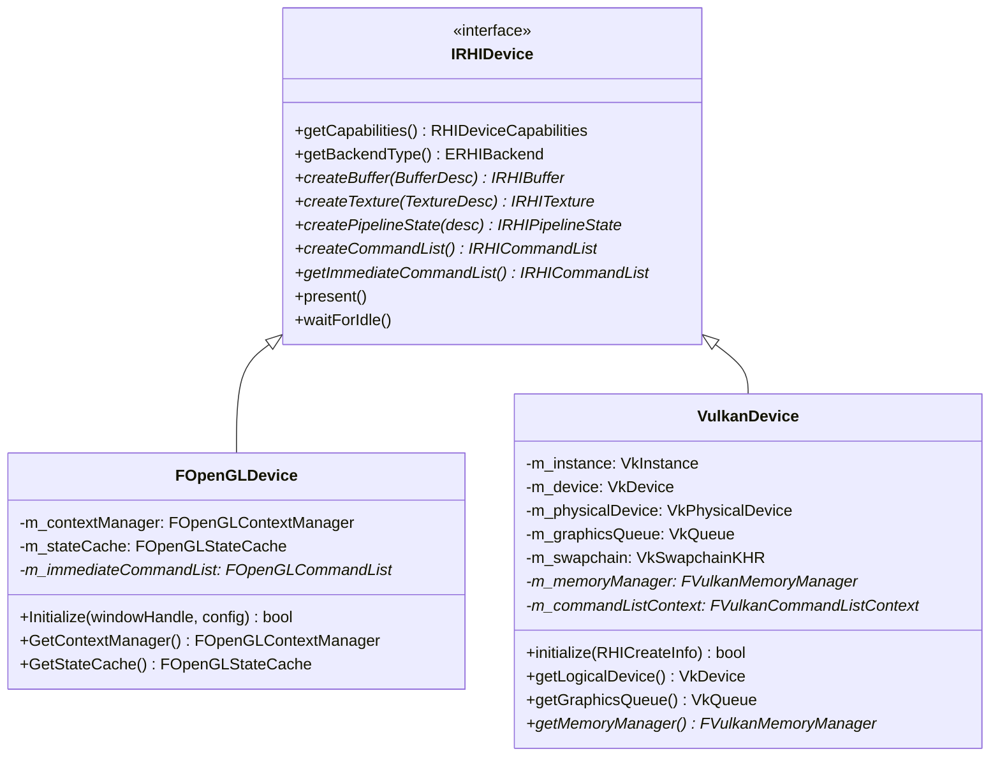
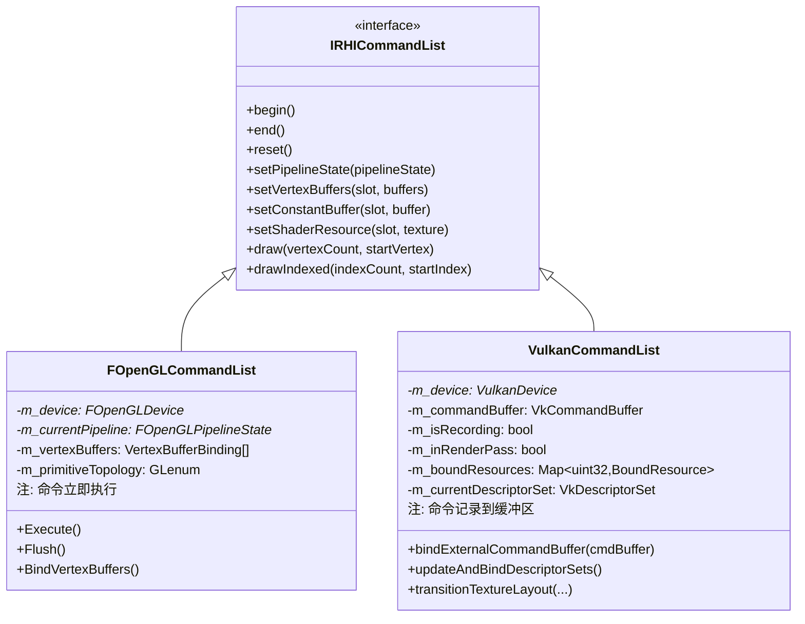
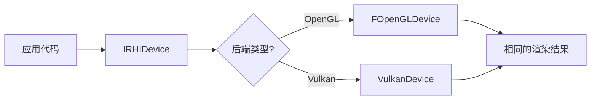
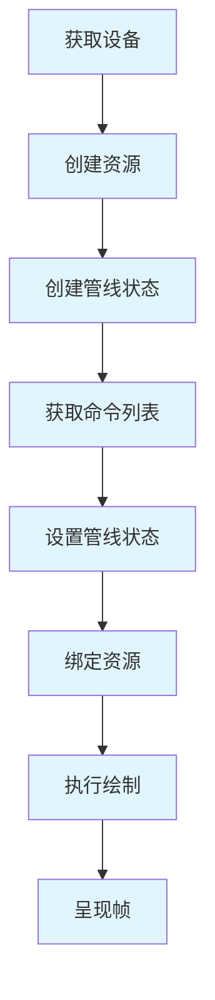
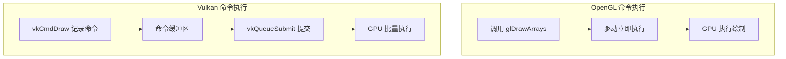
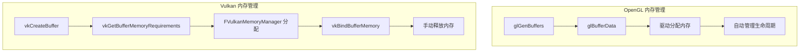
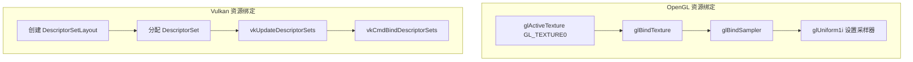
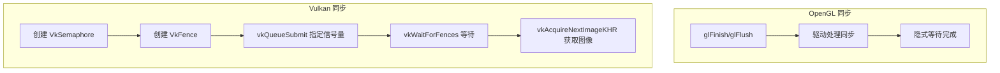
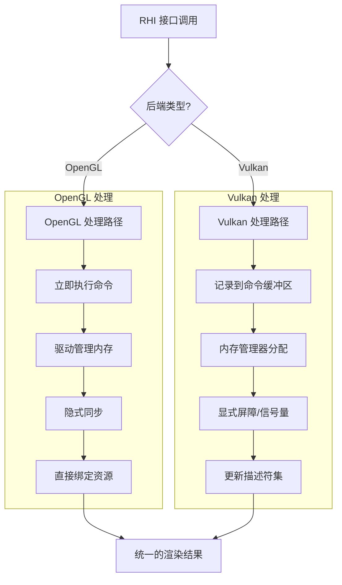

# MonsterEngine OpenGL 与 Vulkan RHI 对比开发说明文档

## 目录

1. [概述](#1-概述)
2. [架构对比](#2-架构对比)
3. [相同点分析](#3-相同点分析)
4. [差异点分析](#4-差异点分析)
5. [差异点处理方式](#5-差异点处理方式)
6. [使用方法](#6-使用方法)
7. [关键代码对比](#7-关键代码对比)
8. [最佳实践](#8-最佳实践)

---

## 1. 概述

MonsterEngine 实现了两个主要的图形后端：**OpenGL 4.6** 和 **Vulkan 1.x**。两者都遵循统一的 RHI（渲染硬件接口）抽象层设计，参考了 UE5 的架构模式。

### 1.1 后端特性对比表

| 特性 | OpenGL 4.6 | Vulkan |
|------|-----------|--------|
| **API 类型** | 高级状态机 | 低级显式控制 |
| **命令模型** | 立即执行 | 命令缓冲区延迟执行 |
| **内存管理** | 驱动自动管理 | 应用显式管理 |
| **同步机制** | 隐式同步 | 显式同步（信号量、栅栏） |
| **多线程支持** | 有限（需上下文切换） | 原生多线程 |
| **管线状态** | 分散状态设置 | 管线状态对象（PSO） |
| **描述符绑定** | 直接绑定 | 描述符集 |
| **着色器格式** | GLSL / SPIR-V | SPIR-V |

### 1.2 文件结构对比

```
MonsterEngine/
├── Include/Platform/
│   ├── OpenGL/                      ├── Vulkan/
│   │   ├── OpenGLDevice.h           │   ├── VulkanDevice.h
│   │   ├── OpenGLCommandList.h      │   ├── VulkanCommandList.h
│   │   ├── OpenGLResources.h        │   ├── VulkanBuffer.h
│   │   ├── OpenGLShaders.h          │   ├── VulkanTexture.h
│   │   ├── OpenGLPipeline.h         │   ├── VulkanPipelineState.h
│   │   ├── OpenGLContext.h          │   ├── VulkanShader.h
│   │   └── OpenGLFunctions.h        │   └── VulkanRHI.h
└── Source/Platform/
    ├── OpenGL/                      └── Vulkan/
        └── *.cpp                        └── *.cpp
```

---

## 2. 架构对比

### 2.1 整体架构图

```
┌─────────────────────────────────────────────────────────────────────────┐
│                          应用层 (Application)                            │
│                    CubeApplication, CubeRenderer                         │
└─────────────────────────────────────────────────────────────────────────┘
                                    │
                                    ▼
┌─────────────────────────────────────────────────────────────────────────┐
│                       RHI 抽象层 (RHI Interface)                         │
│              IRHIDevice, IRHICommandList, IRHIResource                   │
│                  IRHIBuffer, IRHITexture, IRHIPipelineState              │
└─────────────────────────────────────────────────────────────────────────┘
                                    │
                    ┌───────────────┴───────────────┐
                    ▼                               ▼
┌─────────────────────────────────┐ ┌─────────────────────────────────┐
│        OpenGL 后端               │ │        Vulkan 后端               │
│  ┌─────────────────────────┐    │ │  ┌─────────────────────────┐    │
│  │    FOpenGLDevice        │    │ │  │    VulkanDevice         │    │
│  │  - 上下文管理            │    │ │  │  - Instance/Device      │    │
│  │  - 状态缓存              │    │ │  │  - 队列管理             │    │
│  │  - 即时命令列表          │    │ │  │  - 内存管理器           │    │
│  └─────────────────────────┘    │ │  └─────────────────────────┘    │
│  ┌─────────────────────────┐    │ │  ┌─────────────────────────┐    │
│  │  FOpenGLCommandList     │    │ │  │  VulkanCommandList      │    │
│  │  - 立即执行命令          │    │ │  │  - 命令缓冲区记录       │    │
│  │  - VAO/VBO 绑定         │    │ │  │  - 描述符集更新         │    │
│  └─────────────────────────┘    │ │  └─────────────────────────┘    │
│  ┌─────────────────────────┐    │ │  ┌─────────────────────────┐    │
│  │  FOpenGLPipelineState   │    │ │  │  VulkanPipelineState    │    │
│  │  - Program + VAO        │    │ │  │  - VkPipeline           │    │
│  │  - 状态封装              │    │ │  │  - VkPipelineLayout     │    │
│  └─────────────────────────┘    │ │  └─────────────────────────┘    │
└─────────────────────────────────┘ └─────────────────────────────────┘
                    │                               │
                    ▼                               ▼
┌─────────────────────────────────┐ ┌─────────────────────────────────┐
│     OpenGL 4.6 Driver           │ │     Vulkan Loader/Driver        │
└─────────────────────────────────┘ └─────────────────────────────────┘
```

### 2.2 设备类 UML 对比图



### 2.3 命令列表 UML 对比图



---

## 3. 相同点分析

### 3.1 统一的 RHI 接口

OpenGL 和 Vulkan 后端都实现了相同的 RHI 接口，使得上层代码可以无缝切换：



**关键代码 - 统一接口定义：**

```cpp
// Include/RHI/IRHIDevice.h
class IRHIDevice {
public:
    // 两个后端都实现这些接口
    virtual TSharedPtr<IRHIBuffer> createBuffer(const BufferDesc& desc) = 0;
    virtual TSharedPtr<IRHITexture> createTexture(const TextureDesc& desc) = 0;
    virtual TSharedPtr<IRHIPipelineState> createPipelineState(const PipelineStateDesc& desc) = 0;
    virtual IRHICommandList* getImmediateCommandList() = 0;
    virtual void present() = 0;
    virtual ERHIBackend getBackendType() const = 0;
};
```

### 3.2 相同的资源描述结构

两个后端使用相同的资源描述结构：

```cpp
// Include/RHI/RHIDefinitions.h
struct BufferDesc {
    uint32 size = 0;
    EResourceUsage usage = EResourceUsage::None;
    EMemoryUsage memoryUsage = EMemoryUsage::Default;
    bool cpuAccessible = false;
    String debugName;
};

struct TextureDesc {
    uint32 width = 1;
    uint32 height = 1;
    uint32 depth = 1;
    uint32 mipLevels = 1;
    EPixelFormat format = EPixelFormat::R8G8B8A8_UNORM;
    ETextureType type = ETextureType::Texture2D;
    EResourceUsage usage = EResourceUsage::ShaderResource;
};
```

### 3.3 相同的命令列表接口

```cpp
// Include/RHI/IRHICommandList.h
class IRHICommandList {
public:
    virtual void begin() = 0;
    virtual void end() = 0;
    virtual void setPipelineState(TSharedPtr<IRHIPipelineState> pipelineState) = 0;
    virtual void setVertexBuffers(uint32 startSlot, TSpan<TSharedPtr<IRHIBuffer>> vertexBuffers) = 0;
    virtual void setConstantBuffer(uint32 slot, TSharedPtr<IRHIBuffer> buffer) = 0;
    virtual void setShaderResource(uint32 slot, TSharedPtr<IRHITexture> texture) = 0;
    virtual void draw(uint32 vertexCount, uint32 startVertexLocation = 0) = 0;
};
```

### 3.4 相同的渲染流程抽象



---

## 4. 差异点分析

### 4.1 差异点对比表

| 差异点 | OpenGL | Vulkan | 影响 |
|--------|--------|--------|------|
| **命令执行模型** | 立即执行 | 延迟执行（命令缓冲区） | 性能、多线程 |
| **内存管理** | 驱动自动 | 应用显式管理 | 内存效率 |
| **同步机制** | 隐式 | 显式（信号量、栅栏） | 并行性 |
| **资源状态转换** | 自动 | 手动屏障 | 正确性 |
| **描述符绑定** | 直接绑定纹理单元 | 描述符集 | 绑定效率 |
| **管线状态** | 分散设置 | 预编译 PSO | 状态切换开销 |
| **上下文管理** | 单一上下文 | 多队列 | 并行能力 |
| **着色器编译** | 运行时编译 GLSL | 预编译 SPIR-V | 加载时间 |

### 4.2 命令执行模型差异



### 4.3 内存管理差异



### 4.4 资源绑定差异



### 4.5 同步机制差异



---

## 5. 差异点处理方式

### 5.1 命令执行模型处理

**问题**：OpenGL 立即执行 vs Vulkan 延迟执行

**解决方案**：在 RHI 层统一为命令列表模式，OpenGL 内部立即执行

```cpp
// OpenGL 实现 - 立即执行
// Source/Platform/OpenGL/OpenGLCommandList.cpp
void FOpenGLCommandList::draw(uint32 vertexCount, uint32 startVertexLocation)
{
    // OpenGL 直接执行绘制命令
    glDrawArrays(m_primitiveTopology, startVertexLocation, vertexCount);
}

void FOpenGLCommandList::setPipelineState(TSharedPtr<IRHIPipelineState> pipelineState)
{
    auto* glPipeline = static_cast<FOpenGLPipelineState*>(pipelineState.get());
    if (m_currentPipeline != glPipeline) {
        m_currentPipeline = glPipeline;
        if (m_currentPipeline) {
            m_currentPipeline->Bind();  // 立即绑定
        }
    }
}
```

```cpp
// Vulkan 实现 - 记录到命令缓冲区
// Source/Platform/Vulkan/VulkanCommandList.cpp
void VulkanCommandList::draw(uint32 vertexCount, uint32 startVertexLocation)
{
    ensureRecording("draw");
    updateAndBindDescriptorSets();  // 更新描述符集
    vkCmdDraw(m_commandBuffer, vertexCount, 1, startVertexLocation, 0);
}

void VulkanCommandList::begin()
{
    VkCommandBufferBeginInfo beginInfo{};
    beginInfo.sType = VK_STRUCTURE_TYPE_COMMAND_BUFFER_BEGIN_INFO;
    beginInfo.flags = VK_COMMAND_BUFFER_USAGE_ONE_TIME_SUBMIT_BIT;
    vkBeginCommandBuffer(m_commandBuffer, &beginInfo);
    m_isRecording = true;
}
```

### 5.2 内存管理处理

**问题**：OpenGL 自动管理 vs Vulkan 显式管理

**解决方案**：Vulkan 使用 `FVulkanMemoryManager` 进行子分配，OpenGL 直接使用驱动管理

```cpp
// OpenGL Buffer 创建 - 驱动管理内存
// Source/Platform/OpenGL/OpenGLResources.cpp
bool FOpenGLBuffer::CreateBuffer(const void* initialData)
{
    glGenBuffers(1, &m_buffer);
    glBindBuffer(m_target, m_buffer);
    glBufferData(m_target, m_desc.size, initialData, m_usage);
    // 驱动自动分配和管理内存
    return true;
}
```

```cpp
// Vulkan Buffer 创建 - 显式内存管理
// Source/Platform/Vulkan/VulkanBuffer.cpp
bool VulkanBuffer::initialize()
{
    // 1. 创建 Buffer 对象
    VkBufferCreateInfo bufferInfo{};
    bufferInfo.sType = VK_STRUCTURE_TYPE_BUFFER_CREATE_INFO;
    bufferInfo.size = m_desc.size;
    bufferInfo.usage = convertUsageFlags(m_desc.usage);
    vkCreateBuffer(m_device->getDevice(), &bufferInfo, nullptr, &m_buffer);
    
    // 2. 查询内存需求
    VkMemoryRequirements memRequirements;
    vkGetBufferMemoryRequirements(m_device->getDevice(), m_buffer, &memRequirements);
    
    // 3. 使用内存管理器分配
    FVulkanMemoryManager* memManager = m_device->getMemoryManager();
    if (memManager) {
        m_allocation = memManager->Allocate(memRequirements.size, 
                                            memRequirements.alignment,
                                            memRequirements.memoryTypeBits,
                                            m_memoryProperties);
        m_usesMemoryManager = true;
    }
    
    // 4. 绑定内存
    vkBindBufferMemory(m_device->getDevice(), m_buffer, 
                       m_allocation.DeviceMemory, m_allocation.Offset);
    return true;
}
```

### 5.3 资源状态转换处理

**问题**：OpenGL 自动转换 vs Vulkan 需要显式屏障

**解决方案**：RHI 接口提供 `transitionResource`，OpenGL 实现为空操作

```cpp
// OpenGL 实现 - 空操作（驱动自动处理）
// Source/Platform/OpenGL/OpenGLCommandList.cpp
void FOpenGLCommandList::transitionResource(TSharedPtr<IRHIResource> resource, 
                                            EResourceUsage stateBefore, 
                                            EResourceUsage stateAfter)
{
    // OpenGL 驱动自动处理资源状态转换
    // 此方法为空操作，保持接口一致性
}
```

```cpp
// Vulkan 实现 - 显式管线屏障
// Source/Platform/Vulkan/VulkanCommandList.cpp
void VulkanCommandList::transitionTextureLayout(
    TSharedPtr<IRHITexture> texture,
    VkImageLayout oldLayout,
    VkImageLayout newLayout,
    VkAccessFlags srcAccessMask,
    VkAccessFlags dstAccessMask,
    VkPipelineStageFlags srcStageMask,
    VkPipelineStageFlags dstStageMask)
{
    auto* vulkanTexture = static_cast<VulkanTexture*>(texture.get());
    
    VkImageMemoryBarrier barrier{};
    barrier.sType = VK_STRUCTURE_TYPE_IMAGE_MEMORY_BARRIER;
    barrier.oldLayout = oldLayout;
    barrier.newLayout = newLayout;
    barrier.srcAccessMask = srcAccessMask;
    barrier.dstAccessMask = dstAccessMask;
    barrier.image = vulkanTexture->getImage();
    barrier.subresourceRange.aspectMask = VK_IMAGE_ASPECT_COLOR_BIT;
    barrier.subresourceRange.levelCount = VK_REMAINING_MIP_LEVELS;
    barrier.subresourceRange.layerCount = VK_REMAINING_ARRAY_LAYERS;
    
    vkCmdPipelineBarrier(m_commandBuffer,
                         srcStageMask, dstStageMask,
                         0, 0, nullptr, 0, nullptr,
                         1, &barrier);
    
    vulkanTexture->setCurrentLayout(newLayout);
}
```

### 5.4 描述符绑定处理

**问题**：OpenGL 直接绑定 vs Vulkan 描述符集

**解决方案**：统一接口，内部实现差异化

```cpp
// OpenGL 实现 - 直接绑定纹理单元
// Source/Platform/OpenGL/OpenGLCommandList.cpp
void FOpenGLCommandList::setShaderResource(uint32 slot, TSharedPtr<IRHITexture> texture)
{
    auto* glTexture = static_cast<FOpenGLTexture*>(texture.get());
    m_textures[slot] = glTexture;
    
    if (glTexture) {
        glActiveTexture(GL_TEXTURE0 + slot);
        glBindTexture(glTexture->GetGLTarget(), glTexture->GetGLTexture());
    }
}

void FOpenGLCommandList::setConstantBuffer(uint32 slot, TSharedPtr<IRHIBuffer> buffer)
{
    auto* glBuffer = static_cast<FOpenGLBuffer*>(buffer.get());
    m_constantBuffers[slot] = glBuffer;
    
    if (glBuffer) {
        glBindBufferBase(GL_UNIFORM_BUFFER, slot, glBuffer->GetGLBuffer());
    }
}
```

```cpp
// Vulkan 实现 - 更新描述符集
// Source/Platform/Vulkan/VulkanCommandList.cpp
void VulkanCommandList::setShaderResource(uint32 slot, TSharedPtr<IRHITexture> texture)
{
    m_boundResources[slot].texture = texture;
    m_boundResources[slot].isDirty = true;
    m_descriptorsDirty = true;
}

void VulkanCommandList::updateAndBindDescriptorSets()
{
    if (!m_descriptorsDirty) return;
    
    // 分配新的描述符集
    VkDescriptorSetAllocateInfo allocInfo{};
    // ... 分配逻辑
    
    // 更新描述符
    TArray<VkWriteDescriptorSet> writes;
    for (auto& [slot, resource] : m_boundResources) {
        if (resource.isDirty) {
            VkWriteDescriptorSet write{};
            write.sType = VK_STRUCTURE_TYPE_WRITE_DESCRIPTOR_SET;
            write.dstSet = m_currentDescriptorSet;
            write.dstBinding = slot;
            // ... 设置描述符信息
            writes.push_back(write);
            resource.isDirty = false;
        }
    }
    
    vkUpdateDescriptorSets(m_device->getDevice(), 
                           writes.size(), writes.data(), 
                           0, nullptr);
    
    // 绑定描述符集
    vkCmdBindDescriptorSets(m_commandBuffer, 
                            VK_PIPELINE_BIND_POINT_GRAPHICS,
                            m_currentPipelineState->getPipelineLayout(),
                            0, 1, &m_currentDescriptorSet, 
                            0, nullptr);
    
    m_descriptorsDirty = false;
}
```

### 5.5 管线状态处理

**问题**：OpenGL 分散状态 vs Vulkan PSO

**解决方案**：两者都封装为 `IRHIPipelineState`，内部实现不同

```cpp
// OpenGL 管线状态 - 封装 Program + 状态
// Source/Platform/OpenGL/OpenGLPipeline.cpp
void FOpenGLPipelineState::Bind()
{
    if (!m_valid) return;
    
    // 绑定着色器程序
    m_program->Use();
    
    // 绑定 VAO
    m_vertexArray->Bind();
    
    // 应用各种状态
    ApplyBlendState();
    ApplyRasterizerState();
    ApplyDepthStencilState();
}

void FOpenGLPipelineState::ApplyDepthStencilState()
{
    if (m_depthStencilState.depthEnable) {
        glEnable(GL_DEPTH_TEST);
        glDepthFunc(m_depthStencilState.depthFunc);
    } else {
        glDisable(GL_DEPTH_TEST);
    }
    glDepthMask(m_depthStencilState.depthWrite ? GL_TRUE : GL_FALSE);
}
```

```cpp
// Vulkan 管线状态 - 预编译 PSO
// Source/Platform/Vulkan/VulkanPipelineState.cpp
bool VulkanPipelineState::createGraphicsPipeline()
{
    VkGraphicsPipelineCreateInfo pipelineInfo{};
    pipelineInfo.sType = VK_STRUCTURE_TYPE_GRAPHICS_PIPELINE_CREATE_INFO;
    
    // 着色器阶段
    pipelineInfo.stageCount = static_cast<uint32>(m_shaderStages.size());
    pipelineInfo.pStages = m_shaderStages.data();
    
    // 顶点输入
    VkPipelineVertexInputStateCreateInfo vertexInputInfo{};
    auto binding = createVertexInputBinding();
    auto attributes = createVertexInputAttributes();
    vertexInputInfo.vertexBindingDescriptionCount = 1;
    vertexInputInfo.pVertexBindingDescriptions = &binding;
    vertexInputInfo.vertexAttributeDescriptionCount = attributes.size();
    vertexInputInfo.pVertexAttributeDescriptions = attributes.data();
    pipelineInfo.pVertexInputState = &vertexInputInfo;
    
    // 其他状态...
    auto inputAssembly = createInputAssemblyState();
    auto rasterization = createRasterizationState();
    auto depthStencil = createDepthStencilState();
    auto colorBlend = createColorBlendState();
    
    pipelineInfo.pInputAssemblyState = &inputAssembly;
    pipelineInfo.pRasterizationState = &rasterization;
    pipelineInfo.pDepthStencilState = &depthStencil;
    pipelineInfo.pColorBlendState = &colorBlend;
    pipelineInfo.layout = m_pipelineLayout;
    pipelineInfo.renderPass = m_renderPass;
    
    // 创建管线（预编译）
    VkResult result = vkCreateGraphicsPipelines(
        m_device->getDevice(), VK_NULL_HANDLE, 
        1, &pipelineInfo, nullptr, &m_pipeline);
    
    return result == VK_SUCCESS;
}
```

### 5.6 同步机制处理

**问题**：OpenGL 隐式同步 vs Vulkan 显式同步

**解决方案**：Vulkan 设备管理同步原语，OpenGL 依赖驱动

```cpp
// OpenGL 呈现 - 简单的缓冲区交换
// Source/Platform/OpenGL/OpenGLDevice.cpp
void FOpenGLDevice::present()
{
    m_contextManager.SwapBuffers();  // 驱动处理同步
}
```

```cpp
// Vulkan 呈现 - 显式同步
// Source/Platform/Vulkan/VulkanDevice.cpp
void VulkanDevice::present()
{
    // 等待当前帧的栅栏
    vkWaitForFences(m_device, 1, &m_inFlightFences[m_currentFrame], 
                    VK_TRUE, UINT64_MAX);
    
    // 获取下一个交换链图像
    uint32 imageIndex;
    vkAcquireNextImageKHR(m_device, m_swapchain, UINT64_MAX,
                          m_imageAvailableSemaphores[m_currentFrame],
                          VK_NULL_HANDLE, &imageIndex);
    
    // 重置栅栏
    vkResetFences(m_device, 1, &m_inFlightFences[m_currentFrame]);
    
    // 提交命令缓冲区
    VkSubmitInfo submitInfo{};
    submitInfo.sType = VK_STRUCTURE_TYPE_SUBMIT_INFO;
    
    VkSemaphore waitSemaphores[] = {m_imageAvailableSemaphores[m_currentFrame]};
    VkPipelineStageFlags waitStages[] = {VK_PIPELINE_STAGE_COLOR_ATTACHMENT_OUTPUT_BIT};
    submitInfo.waitSemaphoreCount = 1;
    submitInfo.pWaitSemaphores = waitSemaphores;
    submitInfo.pWaitDstStageMask = waitStages;
    
    VkSemaphore signalSemaphores[] = {m_renderFinishedSemaphores[m_currentFrame]};
    submitInfo.signalSemaphoreCount = 1;
    submitInfo.pSignalSemaphores = signalSemaphores;
    
    vkQueueSubmit(m_graphicsQueue, 1, &submitInfo, m_inFlightFences[m_currentFrame]);
    
    // 呈现
    VkPresentInfoKHR presentInfo{};
    presentInfo.sType = VK_STRUCTURE_TYPE_PRESENT_INFO_KHR;
    presentInfo.waitSemaphoreCount = 1;
    presentInfo.pWaitSemaphores = signalSemaphores;
    presentInfo.swapchainCount = 1;
    presentInfo.pSwapchains = &m_swapchain;
    presentInfo.pImageIndices = &imageIndex;
    
    vkQueuePresentKHR(m_presentQueue, &presentInfo);
    
    m_currentFrame = (m_currentFrame + 1) % MAX_FRAMES_IN_FLIGHT;
}
```

### 5.7 差异处理流程图



---

## 6. 使用方法

### 6.1 选择 RHI 后端

```cpp
// 在应用配置中指定后端
ApplicationConfig createConfig() override {
    ApplicationConfig config;
    config.name = "My Application";
    
    // 选择 OpenGL 后端
    config.preferredBackend = RHI::ERHIBackend::OpenGL;
    
    // 或选择 Vulkan 后端
    // config.preferredBackend = RHI::ERHIBackend::Vulkan;
    
    // 或自动选择最佳后端
    // config.preferredBackend = RHI::ERHIBackend::None;
    
    return config;
}
```

### 6.2 后端无关的渲染代码

```cpp
void CubeRenderer::render(RHI::IRHICommandList* cmdList, float32 deltaTime)
{
    // 以下代码对 OpenGL 和 Vulkan 完全相同
    
    // 设置管线状态
    cmdList->setPipelineState(m_pipelineState);
    
    // 绑定 Uniform Buffer
    cmdList->setConstantBuffer(0, m_uniformBuffer);
    
    // 绑定纹理
    cmdList->setShaderResource(1, m_texture1);
    cmdList->setShaderResource(2, m_texture2);
    
    // 绑定顶点缓冲区
    TArray<TSharedPtr<RHI::IRHIBuffer>> vertexBuffers = {m_vertexBuffer};
    cmdList->setVertexBuffers(0, TSpan<TSharedPtr<RHI::IRHIBuffer>>(vertexBuffers));
    
    // 设置视口
    RHI::Viewport viewport(m_windowWidth, m_windowHeight);
    cmdList->setViewport(viewport);
    
    // 绘制
    cmdList->draw(36, 0);
}
```

### 6.3 后端特定代码（如需要）

```cpp
void onRender() override {
    auto* device = getEngine()->getRHIDevice();
    RHI::ERHIBackend backend = device->getBackendType();
    
    if (backend == RHI::ERHIBackend::OpenGL) {
        // OpenGL 特定处理
        using namespace MonsterEngine::OpenGL;
        glBindFramebuffer(GL_FRAMEBUFFER, 0);
        glClearColor(0.2f, 0.3f, 0.3f, 1.0f);
        glClear(GL_COLOR_BUFFER_BIT | GL_DEPTH_BUFFER_BIT);
        
        auto* cmdList = device->getImmediateCommandList();
        m_cubeRenderer->render(cmdList, deltaTime);
        
        getWindow()->swapBuffers();
    }
    else if (backend == RHI::ERHIBackend::Vulkan) {
        // Vulkan 特定处理
        auto* vulkanDevice = static_cast<VulkanDevice*>(device);
        auto* context = vulkanDevice->getCommandListContext();
        context->prepareForNewFrame();
        
        auto* cmdList = device->getImmediateCommandList();
        cmdList->begin();
        
        m_cubeRenderer->render(cmdList, deltaTime);
        
        cmdList->endRenderPass();
        cmdList->end();
        
        device->present();
    }
}
```

---

## 7. 关键代码对比

### 7.1 设备初始化对比

| 步骤 | OpenGL | Vulkan |
|------|--------|--------|
| 1 | 检查现有上下文 | 创建 VkInstance |
| 2 | 加载 OpenGL 函数 | 设置调试回调 |
| 3 | 查询设备能力 | 创建 VkSurface |
| 4 | 创建默认资源 | 选择物理设备 |
| 5 | 创建即时命令列表 | 创建逻辑设备 |
| 6 | - | 创建交换链 |
| 7 | - | 创建命令池 |
| 8 | - | 创建同步对象 |

### 7.2 资源创建对比

**Buffer 创建：**

```cpp
// OpenGL
glGenBuffers(1, &m_buffer);
glBindBuffer(GL_ARRAY_BUFFER, m_buffer);
glBufferData(GL_ARRAY_BUFFER, size, data, GL_STATIC_DRAW);

// Vulkan
vkCreateBuffer(device, &bufferInfo, nullptr, &m_buffer);
vkGetBufferMemoryRequirements(device, m_buffer, &memReqs);
memManager->Allocate(...);
vkBindBufferMemory(device, m_buffer, memory, offset);
```

**Texture 创建：**

```cpp
// OpenGL
glGenTextures(1, &m_texture);
glBindTexture(GL_TEXTURE_2D, m_texture);
glTexStorage2D(GL_TEXTURE_2D, mipLevels, internalFormat, width, height);
glTexSubImage2D(GL_TEXTURE_2D, 0, 0, 0, width, height, format, type, data);

// Vulkan
vkCreateImage(device, &imageInfo, nullptr, &m_image);
vkGetImageMemoryRequirements(device, m_image, &memReqs);
memManager->Allocate(...);
vkBindImageMemory(device, m_image, memory, offset);
vkCreateImageView(device, &viewInfo, nullptr, &m_imageView);
// + 布局转换 + 数据上传（通过暂存缓冲区）
```

### 7.3 绘制命令对比

```cpp
// OpenGL
void FOpenGLCommandList::draw(uint32 vertexCount, uint32 start)
{
    glDrawArrays(m_primitiveTopology, start, vertexCount);
}

// Vulkan
void VulkanCommandList::draw(uint32 vertexCount, uint32 start)
{
    updateAndBindDescriptorSets();
    vkCmdDraw(m_commandBuffer, vertexCount, 1, start, 0);
}
```

---

## 8. 最佳实践

### 8.1 编写后端无关代码

1. **使用 RHI 接口**：始终通过 `IRHIDevice`、`IRHICommandList` 等接口操作
2. **避免直接调用图形 API**：除非在后端特定代码中
3. **使用统一的资源描述**：`BufferDesc`、`TextureDesc` 等

### 8.2 性能优化建议

| 优化点 | OpenGL | Vulkan |
|--------|--------|--------|
| 状态切换 | 使用状态缓存 | 预编译 PSO |
| 资源绑定 | 批量绑定 | 描述符集复用 |
| 命令提交 | 减少 flush | 批量提交命令缓冲区 |
| 内存管理 | 使用持久映射 | 使用内存管理器子分配 |

### 8.3 调试技巧

**OpenGL：**
```cpp
// 启用调试输出
glEnable(GL_DEBUG_OUTPUT);
glDebugMessageCallback(debugCallback, nullptr);
```

**Vulkan：**
```cpp
// 启用验证层
createInfo.enableValidation = true;
// 使用 VK_EXT_debug_utils
```

### 8.4 后端选择建议

| 场景 | 推荐后端 | 原因 |
|------|----------|------|
| 快速原型开发 | OpenGL | 简单易用 |
| 高性能应用 | Vulkan | 低开销、多线程 |
| 老旧硬件支持 | OpenGL | 兼容性好 |
| 移动平台 | Vulkan | 更好的移动支持 |

---

## 附录

### A. 后端切换检查清单

- [ ] 着色器格式匹配（GLSL vs SPIR-V）
- [ ] 资源布局兼容
- [ ] 同步点正确
- [ ] 内存管理适配
- [ ] 调试工具配置

### B. 参考资料

- [OpenGL 4.6 规范](https://www.khronos.org/registry/OpenGL/specs/gl/glspec46.core.pdf)
- [Vulkan 规范](https://www.khronos.org/registry/vulkan/specs/1.3/html/)
- [UE5 RHI 源码](https://github.com/EpicGames/UnrealEngine)

---

*文档版本：1.0*  
*最后更新：2024年12月*  
*作者：MonsterEngine 开发团队*
