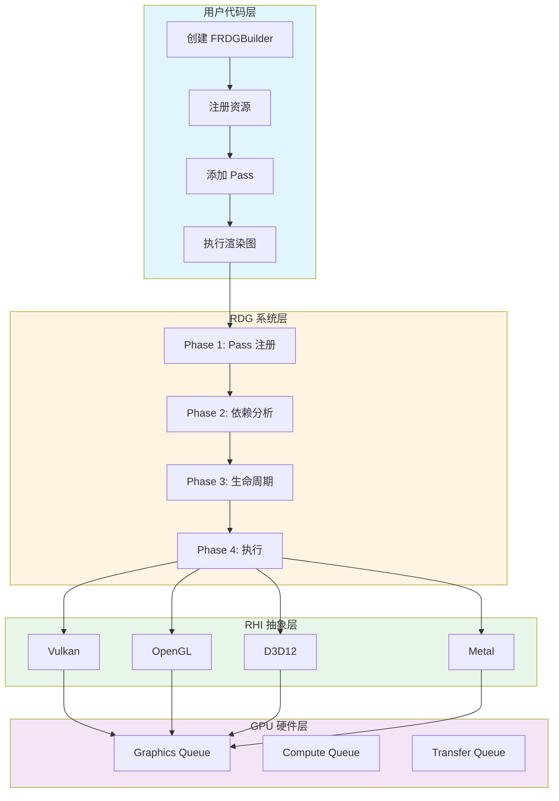

# MonsterEngine RDG 系统开发文档 - 总览

## 📚 文档导航

本文档分为四个部分，全面介绍 MonsterEngine 的 RDG (Render Dependency Graph) 系统：

### [第1部分：概述和架构](./RDG系统开发文档-第1部分-概述和架构.md)

**内容概要**:
- 系统概述
  - 设计目标和优势
  - 与传统渲染管线的对比
  - 主要特性列表
  - 系统架构概览
- 架构设计
  - 四个编译阶段详解（Phase 1-4）
  - 资源管理策略
  - 状态转换机制
  - 内存管理方案

**关键图表**:
- 系统架构流程图
- 四阶段编译模型
- 依赖图示例
- 资源生命周期状态机

---

### [第2部分：核心组件详解](./RDG系统开发文档-第2部分-核心组件.md)

**内容概要**:
- FRDGBuilder - 渲染图构建器
- FRDGPass - 渲染 Pass 基类
- FRDGTexture/FRDGBuffer - RDG 资源封装
- FRDGPassBuilder - Pass 参数构建器
- ERHIAccess - 资源访问状态枚举
- Barrier 系统实现

**关键图表**:
- 核心类 UML 图
- Pass 执行流程图
- 资源状态机
- Barrier 工作流程时序图

**代码示例**:
- 完整的类定义和实现
- Vulkan Barrier 转换逻辑
- ERHIAccess 到 Vulkan 标志映射

---

### [第3部分：API使用指南和实现细节](./RDG系统开发文档-第3部分-API和实现.md)

**内容概要**:
- API 使用指南
  - 创建 RDG Builder
  - 注册外部资源
  - 创建 RDG 资源
  - 添加 Pass
  - 声明资源访问
  - 执行渲染图
  - 完整示例（Shadow Depth Pass + Main Render Pass）
- 实现细节
  - 依赖图构建算法（RAW/WAR/WAW）
  - Kahn 拓扑排序实现
  - 资源生命周期追踪
  - Vulkan Barrier 转换逻辑
  - 渲染目标自动设置

**关键图表**:
- 完整示例执行流程图
- 依赖类型检测逻辑
- 拓扑排序算法流程
- 资源生命周期甘特图

**代码示例**:
- 完整的 Shadow Mapping 示例
- 依赖图构建代码
- 拓扑排序实现
- 资源生命周期分析

---

### [第4部分：性能优化和调试](./RDG系统开发文档-第4部分-优化和调试.md)

**内容概要**:
- 性能优化
  - Barrier 合并优化策略
  - 资源别名和池化
  - 并行 Pass 执行
  - 内存预算管理
  - 性能统计
- 调试和问题排查
  - 日志系统使用
  - RenderDoc 集成
  - 常见问题和解决方案
  - Vulkan 验证层配置
  - 性能分析工具
- 未来规划
  - 短期目标（1-2个月）
  - 中期目标（3-6个月）
  - 长期目标（6-12个月）

**关键图表**:
- Barrier 优化前后对比
- Split Barrier 优化流程
- 资源别名时间线
- 并行执行示意图

**代码示例**:
- Barrier 批处理实现
- 资源池管理器
- RenderDoc 集成代码
- 性能分析工具使用

---

## 🎯 快速开始

### 最小示例

```cpp
#include "RDG/RDGBuilder.h"

using namespace MonsterRender::RDG;

// 1. Create builder
FRDGBuilder graphBuilder(m_device, "MyRenderGraph");

// 2. Register external resources
FRDGTextureRef shadowMap = graphBuilder.registerExternalTexture(
    "ShadowMap",
    m_shadowMapTexture.Get(),
    ERHIAccess::Unknown
);

// 3. Add passes
graphBuilder.addPass(
    "ShadowDepthPass",
    ERDGPassFlags::Raster,
    [&](FRDGPassBuilder& builder) {
        builder.writeDepth(shadowMap, ERHIAccess::DSVWrite);
    },
    [=](RHI::IRHICommandList& cmdList) {
        // Render shadow depth
    }
);

graphBuilder.addPass(
    "MainRenderPass",
    ERDGPassFlags::Raster,
    [&](FRDGPassBuilder& builder) {
        builder.readTexture(shadowMap, ERHIAccess::SRVGraphics);
    },
    [=](RHI::IRHICommandList& cmdList) {
        // Render main scene
    }
);

// 4. Execute
graphBuilder.execute(*cmdList);
```

---

## 📊 系统架构总览



---

## 🔑 核心概念

### RDG (Render Dependency Graph)

渲染依赖图是一种声明式渲染架构，通过显式声明资源依赖关系，自动管理资源生命周期和状态转换。

**核心优势**:
- ✅ 自动资源管理
- ✅ 自动状态转换
- ✅ 自动依赖分析
- ✅ 性能优化
- ✅ 跨平台兼容

### 四阶段编译模型

| 阶段 | 名称 | 功能 |
|------|------|------|
| Phase 1 | Pass 注册 | 收集所有 Pass 和资源信息 |
| Phase 2 | 依赖分析 | 构建依赖图，拓扑排序 |
| Phase 3 | 生命周期 | 分析资源使用范围，插入转换 |
| Phase 4 | 执行 | 分配资源，执行 Pass |

### 依赖类型

- **RAW (Read After Write)**: 读取之前写入的数据
- **WAR (Write After Read)**: 写入之前读取的数据
- **WAW (Write After Write)**: 写入之前写入的数据

---

## 📈 实现状态

### ✅ 已完成

- [x] Phase 1-4 核心编译流程
- [x] RAW/WAR/WAW 依赖分析
- [x] Kahn 拓扑排序算法
- [x] 资源生命周期追踪
- [x] Vulkan Barrier 完整实现
- [x] 渲染目标自动设置
- [x] Debug 模式资源访问控制
- [x] CubeSceneApplication 集成示例

### 🚧 开发中

- [ ] OpenGL 状态管理
- [ ] Barrier 合并优化
- [ ] 资源池和别名
- [ ] 运行时问题调试

### 📋 计划中

- [ ] 异步计算支持
- [ ] 移动平台支持（Android/iOS）
- [ ] D3D12 后端
- [ ] Metal 后端
- [ ] 可视化编辑器

---

## 🛠️ 开发环境

### 必需工具

- **IDE**: Visual Studio 2022
- **编译器**: MSVC C++20
- **图形 API**: Vulkan SDK 1.3+
- **调试工具**: RenderDoc

### 项目路径

```
E:\MonsterEngine\               # 项目根目录
├── Include\RDG\                # RDG 头文件
├── Source\RDG\                 # RDG 实现
├── Include\RHI\                # RHI 接口
├── Source\Platform\Vulkan\     # Vulkan 实现
├── devDocument\                # 开发文档
└── log\                        # 日志文件
```

### 编译命令

```powershell
# 编译项目
& "E:\Program Files\Microsoft Visual Studio\2022\Community\MSBuild\Current\Bin\MSBuild.exe" `
  MonsterEngine.sln /t:Build /p:Configuration=Debug /p:Platform=x64

# 运行测试
.\x64\Debug\MonsterEngine.exe --cube-scene

# RenderDoc 捕获
& "C:\Program Files\RenderDoc\renderdoccmd.exe" capture `
  --working-dir "E:\MonsterEngine" `
  "E:\MonsterEngine\x64\Debug\MonsterEngine.exe" --cube-scene
```

---

## 📖 参考资料

### UE5 源码

- 路径: `E:\UnrealEngine\Engine\Source\Runtime\RenderCore\`
- 关键文件:
  - `Public/RenderGraphDefinitions.h`
  - `Public/RenderGraphBuilder.h`
  - `Private/RenderGraphBuilder.cpp`
  - `VulkanRHI/Private/VulkanBarriers.cpp`

### 外部文档

- [Vulkan Specification](https://www.khronos.org/registry/vulkan/)
- [UE5 RDG Documentation](https://docs.unrealengine.com/5.0/en-US/render-dependency-graph-in-unreal-engine/)
- [GPU Synchronization Guide](https://www.khronos.org/blog/understanding-vulkan-synchronization)

---

## 🤝 贡献指南

### 代码规范

- 使用引擎自定义类型（`TArray`, `TSharedPtr`, `FString`）
- 禁止使用标准库类型
- 注释使用英文
- 遵循 UE5 命名规范
- 使用 `MR_LOG` 记录日志

### 提交流程

1. 创建功能分支
2. 实现功能并添加测试
3. 更新相关文档
4. 提交 Pull Request
5. 代码审查
6. 合并到主分支

---

## 📞 联系方式

- **项目路径**: `E:\MonsterEngine`
- **文档路径**: `E:\MonsterEngine\devDocument\`
- **日志路径**: `E:\MonsterEngine\log\MonsterEngine.log`

---

## 📝 更新日志

### Version 1.0 (2025-12-22)

- ✅ 完成 RDG 核心架构设计
- ✅ 实现 Phase 1-4 编译流程
- ✅ 完成 Vulkan Barrier 实现
- ✅ 集成 CubeSceneApplication 示例
- ✅ 生成完整开发文档

---

**文档生成完成** - 2025-12-22

本文档由 MonsterEngine 开发团队维护。如有问题或建议，请查看各部分详细文档或联系开发团队。
