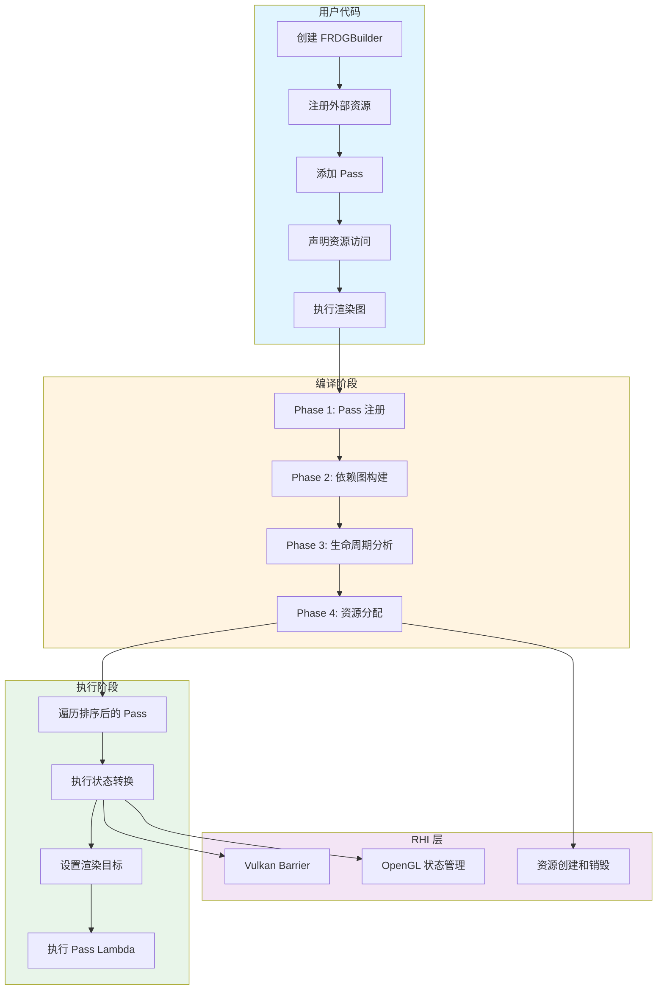
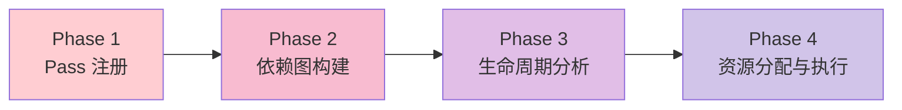
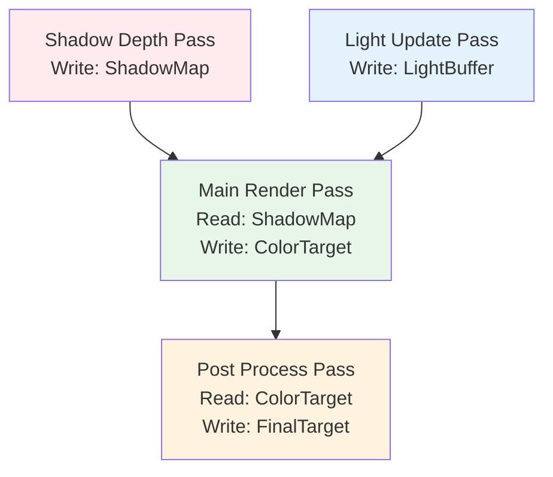
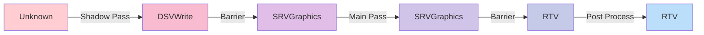
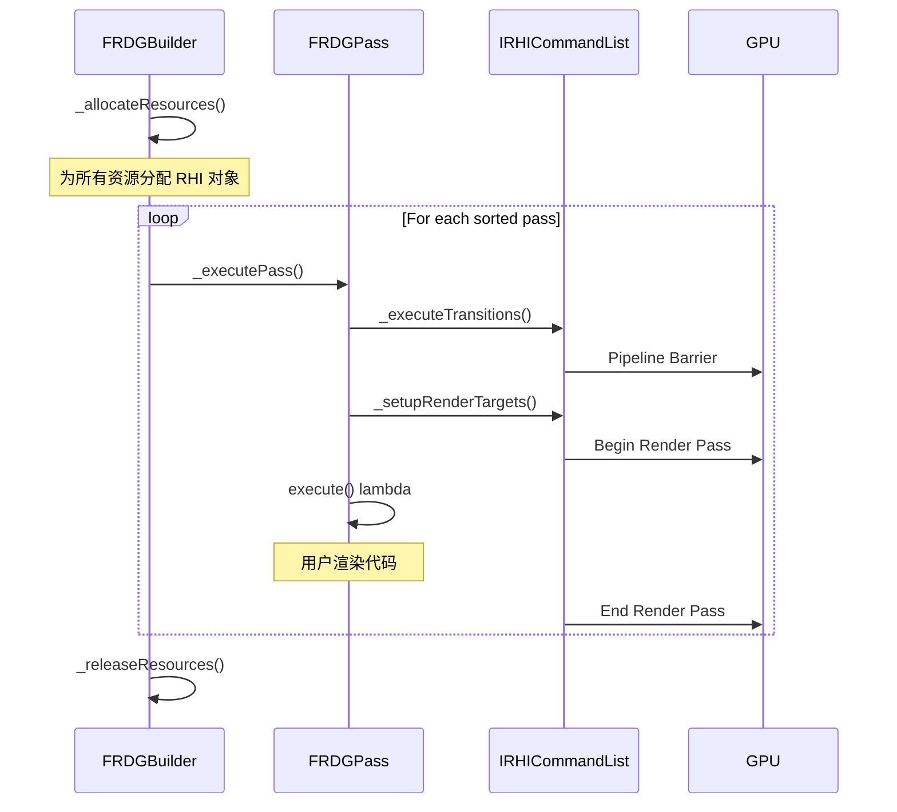
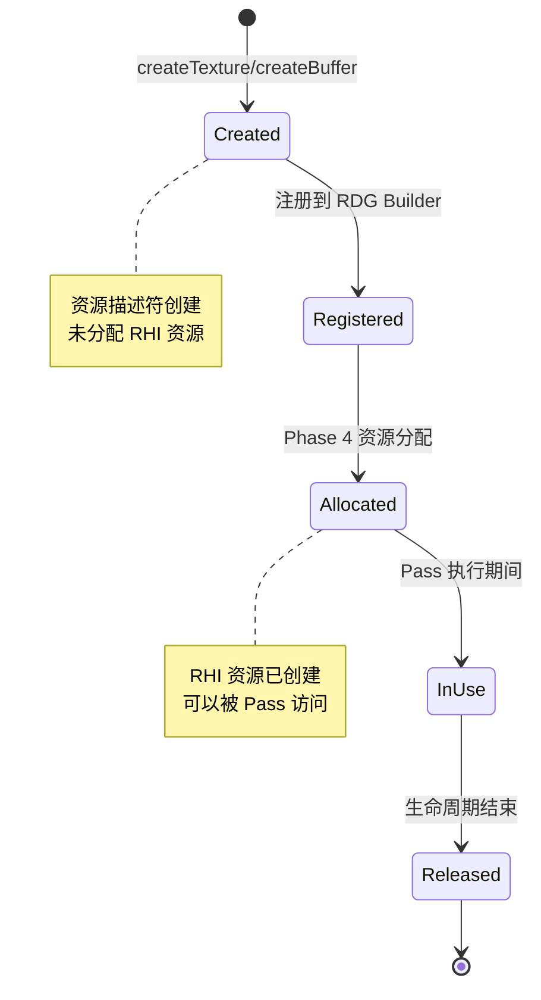

# MonsterEngine RDG 系统开发文档 - 第1部分：概述和架构

## 文档信息

- **项目名称**: MonsterEngine
- **参考架构**: Unreal Engine 5 RDG 系统
- **开发语言**: C++20
- **图形 API**: Vulkan (主要), OpenGL (兼容)
- **文档版本**: 1.0
- **最后更新**: 2025-12-22

---

## 目录

1. [系统概述](#1-系统概述)
2. [架构设计](#2-架构设计)

---

## 1. 系统概述

### 1.1 设计目标

RDG (Render Dependency Graph) 系统是 MonsterEngine 的核心渲染架构，旨在提供：

- **自动资源管理**: 自动分配、释放和复用 GPU 资源
- **自动状态转换**: 自动插入资源 barrier 和状态转换
- **依赖关系追踪**: 自动分析 Pass 之间的依赖关系
- **性能优化**: 资源池化、barrier 合并、并行执行
- **跨平台兼容**: 统一的 API，支持 Vulkan、OpenGL、D3D12、Metal

### 1.2 与传统渲染管线的对比

| 特性 | 传统渲染管线 | RDG 系统 |
|------|------------|----------|
| 资源管理 | 手动创建和销毁 | 自动管理生命周期 |
| 状态转换 | 手动插入 barrier | 自动分析和插入 |
| 依赖关系 | 隐式，容易出错 | 显式声明，自动验证 |
| 资源复用 | 需要手动实现 | 自动池化和别名 |
| 调试难度 | 高，难以追踪 | 低，完整的依赖图 |
| 性能优化 | 手动优化 | 自动合并和优化 |

### 1.3 主要特性

✅ **已实现特性**:
- Phase 1-4 完整编译流程
- 自动依赖图构建 (RAW/WAR/WAW)
- Kahn 拓扑排序算法
- 资源生命周期分析
- Vulkan Barrier 完整实现
- 渲染目标自动设置
- Debug 模式资源访问控制

🚧 **开发中特性**:
- OpenGL 状态管理
- Barrier 合并优化
- 资源池和别名优化
- 并行 Pass 执行

### 1.4 系统架构概览



---

## 2. 架构设计

### 2.1 四个编译阶段详解

RDG 系统采用四阶段编译模型，参考 UE5 的设计：



#### Phase 1: Pass 注册和资源声明

**目标**: 收集所有 Pass 和资源信息

**关键代码** (`RDGBuilder.h:142-170`):

```cpp
template<typename SetupLambdaType, typename ExecuteLambdaType>
FRDGPassRef addPass(
    const FString& name,
    ERDGPassFlags flags,
    SetupLambdaType&& setupFunc,
    ExecuteLambdaType&& executeFunc)
{
    // Create pass
    auto* pass = new TRDGLambdaPass<ExecuteLambdaType>(
        name, flags, std::move(executeFunc));
    
    // Assign handle
    pass->m_handle = FRDGPassHandle(static_cast<uint16>(m_passes.Num()));
    
    // Setup resource dependencies
    FRDGPassBuilder passBuilder;
    setupFunc(passBuilder);
    
    // Record dependencies
    pass->m_textureAccesses = passBuilder.getTextureAccesses();
    pass->m_bufferAccesses = passBuilder.getBufferAccesses();
    
    // Add to pass list
    m_passes.Add(pass);
    
    return pass;
}
```

**工作流程**:
1. 用户调用 `addPass()` 注册 Pass
2. 执行 `setupFunc` lambda，声明资源访问
3. 记录纹理和缓冲区访问信息
4. 分配 Pass Handle 用于后续引用

#### Phase 2: 依赖图构建和拓扑排序

**目标**: 分析 Pass 之间的依赖关系，确定执行顺序

**依赖类型**:
- **RAW (Read After Write)**: 读取之前写入的数据
- **WAR (Write After Read)**: 写入之前读取的数据
- **WAW (Write After Write)**: 写入之前写入的数据

**依赖图示例**:



**拓扑排序** (Kahn 算法):

```cpp
void FRDGBuilder::_topologicalSort()
{
    // Calculate in-degree for each pass
    TMap<FRDGPassHandle, int32> inDegree;
    for (FRDGPass* pass : m_passes)
    {
        inDegree.Add(pass->getHandle(), pass->m_dependencies.Num());
    }
    
    // Queue for passes with no dependencies
    TArray<FRDGPassHandle> queue;
    for (FRDGPass* pass : m_passes)
    {
        if (inDegree[pass->getHandle()] == 0)
        {
            queue.Add(pass->getHandle());
        }
    }
    
    // Process queue
    while (queue.Num() > 0)
    {
        FRDGPassHandle current = queue[0];
        queue.RemoveAt(0);
        
        FRDGPass* currentPass = m_passes[current.index];
        m_sortedPasses.Add(currentPass);
        
        // Reduce in-degree of dependents
        for (FRDGPassHandle dependent : currentPass->m_dependents)
        {
            int32& degree = inDegree[dependent];
            degree--;
            
            if (degree == 0)
            {
                queue.Add(dependent);
            }
        }
    }
    
    // Check for cycles
    if (m_sortedPasses.Num() != m_passes.Num())
    {
        MR_LOG(LogRDG, Error, "Cycle detected in render graph!");
    }
}
```

#### Phase 3: 资源生命周期分析和状态转换插入

**目标**: 确定资源的使用范围，插入必要的状态转换

**状态转换示例**:



#### Phase 4: 资源分配和 Pass 执行

**目标**: 分配 RHI 资源，执行所有 Pass

**执行流程**:



### 2.2 资源管理策略

#### 资源生命周期



#### 外部资源管理

外部资源（如 Swapchain、持久化纹理）需要特殊处理：

```cpp
// Register external texture
FRDGTextureRef shadowMapRDG = graphBuilder.registerExternalTexture(
    "ShadowMap",
    m_shadowMapTexture.Get(),
    ERHIAccess::Unknown  // Initial state
);
```

**特点**:
- 不由 RDG 分配和释放
- 需要指定初始状态
- 生命周期由外部管理

### 2.3 状态转换机制

#### ERHIAccess 状态枚举

**关键代码** (`RDGDefinitions.h:21-75`):

```cpp
enum class ERHIAccess : uint32
{
    Unknown = 0,
    
    // Read-only states
    CPURead                 = 1 << 0,
    Present                 = 1 << 1,
    IndirectArgs            = 1 << 2,
    VertexOrIndexBuffer     = 1 << 3,
    SRVCompute              = 1 << 4,
    SRVGraphics             = 1 << 5,
    CopySrc                 = 1 << 6,
    ResolveSrc              = 1 << 7,
    DSVRead                 = 1 << 8,
    
    // Read-write states
    UAVCompute              = 1 << 9,
    UAVGraphics             = 1 << 10,
    RTV                     = 1 << 11,
    CopyDest                = 1 << 12,
    ResolveDst              = 1 << 13,
    DSVWrite                = 1 << 14,
    
    // Special states
    Discard                 = 1 << 15,
};
```

#### Vulkan Barrier 转换映射表

| ERHIAccess | Vulkan Stage | Vulkan Access | Vulkan Layout |
|------------|--------------|---------------|---------------|
| SRVGraphics | VERTEX_SHADER \| FRAGMENT_SHADER | SHADER_READ | SHADER_READ_ONLY_OPTIMAL |
| RTV | COLOR_ATTACHMENT_OUTPUT | COLOR_ATTACHMENT_WRITE | COLOR_ATTACHMENT_OPTIMAL |
| DSVWrite | EARLY_FRAGMENT_TESTS \| LATE_FRAGMENT_TESTS | DEPTH_STENCIL_ATTACHMENT_WRITE | DEPTH_STENCIL_ATTACHMENT_OPTIMAL |
| DSVRead | EARLY_FRAGMENT_TESTS \| LATE_FRAGMENT_TESTS | DEPTH_STENCIL_ATTACHMENT_READ | DEPTH_STENCIL_READ_ONLY_OPTIMAL |

### 2.4 内存管理方案

#### 自定义内存分配器

MonsterEngine 使用自定义内存管理系统，禁止使用标准库：

```cpp
// ❌ 禁止使用
new Texture();
std::make_shared<Buffer>();
malloc(size);

// ✅ 必须使用
TSharedPtr<Texture> texture = MakeShared<Texture>();
TUniquePtr<Buffer> buffer = MakeUnique<Buffer>();
void* memory = FMemory::Malloc(size);
```

#### GPU 内存管理

```cpp
// Vulkan memory manager
FVulkanMemoryManager* memoryManager = device->getMemoryManager();

// Allocate GPU memory
FVulkanAllocation allocation = memoryManager->allocate(
    size,
    alignment,
    memoryTypeBits,
    VK_MEMORY_PROPERTY_DEVICE_LOCAL_BIT
);
```

---

**继续阅读**: [第2部分：核心组件详解](./RDG系统开发文档-第2部分-核心组件.md)
