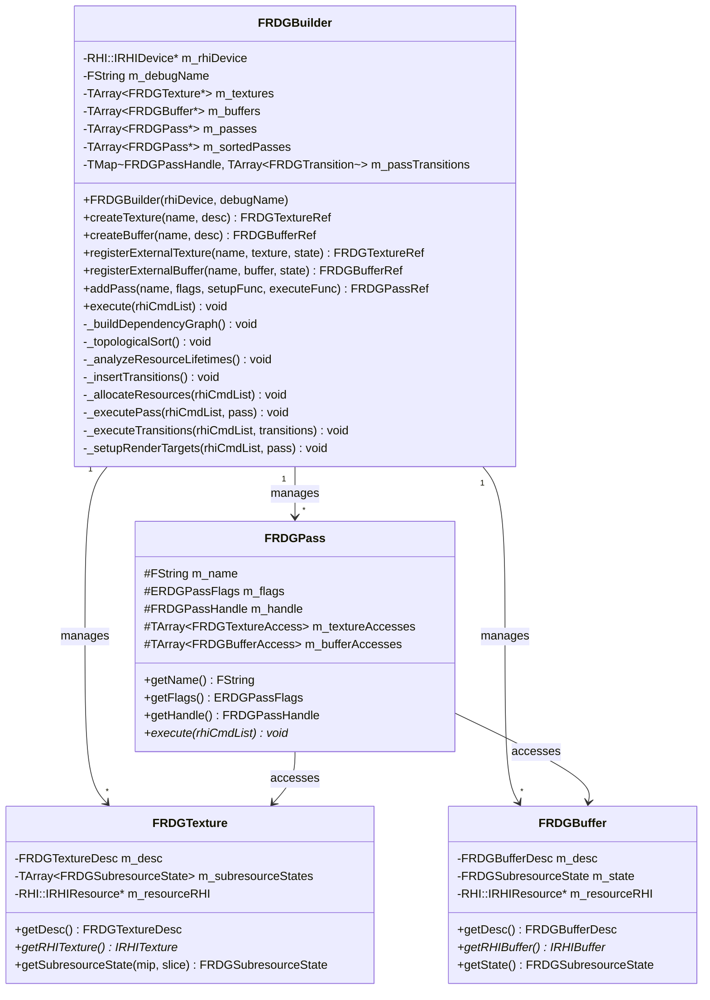
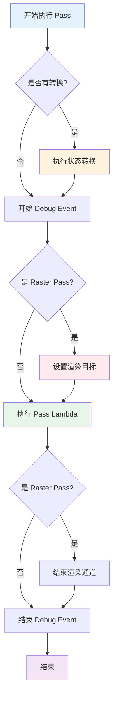
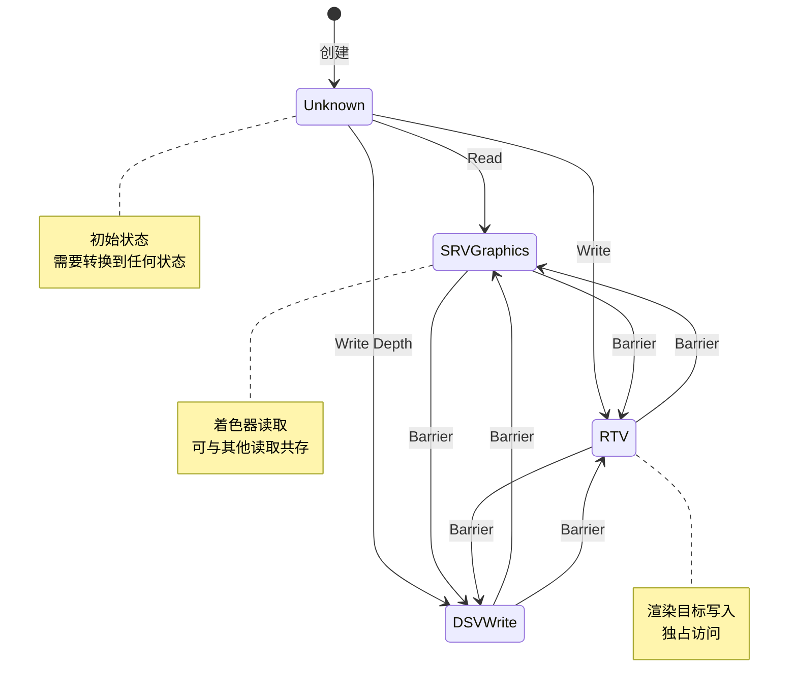
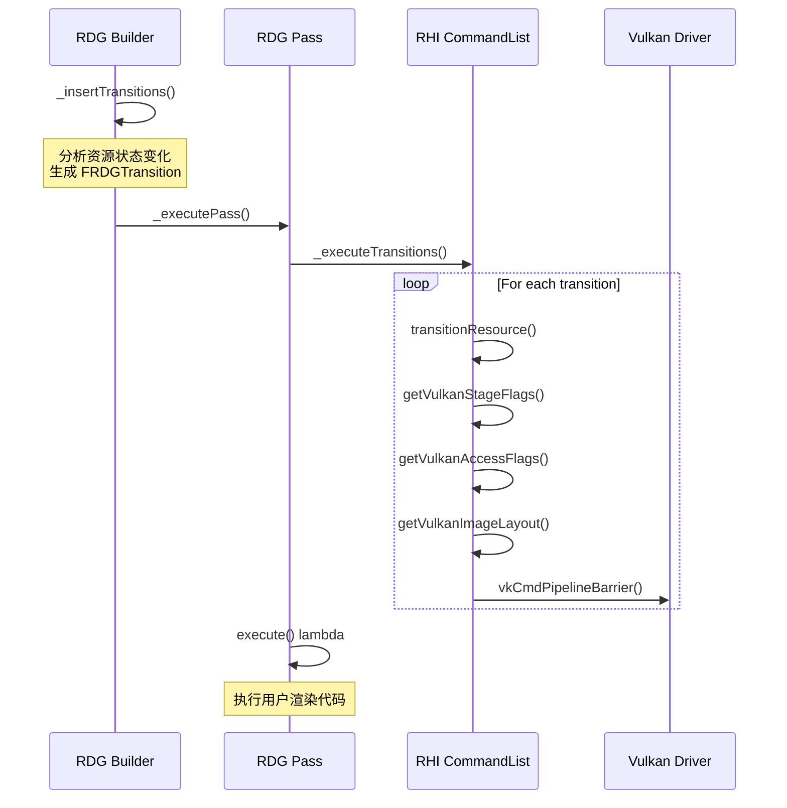

# MonsterEngine RDG 系统开发文档 - 第2部分：核心组件详解

## 目录

3. [核心组件详解](#3-核心组件详解)

---

## 3. 核心组件详解

### 3.1 FRDGBuilder - 渲染图构建器

**类图**:



**主要职责**:
1. 管理所有 Pass 和资源的生命周期
2. 执行四阶段编译流程
3. 协调 RHI 层的资源分配
4. 提供用户友好的 API

**使用示例**:

```cpp
// Create RDG builder
FRDGBuilder graphBuilder(m_device, "MainRenderGraph");

// Create or register resources
FRDGTextureRef colorTarget = graphBuilder.createTexture(
    "ColorTarget",
    FRDGTextureDesc::create2D(1920, 1080, RHI::EPixelFormat::R8G8B8A8_UNORM)
);

FRDGTextureRef shadowMap = graphBuilder.registerExternalTexture(
    "ShadowMap",
    m_shadowMapTexture.Get(),
    ERHIAccess::Unknown
);

// Add passes
graphBuilder.addPass(
    "ShadowDepthPass",
    ERDGPassFlags::Raster,
    [&](FRDGPassBuilder& builder) {
        builder.writeDepth(shadowMap, ERHIAccess::DSVWrite);
    },
    [=](RHI::IRHICommandList& cmdList) {
        // Render shadow depth
    }
);

// Execute
graphBuilder.execute(*cmdList);
```

### 3.2 FRDGPass - 渲染 Pass 基类

**Pass 类型**:

```cpp
enum class ERDGPassFlags : uint16
{
    None = 0,
    Raster = 1 << 0,        // 光栅化 Pass
    Compute = 1 << 1,       // 计算 Pass
    AsyncCompute = 1 << 2,  // 异步计算 Pass
    Copy = 1 << 3,          // 拷贝 Pass
    NeverCull = 1 << 4,     // 永不剔除
    SkipRenderPass = 1 << 5,// 跳过渲染通道管理
    NeverMerge = 1 << 6,    // 永不合并
    NeverParallel = 1 << 7, // 永不并行
};
```

**Lambda Pass 实现**:

```cpp
template<typename ExecuteLambdaType>
class TRDGLambdaPass : public FRDGPass
{
public:
    TRDGLambdaPass(const FString& inName, 
                   ERDGPassFlags inFlags,
                   ExecuteLambdaType&& inExecuteLambda)
        : FRDGPass(inName, inFlags)
        , m_executeLambda(std::move(inExecuteLambda))
    {}
    
    virtual void execute(RHI::IRHICommandList& rhiCmdList) override
    {
        m_executeLambda(rhiCmdList);
    }
    
private:
    ExecuteLambdaType m_executeLambda;
};
```

**Pass 执行流程**:



### 3.3 FRDGTexture/FRDGBuffer - RDG 资源封装

**纹理描述符**:

```cpp
struct FRDGTextureDesc
{
    uint32 width = 1;
    uint32 height = 1;
    uint32 depth = 1;
    uint32 arraySize = 1;
    uint32 mipLevels = 1;
    uint32 sampleCount = 1;
    
    RHI::EPixelFormat format = RHI::EPixelFormat::R8G8B8A8_UNORM;
    RHI::EResourceUsage usage = RHI::EResourceUsage::None;
    ERDGTextureFlags flags = ERDGTextureFlags::None;
    
    // Helper constructors
    static FRDGTextureDesc create2D(uint32 w, uint32 h, RHI::EPixelFormat fmt);
    static FRDGTextureDesc createDepth(uint32 w, uint32 h, RHI::EPixelFormat fmt);
};
```

**子资源状态追踪**:

```cpp
struct FRDGSubresourceState
{
    ERHIAccess access = ERHIAccess::Unknown;
    FRDGPassHandle firstPass;  // 首次使用的 Pass
    FRDGPassHandle lastPass;   // 最后使用的 Pass
    
    void setPass(FRDGPassHandle passHandle)
    {
        if (!firstPass.isValid())
            firstPass = passHandle;
        lastPass = passHandle;
    }
    
    // Check if transition is required
    static bool isTransitionRequired(
        const FRDGSubresourceState& previous, 
        const FRDGSubresourceState& next)
    {
        if (previous.access == ERHIAccess::Unknown)
            return true;
        
        if (previous.access == next.access)
            return false;
        
        bool prevWritable = isWritableAccess(previous.access);
        bool nextWritable = isWritableAccess(next.access);
        
        if (prevWritable || nextWritable)
            return true;
        
        return false;
    }
};
```

**资源状态机**:



### 3.4 FRDGPassBuilder - Pass 参数构建器

**资源访问声明 API**:

```cpp
class FRDGPassBuilder
{
public:
    // Texture access
    void readTexture(FRDGTextureRef texture, ERHIAccess access = ERHIAccess::SRVGraphics);
    void writeTexture(FRDGTextureRef texture, ERHIAccess access = ERHIAccess::RTV);
    void writeDepth(FRDGTextureRef depthTexture, ERHIAccess access = ERHIAccess::DSVWrite);
    void readDepth(FRDGTextureRef depthTexture, ERHIAccess access = ERHIAccess::DSVRead);
    
    // Buffer access
    void readBuffer(FRDGBufferRef buffer, ERHIAccess access = ERHIAccess::SRVGraphics);
    void writeBuffer(FRDGBufferRef buffer, ERHIAccess access = ERHIAccess::UAVGraphics);
    
private:
    TArray<FRDGTextureAccess> m_textureAccesses;
    TArray<FRDGBufferAccess> m_bufferAccesses;
};
```

**使用示例**:

```cpp
graphBuilder.addPass(
    "MyPass",
    ERDGPassFlags::Raster,
    [&](FRDGPassBuilder& builder) {
        // Declare resource accesses
        builder.readTexture(inputTexture, ERHIAccess::SRVGraphics);
        builder.writeTexture(outputTexture, ERHIAccess::RTV);
        builder.readDepth(depthBuffer, ERHIAccess::DSVRead);
        builder.readBuffer(uniformBuffer, ERHIAccess::SRVGraphics);
    },
    [=](RHI::IRHICommandList& cmdList) {
        // Execute pass
    }
);
```

### 3.5 ERHIAccess - 资源访问状态枚举

**状态分类**:

| 类别 | 状态 | 说明 | Vulkan Stage | Vulkan Access |
|------|------|------|--------------|---------------|
| 只读 | SRVGraphics | 图形着色器资源视图 | VERTEX_SHADER \| FRAGMENT_SHADER | SHADER_READ |
| 只读 | SRVCompute | 计算着色器资源视图 | COMPUTE_SHADER | SHADER_READ |
| 只读 | VertexOrIndexBuffer | 顶点/索引缓冲区 | VERTEX_INPUT | VERTEX_ATTRIBUTE_READ |
| 只读 | DSVRead | 深度模板只读 | EARLY_FRAGMENT_TESTS | DEPTH_STENCIL_ATTACHMENT_READ |
| 读写 | UAVGraphics | 图形无序访问视图 | FRAGMENT_SHADER | SHADER_READ \| SHADER_WRITE |
| 读写 | UAVCompute | 计算无序访问视图 | COMPUTE_SHADER | SHADER_READ \| SHADER_WRITE |
| 只写 | RTV | 渲染目标视图 | COLOR_ATTACHMENT_OUTPUT | COLOR_ATTACHMENT_WRITE |
| 只写 | DSVWrite | 深度模板写入 | EARLY_FRAGMENT_TESTS | DEPTH_STENCIL_ATTACHMENT_WRITE |
| 只写 | CopyDest | 拷贝目标 | TRANSFER | TRANSFER_WRITE |

**状态验证函数**:

```cpp
// Check if access is valid
bool isValid = isValidAccess(ERHIAccess::SRVGraphics | ERHIAccess::DSVRead);

// Check if access is writable
bool writable = isWritableAccess(ERHIAccess::RTV);

// Check if access is readable
bool readable = isReadableAccess(ERHIAccess::SRVGraphics);

// Check if transition is required
bool needTransition = FRDGSubresourceState::isTransitionRequired(
    prevState, nextState
);
```

### 3.6 Barrier 系统实现

**Barrier 工作流程**:



**Vulkan Barrier 实现** (`VulkanRHICommandList.cpp`):

```cpp
void FVulkanRHICommandList::transitionResource(
    TSharedPtr<RHI::IRHIResource> resource,
    RHI::EResourceUsage oldUsage,
    RHI::EResourceUsage newUsage)
{
    // Get command buffer
    VkCommandBuffer cmdBuffer = m_context->getCmdBuffer()->getHandle();
    
    // Convert to ERHIAccess
    ERHIAccess oldAccess = static_cast<ERHIAccess>(oldUsage);
    ERHIAccess newAccess = static_cast<ERHIAccess>(newUsage);
    
    // Get Vulkan flags
    VkPipelineStageFlags srcStage = getVulkanStageFlags(oldAccess);
    VkPipelineStageFlags dstStage = getVulkanStageFlags(newAccess);
    VkAccessFlags srcAccess = getVulkanAccessFlags(oldAccess);
    VkAccessFlags dstAccess = getVulkanAccessFlags(newAccess);
    
    // Check if this is a texture or buffer
    FVulkanTexture* texture = dynamic_cast<FVulkanTexture*>(resource.Get());
    if (texture)
    {
        // Image memory barrier
        VkImageMemoryBarrier barrier = {};
        barrier.sType = VK_STRUCTURE_TYPE_IMAGE_MEMORY_BARRIER;
        barrier.srcAccessMask = srcAccess;
        barrier.dstAccessMask = dstAccess;
        barrier.oldLayout = getVulkanImageLayout(oldAccess);
        barrier.newLayout = getVulkanImageLayout(newAccess);
        barrier.image = texture->getImage();
        barrier.subresourceRange.aspectMask = VK_IMAGE_ASPECT_COLOR_BIT;
        barrier.subresourceRange.levelCount = VK_REMAINING_MIP_LEVELS;
        barrier.subresourceRange.layerCount = VK_REMAINING_ARRAY_LAYERS;
        
        vkCmdPipelineBarrier(
            cmdBuffer,
            srcStage, dstStage,
            0,
            0, nullptr,
            0, nullptr,
            1, &barrier
        );
    }
    else
    {
        // Buffer memory barrier
        FVulkanBuffer* buffer = dynamic_cast<FVulkanBuffer*>(resource.Get());
        if (buffer)
        {
            VkBufferMemoryBarrier barrier = {};
            barrier.sType = VK_STRUCTURE_TYPE_BUFFER_MEMORY_BARRIER;
            barrier.srcAccessMask = srcAccess;
            barrier.dstAccessMask = dstAccess;
            barrier.buffer = buffer->getBuffer();
            barrier.size = VK_WHOLE_SIZE;
            
            vkCmdPipelineBarrier(
                cmdBuffer,
                srcStage, dstStage,
                0,
                0, nullptr,
                1, &barrier,
                0, nullptr
            );
        }
    }
}
```

**ERHIAccess 到 Vulkan 转换** (`RHIBarriers.cpp`):

```cpp
VkPipelineStageFlags getVulkanStageFlags(ERHIAccess access)
{
    VkPipelineStageFlags stages = 0;
    
    if (enumHasAnyFlags(access, ERHIAccess::IndirectArgs))
        stages |= VK_PIPELINE_STAGE_DRAW_INDIRECT_BIT;
    
    if (enumHasAnyFlags(access, ERHIAccess::VertexOrIndexBuffer))
        stages |= VK_PIPELINE_STAGE_VERTEX_INPUT_BIT;
    
    if (enumHasAnyFlags(access, ERHIAccess::SRVGraphics))
        stages |= VK_PIPELINE_STAGE_VERTEX_SHADER_BIT | 
                  VK_PIPELINE_STAGE_FRAGMENT_SHADER_BIT;
    
    if (enumHasAnyFlags(access, ERHIAccess::SRVCompute))
        stages |= VK_PIPELINE_STAGE_COMPUTE_SHADER_BIT;
    
    if (enumHasAnyFlags(access, ERHIAccess::UAVGraphics))
        stages |= VK_PIPELINE_STAGE_FRAGMENT_SHADER_BIT;
    
    if (enumHasAnyFlags(access, ERHIAccess::UAVCompute))
        stages |= VK_PIPELINE_STAGE_COMPUTE_SHADER_BIT;
    
    if (enumHasAnyFlags(access, ERHIAccess::RTV))
        stages |= VK_PIPELINE_STAGE_COLOR_ATTACHMENT_OUTPUT_BIT;
    
    if (enumHasAnyFlags(access, ERHIAccess::DSVWrite | ERHIAccess::DSVRead))
        stages |= VK_PIPELINE_STAGE_EARLY_FRAGMENT_TESTS_BIT | 
                  VK_PIPELINE_STAGE_LATE_FRAGMENT_TESTS_BIT;
    
    if (enumHasAnyFlags(access, ERHIAccess::CopySrc | ERHIAccess::CopyDest))
        stages |= VK_PIPELINE_STAGE_TRANSFER_BIT;
    
    return stages ? stages : VK_PIPELINE_STAGE_TOP_OF_PIPE_BIT;
}

VkAccessFlags getVulkanAccessFlags(ERHIAccess access)
{
    VkAccessFlags flags = 0;
    
    if (enumHasAnyFlags(access, ERHIAccess::IndirectArgs))
        flags |= VK_ACCESS_INDIRECT_COMMAND_READ_BIT;
    
    if (enumHasAnyFlags(access, ERHIAccess::VertexOrIndexBuffer))
        flags |= VK_ACCESS_VERTEX_ATTRIBUTE_READ_BIT | VK_ACCESS_INDEX_READ_BIT;
    
    if (enumHasAnyFlags(access, ERHIAccess::SRVGraphics | ERHIAccess::SRVCompute))
        flags |= VK_ACCESS_SHADER_READ_BIT;
    
    if (enumHasAnyFlags(access, ERHIAccess::UAVGraphics | ERHIAccess::UAVCompute))
        flags |= VK_ACCESS_SHADER_READ_BIT | VK_ACCESS_SHADER_WRITE_BIT;
    
    if (enumHasAnyFlags(access, ERHIAccess::RTV))
        flags |= VK_ACCESS_COLOR_ATTACHMENT_WRITE_BIT;
    
    if (enumHasAnyFlags(access, ERHIAccess::DSVRead))
        flags |= VK_ACCESS_DEPTH_STENCIL_ATTACHMENT_READ_BIT;
    
    if (enumHasAnyFlags(access, ERHIAccess::DSVWrite))
        flags |= VK_ACCESS_DEPTH_STENCIL_ATTACHMENT_WRITE_BIT;
    
    if (enumHasAnyFlags(access, ERHIAccess::CopySrc))
        flags |= VK_ACCESS_TRANSFER_READ_BIT;
    
    if (enumHasAnyFlags(access, ERHIAccess::CopyDest))
        flags |= VK_ACCESS_TRANSFER_WRITE_BIT;
    
    return flags;
}

VkImageLayout getVulkanImageLayout(ERHIAccess access)
{
    if (access == ERHIAccess::Unknown)
        return VK_IMAGE_LAYOUT_UNDEFINED;
    
    if (enumHasAnyFlags(access, ERHIAccess::RTV))
        return VK_IMAGE_LAYOUT_COLOR_ATTACHMENT_OPTIMAL;
    
    if (enumHasAnyFlags(access, ERHIAccess::DSVWrite))
        return VK_IMAGE_LAYOUT_DEPTH_STENCIL_ATTACHMENT_OPTIMAL;
    
    if (enumHasAnyFlags(access, ERHIAccess::DSVRead))
        return VK_IMAGE_LAYOUT_DEPTH_STENCIL_READ_ONLY_OPTIMAL;
    
    if (enumHasAnyFlags(access, ERHIAccess::SRVGraphics | ERHIAccess::SRVCompute))
        return VK_IMAGE_LAYOUT_SHADER_READ_ONLY_OPTIMAL;
    
    if (enumHasAnyFlags(access, ERHIAccess::UAVGraphics | ERHIAccess::UAVCompute))
        return VK_IMAGE_LAYOUT_GENERAL;
    
    if (enumHasAnyFlags(access, ERHIAccess::CopySrc))
        return VK_IMAGE_LAYOUT_TRANSFER_SRC_OPTIMAL;
    
    if (enumHasAnyFlags(access, ERHIAccess::CopyDest))
        return VK_IMAGE_LAYOUT_TRANSFER_DST_OPTIMAL;
    
    if (enumHasAnyFlags(access, ERHIAccess::Present))
        return VK_IMAGE_LAYOUT_PRESENT_SRC_KHR;
    
    return VK_IMAGE_LAYOUT_GENERAL;
}
```

---

**继续阅读**: [第3部分：API使用指南和实现细节](./RDG系统开发文档-第3部分-API和实现.md)
