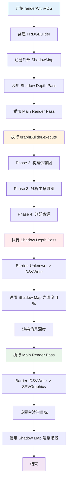
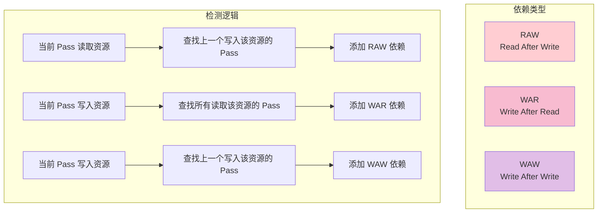
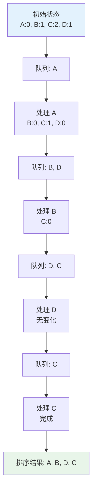
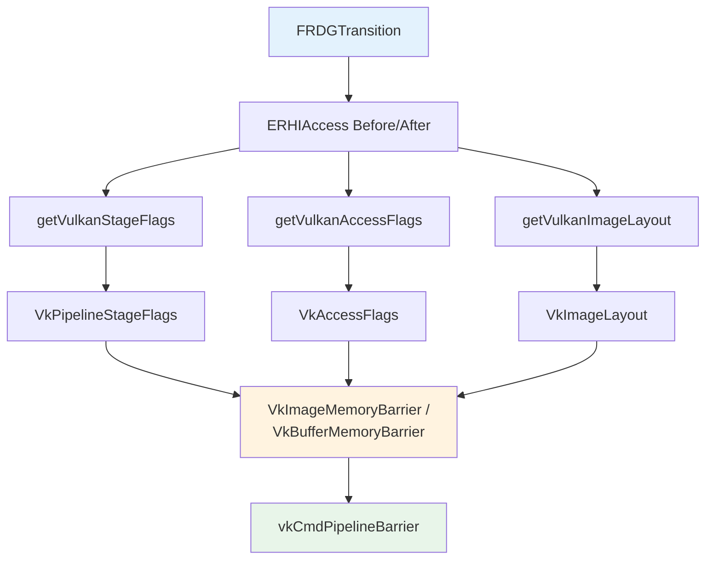

# MonsterEngine RDG 系统开发文档 - 第3部分：API使用指南和实现细节

## 目录

4. [API 使用指南](#4-api-使用指南)
5. [实现细节](#5-实现细节)

---

## 4. API 使用指南

### 4.1 创建 RDG Builder

```cpp
#include "RDG/RDGBuilder.h"

using namespace MonsterRender::RDG;

// Create builder with RHI device
FRDGBuilder graphBuilder(m_device, "MyRenderGraph");
```

### 4.2 注册外部资源

**注册外部纹理**:

```cpp
// Shadow map texture (created outside RDG)
TSharedPtr<RHI::IRHITexture> m_shadowMapTexture = /* ... */;

// Register with RDG
FRDGTextureRef shadowMapRDG = graphBuilder.registerExternalTexture(
    "ShadowMap",
    m_shadowMapTexture.Get(),
    ERHIAccess::Unknown  // Initial state
);
```

**注册外部缓冲区**:

```cpp
// Uniform buffer (created outside RDG)
TSharedPtr<RHI::IRHIBuffer> m_uniformBuffer = /* ... */;

// Register with RDG
FRDGBufferRef uniformBufferRDG = graphBuilder.registerExternalBuffer(
    "UniformBuffer",
    m_uniformBuffer.Get(),
    ERHIAccess::Unknown
);
```

### 4.3 创建 RDG 资源

**创建纹理**:

```cpp
// Create 2D color texture
FRDGTextureRef colorTarget = graphBuilder.createTexture(
    "ColorTarget",
    FRDGTextureDesc::create2D(
        1920, 1080,
        RHI::EPixelFormat::R8G8B8A8_UNORM,
        RHI::EResourceUsage::RenderTarget | RHI::EResourceUsage::ShaderResource
    )
);

// Create depth texture
FRDGTextureRef depthTarget = graphBuilder.createTexture(
    "DepthTarget",
    FRDGTextureDesc::createDepth(
        1920, 1080,
        RHI::EPixelFormat::D32_FLOAT
    )
);
```

**创建缓冲区**:

```cpp
// Create vertex buffer
FRDGBufferRef vertexBuffer = graphBuilder.createBuffer(
    "VertexBuffer",
    FRDGBufferDesc::createVertexBuffer(
        sizeof(Vertex) * vertexCount,
        sizeof(Vertex)
    )
);

// Create uniform buffer
FRDGBufferRef uniformBuffer = graphBuilder.createBuffer(
    "SceneUniforms",
    FRDGBufferDesc::createUniformBuffer(sizeof(SceneConstants))
);
```

### 4.4 添加 Pass

**基本 Pass 结构**:

```cpp
graphBuilder.addPass(
    "PassName",                    // Pass 名称（用于调试）
    ERDGPassFlags::Raster,         // Pass 类型标志
    [&](FRDGPassBuilder& builder)  // Setup lambda: 声明资源访问
    {
        builder.readTexture(inputTexture, ERHIAccess::SRVGraphics);
        builder.writeTexture(outputTexture, ERHIAccess::RTV);
    },
    [=](RHI::IRHICommandList& cmdList)  // Execute lambda: 执行渲染命令
    {
        // Render commands here
    }
);
```

### 4.5 声明资源访问

**纹理访问**:

```cpp
[&](FRDGPassBuilder& builder)
{
    // Read texture as shader resource
    builder.readTexture(inputTexture, ERHIAccess::SRVGraphics);
    
    // Write to render target
    builder.writeTexture(colorTarget, ERHIAccess::RTV);
    
    // Write to depth buffer
    builder.writeDepth(depthTarget, ERHIAccess::DSVWrite);
    
    // Read depth buffer (depth test only)
    builder.readDepth(depthTarget, ERHIAccess::DSVRead);
}
```

**缓冲区访问**:

```cpp
[&](FRDGPassBuilder& builder)
{
    // Read buffer as shader resource
    builder.readBuffer(uniformBuffer, ERHIAccess::SRVGraphics);
    
    // Write to buffer (UAV)
    builder.writeBuffer(outputBuffer, ERHIAccess::UAVCompute);
}
```

### 4.6 执行渲染图

```cpp
// Execute the render graph
graphBuilder.execute(*cmdList);
```

**执行流程**:
1. Phase 1: 已在 `addPass()` 时完成
2. Phase 2: 构建依赖图和拓扑排序
3. Phase 3: 分析资源生命周期和插入转换
4. Phase 4: 分配资源并执行所有 Pass

### 4.7 完整示例：Shadow Depth Pass + Main Render Pass

**场景描述**:
- Pass 1: Shadow Depth Pass - 渲染场景深度到 shadow map
- Pass 2: Main Render Pass - 使用 shadow map 渲染主场景

**完整代码** (`CubeSceneApplication.cpp`):

```cpp
void CubeSceneApplication::renderWithRDG(
    RHI::IRHICommandList* cmdList,
    const Math::FMatrix& viewMatrix,
    const Math::FMatrix& projectionMatrix,
    const Math::FVector& cameraPosition)
{
    using namespace RDG;
    
    // Get light direction
    FVector lightDirection = FVector(0.5f, -1.0f, 0.3f);
    if (m_directionalLight->GetLightSceneInfo() && 
        m_directionalLight->GetLightSceneInfo()->Proxy)
    {
        lightDirection = m_directionalLight->GetLightSceneInfo()->Proxy->GetDirection();
    }
    lightDirection.Normalize();
    
    // Calculate light view-projection matrix
    Math::FMatrix lightViewProjection = calculateLightViewProjection(lightDirection, 10.0f);
    
    // ========================================================================
    // Create RDG Builder
    // ========================================================================
    
    FRDGBuilder graphBuilder(m_device, "CubeSceneRenderGraph");
    
    // ========================================================================
    // Register External Resources
    // ========================================================================
    
    // Register external shadow map texture
    FRDGTextureRef shadowMapRDG = graphBuilder.registerExternalTexture(
        "ShadowMap",
        m_shadowMapTexture.Get(),
        ERHIAccess::Unknown
    );
    
    // ========================================================================
    // Pass 1: Shadow Depth Pass
    // ========================================================================
    
    graphBuilder.addPass(
        "ShadowDepthPass",
        ERDGPassFlags::Raster,
        [&](FRDGPassBuilder& builder)
        {
            // Declare that we will write to the shadow map depth
            builder.writeDepth(shadowMapRDG, ERHIAccess::DSVWrite);
        },
        [this, lightViewProjection](RHI::IRHICommandList& rhiCmdList)
        {
            MR_LOG(LogCubeSceneApp, Verbose, "Executing Shadow Depth Pass");
            
            // Set viewport for shadow map
            RHI::Viewport viewport;
            viewport.x = 0;
            viewport.y = 0;
            viewport.width = static_cast<float32>(m_shadowMapResolution);
            viewport.height = static_cast<float32>(m_shadowMapResolution);
            viewport.minDepth = 0.0f;
            viewport.maxDepth = 1.0f;
            rhiCmdList.setViewport(viewport);
            
            // Set scissor rect
            RHI::ScissorRect scissor;
            scissor.left = 0;
            scissor.top = 0;
            scissor.right = static_cast<int32>(m_shadowMapResolution);
            scissor.bottom = static_cast<int32>(m_shadowMapResolution);
            rhiCmdList.setScissorRect(scissor);
            
            // Clear depth buffer
            TSharedPtr<RHI::IRHITexture> depthTarget(
                m_shadowMapTexture.Get(), 
                [](RHI::IRHITexture*){}
            );
            rhiCmdList.clearDepthStencil(depthTarget, true, false, 1.0f, 0);
            
            // Render cube to shadow map
            if (m_cubeActor)
            {
                UCubeMeshComponent* meshComp = m_cubeActor->GetCubeMeshComponent();
                if (meshComp)
                {
                    meshComp->UpdateComponentToWorld();
                    FPrimitiveSceneProxy* baseProxy = meshComp->GetSceneProxy();
                    FCubeSceneProxy* cubeProxy = dynamic_cast<FCubeSceneProxy*>(baseProxy);
                    
                    if (cubeProxy && cubeProxy->AreResourcesInitialized())
                    {
                        cubeProxy->UpdateModelMatrix(
                            m_cubeActor->GetActorTransform().ToMatrixWithScale()
                        );
                        
                        // Draw depth only
                        cubeProxy->Draw(
                            &rhiCmdList, 
                            lightViewProjection, 
                            lightViewProjection, 
                            FVector::ZeroVector
                        );
                    }
                }
            }
            
            MR_LOG(LogCubeSceneApp, Verbose, "Shadow Depth Pass complete");
        }
    );
    
    // ========================================================================
    // Pass 2: Main Render Pass
    // ========================================================================
    
    graphBuilder.addPass(
        "MainRenderPass",
        ERDGPassFlags::Raster,
        [&](FRDGPassBuilder& builder)
        {
            // Declare that we will read from the shadow map
            builder.readTexture(shadowMapRDG, ERHIAccess::SRVGraphics);
        },
        [this, viewMatrix, projectionMatrix, cameraPosition, lightViewProjection]
        (RHI::IRHICommandList& rhiCmdList)
        {
            // Render cube with shadows
            TArray<FLightSceneInfo*> lights;
            if (m_directionalLight)
            {
                lights.Add(m_directionalLight->GetLightSceneInfo());
            }
            if (m_pointLight)
            {
                lights.Add(m_pointLight->GetLightSceneInfo());
            }
            
            renderCubeWithShadows(
                &rhiCmdList,
                viewMatrix,
                projectionMatrix,
                cameraPosition,
                lights,
                lightViewProjection
            );
        }
    );
    
    // ========================================================================
    // Execute the Render Graph
    // ========================================================================
    
    MR_LOG(LogCubeSceneApp, Log, "Executing RDG with %d passes", 2);
    graphBuilder.execute(*cmdList);
    MR_LOG(LogCubeSceneApp, Log, "RDG execution complete");
}
```

**执行流程图**:



---

## 5. 实现细节

### 5.1 依赖图构建算法 (RAW/WAR/WAW)

**算法原理**:



**实现代码** (`RDGBuilder.cpp:203-360`):

```cpp
void FRDGBuilder::_buildDependencyGraph()
{
    MR_LOG(LogRDG, Log, "Building dependency graph for %d passes", m_passes.Num());
    
    // Track last write and read passes for each resource
    TMap<FRDGResourceRef, FRDGPassHandle> lastWritePass;
    TMap<FRDGResourceRef, TArray<FRDGPassHandle>> lastReadPasses;
    
    int32 totalDependencies = 0;
    
    for (FRDGPass* pass : m_passes)
    {
        if (!pass) continue;
        
        // Process texture accesses
        for (const FRDGTextureAccess& access : pass->getTextureAccesses())
        {
            if (!access.texture) continue;
            
            FRDGResourceRef resource = access.texture;
            bool isWrite = isWritableAccess(access.access);
            bool isRead = isReadableAccess(access.access);
            
            // ============================================================
            // RAW (Read After Write) Dependency
            // ============================================================
            if (isRead)
            {
                auto* lastWrite = lastWritePass.Find(resource);
                if (lastWrite && lastWrite->isValid())
                {
                    // Add dependency: current pass depends on last write pass
                    if (!pass->m_dependencies.Contains(*lastWrite))
                    {
                        pass->m_dependencies.Add(*lastWrite);
                        
                        // Add reverse dependency
                        FRDGPass* writePass = m_passes[lastWrite->index];
                        writePass->m_dependents.AddUnique(pass->m_handle);
                        
                        totalDependencies++;
                        
                        MR_LOG(LogRDG, VeryVerbose, 
                               "RAW: Pass '%s' depends on '%s' (resource: %s)",
                               *pass->getName(), 
                               *writePass->getName(),
                               *resource->getName());
                    }
                }
            }
            
            // ============================================================
            // WAR (Write After Read) Dependency
            // ============================================================
            if (isWrite)
            {
                auto* lastReads = lastReadPasses.Find(resource);
                if (lastReads)
                {
                    for (FRDGPassHandle readHandle : *lastReads)
                    {
                        if (readHandle.isValid() && !pass->m_dependencies.Contains(readHandle))
                        {
                            // Add dependency: current pass depends on all read passes
                            pass->m_dependencies.Add(readHandle);
                            
                            // Add reverse dependency
                            FRDGPass* readPass = m_passes[readHandle.index];
                            readPass->m_dependents.AddUnique(pass->m_handle);
                            
                            totalDependencies++;
                            
                            MR_LOG(LogRDG, VeryVerbose, 
                                   "WAR: Pass '%s' depends on '%s' (resource: %s)",
                                   *pass->getName(), 
                                   *readPass->getName(),
                                   *resource->getName());
                        }
                    }
                }
            }
            
            // ============================================================
            // WAW (Write After Write) Dependency
            // ============================================================
            if (isWrite)
            {
                auto* lastWrite = lastWritePass.Find(resource);
                if (lastWrite && lastWrite->isValid())
                {
                    if (!pass->m_dependencies.Contains(*lastWrite))
                    {
                        // Add dependency: current pass depends on last write pass
                        pass->m_dependencies.Add(*lastWrite);
                        
                        // Add reverse dependency
                        FRDGPass* writePass = m_passes[lastWrite->index];
                        writePass->m_dependents.AddUnique(pass->m_handle);
                        
                        totalDependencies++;
                        
                        MR_LOG(LogRDG, VeryVerbose, 
                               "WAW: Pass '%s' depends on '%s' (resource: %s)",
                               *pass->getName(), 
                               *writePass->getName(),
                               *resource->getName());
                    }
                }
            }
            
            // Update tracking
            if (isWrite)
            {
                lastWritePass.Add(resource, pass->m_handle);
                lastReadPasses.Remove(resource);
            }
            if (isRead)
            {
                TArray<FRDGPassHandle>& reads = lastReadPasses.FindOrAdd(resource);
                reads.AddUnique(pass->m_handle);
            }
        }
        
        // Process buffer accesses (similar logic)
        for (const FRDGBufferAccess& access : pass->getBufferAccesses())
        {
            // Same logic as textures...
        }
    }
    
    MR_LOG(LogRDG, Log, "Built dependency graph with %d dependencies", totalDependencies);
}
```

**依赖示例**:


### 5.2 Kahn 拓扑排序实现

**算法步骤**:

1. 计算每个 Pass 的入度（依赖数量）
2. 将入度为 0 的 Pass 加入队列
3. 从队列中取出 Pass，加入排序结果
4. 减少其依赖者的入度
5. 重复步骤 3-4 直到队列为空
6. 检查是否存在环

**实现代码** (`RDGBuilder.cpp:362-458`):

```cpp
void FRDGBuilder::_topologicalSort()
{
    MR_LOG(LogRDG, Log, "Performing topological sort on %d passes", m_passes.Num());
    
    // Calculate in-degree for each pass
    TMap<FRDGPassHandle, int32> inDegree;
    for (FRDGPass* pass : m_passes)
    {
        inDegree.Add(pass->getHandle(), pass->m_dependencies.Num());
        
        MR_LOG(LogRDG, VeryVerbose, "Pass '%s' has %d dependencies",
               *pass->getName(), pass->m_dependencies.Num());
    }
    
    // Queue for passes with no dependencies
    TArray<FRDGPassHandle> queue;
    for (FRDGPass* pass : m_passes)
    {
        if (inDegree[pass->getHandle()] == 0)
        {
            queue.Add(pass->getHandle());
            MR_LOG(LogRDG, VeryVerbose, "Pass '%s' has no dependencies, adding to queue",
                   *pass->getName());
        }
    }
    
    // Process queue
    int32 processedCount = 0;
    while (queue.Num() > 0)
    {
        // Dequeue
        FRDGPassHandle current = queue[0];
        queue.RemoveAt(0);
        
        FRDGPass* currentPass = m_passes[current.index];
        m_sortedPasses.Add(currentPass);
        processedCount++;
        
        MR_LOG(LogRDG, VeryVerbose, "Processing pass '%s' (%d/%d)",
               *currentPass->getName(), processedCount, m_passes.Num());
        
        // Reduce in-degree of dependents
        for (FRDGPassHandle dependent : currentPass->m_dependents)
        {
            int32& degree = inDegree[dependent];
            degree--;
            
            MR_LOG(LogRDG, VeryVerbose, "  Reduced in-degree of pass '%s' to %d",
                   *m_passes[dependent.index]->getName(), degree);
            
            if (degree == 0)
            {
                queue.Add(dependent);
                MR_LOG(LogRDG, VeryVerbose, "  Pass '%s' now has no dependencies, adding to queue",
                       *m_passes[dependent.index]->getName());
            }
        }
    }
    
    // Check for cycles
    if (m_sortedPasses.Num() != m_passes.Num())
    {
        MR_LOG(LogRDG, Error, "Cycle detected in render graph! Processed %d/%d passes",
               m_sortedPasses.Num(), m_passes.Num());
        
        // Log unprocessed passes
        for (FRDGPass* pass : m_passes)
        {
            if (!m_sortedPasses.Contains(pass))
            {
                MR_LOG(LogRDG, Error, "  Unprocessed pass: '%s' (in-degree: %d)",
                       *pass->getName(), inDegree[pass->getHandle()]);
            }
        }
    }
    else
    {
        MR_LOG(LogRDG, Log, "Topological sort complete: %d passes sorted", m_sortedPasses.Num());
        
        // Log execution order
        for (int32 i = 0; i < m_sortedPasses.Num(); ++i)
        {
            MR_LOG(LogRDG, Verbose, "  %d: %s", i, *m_sortedPasses[i]->getName());
        }
    }
}
```

**排序示例**:



### 5.3 资源生命周期追踪

**目标**: 确定每个资源的首次使用和最后使用的 Pass

**实现代码** (`RDGBuilder.cpp:460-559`):

```cpp
void FRDGBuilder::_analyzeResourceLifetimes()
{
    MR_LOG(LogRDG, Verbose, "Analyzing resource lifetimes");
    
    int32 textureCount = 0;
    int32 bufferCount = 0;
    
    // Analyze texture lifetimes
    for (FRDGTexture* texture : m_textures)
    {
        if (!texture) continue;
        
        // Initialize subresource states
        for (FRDGSubresourceState& state : texture->getSubresourceStates())
        {
            state.firstPass = FRDGPassHandle();
            state.lastPass = FRDGPassHandle();
        }
        
        // Find first and last usage in sorted pass order
        for (FRDGPass* pass : m_sortedPasses)
        {
            for (const FRDGTextureAccess& access : pass->getTextureAccesses())
            {
                if (access.texture == texture)
                {
                    // For simplicity, track whole resource (subresource 0)
                    FRDGSubresourceState& state = texture->getSubresourceStates()[0];
                    state.setPass(pass->getHandle());
                }
            }
        }
        
        // Log lifetime
        const FRDGSubresourceState& state = texture->getSubresourceStates()[0];
        if (state.firstPass.isValid())
        {
            FRDGPass* firstPass = m_sortedPasses[state.firstPass.index];
            FRDGPass* lastPass = m_sortedPasses[state.lastPass.index];
            
            MR_LOG(LogRDG, VeryVerbose, "Texture '%s' lifetime: [%s -> %s]",
                   *texture->getName(),
                   *firstPass->getName(),
                   *lastPass->getName());
            
            textureCount++;
        }
    }
    
    // Analyze buffer lifetimes
    for (FRDGBuffer* buffer : m_buffers)
    {
        if (!buffer) continue;
        
        // Initialize state
        FRDGSubresourceState& state = buffer->getState();
        state.firstPass = FRDGPassHandle();
        state.lastPass = FRDGPassHandle();
        
        // Find first and last usage
        for (FRDGPass* pass : m_sortedPasses)
        {
            for (const FRDGBufferAccess& access : pass->getBufferAccesses())
            {
                if (access.buffer == buffer)
                {
                    state.setPass(pass->getHandle());
                }
            }
        }
        
        // Log lifetime
        if (state.firstPass.isValid())
        {
            FRDGPass* firstPass = m_sortedPasses[state.firstPass.index];
            FRDGPass* lastPass = m_sortedPasses[state.lastPass.index];
            
            MR_LOG(LogRDG, VeryVerbose, "Buffer '%s' lifetime: [%s -> %s]",
                   *buffer->getName(),
                   *firstPass->getName(),
                   *lastPass->getName());
            
            bufferCount++;
        }
    }
    
    MR_LOG(LogRDG, Verbose, "Analyzed lifetimes: %d textures, %d buffers",
           textureCount, bufferCount);
}
```

**生命周期示例**:

```mermaid
gantt
    title 资源生命周期
    dateFormat X
    axisFormat %s
    
    section ShadowMap
    使用中 :active, 0, 2
    
    section ColorTarget
    使用中 :active, 1, 3
    
    section DepthBuffer
    使用中 :active, 0, 3
    
    section UniformBuffer
    使用中 :active, 0, 3
```



### 5.4 Vulkan Barrier 转换逻辑

**转换流程**:



**完整转换表**:

| ERHIAccess | Pipeline Stage | Access Flags | Image Layout |
|------------|----------------|--------------|--------------|
| Unknown | TOP_OF_PIPE | 0 | UNDEFINED |
| SRVGraphics | VERTEX_SHADER \| FRAGMENT_SHADER | SHADER_READ | SHADER_READ_ONLY_OPTIMAL |
| SRVCompute | COMPUTE_SHADER | SHADER_READ | SHADER_READ_ONLY_OPTIMAL |
| UAVGraphics | FRAGMENT_SHADER | SHADER_READ \| SHADER_WRITE | GENERAL |
| UAVCompute | COMPUTE_SHADER | SHADER_READ \| SHADER_WRITE | GENERAL |
| RTV | COLOR_ATTACHMENT_OUTPUT | COLOR_ATTACHMENT_WRITE | COLOR_ATTACHMENT_OPTIMAL |
| DSVWrite | EARLY_FRAGMENT_TESTS \| LATE_FRAGMENT_TESTS | DEPTH_STENCIL_ATTACHMENT_WRITE | DEPTH_STENCIL_ATTACHMENT_OPTIMAL |
| DSVRead | EARLY_FRAGMENT_TESTS \| LATE_FRAGMENT_TESTS | DEPTH_STENCIL_ATTACHMENT_READ | DEPTH_STENCIL_READ_ONLY_OPTIMAL |
| VertexOrIndexBuffer | VERTEX_INPUT | VERTEX_ATTRIBUTE_READ \| INDEX_READ | N/A (Buffer) |
| CopySrc | TRANSFER | TRANSFER_READ | TRANSFER_SRC_OPTIMAL |
| CopyDest | TRANSFER | TRANSFER_WRITE | TRANSFER_DST_OPTIMAL |
| Present | BOTTOM_OF_PIPE | 0 | PRESENT_SRC_KHR |

### 5.5 渲染目标自动设置

**实现代码** (`RDGBuilder.cpp:938-999`):

```cpp
void FRDGBuilder::_setupRenderTargets(RHI::IRHICommandList& rhiCmdList, FRDGPass* pass)
{
    if (!pass) return;
    
    MR_LOG(LogRDG, VeryVerbose, "Setting up render targets for pass '%s'", *pass->getName());
    
    // Collect render targets from pass texture accesses
    TArray<TSharedPtr<RHI::IRHITexture>> colorTargets;
    TSharedPtr<RHI::IRHITexture> depthTarget;
    
    for (const FRDGTextureAccess& access : pass->getTextureAccesses())
    {
        if (!access.texture || !access.texture->hasRHI())
        {
            continue;
        }
        
        RHI::IRHITexture* rhiTexture = static_cast<RHI::IRHITexture*>(access.texture->getRHI());
        if (!rhiTexture)
        {
            continue;
        }
        
        // Check if this is a render target write
        if (access.access == ERHIAccess::RTV)
        {
            // Color render target
            TSharedPtr<RHI::IRHITexture> target(rhiTexture, [](RHI::IRHITexture*){});
            colorTargets.Add(target);
            
            MR_LOG(LogRDG, VeryVerbose, "  Color RT: %s", *access.texture->getName());
        }
        else if (access.access == ERHIAccess::DSVWrite || access.access == ERHIAccess::DSVRead)
        {
            // Depth/stencil target
            depthTarget = TSharedPtr<RHI::IRHITexture>(rhiTexture, [](RHI::IRHITexture*){});
            
            MR_LOG(LogRDG, VeryVerbose, "  Depth RT: %s", *access.texture->getName());
        }
    }
    
    // Set render targets if any were found
    if (colorTargets.Num() > 0 || depthTarget)
    {
        rhiCmdList.setRenderTargets(
            TSpan<TSharedPtr<RHI::IRHITexture>>(colorTargets.GetData(), colorTargets.Num()),
            depthTarget
        );
        
        MR_LOG(LogRDG, Verbose, "Set %d color targets and %s depth target for pass '%s'",
               colorTargets.Num(), 
               depthTarget ? "1" : "0",
               *pass->getName());
    }
}
```

### 5.6 资源池和复用机制 (待实现)

**设计目标**:
- 减少 GPU 内存分配/释放开销
- 复用相同规格的瞬态资源
- 实现资源别名（Aliasing）

**预期实现**:

```cpp
class FRDGResourcePool
{
public:
    // Allocate texture from pool
    TSharedPtr<RHI::IRHITexture> allocateTexture(const FRDGTextureDesc& desc);
    
    // Return texture to pool
    void releaseTexture(TSharedPtr<RHI::IRHITexture> texture);
    
    // Allocate buffer from pool
    TSharedPtr<RHI::IRHIBuffer> allocateBuffer(const FRDGBufferDesc& desc);
    
    // Return buffer to pool
    void releaseBuffer(TSharedPtr<RHI::IRHIBuffer> buffer);
    
private:
    TMap<uint64, TArray<TSharedPtr<RHI::IRHITexture>>> m_texturePool;
    TMap<uint64, TArray<TSharedPtr<RHI::IRHIBuffer>>> m_bufferPool;
};
```

---

**继续阅读**: [第4部分：性能优化和调试](./RDG系统开发文档-第4部分-优化和调试.md)
