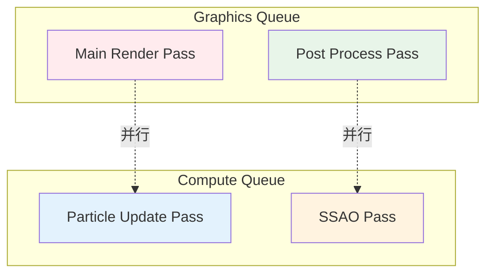

# MonsterEngine RDG 系统开发文档 - 第4部分：性能优化和调试

## 目录

6. [性能优化](#6-性能优化)
7. [调试和问题排查](#7-调试和问题排查)
8. [未来规划](#8-未来规划)

---

## 6. 性能优化

### 6.1 Barrier 合并优化策略

**优化目标**: 减少 GPU 管线停顿，提高并行度

#### 6.1.1 同类型 Barrier 合并

**问题**: 多个资源的相同状态转换会产生多次 `vkCmdPipelineBarrier` 调用

```cpp
// Before optimization: 3 separate barrier calls
Barrier(TextureA, Unknown -> SRVGraphics)
Barrier(TextureB, Unknown -> SRVGraphics)
Barrier(TextureC, Unknown -> SRVGraphics)

// After optimization: 1 barrier call with 3 image barriers
vkCmdPipelineBarrier(
    cmdBuffer,
    VK_PIPELINE_STAGE_TOP_OF_PIPE_BIT,
    VK_PIPELINE_STAGE_FRAGMENT_SHADER_BIT,
    0,
    0, nullptr,
    0, nullptr,
    3, imageBarriers  // 3 image barriers in one call
);
```

**实现方案**:

```cpp
void FRDGBuilder::_executeTransitions(
    RHI::IRHICommandList& rhiCmdList, 
    const TArray<FRDGTransition>& transitions)
{
    if (transitions.Num() == 0) return;
    
    // Group transitions by stage flags
    struct FBarrierBatch
    {
        VkPipelineStageFlags srcStage;
        VkPipelineStageFlags dstStage;
        TArray<VkImageMemoryBarrier> imageBarriers;
        TArray<VkBufferMemoryBarrier> bufferBarriers;
    };
    
    TMap<uint64, FBarrierBatch> batches;
    
    for (const FRDGTransition& transition : transitions)
    {
        // Calculate stage flags
        VkPipelineStageFlags srcStage = getVulkanStageFlags(transition.stateBefore);
        VkPipelineStageFlags dstStage = getVulkanStageFlags(transition.stateAfter);
        
        // Create batch key
        uint64 batchKey = ((uint64)srcStage << 32) | (uint64)dstStage;
        
        FBarrierBatch& batch = batches.FindOrAdd(batchKey);
        batch.srcStage = srcStage;
        batch.dstStage = dstStage;
        
        // Add barrier to batch
        if (transition.bIsTexture)
        {
            VkImageMemoryBarrier barrier = /* ... */;
            batch.imageBarriers.Add(barrier);
        }
        else
        {
            VkBufferMemoryBarrier barrier = /* ... */;
            batch.bufferBarriers.Add(barrier);
        }
    }
    
    // Execute batched barriers
    for (const auto& pair : batches)
    {
        const FBarrierBatch& batch = pair.Value;
        
        vkCmdPipelineBarrier(
            cmdBuffer,
            batch.srcStage,
            batch.dstStage,
            0,
            0, nullptr,
            batch.bufferBarriers.Num(), batch.bufferBarriers.GetData(),
            batch.imageBarriers.Num(), batch.imageBarriers.GetData()
        );
    }
}
```

#### 6.1.2 Split Barrier 优化

**原理**: 将 barrier 分为 begin 和 end 两部分，允许 GPU 在等待期间执行其他工作


**实现方案** (待实现):

```cpp
// Begin barrier early
rhiCmdList.beginBarrier(texture, RTV, SRVGraphics);

// Do independent work
executeIndependentPasses();

// End barrier when needed
rhiCmdList.endBarrier(texture, RTV, SRVGraphics);
```

#### 6.1.3 Barrier 消除优化

**策略**: 分析资源访问模式，消除不必要的 barrier

```cpp
// Example: Multiple read-only accesses don't need barriers
Pass1: Read Texture (SRVGraphics)
Pass2: Read Texture (SRVGraphics)  // No barrier needed
Pass3: Read Texture (SRVGraphics)  // No barrier needed
```

**实现逻辑**:

```cpp
bool FRDGSubresourceState::isTransitionRequired(
    const FRDGSubresourceState& previous, 
    const FRDGSubresourceState& next)
{
    // No transition if states match
    if (previous.access == next.access)
        return false;
    
    // Multiple read-only states can coexist
    bool prevReadOnly = isReadOnlyAccess(previous.access);
    bool nextReadOnly = isReadOnlyAccess(next.access);
    
    if (prevReadOnly && nextReadOnly)
        return false;  // No barrier needed
    
    // Transition required for write access
    return true;
}
```

### 6.2 资源别名和池化

#### 6.2.1 资源别名 (Aliasing)

**目标**: 多个瞬态资源共享同一块 GPU 内存

```mermaid
gantt
    title 资源别名示例
    dateFormat X
    axisFormat %s
    
    section Memory Block
    TempTexture1 :active, 0, 2
    TempTexture2 :active, 2, 4
    TempTexture3 :active, 4, 6
```



**实现方案**:

```cpp
class FRDGResourceAllocator
{
public:
    TSharedPtr<RHI::IRHITexture> allocateTexture(
        const FRDGTextureDesc& desc,
        FRDGPassHandle firstUse,
        FRDGPassHandle lastUse)
    {
        // Find existing texture that can be aliased
        for (auto& entry : m_allocatedTextures)
        {
            // Check if lifetime doesn't overlap
            if (entry.lastUse < firstUse || entry.firstUse > lastUse)
            {
                // Check if descriptor matches
                if (isCompatible(entry.desc, desc))
                {
                    // Reuse this texture
                    entry.firstUse = firstUse;
                    entry.lastUse = lastUse;
                    return entry.texture;
                }
            }
        }
        
        // Allocate new texture
        TSharedPtr<RHI::IRHITexture> texture = m_device->createTexture(desc);
        m_allocatedTextures.Add({desc, texture, firstUse, lastUse});
        return texture;
    }
    
private:
    struct FAllocatedTexture
    {
        FRDGTextureDesc desc;
        TSharedPtr<RHI::IRHITexture> texture;
        FRDGPassHandle firstUse;
        FRDGPassHandle lastUse;
    };
    
    TArray<FAllocatedTexture> m_allocatedTextures;
};
```

#### 6.2.2 资源池化

**目标**: 跨帧复用资源，减少分配开销

```cpp
class FRDGResourcePool
{
public:
    TSharedPtr<RHI::IRHITexture> allocateTexture(const FRDGTextureDesc& desc)
    {
        uint64 hash = hashDescriptor(desc);
        
        // Try to get from pool
        TArray<TSharedPtr<RHI::IRHITexture>>* pool = m_texturePool.Find(hash);
        if (pool && pool->Num() > 0)
        {
            TSharedPtr<RHI::IRHITexture> texture = (*pool)[0];
            pool->RemoveAt(0);
            return texture;
        }
        
        // Allocate new texture
        return m_device->createTexture(desc);
    }
    
    void releaseTexture(const FRDGTextureDesc& desc, TSharedPtr<RHI::IRHITexture> texture)
    {
        uint64 hash = hashDescriptor(desc);
        TArray<TSharedPtr<RHI::IRHITexture>>& pool = m_texturePool.FindOrAdd(hash);
        pool.Add(texture);
    }
    
    void trim()
    {
        // Remove unused textures after N frames
        for (auto& pair : m_texturePool)
        {
            pair.Value.RemoveAll([](const TSharedPtr<RHI::IRHITexture>& tex) {
                return tex.GetSharedReferenceCount() == 1;
            });
        }
    }
    
private:
    TMap<uint64, TArray<TSharedPtr<RHI::IRHITexture>>> m_texturePool;
};
```

### 6.3 并行 Pass 执行 (预留)

**目标**: 利用异步计算队列并行执行独立的 Pass



**实现方案**:

```cpp
// Mark pass as async compute
graphBuilder.addPass(
    "ParticleUpdate",
    ERDGPassFlags::AsyncCompute,  // Use async compute queue
    [&](FRDGPassBuilder& builder) {
        builder.writeBuffer(particleBuffer, ERHIAccess::UAVCompute);
    },
    [=](RHI::IRHICommandList& cmdList) {
        // Compute shader execution
    }
);
```

### 6.4 内存预算管理

**目标**: 控制 GPU 内存使用，避免 OOM

```cpp
class FRDGMemoryBudget
{
public:
    bool canAllocate(uint64 size) const
    {
        return m_usedMemory + size <= m_budgetMemory;
    }
    
    void trackAllocation(uint64 size)
    {
        m_usedMemory += size;
        m_peakMemory = FMath::Max(m_peakMemory, m_usedMemory);
    }
    
    void trackDeallocation(uint64 size)
    {
        m_usedMemory -= size;
    }
    
    void logStatistics() const
    {
        MR_LOG(LogRDG, Log, "Memory Budget: %llu MB / %llu MB (Peak: %llu MB)",
               m_usedMemory / (1024 * 1024),
               m_budgetMemory / (1024 * 1024),
               m_peakMemory / (1024 * 1024));
    }
    
private:
    uint64 m_budgetMemory = 512 * 1024 * 1024;  // 512 MB
    uint64 m_usedMemory = 0;
    uint64 m_peakMemory = 0;
};
```

### 6.5 性能统计

**实现方案**:

```cpp
struct FRDGStatistics
{
    int32 numPasses = 0;
    int32 numTextures = 0;
    int32 numBuffers = 0;
    int32 numTransitions = 0;
    int32 numBarriers = 0;
    
    uint64 totalTextureMemory = 0;
    uint64 totalBufferMemory = 0;
    
    float32 compileTimeMs = 0.0f;
    float32 executeTimeMs = 0.0f;
    
    void log() const
    {
        MR_LOG(LogRDG, Log, "=== RDG Statistics ===");
        MR_LOG(LogRDG, Log, "Passes: %d", numPasses);
        MR_LOG(LogRDG, Log, "Textures: %d (%llu MB)", 
               numTextures, totalTextureMemory / (1024 * 1024));
        MR_LOG(LogRDG, Log, "Buffers: %d (%llu MB)", 
               numBuffers, totalBufferMemory / (1024 * 1024));
        MR_LOG(LogRDG, Log, "Transitions: %d", numTransitions);
        MR_LOG(LogRDG, Log, "Barriers: %d", numBarriers);
        MR_LOG(LogRDG, Log, "Compile Time: %.2f ms", compileTimeMs);
        MR_LOG(LogRDG, Log, "Execute Time: %.2f ms", executeTimeMs);
    }
};
```

---

## 7. 调试和问题排查

### 7.1 日志系统使用

#### 7.1.1 日志级别

MonsterEngine 使用 UE5 风格的日志系统：

```cpp
// Log levels
MR_LOG(LogRDG, VeryVerbose, "Detailed debug info");
MR_LOG(LogRDG, Verbose, "Debug info");
MR_LOG(LogRDG, Log, "Normal info");
MR_LOG(LogRDG, Warning, "Warning message");
MR_LOG(LogRDG, Error, "Error message");
MR_LOG(LogRDG, Fatal, "Fatal error");
```

#### 7.1.2 关键日志点

**Phase 2: 依赖图构建**:
```cpp
MR_LOG(LogRDG, Log, "Building dependency graph for %d passes", m_passes.Num());
MR_LOG(LogRDG, VeryVerbose, "RAW: Pass '%s' depends on '%s'", passA, passB);
MR_LOG(LogRDG, Log, "Built dependency graph with %d dependencies", totalDeps);
```

**Phase 3: 状态转换**:
```cpp
MR_LOG(LogRDG, Verbose, "Inserting resource transitions");
MR_LOG(LogRDG, VeryVerbose, "Transition: %s (state %d -> %d)", 
       resourceName, stateBefore, stateAfter);
```

**Phase 4: 执行**:
```cpp
MR_LOG(LogRDG, Verbose, "Executing pass: %s", passName);
MR_LOG(LogRDG, VeryVerbose, "Executing %d transitions before pass", numTransitions);
```

#### 7.1.3 日志文件位置

```
E:\MonsterEngine\log\MonsterEngine.log
```

### 7.2 RenderDoc 集成

#### 7.2.1 捕获帧

**命令行捕获**:

```powershell
& "C:\Program Files\RenderDoc\renderdoccmd.exe" capture `
    --working-dir "E:\MonsterEngine" `
    "E:\MonsterEngine\x64\Debug\MonsterEngine.exe" `
    --cube-scene 2>&1
```

**程序内捕获**:

```cpp
#include <renderdoc_app.h>

RENDERDOC_API_1_1_2* rdoc_api = nullptr;

// Initialize RenderDoc API
void initRenderDoc()
{
    if (HMODULE mod = GetModuleHandleA("renderdoc.dll"))
    {
        pRENDERDOC_GetAPI RENDERDOC_GetAPI = 
            (pRENDERDOC_GetAPI)GetProcAddress(mod, "RENDERDOC_GetAPI");
        
        RENDERDOC_GetAPI(eRENDERDOC_API_Version_1_1_2, (void**)&rdoc_api);
    }
}

// Capture frame
void captureFrame()
{
    if (rdoc_api)
    {
        rdoc_api->StartFrameCapture(nullptr, nullptr);
        
        // Render frame
        renderFrame();
        
        rdoc_api->EndFrameCapture(nullptr, nullptr);
    }
}
```

#### 7.2.2 验证 Barrier

在 RenderDoc 中验证 barrier 是否正确：

1. 打开 Event Browser
2. 查找 `vkCmdPipelineBarrier` 事件
3. 检查 Pipeline Barrier 参数：
   - Source Stage
   - Destination Stage
   - Image Memory Barriers
   - Buffer Memory Barriers

**正确的 Barrier 示例**:

```
vkCmdPipelineBarrier
├─ srcStageMask: VK_PIPELINE_STAGE_COLOR_ATTACHMENT_OUTPUT_BIT
├─ dstStageMask: VK_PIPELINE_STAGE_FRAGMENT_SHADER_BIT
└─ imageMemoryBarriers[0]
   ├─ srcAccessMask: VK_ACCESS_COLOR_ATTACHMENT_WRITE_BIT
   ├─ dstAccessMask: VK_ACCESS_SHADER_READ_BIT
   ├─ oldLayout: VK_IMAGE_LAYOUT_COLOR_ATTACHMENT_OPTIMAL
   └─ newLayout: VK_IMAGE_LAYOUT_SHADER_READ_ONLY_OPTIMAL
```

### 7.3 常见问题和解决方案

#### 7.3.1 Vulkan 验证错误

**问题 1**: `vkCmdDraw(): This call must be issued inside an active render pass`

**原因**: 在没有激活渲染通道的情况下调用绘制命令

**解决方案**:
```cpp
// Ensure render pass is active before draw
if (bIsRasterPass)
{
    _setupRenderTargets(rhiCmdList, pass);  // This begins render pass
}

pass->execute(rhiCmdList);  // Draw commands here

if (bIsRasterPass)
{
    rhiCmdList.endRenderPass();  // End render pass
}
```

**问题 2**: `Image layout mismatch`

**原因**: 资源的实际布局与期望布局不匹配

**解决方案**:
```cpp
// Ensure barrier is executed before use
_executeTransitions(rhiCmdList, transitions);

// Verify layout in barrier
barrier.oldLayout = getVulkanImageLayout(stateBefore);
barrier.newLayout = getVulkanImageLayout(stateAfter);
```

**问题 3**: `Descriptor set binding mismatch`

**原因**: 描述符集布局与着色器不匹配

**解决方案**:
```cpp
// Ensure descriptor set is updated before binding
rhiCmdList.updateDescriptorSet(descriptorSet, bindings);
rhiCmdList.bindDescriptorSet(descriptorSet);
```

#### 7.3.2 依赖图环检测

**问题**: 渲染图中存在循环依赖

**检测方法**:
```cpp
if (m_sortedPasses.Num() != m_passes.Num())
{
    MR_LOG(LogRDG, Error, "Cycle detected in render graph!");
    
    // Log unprocessed passes
    for (FRDGPass* pass : m_passes)
    {
        if (!m_sortedPasses.Contains(pass))
        {
            MR_LOG(LogRDG, Error, "  Unprocessed pass: '%s'", *pass->getName());
        }
    }
}
```

**解决方案**:
- 检查资源访问声明是否正确
- 避免 Pass 之间的循环依赖
- 使用不同的资源打破循环

#### 7.3.3 内存泄漏

**检测工具**:
- Visual Studio Memory Profiler
- Valgrind (Linux)
- Dr. Memory (Windows)

**常见原因**:
1. 忘记释放 RDG 资源
2. 智能指针循环引用
3. RHI 资源未正确销毁

**解决方案**:
```cpp
// Use RAII and smart pointers
TSharedPtr<RHI::IRHITexture> texture = MakeShared<RHI::IRHITexture>();

// Avoid circular references
TWeakPtr<FRDGPass> weakPass = pass;

// Properly cleanup in destructor
FRDGBuilder::~FRDGBuilder()
{
    for (FRDGPass* pass : m_passes)
    {
        delete pass;
    }
    m_passes.Empty();
}
```

### 7.4 Vulkan 验证层配置

**启用验证层**:

```cpp
// In VulkanDevice initialization
const char* validationLayers[] = {
    "VK_LAYER_KHRONOS_validation"
};

VkInstanceCreateInfo createInfo = {};
createInfo.enabledLayerCount = 1;
createInfo.ppEnabledLayerNames = validationLayers;
```

**验证层配置文件** (`vk_layer_settings.txt`):

```ini
# Enable all validation features
khronos_validation.enables = VK_VALIDATION_FEATURE_ENABLE_BEST_PRACTICES_EXT
khronos_validation.enables = VK_VALIDATION_FEATURE_ENABLE_SYNCHRONIZATION_VALIDATION_EXT

# Report all messages
khronos_validation.report_flags = error,warn,perf,info

# Log to file
khronos_validation.log_filename = vulkan_validation.log
```

### 7.5 性能分析工具

#### 7.5.1 GPU Profiler

**Vulkan 时间戳查询**:

```cpp
// Begin timestamp query
vkCmdWriteTimestamp(cmdBuffer, VK_PIPELINE_STAGE_TOP_OF_PIPE_BIT, queryPool, 0);

// Execute pass
pass->execute(cmdList);

// End timestamp query
vkCmdWriteTimestamp(cmdBuffer, VK_PIPELINE_STAGE_BOTTOM_OF_PIPE_BIT, queryPool, 1);

// Get results
uint64 timestamps[2];
vkGetQueryPoolResults(device, queryPool, 0, 2, sizeof(timestamps), timestamps, 
                      sizeof(uint64), VK_QUERY_RESULT_64_BIT);

float32 timeMs = (timestamps[1] - timestamps[0]) * timestampPeriod / 1000000.0f;
MR_LOG(LogRDG, Log, "Pass '%s' took %.2f ms", passName, timeMs);
```

#### 7.5.2 CPU Profiler

**使用 Tracy Profiler**:

```cpp
#include <tracy/Tracy.hpp>

void FRDGBuilder::execute(RHI::IRHICommandList& rhiCmdList)
{
    ZoneScoped;  // Tracy profiler zone
    
    {
        ZoneScopedN("Phase 2: Build Dependency Graph");
        _buildDependencyGraph();
    }
    
    {
        ZoneScopedN("Phase 3: Analyze Lifetimes");
        _analyzeResourceLifetimes();
    }
    
    {
        ZoneScopedN("Phase 4: Execute Passes");
        for (FRDGPass* pass : m_sortedPasses)
        {
            ZoneScopedN(pass->getName().c_str());
            _executePass(rhiCmdList, pass);
        }
    }
}
```

---

## 8. 未来规划

### 8.1 短期目标 (1-2 个月)

#### 8.1.1 完善 OpenGL 支持

**任务**:
- 实现 OpenGL 状态管理
- 添加 OpenGL barrier 等价物
- 测试跨平台兼容性

**实现方案**:

```cpp
// OpenGL doesn't have explicit barriers
// Use glMemoryBarrier for compute/image operations
void FOpenGLRHICommandList::transitionResource(
    TSharedPtr<RHI::IRHIResource> resource,
    RHI::EResourceUsage oldUsage,
    RHI::EResourceUsage newUsage)
{
    ERHIAccess newAccess = static_cast<ERHIAccess>(newUsage);
    
    GLbitfield barriers = 0;
    
    if (enumHasAnyFlags(newAccess, ERHIAccess::UAVGraphics | ERHIAccess::UAVCompute))
        barriers |= GL_SHADER_IMAGE_ACCESS_BARRIER_BIT;
    
    if (enumHasAnyFlags(newAccess, ERHIAccess::RTV))
        barriers |= GL_FRAMEBUFFER_BARRIER_BIT;
    
    if (enumHasAnyFlags(newAccess, ERHIAccess::SRVGraphics | ERHIAccess::SRVCompute))
        barriers |= GL_TEXTURE_FETCH_BARRIER_BIT;
    
    if (barriers != 0)
    {
        glMemoryBarrier(barriers);
    }
}
```

#### 8.1.2 Barrier 合并优化

**任务**:
- 实现同类型 barrier 批处理
- 添加 barrier 消除优化
- 性能测试和对比

#### 8.1.3 调试运行时问题

**任务**:
- 修复 RDG 渲染路径的崩溃问题
- 验证资源状态转换正确性
- 确保程序稳定运行

### 8.2 中期目标 (3-6 个月)

#### 8.2.1 资源池和别名优化

**任务**:
- 实现资源池管理器
- 添加资源别名支持
- 实现跨帧资源复用

#### 8.2.2 异步计算支持

**任务**:
- 实现异步计算队列管理
- 添加队列同步机制
- 支持并行 Pass 执行

#### 8.2.3 移动平台支持

**任务**:
- 添加 Android Vulkan 支持
- 添加 iOS Metal 支持
- 优化移动平台性能

### 8.3 长期目标 (6-12 个月)

#### 8.3.1 高级渲染特性

**任务**:
- Variable Rate Shading (VRS)
- Mesh Shaders
- Ray Tracing 集成

#### 8.3.2 多 GPU 支持

**任务**:
- 实现 AFR (Alternate Frame Rendering)
- 添加 SFR (Split Frame Rendering)
- 支持 mGPU 资源共享

#### 8.3.3 编辑器集成

**任务**:
- RDG 可视化编辑器
- 实时性能分析工具
- 资源依赖图可视化

### 8.4 性能目标

| 指标 | 当前 | 目标 |
|------|------|------|
| Pass 执行开销 | ~0.5ms | <0.1ms |
| Barrier 数量 | 未优化 | 减少 50% |
| 内存使用 | 未优化 | 减少 30% |
| 编译时间 | ~1ms | <0.5ms |

### 8.5 代码质量目标

- **单元测试覆盖率**: 80%+
- **文档完整性**: 100%
- **代码审查**: 所有 PR 必须审查
- **性能回归测试**: 自动化测试

---

## 9. 参考资料

### 9.1 UE5 源码参考

- `Engine/Source/Runtime/RenderCore/Public/RenderGraphDefinitions.h`
- `Engine/Source/Runtime/RenderCore/Public/RenderGraphBuilder.h`
- `Engine/Source/Runtime/RenderCore/Private/RenderGraphBuilder.cpp`
- `Engine/Source/Runtime/VulkanRHI/Private/VulkanBarriers.cpp`

### 9.2 相关文档

- [Vulkan Specification](https://www.khronos.org/registry/vulkan/)
- [UE5 Render Dependency Graph](https://docs.unrealengine.com/5.0/en-US/render-dependency-graph-in-unreal-engine/)
- [GPU Synchronization](https://www.khronos.org/blog/understanding-vulkan-synchronization)

### 9.3 项目文件

- 项目路径: `E:\MonsterEngine`
- UE5 源码: `E:\UnrealEngine`
- 开发文档: `E:\MonsterEngine\devDocument\`

---

## 附录 A: 术语表

| 术语 | 说明 |
|------|------|
| RDG | Render Dependency Graph，渲染依赖图 |
| Pass | 渲染通道，一个独立的渲染操作 |
| Barrier | 资源屏障，用于同步 GPU 操作 |
| RAW | Read After Write，写后读依赖 |
| WAR | Write After Read，读后写依赖 |
| WAW | Write After Write，写后写依赖 |
| SRV | Shader Resource View，着色器资源视图 |
| UAV | Unordered Access View，无序访问视图 |
| RTV | Render Target View，渲染目标视图 |
| DSV | Depth Stencil View，深度模板视图 |

## 附录 B: 快速参考

### 常用 API

```cpp
// Create builder
FRDGBuilder builder(device, "GraphName");

// Create texture
FRDGTextureRef tex = builder.createTexture("Name", desc);

// Register external
FRDGTextureRef ext = builder.registerExternalTexture("Name", rhiTex, state);

// Add pass
builder.addPass("PassName", flags, setupLambda, executeLambda);

// Execute
builder.execute(cmdList);
```

### 常用日志

```cpp
MR_LOG(LogRDG, Log, "Message");
MR_LOG(LogRDG, Warning, "Warning");
MR_LOG(LogRDG, Error, "Error");
```

### 编译命令

```powershell
# Build
& "E:\Program Files\Microsoft Visual Studio\2022\Community\MSBuild\Current\Bin\MSBuild.exe" `
  MonsterEngine.sln /t:Build /p:Configuration=Debug /p:Platform=x64

# Run
.\x64\Debug\MonsterEngine.exe --cube-scene
```

---

**文档完成**

本文档涵盖了 MonsterEngine RDG 系统的完整设计和实现细节。如有问题或建议，请参考项目文档或联系开发团队。
