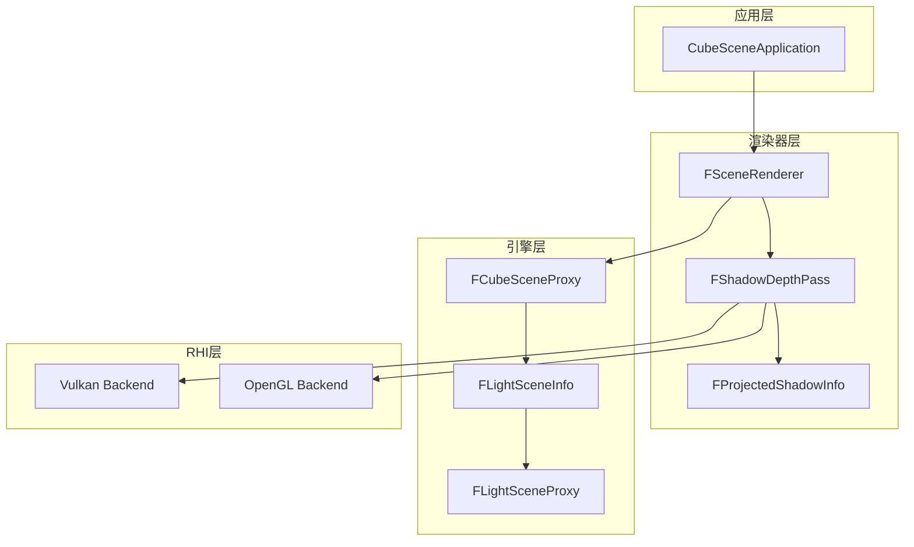
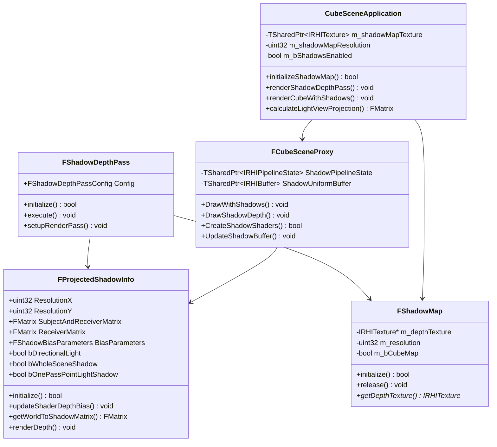
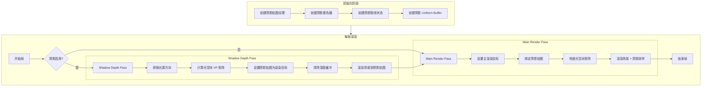
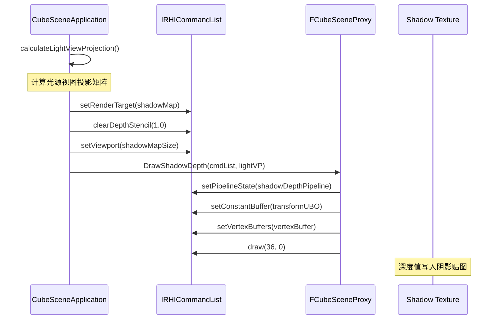
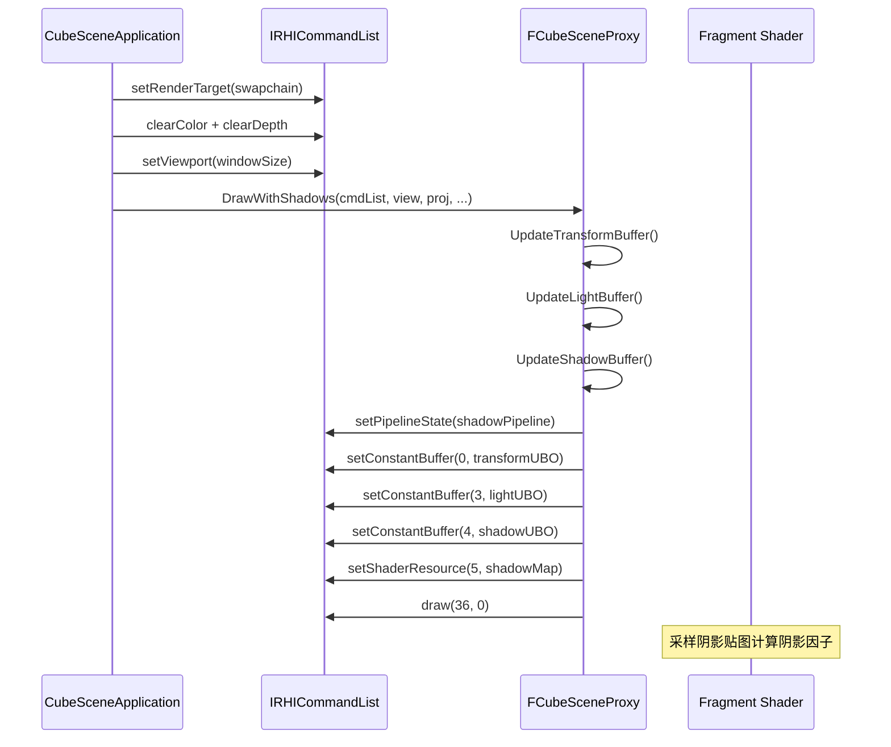
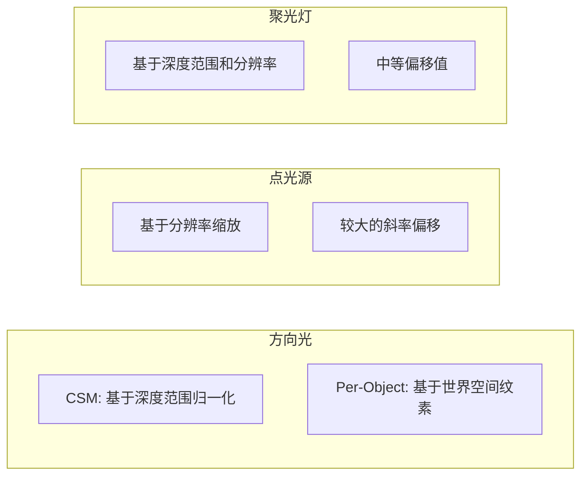
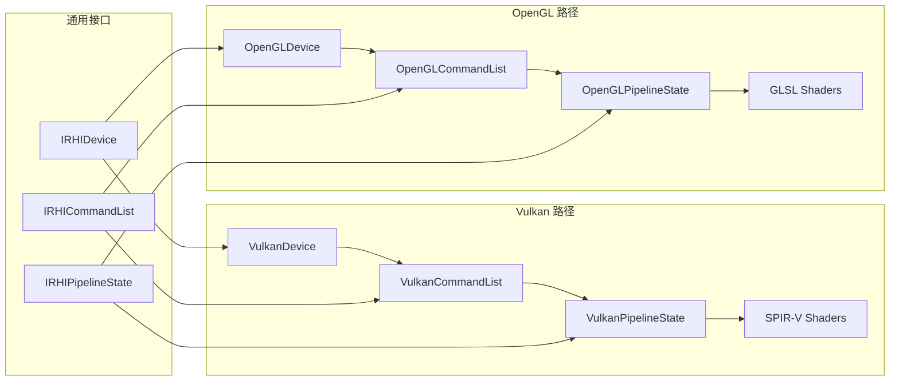

# MonsterEngine 阴影贴图渲染系统开发文档

> **版本**: 1.0  
> **日期**: 2024年12月  
> **参考**: UE5 ShadowRendering.cpp, ShadowDepthRendering.cpp

---

## 目录

1. [概述](#1-概述)
2. [开发阶段概览](#2-开发阶段概览)
3. [系统架构](#3-系统架构)
4. [核心类和文件](#4-核心类和文件)
5. [阴影渲染流程](#5-阴影渲染流程)
6. [深度偏移计算](#6-深度偏移计算)
7. [阴影参数配置](#7-阴影参数配置)
8. [跨平台实现](#8-跨平台实现)
9. [集成示例](#9-集成示例)
10. [调试和优化](#10-调试和优化)
11. [常见问题](#11-常见问题)

---

## 1. 概述

### 1.1 阴影贴图技术原理

阴影贴图（Shadow Mapping）是一种两遍渲染技术：

1. **Shadow Depth Pass**: 从光源视角渲染场景，将深度值存储到阴影贴图
2. **Main Render Pass**: 从相机视角渲染场景，采样阴影贴图判断像素是否在阴影中

```
┌─────────────────────────────────────────────────────────────────┐
│                    阴影贴图技术原理                              │
├─────────────────────────────────────────────────────────────────┤
│                                                                 │
│   Pass 1: Shadow Depth                Pass 2: Main Render       │
│   ┌─────────────┐                     ┌─────────────┐          │
│   │   Light     │                     │   Camera    │          │
│   │   ☀️        │                     │   📷        │          │
│   └──────┬──────┘                     └──────┬──────┘          │
│          │                                   │                  │
│          ▼                                   ▼                  │
│   ┌─────────────┐                     ┌─────────────┐          │
│   │   Scene     │                     │   Scene     │          │
│   │   Depth     │ ──────────────────▶ │   + Shadow  │          │
│   └─────────────┘    Shadow Map       └─────────────┘          │
│                                                                 │
└─────────────────────────────────────────────────────────────────┘
```

### 1.2 MonsterEngine 阴影系统架构

MonsterEngine 的阴影系统严格参考 UE5 设计，采用分层架构：



### 1.3 支持的光源类型

| 光源类型 | 阴影贴图类型 | 投影方式 | 状态 |
|---------|-------------|---------|------|
| **方向光 (Directional)** | 2D 深度贴图 | 正交投影 | ✅ 已实现 |
| **点光源 (Point)** | 立方体贴图 | 透视投影 | 🔄 预留 |
| **聚光灯 (Spot)** | 2D 深度贴图 | 透视投影 | 🔄 预留 |

---

## 2. 开发阶段概览

| Phase | 内容 | 状态 |
|-------|------|------|
| **Phase 1-7** | 基础渲染架构搭建（Scene、Actor、Component、SceneProxy、光照系统） | ✅ |
| **Phase 8** | CSM 级联阴影架构设计（预留） | 🔄 |
| **Phase 9** | 阴影渲染基础类 `FShadowDepthPass`、`FProjectedShadowInfo` | ✅ |
| **Phase 10** | 阴影深度着色器 `ShadowDepth.vert/frag` | ✅ |
| **Phase 11** | `FCubeSceneProxy` 阴影绘制方法 `DrawWithShadows()` | ✅ |
| **Phase 12** | 阴影 Uniform Buffer 结构和着色器 `CubeLitShadow.vert/frag` | ✅ |
| **Phase 13** | `FProjectedShadowInfo::updateShaderDepthBias()` 深度偏移计算 | ✅ |
| **Phase 14** | 阴影管线状态和资源绑定 | ✅ |
| **Phase 15** | `CubeSceneApplication` 阴影渲染集成（Vulkan） | ✅ |
| **Phase 16** | OpenGL 阴影渲染支持，跨平台一致性 | ✅ |

---

## 3. 系统架构

### 3.1 类图 (UML)



### 3.2 文件结构

```
MonsterEngine/
├── Include/
│   ├── Renderer/
│   │   ├── ShadowRendering.h          # 阴影渲染核心类定义
│   │   └── ShadowDepthPass.h          # 阴影深度 Pass 定义
│   ├── Engine/
│   │   └── Proxies/
│   │       └── CubeSceneProxy.h       # Cube 代理（含阴影支持）
│   └── CubeSceneApplication.h         # 应用程序（阴影集成）
│
├── Source/
│   ├── Renderer/
│   │   ├── ShadowRendering.cpp        # 阴影渲染实现
│   │   └── ShadowDepthPass.cpp        # 阴影深度 Pass 实现
│   ├── Engine/
│   │   └── Proxies/
│   │       └── CubeSceneProxy.cpp     # Cube 代理实现
│   └── CubeSceneApplication.cpp       # 应用程序实现
│
└── Shaders/
    ├── ShadowDepth.vert               # 阴影深度顶点着色器
    ├── ShadowDepth.frag               # 阴影深度片段着色器
    ├── CubeLitShadow.vert             # 带阴影光照顶点着色器 (Vulkan)
    ├── CubeLitShadow.frag             # 带阴影光照片段着色器 (Vulkan)
    ├── CubeLitShadow_GL.vert          # OpenGL 版本
    └── CubeLitShadow_GL.frag          # OpenGL 版本
```

---

## 4. 核心类和文件

### 4.1 FProjectedShadowInfo

阴影投影信息类，包含视图矩阵、投影矩阵、深度偏移计算。

**文件**: `Include/Renderer/ShadowRendering.h`

```cpp
/**
 * @class FProjectedShadowInfo
 * @brief Complete shadow projection information
 * 
 * Reference: UE5 FProjectedShadowInfo
 */
class FProjectedShadowInfo
{
public:
    // Shadow map resolution
    uint32 ResolutionX;
    uint32 ResolutionY;
    
    // Shadow matrices
    FMatrix SubjectAndReceiverMatrix;  // World to shadow space
    FMatrix ReceiverMatrix;            // For receiver depth bias
    
    // Depth range
    float MaxSubjectZ;
    float MinSubjectZ;
    
    // Shadow bounds (sphere)
    FVector4 ShadowBounds;  // xyz = center, w = radius
    
    // Bias parameters
    FShadowBiasParameters BiasParameters;
    
    // Light type flags
    bool bDirectionalLight;
    bool bWholeSceneShadow;
    bool bOnePassPointLightShadow;
    bool bPreShadow;
    
    // Core methods
    bool initialize(IRHIDevice* device, const FShadowInitializer& initializer);
    void updateShaderDepthBias();
    FMatrix getWorldToShadowMatrix(const FVector4& ShadowmapMinMax) const;
    void renderDepth(IRHICommandList* cmdList, FSceneRenderer* sceneRenderer);
};
```

### 4.2 FShadowDepthPass

阴影深度 Pass 管理类。

**文件**: `Include/Renderer/ShadowDepthPass.h`

```cpp
/**
 * @struct FShadowDepthPassUniformParameters
 * @brief Uniform buffer data for shadow depth pass
 */
struct FShadowDepthPassUniformParameters
{
    FMatrix LightViewMatrix;           // World to light view space
    FMatrix LightProjectionMatrix;     // Light view to clip space
    FMatrix LightViewProjectionMatrix; // Combined VP matrix
    FVector4f LightPosition;           // w = 1 for point/spot, w = 0 for directional
    FVector4f LightDirection;          // Normalized direction
    float DepthBias;
    float SlopeScaledBias;
    float NormalOffsetBias;
    float ShadowDistance;
    float InvMaxSubjectDepth;
    float bClampToNearPlane;
    float Padding[2];
};

/**
 * @class FShadowDepthPass
 * @brief Shadow depth rendering pass
 */
class FShadowDepthPass : public FRenderPass
{
public:
    bool initialize(IRHIDevice* device, const FShadowDepthPassConfig& config);
    void execute(IRHICommandList* cmdList, FProjectedShadowInfo* shadowInfo);
    void setupRenderPass(IRHICommandList* cmdList, IRHITexture* depthTarget);
};
```

### 4.3 FCubeSceneProxy 阴影支持

**文件**: `Include/Engine/Proxies/CubeSceneProxy.h`

```cpp
/**
 * Shadow uniform buffer for cube rendering
 */
struct alignas(16) FCubeShadowUniformBuffer
{
    float LightViewProjection[16];  // Light space VP matrix
    float ShadowParams[4];          // x = bias, y = slope bias, z = normal bias, w = shadow distance
    float ShadowMapSize[4];         // xy = size, zw = 1/size
};

class FCubeSceneProxy : public FPrimitiveSceneProxy
{
public:
    // Shadow rendering methods
    void DrawWithShadows(
        IRHICommandList* CmdList,
        const FMatrix& ViewMatrix,
        const FMatrix& ProjectionMatrix,
        const FVector& CameraPosition,
        const TArray<FLightSceneInfo*>& AffectingLights,
        const FMatrix& LightViewProjection,
        TSharedPtr<IRHITexture> ShadowMap,
        const FVector4& ShadowParams);
    
    void DrawShadowDepth(
        IRHICommandList* CmdList,
        const FMatrix& LightViewProjection);

protected:
    bool CreateShadowShaders();
    bool CreateShadowPipelineState();
    void UpdateShadowBuffer(
        const FMatrix& LightViewProjection,
        const FVector4& ShadowParams,
        uint32 ShadowMapWidth,
        uint32 ShadowMapHeight);

private:
    // Shadow resources
    TSharedPtr<IRHIVertexShader> ShadowVertexShader;
    TSharedPtr<IRHIPixelShader> ShadowPixelShader;
    TSharedPtr<IRHIPipelineState> ShadowPipelineState;
    TSharedPtr<IRHIBuffer> ShadowUniformBuffer;
    TSharedPtr<IRHISampler> ShadowSampler;
};
```

### 4.4 着色器文件

#### CubeLitShadow.frag (Vulkan)

**文件**: `Shaders/CubeLitShadow.frag`

```glsl
#version 450

// Shadow Quality: 1=Hard, 2=2x2 PCF, 3=3x3 PCF, 4=5x5 PCF
#ifndef SHADOW_QUALITY
#define SHADOW_QUALITY 3
#endif

// Uniform Buffers
layout(set = 0, binding = 0) uniform TransformUBO { ... } transform;
layout(set = 0, binding = 3) uniform LightingUBO { ... } lighting;
layout(set = 0, binding = 4) uniform ShadowUBO {
    mat4 lightViewProjection;
    vec4 shadowParams;      // x = bias, y = slope bias, z = normal bias, w = shadow distance
    vec4 shadowMapSize;     // xy = size, zw = 1/size
} shadow;

// Textures
layout(set = 1, binding = 2) uniform sampler2D shadowMap;

// Shadow sampling functions
float shadowCompare(vec2 uv, float compareDepth) {
    float shadowDepth = texture(shadowMap, uv).r;
    float bias = shadow.shadowParams.x;
    return (compareDepth - bias <= shadowDepth) ? 1.0 : 0.0;
}

// PCF soft shadow
float pcf3x3(vec2 uv, float compareDepth) {
    vec2 texelSize = shadow.shadowMapSize.zw;
    float result = 0.0;
    for (int x = -1; x <= 1; ++x) {
        for (int y = -1; y <= 1; ++y) {
            result += shadowCompare(uv + vec2(x, y) * texelSize, compareDepth);
        }
    }
    return result / 9.0;
}

// Calculate shadow factor
float calculateShadow(vec4 shadowCoord) {
    // Perspective divide
    vec3 projCoords = shadowCoord.xyz / shadowCoord.w;
    projCoords = projCoords * 0.5 + 0.5;  // Transform to [0,1]
    
    // Check bounds
    if (projCoords.x < 0.0 || projCoords.x > 1.0 ||
        projCoords.y < 0.0 || projCoords.y > 1.0 ||
        projCoords.z < 0.0 || projCoords.z > 1.0) {
        return 1.0;  // Outside shadow map
    }
    
    return pcf3x3(projCoords.xy, projCoords.z);
}
```

---

## 5. 阴影渲染流程

### 5.1 整体流程图



### 5.2 Shadow Depth Pass 详细流程



### 5.3 Main Render Pass 详细流程



---

## 6. 深度偏移计算

### 6.1 偏移类型

阴影渲染中需要处理三种偏移来避免阴影瑕疵：

| 偏移类型 | 作用 | 典型值 |
|---------|------|--------|
| **常量深度偏移 (Depth Bias)** | 防止自阴影（阴影痤疮） | 0.0005 - 0.005 |
| **斜率深度偏移 (Slope Bias)** | 根据表面角度调整偏移 | 1.0 - 3.0 |
| **法线偏移 (Normal Bias)** | 沿法线方向偏移接收面 | 0.01 - 0.05 |

### 6.2 偏移计算代码

**文件**: `Source/Renderer/ShadowRendering.cpp`

```cpp
void FProjectedShadowInfo::updateShaderDepthBias()
{
    float DepthBias = 0.0f;
    float SlopeScaleDepthBias = 1.0f;
    
    // Get resolution for bias scaling
    float MaxResolution = static_cast<float>(FMath::Max(ResolutionX, ResolutionY));
    if (MaxResolution < 1.0f) MaxResolution = 1.0f;
    
    // Get depth range for normalization
    float DepthRange = MaxSubjectZ - MinSubjectZ;
    if (DepthRange < 0.0001f) DepthRange = 1.0f;
    
    // Calculate world space texel scale
    float WorldSpaceTexelScale = ShadowBounds.W / MaxResolution;
    
    if (bOnePassPointLightShadow)
    {
        // Point light shadows
        const float PointLightDepthBiasConstant = 0.02f;
        const float PointLightSlopeBiasConstant = 3.0f;
        
        DepthBias = PointLightDepthBiasConstant * 512.0f / MaxResolution;
        DepthBias *= 2.0f * BiasParameters.ConstantDepthBias;
        
        SlopeScaleDepthBias = PointLightSlopeBiasConstant;
        SlopeScaleDepthBias *= BiasParameters.SlopeScaledDepthBias;
    }
    else if (bDirectionalLight && bWholeSceneShadow)
    {
        // CSM directional light
        const float CSMDepthBiasConstant = 10.0f;
        const float CSMSlopeBiasConstant = 3.0f;
        
        DepthBias = CSMDepthBiasConstant / DepthRange;
        DepthBias = FMath::Lerp(DepthBias, DepthBias * WorldSpaceTexelScale, 0.8f);
        DepthBias *= BiasParameters.ConstantDepthBias;
        
        SlopeScaleDepthBias = CSMSlopeBiasConstant * BiasParameters.SlopeScaledDepthBias;
    }
    else if (bDirectionalLight)
    {
        // Per-object directional shadow
        const float PerObjectDirDepthBias = 10.0f;
        
        DepthBias = PerObjectDirDepthBias / DepthRange;
        DepthBias *= WorldSpaceTexelScale * 0.5f * BiasParameters.ConstantDepthBias;
    }
    else
    {
        // Spot light shadows
        const float SpotLightDepthBiasConstant = 5.0f;
        
        DepthBias = SpotLightDepthBiasConstant * 512.0f / (DepthRange * MaxResolution);
        DepthBias *= 2.0f * BiasParameters.ConstantDepthBias;
    }
    
    // Clamp and store
    m_shaderDepthBias = FMath::Clamp(DepthBias, 0.0f, 0.1f);
    m_shaderSlopeDepthBias = FMath::Max(SlopeScaleDepthBias, 0.0f);
}
```

### 6.3 不同光源类型的偏移策略



---

## 7. 阴影参数配置

### 7.1 CubeSceneApplication 阴影参数

**文件**: `Include/CubeSceneApplication.h`

```cpp
class CubeSceneApplication
{
private:
    // Shadow mapping resources
    TSharedPtr<RHI::IRHITexture> m_shadowMapTexture;
    
    // Shadow parameters
    uint32 m_shadowMapResolution = 1024;    // Shadow map resolution
    float m_shadowDepthBias = 0.005f;       // Constant depth bias
    float m_shadowSlopeBias = 0.01f;        // Slope-scaled bias
    float m_shadowNormalBias = 0.02f;       // Normal offset bias
    float m_shadowDistance = 50.0f;         // Maximum shadow distance
    bool m_bShadowsEnabled = true;          // Enable/disable shadows
};
```

### 7.2 参数说明

| 参数 | 类型 | 默认值 | 说明 |
|------|------|--------|------|
| `m_shadowMapResolution` | uint32 | 1024 | 阴影贴图分辨率（像素） |
| `m_shadowDepthBias` | float | 0.005 | 常量深度偏移，防止阴影痤疮 |
| `m_shadowSlopeBias` | float | 0.01 | 斜率偏移，根据表面角度调整 |
| `m_shadowNormalBias` | float | 0.02 | 法线偏移，沿法线方向偏移 |
| `m_shadowDistance` | float | 50.0 | 最大阴影距离 |
| `m_bShadowsEnabled` | bool | true | 是否启用阴影 |

### 7.3 阴影质量等级

着色器中定义的阴影质量等级：

```glsl
// Shadow Quality Configuration
// 1 = Hard shadows (no filtering)
// 2 = 2x2 PCF
// 3 = 3x3 PCF (default)
// 4 = 5x5 PCF

#ifndef SHADOW_QUALITY
#define SHADOW_QUALITY 3
#endif
```

| 质量等级 | 采样次数 | 性能影响 | 效果 |
|---------|---------|---------|------|
| 1 | 1 | 最低 | 硬阴影，锯齿明显 |
| 2 | 4 | 低 | 轻微软化 |
| 3 | 9 | 中等 | 较好的软阴影 |
| 4 | 25 | 较高 | 高质量软阴影 |

---

## 8. 跨平台实现

### 8.1 Vulkan vs OpenGL 差异

| 特性 | Vulkan | OpenGL |
|------|--------|--------|
| **着色器语言** | GLSL 450 + SPIR-V | GLSL 330 core |
| **坐标系** | Y 轴向下，Z 范围 [0,1] | Y 轴向上，Z 范围 [-1,1] |
| **Uniform Buffer** | Descriptor Set | Uniform Block |
| **纹理绑定** | set/binding | location |

### 8.2 着色器版本差异

**Vulkan (CubeLitShadow.frag)**:
```glsl
#version 450

layout(set = 0, binding = 4) uniform ShadowUBO {
    mat4 lightViewProjection;
    vec4 shadowParams;
    vec4 shadowMapSize;
} shadow;

layout(set = 1, binding = 2) uniform sampler2D shadowMap;
```

**OpenGL (CubeLitShadow_GL.frag)**:
```glsl
#version 330 core

uniform mat4 lightViewProjection;
uniform vec4 shadowParams;
uniform vec4 shadowMapSize;

uniform sampler2D shadowMap;
```

### 8.3 坐标系处理

```cpp
// Vulkan: Y-flip for viewport
if (backend == RHI::ERHIBackend::Vulkan)
{
    // Vulkan uses top-left origin, flip Y
    viewport.y = viewport.height;
    viewport.height = -viewport.height;
}

// Shadow coordinate transform in shader
vec3 projCoords = shadowCoord.xyz / shadowCoord.w;
projCoords = projCoords * 0.5 + 0.5;  // [-1,1] -> [0,1]
```

### 8.4 渲染路径对比



---

## 9. 集成示例

### 9.1 初始化阴影贴图

**文件**: `Source/CubeSceneApplication.cpp`

```cpp
bool CubeSceneApplication::initializeShadowMap()
{
    MR_LOG(LogCubeSceneApp, Log, "Initializing shadow map (resolution: %u)", m_shadowMapResolution);
    
    if (!m_device)
    {
        MR_LOG(LogCubeSceneApp, Error, "Cannot initialize shadow map: no device");
        return false;
    }
    
    // Create shadow map depth texture
    RHI::TextureDesc shadowMapDesc;
    shadowMapDesc.width = m_shadowMapResolution;
    shadowMapDesc.height = m_shadowMapResolution;
    shadowMapDesc.depth = 1;
    shadowMapDesc.mipLevels = 1;
    shadowMapDesc.arraySize = 1;
    shadowMapDesc.format = RHI::EPixelFormat::D32_FLOAT;
    shadowMapDesc.usage = RHI::EResourceUsage::DepthStencil | RHI::EResourceUsage::ShaderResource;
    shadowMapDesc.debugName = "ShadowMap";
    
    m_shadowMapTexture = m_device->createTexture(shadowMapDesc);
    if (!m_shadowMapTexture)
    {
        MR_LOG(LogCubeSceneApp, Error, "Failed to create shadow map texture");
        return false;
    }
    
    MR_LOG(LogCubeSceneApp, Log, "Shadow map initialized successfully");
    return true;
}
```

### 9.2 计算光源视图投影矩阵

```cpp
FMatrix CubeSceneApplication::calculateLightViewProjection(
    const FVector& lightDirection,
    float sceneBoundsRadius)
{
    // Normalize light direction
    FVector lightDir = lightDirection.GetSafeNormal();
    if (lightDir.IsNearlyZero())
    {
        lightDir = FVector(0.0, -1.0, 0.0);  // Default to down
    }
    
    // Calculate light position (far enough to encompass scene)
    float lightDistance = sceneBoundsRadius * 2.0f;
    FVector lightPos = -lightDir * lightDistance;
    
    // Calculate up vector (avoid parallel to light direction)
    FVector upVector = FVector(0.0, 1.0, 0.0);
    if (FMath::Abs(FVector::DotProduct(lightDir, upVector)) > 0.99f)
    {
        upVector = FVector(1.0, 0.0, 0.0);
    }
    
    // Create light view matrix
    FVector targetPos = FVector::ZeroVector;
    FMatrix lightViewMatrix = FMatrix::MakeLookAt(lightPos, targetPos, upVector);
    
    // Create orthographic projection for directional light
    float orthoSize = sceneBoundsRadius * 1.5f;
    float nearPlane = 0.1f;
    float farPlane = lightDistance * 2.0f;
    
    FMatrix lightProjectionMatrix = FMatrix::MakeOrtho(
        orthoSize * 2.0, orthoSize * 2.0, nearPlane, farPlane);
    
    return lightViewMatrix * lightProjectionMatrix;
}
```

### 9.3 渲染阴影深度 Pass

```cpp
void CubeSceneApplication::renderShadowDepthPass(
    RHI::IRHICommandList* cmdList,
    const FVector& lightDirection,
    FMatrix& outLightViewProjection)
{
    if (!cmdList || !m_shadowMapTexture || !m_cubeActor)
    {
        return;
    }
    
    // Calculate light view projection matrix
    float sceneBoundsRadius = 10.0f;
    outLightViewProjection = calculateLightViewProjection(lightDirection, sceneBoundsRadius);
    
    // Set shadow map as render target
    cmdList->setRenderTarget(nullptr, m_shadowMapTexture);
    
    // Clear depth buffer
    cmdList->clearDepthStencil(m_shadowMapTexture, 1.0f, 0);
    
    // Set viewport to shadow map size
    RHI::Viewport shadowViewport;
    shadowViewport.x = 0.0f;
    shadowViewport.y = 0.0f;
    shadowViewport.width = static_cast<float>(m_shadowMapResolution);
    shadowViewport.height = static_cast<float>(m_shadowMapResolution);
    shadowViewport.minDepth = 0.0f;
    shadowViewport.maxDepth = 1.0f;
    cmdList->setViewport(shadowViewport);
    
    // Render cube to shadow map
    UCubeMeshComponent* cubeMesh = m_cubeActor->GetCubeMeshComponent();
    if (cubeMesh)
    {
        FCubeSceneProxy* cubeProxy = dynamic_cast<FCubeSceneProxy*>(cubeMesh->GetSceneProxy());
        if (cubeProxy)
        {
            cubeProxy->DrawShadowDepth(cmdList, outLightViewProjection);
        }
    }
}
```

### 9.4 渲染带阴影的主 Pass

```cpp
void CubeSceneApplication::renderCubeWithShadows(
    RHI::IRHICommandList* cmdList,
    const FMatrix& viewMatrix,
    const FMatrix& projectionMatrix,
    const FVector& cameraPosition,
    const TArray<FLightSceneInfo*>& lights,
    const FMatrix& lightViewProjection)
{
    if (!cmdList || !m_cubeActor)
    {
        return;
    }
    
    UCubeMeshComponent* cubeMesh = m_cubeActor->GetCubeMeshComponent();
    if (!cubeMesh)
    {
        return;
    }
    
    FCubeSceneProxy* cubeProxy = dynamic_cast<FCubeSceneProxy*>(cubeMesh->GetSceneProxy());
    if (!cubeProxy)
    {
        return;
    }
    
    // Prepare shadow parameters
    FVector4 shadowParams(
        m_shadowDepthBias,
        m_shadowSlopeBias,
        m_shadowNormalBias,
        m_shadowDistance
    );
    
    // Draw cube with shadows
    cubeProxy->DrawWithShadows(
        cmdList,
        viewMatrix,
        projectionMatrix,
        cameraPosition,
        lights,
        lightViewProjection,
        m_shadowMapTexture,
        shadowParams
    );
}
```

### 9.5 完整渲染循环 (Vulkan)

```cpp
void CubeSceneApplication::onRender()
{
    // ... camera and light setup ...
    
    if (backend == RHI::ERHIBackend::Vulkan)
    {
        auto* vulkanDevice = static_cast<RHI::Vulkan::VulkanDevice*>(m_device);
        RHI::IRHICommandList* cmdList = m_device->getImmediateCommandList();
        
        cmdList->begin();
        
        // ================================================================
        // Shadow Depth Pass
        // ================================================================
        FMatrix lightViewProjection = FMatrix::Identity;
        
        if (m_bShadowsEnabled && m_shadowMapTexture && lights.Num() > 0)
        {
            FVector lightDirection = FVector(0.5, -1.0, 0.3).GetSafeNormal();
            
            if (lights[0] && lights[0]->Proxy && lights[0]->Proxy->IsDirectionalLight())
            {
                lightDirection = lights[0]->Proxy->GetDirection();
            }
            
            renderShadowDepthPass(cmdList, lightDirection, lightViewProjection);
        }
        
        // ================================================================
        // Main Render Pass
        // ================================================================
        cmdList->setRenderTarget(swapchainColor, swapchainDepth);
        cmdList->clearColor(swapchainColor, clearColor);
        cmdList->clearDepthStencil(swapchainDepth, 1.0f, 0);
        cmdList->setViewport(mainViewport);
        
        if (m_bShadowsEnabled && m_shadowMapTexture)
        {
            renderCubeWithShadows(cmdList, viewMatrix, projectionMatrix, 
                                  cameraPosition, lights, lightViewProjection);
        }
        else
        {
            renderCube(cmdList, viewMatrix, projectionMatrix, cameraPosition, lights);
        }
        
        cmdList->end();
        vulkanDevice->executeCommandLists({cmdList});
        vulkanDevice->present();
    }
}
```

---

## 10. 调试和优化

### 10.1 阴影贴图可视化

可以通过将阴影贴图渲染到屏幕上来调试：

```cpp
// Debug: Render shadow map to screen quad
void CubeSceneApplication::debugRenderShadowMap(RHI::IRHICommandList* cmdList)
{
    // Bind shadow map as texture
    cmdList->setShaderResource(0, m_shadowMapTexture);
    
    // Use simple quad shader to display depth
    cmdList->setPipelineState(m_debugQuadPipeline);
    cmdList->draw(6, 0);  // Full screen quad
}
```

### 10.2 常见问题和解决方案

#### 阴影痤疮 (Shadow Acne)

**现象**: 表面出现条纹状阴影瑕疵

**原因**: 深度精度不足导致自阴影

**解决方案**:
```cpp
// 增加深度偏移
m_shadowDepthBias = 0.005f;  // 增大此值
m_shadowSlopeBias = 0.01f;   // 增大此值
```

#### Peter Panning

**现象**: 阴影与物体分离，悬浮在空中

**原因**: 深度偏移过大

**解决方案**:
```cpp
// 减小深度偏移，使用法线偏移代替
m_shadowDepthBias = 0.001f;  // 减小
m_shadowNormalBias = 0.02f;  // 使用法线偏移
```

#### 阴影边缘锯齿

**现象**: 阴影边缘呈锯齿状

**原因**: 阴影贴图分辨率不足或未使用软阴影

**解决方案**:
```cpp
// 增加分辨率
m_shadowMapResolution = 2048;

// 或使用更高质量的 PCF
#define SHADOW_QUALITY 4  // 5x5 PCF
```

### 10.3 性能优化建议

| 优化项 | 方法 | 效果 |
|-------|------|------|
| **分辨率** | 根据场景大小动态调整 | 减少 GPU 带宽 |
| **剔除** | 阴影视锥剔除 | 减少绘制调用 |
| **缓存** | 静态物体阴影缓存 | 减少重复渲染 |
| **LOD** | 远距离使用低质量阴影 | 平衡质量和性能 |
| **级联** | CSM 级联阴影 | 优化大场景阴影 |

### 10.4 性能指标

| 指标 | 目标值 | 测量方法 |
|------|--------|---------|
| Shadow Pass 耗时 | < 2ms | GPU 计时器 |
| 阴影贴图内存 | < 16MB | 1024x1024 D32 = 4MB |
| 采样开销 | < 1ms | 片段着色器分析 |

---

## 11. 常见问题

### Q1: 为什么阴影只在 Vulkan 下工作？

**A**: 确保 OpenGL 路径也调用了 `renderShadowDepthPass()` 和 `renderCubeWithShadows()`。参考 Phase 16 的实现。

### Q2: 如何支持多光源阴影？

**A**: 需要为每个光源创建独立的阴影贴图，或使用阴影贴图图集（Shadow Atlas）。这是 Phase 18 的内容。

### Q3: 如何实现点光源阴影？

**A**: 点光源需要使用立方体阴影贴图（Cube Shadow Map），从 6 个方向渲染。这是 Phase 20 的内容。

### Q4: CSM 级联阴影如何实现？

**A**: CSM 将视锥体分割为多个级联，每个级联使用不同分辨率的阴影贴图。这是 Phase 8 的内容。

---

## 参考资料

- **UE5 源码**: `Engine/Source/Runtime/Renderer/Private/ShadowRendering.cpp`
- **UE5 源码**: `Engine/Source/Runtime/Renderer/Private/ShadowDepthRendering.cpp`
- **MonsterEngine 源码**: `E:\MonsterEngine`
- **GPU Gems**: Chapter 11 - Shadow Map Antialiasing
- **Real-Time Rendering 4th Edition**: Chapter 7 - Shadows

---

> **文档维护**: MonsterEngine 开发团队  
> **最后更新**: 2024年12月
