# MonsterEngine 智能指针系统开发文档

## 目录

1. [概述](#概述)
2. [架构设计](#架构设计)
3. [文件结构](#文件结构)
4. [核心组件详解](#核心组件详解)
5. [使用指南](#使用指南)
6. [UML类图](#uml类图)
7. [代码流程图](#代码流程图)
8. [最佳实践](#最佳实践)
9. [性能优化](#性能优化)

---

## 概述

MonsterEngine 智能指针系统是参考 UE5（Unreal Engine 5）的 `SharedPointer` 实现设计的现代 C++ 智能指针库。该系统提供了类型安全、线程安全可选的引用计数智能指针，用于自动管理动态分配对象的生命周期。

### 核心特性

- **TSharedRef**: 非空共享引用，保证始终指向有效对象
- **TSharedPtr**: 可空共享指针，类似 `std::shared_ptr`
- **TWeakPtr**: 弱指针，不阻止对象销毁
- **TUniquePtr**: 独占所有权指针，类似 `std::unique_ptr`
- **TSharedFromThis**: 从 `this` 获取共享指针的混入类
- **可选线程安全**: 通过 `ESPMode` 选择线程安全或非线程安全模式
- **内存池支持**: 高频分配场景的性能优化

---

## 架构设计

### 整体架构图

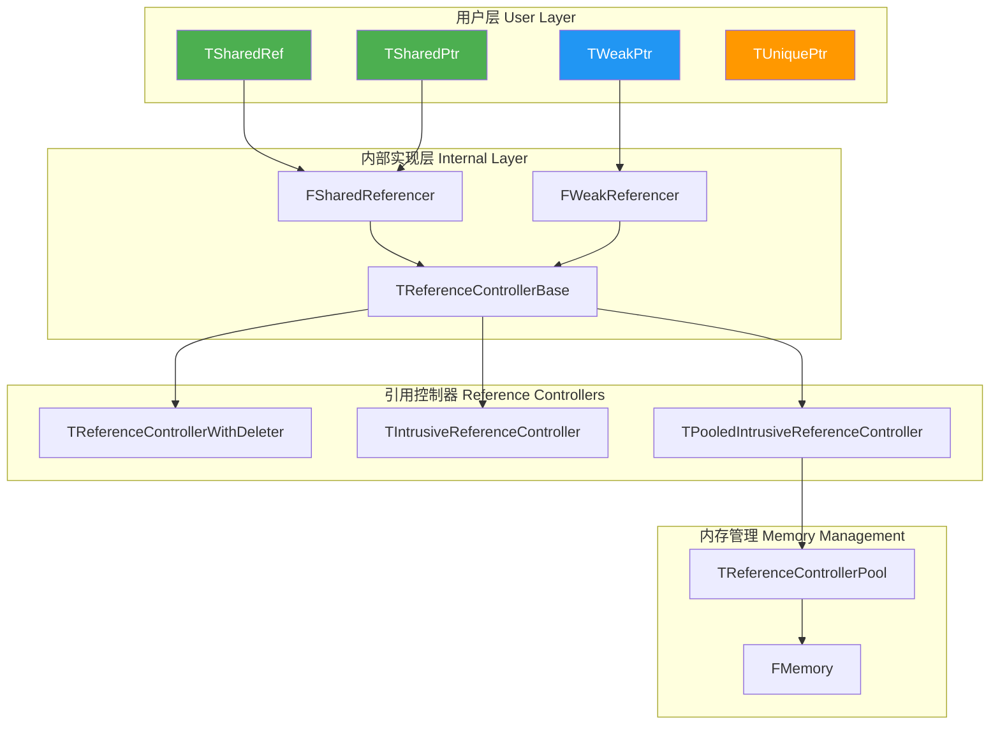

### 设计原则

1. **引用计数分离**: 共享计数控制对象生命周期，弱计数控制控制器生命周期
2. **线程安全可选**: 通过模板参数选择原子操作或普通操作
3. **零开销抽象**: 使用空基类优化（EBO）存储删除器
4. **单次分配优化**: `MakeShared` 将对象和控制器分配在同一内存块

---

## 文件结构

```
Include/Core/Templates/
├── SharedPointerFwd.h        # 前向声明和ESPMode枚举
├── SharedPointerInternals.h  # 内部实现（引用控制器、内存池）
├── SharedPointer.h           # 主要智能指针类
└── UniquePtr.h               # 独占所有权指针
```

### 文件依赖关系

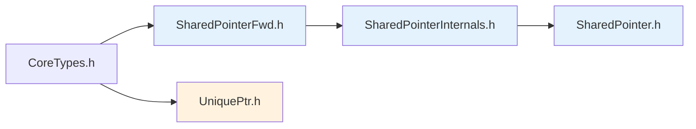

---

## 核心组件详解

### 1. ESPMode 枚举（线程安全模式）

**文件**: `SharedPointerFwd.h`

```cpp
enum class ESPMode : uint8
{
    /** 非线程安全模式 - 更快但不支持多线程访问 */
    NotThreadSafe = 0,

    /** 线程安全模式 - 使用原子操作，支持多线程访问 */
    ThreadSafe = 1
};
```

**类型别名**:

```cpp
// 线程安全版本 (TS = Thread Safe)
template<class T> using TSharedRefTS = TSharedRef<T, ESPMode::ThreadSafe>;
template<class T> using TSharedPtrTS = TSharedPtr<T, ESPMode::ThreadSafe>;
template<class T> using TWeakPtrTS = TWeakPtr<T, ESPMode::ThreadSafe>;

// 非线程安全版本 (NTS = Not Thread Safe)
template<class T> using TSharedRefNTS = TSharedRef<T, ESPMode::NotThreadSafe>;
template<class T> using TSharedPtrNTS = TSharedPtr<T, ESPMode::NotThreadSafe>;
template<class T> using TWeakPtrNTS = TWeakPtr<T, ESPMode::NotThreadSafe>;
```

---

### 2. TReferenceControllerBase（引用计数基类）

**文件**: `SharedPointerInternals.h`

这是所有引用控制器的基类，管理共享计数和弱计数。

```cpp
template<ESPMode Mode>
class TReferenceControllerBase
{
    // 根据线程安全模式选择原子或普通int32
    using RefCountType = std::conditional_t<
        Mode == ESPMode::ThreadSafe, 
        std::atomic<int32>, 
        int32
    >;

public:
    // 纯虚函数 - 销毁管理的对象
    virtual void DestroyObject() = 0;

    // 获取共享引用计数
    int32 GetSharedReferenceCount() const;
    
    // 检查是否唯一引用
    bool IsUnique() const;
    
    // 增加共享引用
    void AddSharedReference();
    
    // 条件增加共享引用（用于弱指针提升）
    bool ConditionallyAddSharedReference();
    
    // 释放共享引用
    void ReleaseSharedReference();
    
    // 增加/释放弱引用
    void AddWeakReference();
    void ReleaseWeakReference();

private:
    RefCountType SharedReferenceCount{1};  // 共享计数，初始为1
    RefCountType WeakReferenceCount{1};    // 弱计数，初始为1
};
```

**引用计数规则**:

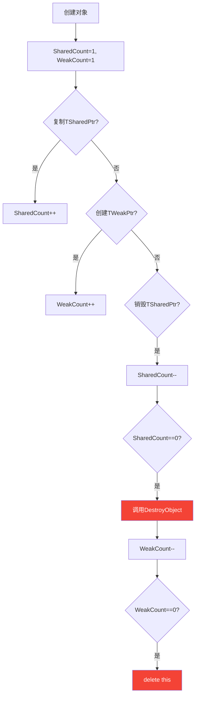

---

### 3. TReferenceControllerWithDeleter（自定义删除器支持）

**文件**: `SharedPointerInternals.h`

支持自定义删除器的引用控制器，使用空基类优化存储删除器。

```cpp
template<typename ObjectType, typename DeleterType, ESPMode Mode>
class TReferenceControllerWithDeleter 
    : private TDeleterHolder<DeleterType>  // EBO优化
    , public TReferenceControllerBase<Mode>
{
public:
    explicit TReferenceControllerWithDeleter(ObjectType* InObject, DeleterType&& InDeleter)
        : TDeleterHolder<DeleterType>(std::move(InDeleter))
        , Object(InObject)
    {
    }

    virtual void DestroyObject() override
    {
        this->InvokeDeleter(Object);  // 调用自定义删除器
    }

private:
    ObjectType* Object;
};
```

---

### 4. TIntrusiveReferenceController（MakeShared优化）

**文件**: `SharedPointerInternals.h`

将对象存储在控制器内部，实现单次内存分配。

```cpp
template<typename ObjectType, ESPMode Mode>
class TIntrusiveReferenceController : public TReferenceControllerBase<Mode>
{
public:
    template<typename... ArgTypes>
    explicit TIntrusiveReferenceController(ArgTypes&&... Args)
    {
        // 在内部存储空间原地构造对象
        new (GetObjectPtr()) ObjectType(std::forward<ArgTypes>(Args)...);
    }

    ObjectType* GetObjectPtr() const
    {
        return reinterpret_cast<ObjectType*>(const_cast<uint8*>(ObjectStorage));
    }

    virtual void DestroyObject() override
    {
        GetObjectPtr()->~ObjectType();  // 只调用析构函数，不释放内存
    }

private:
    alignas(ObjectType) uint8 ObjectStorage[sizeof(ObjectType)];  // 内联存储
};
```

**内存布局对比**:

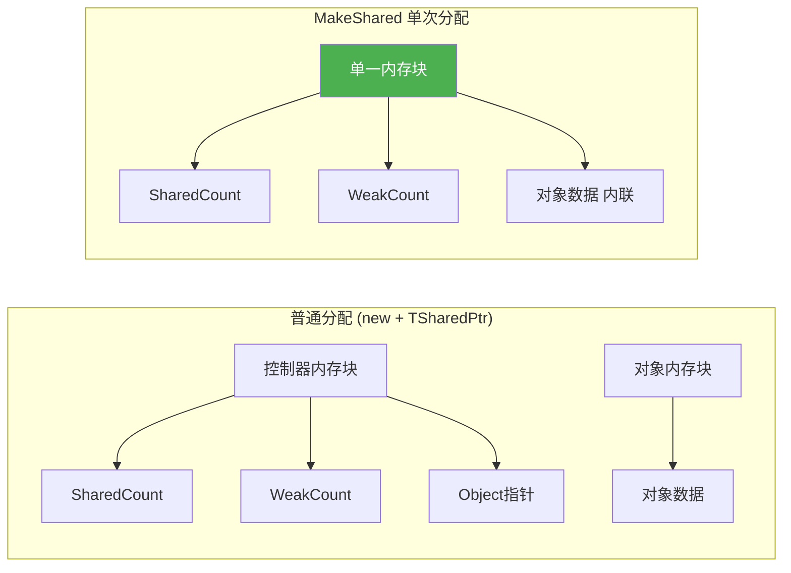

---

### 5. FSharedReferencer / FWeakReferencer（引用计数包装器）

**文件**: `SharedPointerInternals.h`

封装对引用控制器的操作，提供 RAII 语义。

```cpp
template<ESPMode Mode>
class FSharedReferencer
{
public:
    // 空构造
    FSharedReferencer() : ReferenceController(nullptr) {}
    
    // 从控制器构造
    explicit FSharedReferencer(TReferenceControllerBase<Mode>* InController)
        : ReferenceController(InController) {}
    
    // 复制构造 - 增加引用
    FSharedReferencer(const FSharedReferencer& Other)
        : ReferenceController(Other.ReferenceController)
    {
        if (ReferenceController) ReferenceController->AddSharedReference();
    }
    
    // 析构 - 释放引用
    ~FSharedReferencer()
    {
        if (ReferenceController) ReferenceController->ReleaseSharedReference();
    }
    
    // 从弱引用构造（用于Pin操作）
    FSharedReferencer(const FWeakReferencer<Mode>& WeakRef)
        : ReferenceController(WeakRef.ReferenceController)
    {
        if (ReferenceController)
        {
            if (!ReferenceController->ConditionallyAddSharedReference())
                ReferenceController = nullptr;  // 对象已销毁
        }
    }

private:
    TReferenceControllerBase<Mode>* ReferenceController;
};
```

---

### 6. TRawPtrProxy（MakeShareable支持）

**文件**: `SharedPointerInternals.h`

用于将原始指针隐式转换为共享指针的代理结构。

```cpp
template<class ObjectType>
struct TRawPtrProxy
{
    ObjectType* Object;
    
    explicit TRawPtrProxy(ObjectType* InObject) : Object(InObject) {}
};

template<class ObjectType, typename DeleterType>
struct TRawPtrProxyWithDeleter
{
    ObjectType* Object;
    DeleterType Deleter;
    
    TRawPtrProxyWithDeleter(ObjectType* InObject, DeleterType&& InDeleter)
        : Object(InObject), Deleter(std::move(InDeleter)) {}
};
```

---

### 7. TSharedRef（非空共享引用）

**文件**: `SharedPointer.h`

保证始终指向有效对象的共享引用。

```cpp
template<class ObjectType, ESPMode Mode = ESPMode::ThreadSafe>
class TSharedRef
{
public:
    // 注意：没有默认构造函数！必须始终引用有效对象
    
    // 从原始指针构造
    template<typename OtherType>
    explicit TSharedRef(OtherType* InObject);
    
    // 从MakeShareable代理构造
    template<typename OtherType>
    TSharedRef(SharedPointerInternals::TRawPtrProxy<OtherType> const& Proxy);
    
    // 转换为TSharedPtr
    TSharedPtr<ObjectType, Mode> ToSharedPtr() const;
    
    // 转换为TWeakPtr
    TWeakPtr<ObjectType, Mode> ToWeakPtr() const;
    
    // 访问对象（返回引用，不是指针）
    ObjectType& Get() const { return *Object; }
    ObjectType& operator*() const { return *Object; }
    ObjectType* operator->() const { return Object; }
    
    // 引用计数查询
    int32 GetSharedReferenceCount() const;
    bool IsUnique() const;

private:
    ObjectType* Object;
    SharedPointerInternals::FSharedReferencer<Mode> SharedReferenceCount;
};
```

---

### 8. TSharedPtr（可空共享指针）

**文件**: `SharedPointer.h`

可以为空的共享指针，类似 `std::shared_ptr`。

```cpp
template<class ObjectType, ESPMode Mode = ESPMode::ThreadSafe>
class TSharedPtr
{
public:
    // 默认构造（空指针）
    TSharedPtr(nullptr_t = nullptr);
    
    // 从原始指针构造
    template<typename OtherType>
    explicit TSharedPtr(OtherType* InObject);
    
    // 从TSharedRef隐式转换
    template<typename OtherType>
    TSharedPtr(TSharedRef<OtherType, Mode> const& SharedRef);
    
    // 转换为TSharedRef（必须有效！）
    TSharedRef<ObjectType, Mode> ToSharedRef() const;
    
    // 转换为TWeakPtr
    TWeakPtr<ObjectType, Mode> ToWeakPtr() const;
    
    // 访问对象
    ObjectType* Get() const { return Object; }
    ObjectType* get() const { return Object; }  // std兼容
    ObjectType& operator*() const { return *Object; }
    ObjectType* operator->() const { return Object; }
    
    // 有效性检查
    bool IsValid() const { return Object != nullptr; }
    explicit operator bool() const { return IsValid(); }
    
    // 重置
    void Reset();
    void reset();  // std兼容
    
    // 引用计数查询
    int32 GetSharedReferenceCount() const;
    bool IsUnique() const;

private:
    ObjectType* Object;
    SharedPointerInternals::FSharedReferencer<Mode> SharedReferenceCount;
};
```

---

### 9. TWeakPtr（弱指针）

**文件**: `SharedPointer.h`

不阻止对象销毁的观察指针。

```cpp
template<class ObjectType, ESPMode Mode = ESPMode::ThreadSafe>
class TWeakPtr
{
public:
    // 默认构造（空）
    TWeakPtr(nullptr_t = nullptr);
    
    // 从TSharedRef/TSharedPtr构造
    template<typename OtherType>
    TWeakPtr(TSharedRef<OtherType, Mode> const& SharedRef);
    
    template<typename OtherType>
    TWeakPtr(TSharedPtr<OtherType, Mode> const& SharedPtr);
    
    // 提升为TSharedPtr（可能失败）
    TSharedPtr<ObjectType, Mode> Pin() const;
    
    // 检查是否仍然有效
    bool IsValid() const;
    
    // 重置
    void Reset();

private:
    ObjectType* Object;
    SharedPointerInternals::FWeakReferencer<Mode> WeakReferenceCount;
};
```

**Pin操作流程**:

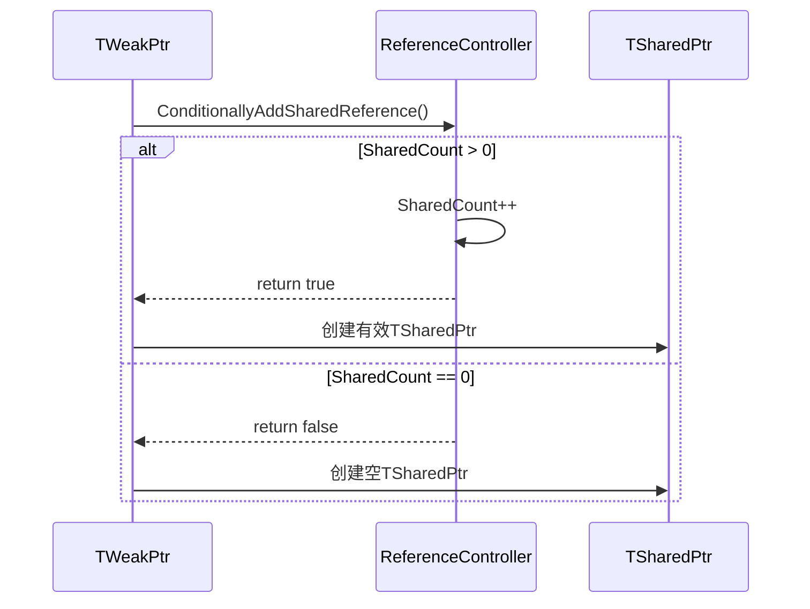

---

### 10. TSharedFromThis（从this获取共享指针）

**文件**: `SharedPointer.h`

允许对象获取指向自身的共享指针。

```cpp
template<class ObjectType, ESPMode Mode = ESPMode::ThreadSafe>
class TSharedFromThis
{
public:
    // 获取共享引用
    TSharedRef<ObjectType, Mode> AsShared();
    TSharedRef<ObjectType const, Mode> AsShared() const;
    
    // 获取弱指针
    TWeakPtr<ObjectType, Mode> AsWeak();
    TWeakPtr<ObjectType const, Mode> AsWeak() const;
    
    // 检查是否已被共享指针管理
    bool DoesSharedInstanceExist() const;

protected:
    TSharedFromThis() = default;
    
private:
    mutable TWeakPtr<ObjectType, Mode> WeakThis;
};
```

**使用示例**:

```cpp
class FMyClass : public TSharedFromThis<FMyClass>
{
public:
    void DoSomething()
    {
        // 获取指向自己的共享指针
        TSharedRef<FMyClass> Self = AsShared();
        
        // 传递给其他函数
        SomeFunction(Self);
    }
};

// 必须先通过共享指针创建
TSharedRef<FMyClass> Obj = MakeShared<FMyClass>();
Obj->DoSomething();  // 现在可以调用AsShared()
```

---

### 11. TUniquePtr（独占所有权指针）

**文件**: `UniquePtr.h`

独占所有权的智能指针，不可复制，只能移动。

```cpp
template<typename T, typename Deleter = TDefaultDelete<T>>
class TUniquePtr : private Deleter  // EBO优化
{
public:
    // 不可复制
    TUniquePtr(TUniquePtr const&) = delete;
    TUniquePtr& operator=(TUniquePtr const&) = delete;
    
    // 默认构造（空）
    TUniquePtr();
    TUniquePtr(nullptr_t);
    
    // 从原始指针构造
    template<typename U>
    explicit TUniquePtr(U* InPtr);
    
    // 移动构造/赋值
    TUniquePtr(TUniquePtr&& Other);
    TUniquePtr& operator=(TUniquePtr&& Other);
    
    // 析构时自动删除
    ~TUniquePtr();
    
    // 访问
    T* Get() const;
    T* get() const;  // std兼容
    T& operator*() const;
    T* operator->() const;
    
    // 有效性检查
    bool IsValid() const;
    explicit operator bool() const;
    
    // 释放所有权
    T* Release();
    T* release();  // std兼容
    
    // 重置
    void Reset(T* InPtr = nullptr);
    void reset(T* InPtr = nullptr);  // std兼容
    
    // 交换
    void Swap(TUniquePtr& Other);
    void swap(TUniquePtr& Other);  // std兼容
    
    // 获取删除器
    Deleter& GetDeleter();
    Deleter const& GetDeleter() const;

private:
    T* Ptr;
};
```

**数组特化**:

```cpp
template<typename T, typename Deleter>
class TUniquePtr<T[], Deleter>
{
    // 额外提供数组下标访问
    T& operator[](SIZE_T Index) const { return Ptr[Index]; }
};
```

---

### 12. 内存池支持

**文件**: `SharedPointerInternals.h`

为高频分配场景提供的内存池优化。

```cpp
template<typename ControllerType, ESPMode Mode>
class TReferenceControllerPool
{
public:
    static TReferenceControllerPool& Get();  // 单例访问
    
    void* Allocate();   // 从池分配
    void Free(void* Ptr);  // 归还到池
    
    int32 GetPooledCount() const;     // 池中空闲块数量
    int32 GetTotalAllocated() const;  // 总分配数量
    void SetMaxPoolSize(int32 Size);  // 设置池大小上限
    void Clear();  // 清空池

private:
    // Lock-free 空闲链表（线程安全模式）
    NodePtrType FreeList;
    std::atomic<int32> PooledCount;
    std::atomic<int32> TotalAllocated;
    int32 MaxPoolSize{1024};
};
```

**使用池化分配**:

```cpp
// 使用内存池创建共享指针
TSharedRef<FMyClass> Obj = MakeSharedPooled<FMyClass>(Args...);
```

---

## 使用指南

### 基本用法

#### 创建共享指针

```cpp
// 推荐：使用MakeShared（单次分配）
TSharedRef<FMyClass> Ref = MakeShared<FMyClass>(Arg1, Arg2);
TSharedPtr<FMyClass> Ptr = MakeShared<FMyClass>(Arg1, Arg2);

// 从原始指针创建
TSharedPtr<FMyClass> Ptr2(new FMyClass());

// 使用MakeShareable
TSharedPtr<FMyClass> Ptr3 = MakeShareable(new FMyClass());

// 带自定义删除器
TSharedPtr<FMyClass> Ptr4 = MakeShareable(new FMyClass(), 
    [](FMyClass* Obj) { 
        // 自定义清理逻辑
        delete Obj; 
    });
```

#### 访问对象

```cpp
TSharedPtr<FMyClass> Ptr = MakeShared<FMyClass>();

// 检查有效性
if (Ptr.IsValid())  // 或 if (Ptr)
{
    // 访问成员
    Ptr->DoSomething();
    
    // 获取引用
    FMyClass& Ref = *Ptr;
    
    // 获取原始指针
    FMyClass* Raw = Ptr.Get();
}
```

#### 弱指针使用

```cpp
TSharedPtr<FMyClass> Shared = MakeShared<FMyClass>();
TWeakPtr<FMyClass> Weak = Shared;

// 检查是否仍然有效
if (Weak.IsValid())
{
    // 提升为共享指针
    if (TSharedPtr<FMyClass> Pinned = Weak.Pin())
    {
        Pinned->DoSomething();
    }
}
```

#### 类型转换

```cpp
class FBase { virtual ~FBase() = default; };
class FDerived : public FBase {};

TSharedPtr<FDerived> Derived = MakeShared<FDerived>();

// 隐式向上转换
TSharedPtr<FBase> Base = Derived;

// 显式向下转换
TSharedPtr<FDerived> Derived2 = StaticCastSharedPtr<FDerived>(Base);

// const转换
TSharedPtr<const FBase> ConstBase = Base;
TSharedPtr<FBase> MutableBase = ConstCastSharedPtr<FBase>(ConstBase);
```

#### 独占指针使用

```cpp
// 创建
TUniquePtr<FMyClass> Ptr = MakeUnique<FMyClass>(Args...);

// 移动（不能复制）
TUniquePtr<FMyClass> Ptr2 = std::move(Ptr);
// Ptr 现在为空

// 释放所有权
FMyClass* Raw = Ptr2.Release();
// 现在需要手动管理 Raw

// 重置
Ptr2.Reset(new FMyClass());

// 数组
TUniquePtr<int32[]> Array = MakeUnique<int32[]>(100);
Array[0] = 42;
```

### 线程安全选择

```cpp
// 默认线程安全（多线程环境）
TSharedPtr<FMyClass> ThreadSafe = MakeShared<FMyClass>();

// 显式线程安全
TSharedPtr<FMyClass, ESPMode::ThreadSafe> Explicit = 
    MakeShared<FMyClass, ESPMode::ThreadSafe>();

// 非线程安全（单线程，性能更好）
TSharedPtr<FMyClass, ESPMode::NotThreadSafe> Fast = 
    MakeShared<FMyClass, ESPMode::NotThreadSafe>();

// 使用类型别名
TSharedPtrTS<FMyClass> Safe;   // ThreadSafe
TSharedPtrNTS<FMyClass> Fast2; // NotThreadSafe
```

---

## UML类图

### 智能指针类层次结构

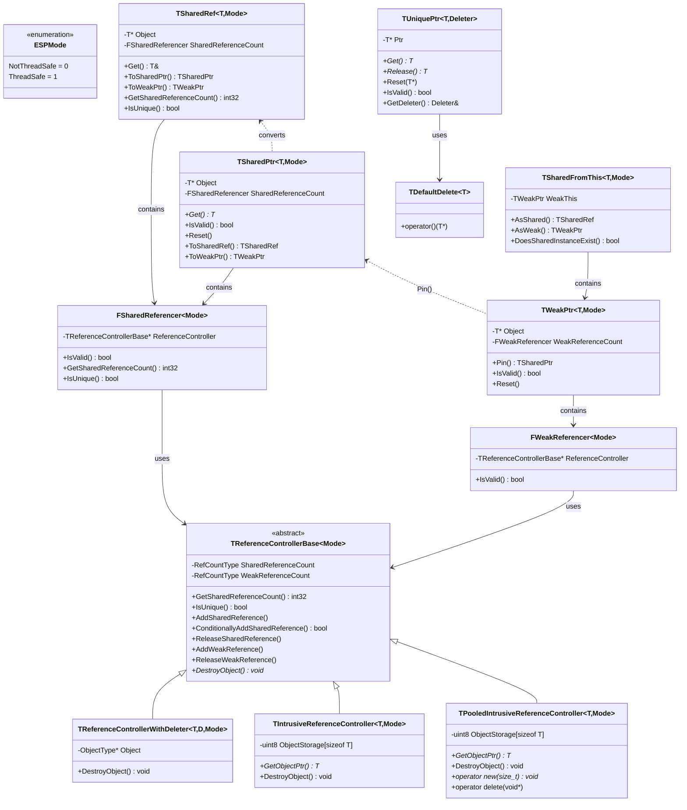

---

## 代码流程图

### MakeShared 创建流程

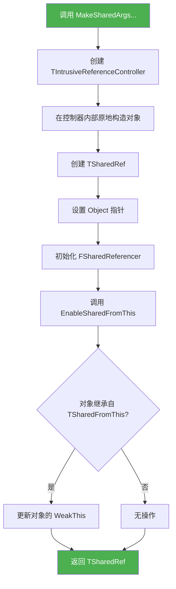

### TSharedPtr 复制流程

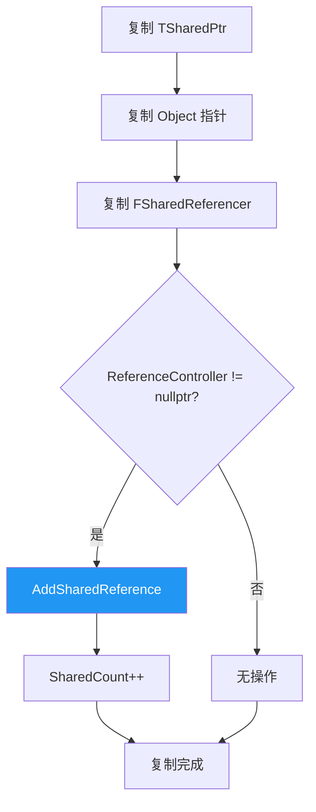

### TSharedPtr 析构流程

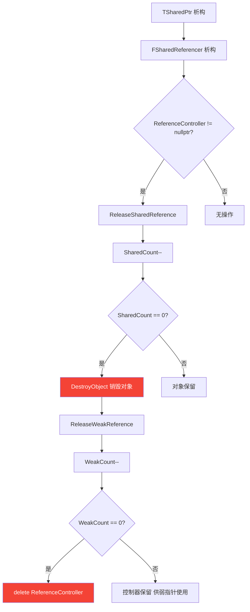

### TWeakPtr::Pin() 流程

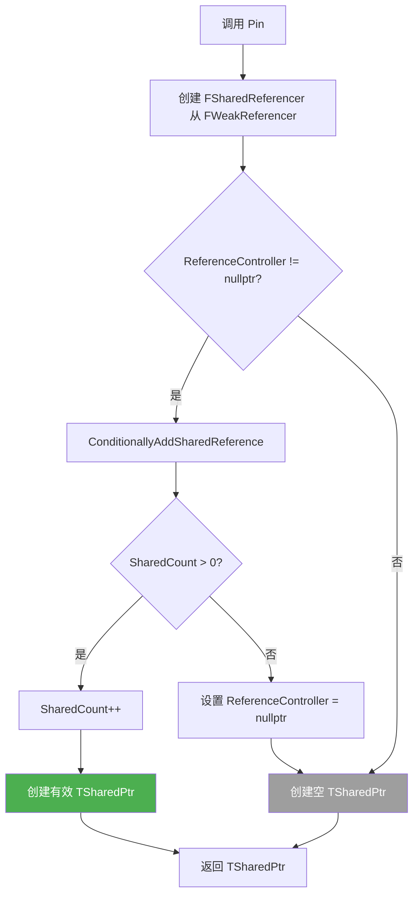

### 内存池分配流程

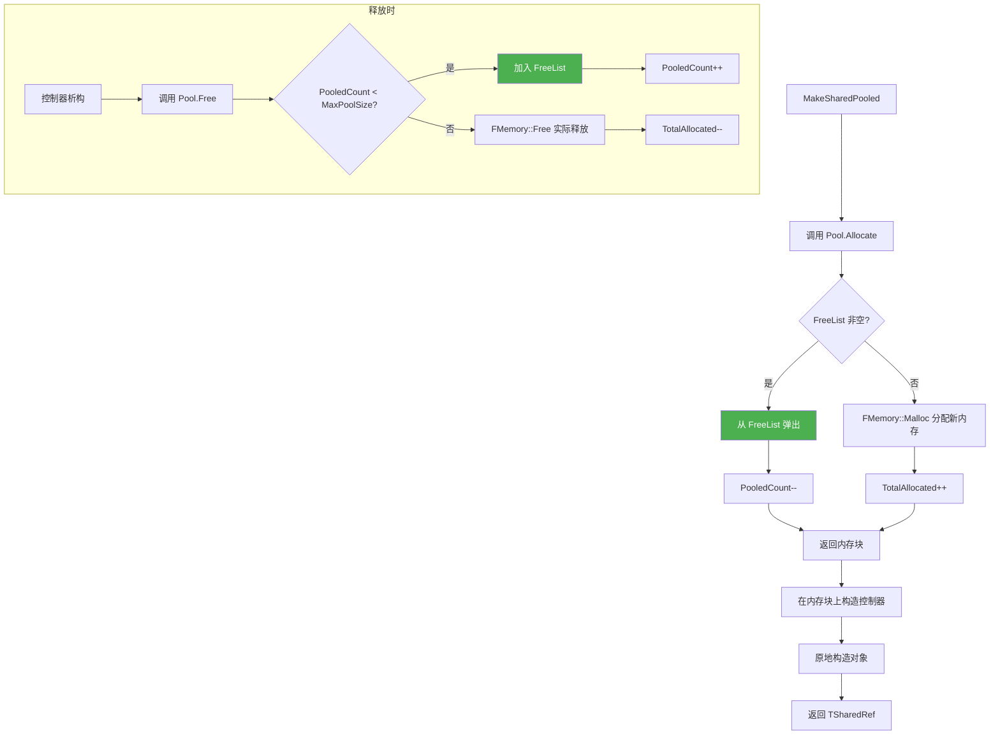

---

## 最佳实践

### 推荐做法

1. **优先使用 MakeShared**
   ```cpp
   // 好：单次分配，异常安全
   auto Ptr = MakeShared<FMyClass>(Args...);
   
   // 避免：两次分配
   TSharedPtr<FMyClass> Ptr(new FMyClass(Args...));
   ```

2. **使用 TSharedRef 表示非空**
   ```cpp
   // 函数参数使用 TSharedRef 表示必须有效
   void Process(TSharedRef<FData> Data);
   
   // 返回值可能为空时使用 TSharedPtr
   TSharedPtr<FData> FindData(int32 Id);
   ```

3. **避免循环引用**
   ```cpp
   class FNode
   {
       TSharedPtr<FNode> Next;   // 强引用
       TWeakPtr<FNode> Parent;   // 弱引用，打破循环
   };
   ```

4. **选择合适的线程安全模式**
   ```cpp
   // 多线程共享：使用默认 ThreadSafe
   TSharedPtr<FData> SharedData;
   
   // 单线程局部：使用 NotThreadSafe 提升性能
   TSharedPtr<FData, ESPMode::NotThreadSafe> LocalData;
   ```

### 避免的做法

1. **不要从原始指针创建多个共享指针**
   ```cpp
   FMyClass* Raw = new FMyClass();
   TSharedPtr<FMyClass> Ptr1(Raw);
   TSharedPtr<FMyClass> Ptr2(Raw);  // 错误！双重删除
   ```

2. **不要在构造函数中调用 AsShared()**
   ```cpp
   class FBad : public TSharedFromThis<FBad>
   {
       FBad()
       {
           auto Self = AsShared();  // 错误！还未被共享指针管理
       }
   };
   ```

3. **不要存储 Get() 返回的原始指针**
   ```cpp
   FMyClass* Raw = Ptr.Get();
   Ptr.Reset();
   Raw->DoSomething();  // 错误！悬空指针
   ```

---

## 性能优化

### 内存池使用场景

当需要频繁创建和销毁相同类型的共享对象时，使用内存池可以显著提升性能：

```cpp
// 高频分配场景
for (int32 i = 0; i < 10000; ++i)
{
    // 使用内存池
    auto Obj = MakeSharedPooled<FSmallObject>(i);
    ProcessObject(Obj);
    // 对象销毁时内存归还到池
}
```

### 性能对比

| 操作 | MakeShared | MakeSharedPooled | new + TSharedPtr |
|------|------------|------------------|------------------|
| 内存分配次数 | 1 | 1 (或0，从池获取) | 2 |
| 缓存友好性 | 好 | 好 | 差 |
| 高频分配性能 | 中 | 优 | 差 |
| 内存碎片 | 低 | 最低 | 高 |

### 线程安全开销

| 模式 | 引用计数操作 | 适用场景 |
|------|-------------|---------|
| ThreadSafe | 原子操作 (fetch_add/sub) | 多线程共享 |
| NotThreadSafe | 普通 ++/-- | 单线程或线程局部 |

---

## 附录：API 快速参考

### TSharedPtr<T, Mode>

| 方法 | 描述 |
|------|------|
| `TSharedPtr()` | 构造空指针 |
| `TSharedPtr(T*)` | 从原始指针构造 |
| `Get()` / `get()` | 获取原始指针 |
| `IsValid()` | 检查是否有效 |
| `Reset()` / `reset()` | 重置为空 |
| `ToSharedRef()` | 转换为 TSharedRef |
| `ToWeakPtr()` | 转换为 TWeakPtr |
| `GetSharedReferenceCount()` | 获取引用计数 |
| `IsUnique()` | 是否唯一引用 |

### TSharedRef<T, Mode>

| 方法 | 描述 |
|------|------|
| `TSharedRef(T*)` | 从原始指针构造（不能为空） |
| `Get()` | 获取对象引用 |
| `ToSharedPtr()` | 转换为 TSharedPtr |
| `ToWeakPtr()` | 转换为 TWeakPtr |
| `GetSharedReferenceCount()` | 获取引用计数 |
| `IsUnique()` | 是否唯一引用 |

### TWeakPtr<T, Mode>

| 方法 | 描述 |
|------|------|
| `TWeakPtr()` | 构造空弱指针 |
| `TWeakPtr(TSharedPtr)` | 从共享指针构造 |
| `Pin()` | 提升为 TSharedPtr |
| `IsValid()` | 检查对象是否仍存在 |
| `Reset()` | 重置为空 |

### TUniquePtr<T, Deleter>

| 方法 | 描述 |
|------|------|
| `TUniquePtr()` | 构造空指针 |
| `TUniquePtr(T*)` | 从原始指针构造 |
| `Get()` / `get()` | 获取原始指针 |
| `Release()` / `release()` | 释放所有权 |
| `Reset()` / `reset()` | 重置 |
| `Swap()` / `swap()` | 交换 |
| `IsValid()` | 检查是否有效 |
| `GetDeleter()` | 获取删除器 |

### 辅助函数

| 函数 | 描述 |
|------|------|
| `MakeShared<T>(Args...)` | 创建共享指针（单次分配） |
| `MakeSharedPooled<T>(Args...)` | 使用内存池创建共享指针 |
| `MakeShareable(T*)` | 包装原始指针 |
| `MakeShareable(T*, Deleter)` | 包装原始指针（自定义删除器） |
| `MakeUnique<T>(Args...)` | 创建独占指针 |
| `StaticCastSharedPtr<To>(From)` | 静态转换 |
| `ConstCastSharedPtr<To>(From)` | const 转换 |

---

*文档版本: 1.0*  
*最后更新: 2024年*  
*基于 UE5 SharedPointer 实现*
