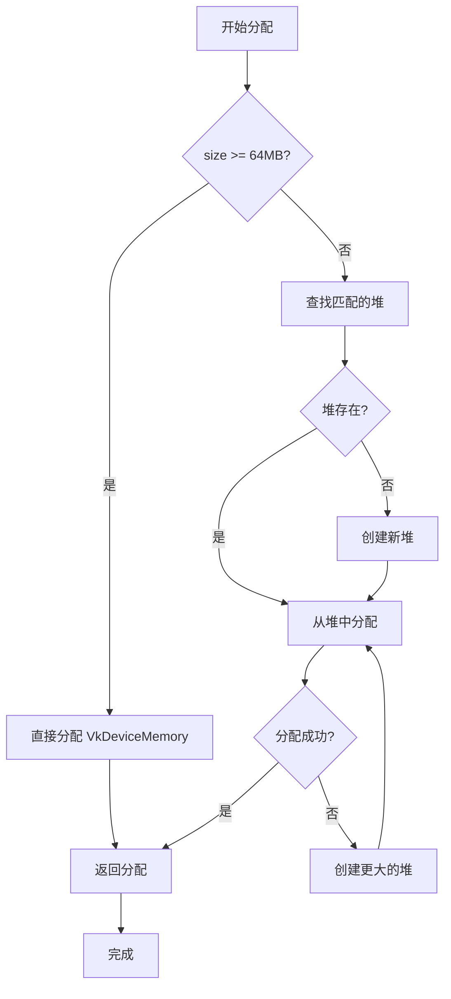
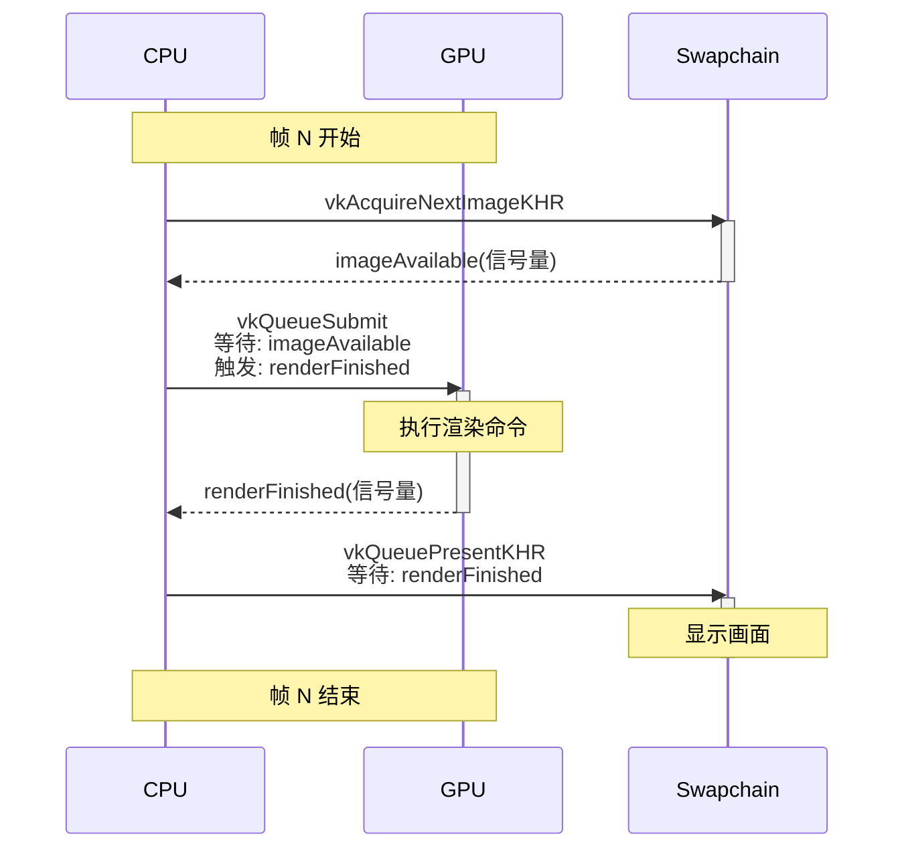

# Vulkan RHI 架构深度分析

## 文档概述

本文档深入分析 MonsterRender 引擎的 Vulkan RHI 实现架构，重点关注 UE5 风格的设计模式和最佳实践。

**文档版本**: 1.0  
**创建日期**: 2025-11-19  
**参考**: UE5 VulkanRHI 模块

---

## 目录

1. [核心架构模式](#核心架构模式)
2. [命令列表系统](#命令列表系统)
3. [内存管理系统](#内存管理系统)
4. [资源管理](#资源管理)
5. [同步机制](#同步机制)
6. [性能优化技术](#性能优化技术)

---

## 核心架构模式

### 1. 三层架构设计

```
┌─────────────────────────────────────┐
│  应用层 (Application Layer)          │
│  - TriangleApplication              │
│  - TriangleRenderer                 │
└───────────┬─────────────────────────┘
            │ 通过 RHI 接口调用
┌───────────▼─────────────────────────┐
│  RHI 抽象层 (RHI Abstraction)       │
│  - IRHIDevice                       │
│  - IRHICommandList                  │
│  - IRHIBuffer, IRHITexture...       │
└───────────┬─────────────────────────┘
            │ 平台特定实现
┌───────────▼─────────────────────────┐
│  Vulkan 实现层 (Vulkan Backend)     │
│  - VulkanDevice                     │
│  - FVulkanRHICommandListImmediate   │
│  - VulkanBuffer, VulkanTexture...   │
└───────────┬─────────────────────────┘
            │ Vulkan API 调用
┌───────────▼─────────────────────────┐
│  Vulkan Runtime                     │
│  - VkInstance, VkDevice             │
│  - VkCommandBuffer, VkQueue...      │
└─────────────────────────────────────┘
```

### 2. 设计模式应用

#### 2.1 抽象工厂模式 (Abstract Factory)

```cpp
// RHI 接口定义（抽象工厂）
class IRHIDevice {
public:
    virtual TSharedPtr<IRHIBuffer> createBuffer(const BufferDesc& desc) = 0;
    virtual TSharedPtr<IRHITexture> createTexture(const TextureDesc& desc) = 0;
    virtual TSharedPtr<IRHIPipelineState> createPipelineState(const PipelineStateDesc& desc) = 0;
};

// Vulkan 具体工厂
class VulkanDevice : public IRHIDevice {
public:
    TSharedPtr<IRHIBuffer> createBuffer(const BufferDesc& desc) override {
        return MakeShared<VulkanBuffer>(this, desc);
    }
    
    TSharedPtr<IRHITexture> createTexture(const TextureDesc& desc) override {
        return MakeShared<VulkanTexture>(this, desc);
    }
};
```

**优势**:
- 应用层不依赖具体实现
- 支持运行时切换图形 API（Vulkan/D3D12/OpenGL）
- 便于单元测试（Mock 实现）

#### 2.2 外观模式 (Facade)

```cpp
// FVulkanRHICommandListImmediate 作为外观
class FVulkanRHICommandListImmediate : public IRHICommandList {
private:
    FVulkanCommandListContext* m_context;  // 隐藏复杂的内部实现
    
public:
    void draw(uint32 vertexCount, uint32 startVertexLocation) override {
        // 简化接口，委托给复杂的内部系统
        auto* context = getCurrentContext();
        context->getPendingState()->markDirty();
        context->getCmdBuffer()->recordDraw(vertexCount, startVertexLocation);
    }
};
```

**作用**:
- 简化复杂子系统的使用
- 提供统一的高级接口
- 隐藏实现细节

#### 2.3 对象池模式 (Object Pool)

```cpp
class FVulkanCommandBufferManager {
private:
    TArray<FVulkanCmdBuffer*> m_freePool;    // 空闲对象池
    TArray<FVulkanCmdBuffer*> m_activePool;  // 活跃对象池
    
public:
    FVulkanCmdBuffer* acquire() {
        if (!m_freePool.empty()) {
            auto* cmd = m_freePool.back();
            m_freePool.pop_back();
            m_activePool.push_back(cmd);
            return cmd;  // 重用
        }
        
        // 池耗尽，创建新对象
        auto* cmd = createNewCmdBuffer();
        m_activePool.push_back(cmd);
        return cmd;
    }
    
    void release(FVulkanCmdBuffer* cmd) {
        // 归还到池中
        auto it = std::find(m_activePool.begin(), m_activePool.end(), cmd);
        if (it != m_activePool.end()) {
            m_activePool.erase(it);
            m_freePool.push_back(cmd);
        }
    }
};
```

#### 2.4 状态模式 (State Pattern)

```cpp
class FVulkanCmdBuffer {
public:
    enum class State {
        Initial,      // 初始状态
        Recording,    // 正在录制
        Executable,   // 可执行
        Submitted,    // 已提交
        Completed     // 已完成
    };
    
private:
    State m_state;
    
public:
    void begin() {
        CHECK(m_state == State::Initial || m_state == State::Completed);
        vkBeginCommandBuffer(m_cmdBuffer, ...);
        m_state = State::Recording;
    }
    
    void end() {
        CHECK(m_state == State::Recording);
        vkEndCommandBuffer(m_cmdBuffer);
        m_state = State::Executable;
    }
    
    void submit() {
        CHECK(m_state == State::Executable);
        vkQueueSubmit(...);
        m_state = State::Submitted;
    }
};
```

---

## 命令列表系统

### 1. UE5 风格命令列表架构

```
                      应用层
                         ↓
          IRHICommandList (RHI 接口)
                         ↓
      FVulkanRHICommandListImmediate (外观)
                         ↓ 委托
      FVulkanCommandListContext (上下文)
         ├── FVulkanCmdBuffer (命令缓冲区)
         ├── FVulkanPendingState (待处理状态)
         └── FVulkanDescriptorPoolSetContainer (描述符池)
                         ↓
             FVulkanCommandBufferManager (池管理器)
                         ↓
                   VkCommandBuffer
```

### 2. 命令录制流程

#### 2.1 帧开始准备

```cpp
void FVulkanCommandListContext::prepareForNewFrame() {
    // 1. 从管理器获取可用的命令缓冲区
    m_cmdBuffer = m_manager->getOrCreateCmdBuffer();
    
    // 2. 刷新围栏状态
    m_manager->refreshFenceStatus();
    
    // 3. 等待命令缓冲区完成之前的工作
    if (m_cmdBuffer->getState() == FVulkanCmdBuffer::State::Submitted) {
        m_cmdBuffer->waitForFence();
    }
    
    // 4. 重置命令缓冲区（可重用）
    m_cmdBuffer->reset();
    
    // 5. 重置待处理状态
    m_pendingState->reset();
    
    // 6. 重置描述符池（释放所有描述符集）
    m_descriptorPool->reset();
    
    MR_LOG_DEBUG("Frame prepared, ready for recording");
}
```

#### 2.2 命令录制

```cpp
void FVulkanRHICommandListImmediate::draw(uint32 vertexCount, uint32 startVertexLocation) {
    auto* context = getCurrentContext();
    
    // 1. 获取当前命令缓冲区
    FVulkanCmdBuffer* cmdBuffer = context->getCmdBuffer();
    VkCommandBuffer vkCmdBuffer = cmdBuffer->getCommandBuffer();
    
    // 2. 应用待处理状态
    FVulkanPendingState* pendingState = context->getPendingState();
    if (pendingState->isDirty()) {
        // 绑定管线
        if (pendingState->isPipelineDirty()) {
            auto* pipeline = pendingState->getCurrentPipeline();
            vkCmdBindPipeline(vkCmdBuffer, VK_PIPELINE_BIND_POINT_GRAPHICS, 
                             pipeline->getPipeline());
        }
        
        // 绑定顶点缓冲
        if (pendingState->isVertexBufferDirty()) {
            auto& vertexBuffers = pendingState->getVertexBuffers();
            TArray<VkBuffer> vkBuffers;
            TArray<VkDeviceSize> offsets;
            for (auto& buf : vertexBuffers) {
                auto* vkBuf = static_cast<VulkanBuffer*>(buf.get());
                vkBuffers.push_back(vkBuf->getBuffer());
                offsets.push_back(0);
            }
            vkCmdBindVertexBuffers(vkCmdBuffer, 0, vkBuffers.size(), 
                                  vkBuffers.data(), offsets.data());
        }
        
        // 绑定描述符集（如果有）
        if (pendingState->isDescriptorSetDirty()) {
            // ... 描述符绑定逻辑
        }
        
        pendingState->clearDirty();
    }
    
    // 3. 录制绘制命令
    vkCmdDraw(vkCmdBuffer, vertexCount, 1, startVertexLocation, 0);
    
    MR_LOG_DEBUG("Recorded draw command: {} vertices", vertexCount);
}
```

### 3. 待处理状态管理

```cpp
class FVulkanPendingState {
private:
    VulkanPipelineState* m_currentPipeline;
    TArray<TSharedPtr<IRHIBuffer>> m_vertexBuffers;
    TSharedPtr<IRHIBuffer> m_indexBuffer;
    
    // 脏标记
    bool m_pipelineDirty;
    bool m_vertexBufferDirty;
    bool m_descriptorSetDirty;
    
public:
    void setPipeline(VulkanPipelineState* pipeline) {
        if (m_currentPipeline != pipeline) {
            m_currentPipeline = pipeline;
            m_pipelineDirty = true;
        }
    }
    
    void setVertexBuffers(uint32 startSlot, TSpan<TSharedPtr<IRHIBuffer>> buffers) {
        // 只更新变化的槽位
        bool changed = false;
        for (uint32 i = 0; i < buffers.size(); ++i) {
            if (m_vertexBuffers[startSlot + i] != buffers[i]) {
                m_vertexBuffers[startSlot + i] = buffers[i];
                changed = true;
            }
        }
        if (changed) {
            m_vertexBufferDirty = true;
        }
    }
    
    void reset() {
        m_currentPipeline = nullptr;
        m_vertexBuffers.clear();
        m_indexBuffer.reset();
        clearDirty();
    }
    
    bool isDirty() const {
        return m_pipelineDirty || m_vertexBufferDirty || m_descriptorSetDirty;
    }
};
```

**优势**:
- 避免冗余的 Vulkan 调用（状态跟踪）
- 延迟绑定，批量应用状态
- 降低 CPU 开销

---

## 内存管理系统

### 1. FVulkanMemoryManager 架构

```cpp
class FVulkanMemoryManager {
public:
    // 分配内存
    FVulkanAllocation* Allocate(
        VkDeviceSize size,
        uint32 memoryTypeBits,
        VkMemoryPropertyFlags properties,
        const char* debugName = nullptr
    );
    
    // 释放内存
    void Free(FVulkanAllocation* allocation);
    
    // 内存统计
    struct MemoryStats {
        uint64 totalAllocated;      // 总分配内存
        uint64 totalUsed;           // 实际使用内存
        uint64 allocationCount;     // 分配次数
        uint64 fragmentationRatio;  // 碎片率
    };
    MemoryStats getStats() const;
    
private:
    // 内存堆（每种内存类型一个堆）
    TArray<FVulkanHeap*> m_heaps;
    
    // 大块分配列表（超过阈值直接分配）
    TArray<FVulkanAllocation*> m_dedicatedAllocations;
    
    // 分配策略
    static constexpr VkDeviceSize DEDICATED_ALLOCATION_THRESHOLD = 64 * 1024 * 1024; // 64MB
    static constexpr VkDeviceSize DEFAULT_HEAP_SIZE = 256 * 1024 * 1024;             // 256MB
};
```

### 2. 子分配策略

#### 2.1 内存堆结构

```cpp
class FVulkanHeap {
private:
    VkDeviceMemory m_deviceMemory;  // Vulkan 内存句柄
    VkDeviceSize m_size;            // 堆大小
    VkDeviceSize m_usedSize;        // 已使用大小
    uint32 m_memoryTypeIndex;       // 内存类型索引
    
    // 空闲块列表（按地址排序）
    TArray<FreeBlock> m_freeBlocks;
    
    // 已分配块列表
    TArray<FVulkanAllocation*> m_allocations;
    
public:
    FVulkanAllocation* allocate(VkDeviceSize size, VkDeviceSize alignment) {
        // 1. 对齐大小
        VkDeviceSize alignedSize = alignUp(size, alignment);
        
        // 2. 查找合适的空闲块（首次适应算法）
        for (auto& freeBlock : m_freeBlocks) {
            if (freeBlock.size >= alignedSize) {
                // 找到合适的块
                VkDeviceSize alignedOffset = alignUp(freeBlock.offset, alignment);
                VkDeviceSize padding = alignedOffset - freeBlock.offset;
                
                if (freeBlock.size >= alignedSize + padding) {
                    // 创建分配
                    auto* allocation = new FVulkanAllocation{
                        .DeviceMemory = m_deviceMemory,
                        .Offset = alignedOffset,
                        .Size = alignedSize,
                        .MappedPointer = nullptr
                    };
                    
                    // 更新空闲块
                    freeBlock.offset += alignedSize + padding;
                    freeBlock.size -= alignedSize + padding;
                    
                    m_allocations.push_back(allocation);
                    m_usedSize += alignedSize;
                    
                    return allocation;
                }
            }
        }
        
        return nullptr;  // 堆已满
    }
    
    void free(FVulkanAllocation* allocation) {
        // 1. 移除分配
        auto it = std::find(m_allocations.begin(), m_allocations.end(), allocation);
        if (it != m_allocations.end()) {
            m_allocations.erase(it);
        }
        
        // 2. 添加到空闲块列表
        FreeBlock newBlock{
            .offset = allocation->Offset,
            .size = allocation->Size
        };
        m_freeBlocks.push_back(newBlock);
        
        // 3. 合并相邻空闲块
        mergeAdjacentFreeBlocks();
        
        m_usedSize -= allocation->Size;
    }
    
private:
    void mergeAdjacentFreeBlocks() {
        // 按偏移量排序
        std::sort(m_freeBlocks.begin(), m_freeBlocks.end(),
                 [](const FreeBlock& a, const FreeBlock& b) {
                     return a.offset < b.offset;
                 });
        
        // 合并相邻块
        for (size_t i = 0; i < m_freeBlocks.size() - 1; ) {
            auto& current = m_freeBlocks[i];
            auto& next = m_freeBlocks[i + 1];
            
            if (current.offset + current.size == next.offset) {
                // 相邻，合并
                current.size += next.size;
                m_freeBlocks.erase(m_freeBlocks.begin() + i + 1);
            } else {
                ++i;
            }
        }
    }
};
```

#### 2.2 分配流程图



### 3. 内存映射策略

```cpp
class VulkanBuffer {
private:
    void* m_mappedData;
    bool m_persistentMapped;
    
public:
    void* map() {
        if (m_mappedData) {
            return m_mappedData;  // 已映射
        }
        
        if (m_usesMemoryManager) {
            // 使用内存管理器的映射
            if (!m_allocation.MappedPointer) {
                void* basePointer;
                vkMapMemory(m_device->getDevice(), 
                           m_allocation.DeviceMemory,
                           0, VK_WHOLE_SIZE, 0, &basePointer);
                m_allocation.MappedPointer = basePointer;
            }
            
            // 返回偏移后的指针
            m_mappedData = static_cast<uint8*>(m_allocation.MappedPointer) + m_allocation.Offset;
        } else {
            // 直接映射
            vkMapMemory(m_device->getDevice(), m_deviceMemory, 
                       0, m_desc.size, 0, &m_mappedData);
        }
        
        return m_mappedData;
    }
    
    void unmap() {
        if (!m_persistentMapped && m_mappedData) {
            if (!m_usesMemoryManager) {
                vkUnmapMemory(m_device->getDevice(), m_deviceMemory);
            }
            m_mappedData = nullptr;
        }
    }
};
```

**优势**:
- 减少 vkMapMemory/vkUnmapMemory 调用（昂贵）
- 支持持久映射（频繁更新的缓冲区）
- 子分配共享同一个映射

---

## 资源管理

### 1. 资源生命周期

```cpp
class VulkanBuffer : public IRHIBuffer {
public:
    VulkanBuffer(VulkanDevice* device, const BufferDesc& desc)
        : m_device(device)
        , m_desc(desc)
    {
        initialize();
    }
    
    ~VulkanBuffer() {
        destroy();
    }
    
private:
    bool initialize() {
        // 1. 创建 VkBuffer
        VkBufferCreateInfo bufferInfo{};
        bufferInfo.sType = VK_STRUCTURE_TYPE_BUFFER_CREATE_INFO;
        bufferInfo.size = m_desc.size;
        bufferInfo.usage = getVulkanUsageFlags(m_desc.usage);
        bufferInfo.sharingMode = VK_SHARING_MODE_EXCLUSIVE;
        
        VkResult result = vkCreateBuffer(m_device->getDevice(), &bufferInfo, nullptr, &m_buffer);
        if (result != VK_SUCCESS) {
            return false;
        }
        
        // 2. 查询内存需求
        VkMemoryRequirements memReqs;
        vkGetBufferMemoryRequirements(m_device->getDevice(), m_buffer, &memReqs);
        
        // 3. 分配内存
        auto* memoryManager = m_device->getMemoryManager();
        m_allocation = memoryManager->Allocate(
            memReqs.size,
            memReqs.memoryTypeBits,
            getVulkanMemoryProperties(m_desc),
            m_desc.debugName.c_str()
        );
        
        if (!m_allocation) {
            vkDestroyBuffer(m_device->getDevice(), m_buffer, nullptr);
            return false;
        }
        
        // 4. 绑定内存
        result = vkBindBufferMemory(m_device->getDevice(), m_buffer, 
                                   m_allocation->DeviceMemory, m_allocation->Offset);
        
        return result == VK_SUCCESS;
    }
    
    void destroy() {
        if (m_buffer != VK_NULL_HANDLE) {
            vkDestroyBuffer(m_device->getDevice(), m_buffer, nullptr);
            m_buffer = VK_NULL_HANDLE;
        }
        
        if (m_allocation) {
            m_device->getMemoryManager()->Free(m_allocation);
            m_allocation = nullptr;
        }
    }
};
```

### 2. 智能指针使用规范

```cpp
// 1. 共享所有权 - TSharedPtr
class TriangleRenderer {
private:
    TSharedPtr<IRHIBuffer> m_vertexBuffer;          // 多个管线可能共享
    TSharedPtr<IRHIPipelineState> m_pipelineState;  // 可能被缓存和重用
};

// 2. 独占所有权 - TUniquePtr
class VulkanDevice {
private:
    TUniquePtr<FVulkanMemoryManager> m_memoryManager;         // 设备独占
    TUniquePtr<FVulkanCommandBufferManager> m_cmdBufManager;  // 设备独占
};

// 3. 非拥有引用 - 原始指针
class VulkanBuffer {
private:
    VulkanDevice* m_device;  // 不负责生命周期，设备由外部管理
};

// 4. 临时引用 - 原始指针参数
void render(IRHICommandList* cmdList) {
    // cmdList 的生命周期由调用者管理
}
```

---

## 同步机制

### 1. CPU-GPU 同步（围栏）

```cpp
class FVulkanCmdBuffer {
private:
    VkFence m_fence;
    State m_state;
    
public:
    void submit(VkQueue queue) {
        CHECK(m_state == State::Executable);
        
        // 提交时关联围栏
        VkSubmitInfo submitInfo{};
        submitInfo.commandBufferCount = 1;
        submitInfo.pCommandBuffers = &m_commandBuffer;
        
        vkQueueSubmit(queue, 1, &submitInfo, m_fence);
        m_state = State::Submitted;
    }
    
    void waitForFence() {
        if (m_state == State::Submitted) {
            // 等待 GPU 完成
            vkWaitForFences(m_device, 1, &m_fence, VK_TRUE, UINT64_MAX);
            m_state = State::Completed;
        }
    }
    
    bool isFenceSignaled() const {
        if (m_state != State::Submitted) {
            return false;
        }
        
        // 查询围栏状态（非阻塞）
        VkResult result = vkGetFenceStatus(m_device, m_fence);
        return result == VK_SUCCESS;
    }
};
```

### 2. GPU-GPU 同步（信号量）

```cpp
void VulkanDevice::present() {
    uint32 currentFrame = m_currentFrame % MAX_FRAMES_IN_FLIGHT;
    
    // 1. 获取交换链图像
    uint32 imageIndex;
    vkAcquireNextImageKHR(m_device, m_swapchain, UINT64_MAX,
                         m_imageAvailableSemaphores[currentFrame],  // 触发此信号量
                         VK_NULL_HANDLE, &imageIndex);
    
    // 2. 提交渲染命令
    VkSubmitInfo submitInfo{};
    
    // 等待图像可用
    VkSemaphore waitSemaphores[] = {m_imageAvailableSemaphores[currentFrame]};
    VkPipelineStageFlags waitStages[] = {VK_PIPELINE_STAGE_COLOR_ATTACHMENT_OUTPUT_BIT};
    submitInfo.waitSemaphoreCount = 1;
    submitInfo.pWaitSemaphores = waitSemaphores;
    submitInfo.pWaitDstStageMask = waitStages;
    
    // 渲染完成后触发
    VkSemaphore signalSemaphores[] = {m_renderFinishedSemaphores[currentFrame]};
    submitInfo.signalSemaphoreCount = 1;
    submitInfo.pSignalSemaphores = signalSemaphores;
    
    VkCommandBuffer cmdBuffer = m_cmdListContext->getCmdBuffer()->getCommandBuffer();
    submitInfo.commandBufferCount = 1;
    submitInfo.pCommandBuffers = &cmdBuffer;
    
    vkQueueSubmit(m_graphicsQueue, 1, &submitInfo, m_inFlightFences[currentFrame]);
    
    // 3. 呈现
    VkPresentInfoKHR presentInfo{};
    presentInfo.waitSemaphoreCount = 1;
    presentInfo.pWaitSemaphores = signalSemaphores;  // 等待渲染完成
    
    VkSwapchainKHR swapchains[] = {m_swapchain};
    presentInfo.swapchainCount = 1;
    presentInfo.pSwapchains = swapchains;
    presentInfo.pImageIndices = &imageIndex;
    
    vkQueuePresentKHR(m_presentQueue, &presentInfo);
    
    m_currentFrame++;
}
```

### 3. 同步流程图



---

## 性能优化技术

### 1. 命令缓冲区重用

```cpp
class FVulkanCommandBufferManager {
public:
    void refreshFenceStatus() {
        // 检查所有已提交的命令缓冲区
        for (auto* cmd : m_submittedCmdBuffers) {
            if (cmd->isFenceSignaled()) {
                // GPU 已完成，可以重用
                cmd->setState(FVulkanCmdBuffer::State::Completed);
                m_freeCmdBuffers.push_back(cmd);
                MR_LOG_DEBUG("Command buffer {} ready for reuse", cmd->getId());
            }
        }
        
        // 移除已完成的
        m_submittedCmdBuffers.erase(
            std::remove_if(m_submittedCmdBuffers.begin(), m_submittedCmdBuffers.end(),
                          [](auto* cmd) { return cmd->getState() == FVulkanCmdBuffer::State::Completed; }),
            m_submittedCmdBuffers.end()
        );
    }
};
```

**优势**:
- 避免频繁创建/销毁命令缓冲区
- 降低内存分配开销
- 提高缓存命中率

### 2. 管线状态缓存

```cpp
class VulkanPipelineCache {
private:
    TMap<uint64, TSharedPtr<VulkanPipelineState>> m_cache;
    
    struct Stats {
        uint32 hits;
        uint32 misses;
        float hitRate() const { return (float)hits / (hits + misses); }
    } m_stats;
    
public:
    TSharedPtr<VulkanPipelineState> getOrCreate(const PipelineStateDesc& desc) {
        uint64 hash = calculateHash(desc);
        
        auto it = m_cache.find(hash);
        if (it != m_cache.end()) {
            m_stats.hits++;
            MR_LOG_DEBUG("Pipeline cache hit (hit rate: {:.2f}%)", m_stats.hitRate() * 100);
            return it->second;
        }
        
        m_stats.misses++;
        MR_LOG_DEBUG("Pipeline cache miss, creating new pipeline");
        
        auto pipeline = MakeShared<VulkanPipelineState>(m_device, desc);
        pipeline->initialize();
        m_cache[hash] = pipeline;
        
        return pipeline;
    }
    
private:
    uint64 calculateHash(const PipelineStateDesc& desc) const {
        uint64 hash = 0;
        
        // 哈希所有影响管线的状态
        hash = combineHash(hash, reinterpret_cast<uintptr_t>(desc.vertexShader.get()));
        hash = combineHash(hash, reinterpret_cast<uintptr_t>(desc.pixelShader.get()));
        hash = combineHash(hash, static_cast<uint32>(desc.primitiveTopology));
        hash = combineHash(hash, static_cast<uint32>(desc.rasterizerState.fillMode));
        hash = combineHash(hash, static_cast<uint32>(desc.rasterizerState.cullMode));
        // ... 更多状态
        
        return hash;
    }
};
```

### 3. 描述符集池化

```cpp
class FVulkanDescriptorPoolSetContainer {
private:
    static constexpr uint32 MAX_SETS_PER_POOL = 1024;
    
    struct PoolInfo {
        VkDescriptorPool pool;
        uint32 allocatedSets;
        uint32 capacity;
    };
    
    TArray<PoolInfo> m_pools;
    uint32 m_currentPoolIndex;
    
public:
    VkDescriptorSet allocate(VkDescriptorSetLayout layout) {
        auto& currentPool = m_pools[m_currentPoolIndex];
        
        // 如果当前池已满，切换到下一个池或创建新池
        if (currentPool.allocatedSets >= currentPool.capacity) {
            m_currentPoolIndex++;
            if (m_currentPoolIndex >= m_pools.size()) {
                createNewPool();
            }
        }
        
        auto& pool = m_pools[m_currentPoolIndex];
        
        VkDescriptorSetAllocateInfo allocInfo{};
        allocInfo.sType = VK_STRUCTURE_TYPE_DESCRIPTOR_SET_ALLOCATE_INFO;
        allocInfo.descriptorPool = pool.pool;
        allocInfo.descriptorSetCount = 1;
        allocInfo.pSetLayouts = &layout;
        
        VkDescriptorSet set;
        vkAllocateDescriptorSets(m_device, &allocInfo, &set);
        
        pool.allocatedSets++;
        return set;
    }
    
    void reset() {
        // 重置所有池（快速释放所有描述符集）
        for (auto& pool : m_pools) {
            vkResetDescriptorPool(m_device, pool.pool, 0);
            pool.allocatedSets = 0;
        }
        m_currentPoolIndex = 0;
        
        MR_LOG_DEBUG("Descriptor pools reset");
    }
};
```

**优势**:
- 避免频繁创建/销毁描述符集
- 批量重置比逐个释放更快
- 减少驱动开销

### 4. 内存对齐优化

```cpp
// Vulkan 要求特定对齐
inline VkDeviceSize alignUp(VkDeviceSize value, VkDeviceSize alignment) {
    return (value + alignment - 1) & ~(alignment - 1);
}

// 使用示例
VkPhysicalDeviceProperties deviceProps;
vkGetPhysicalDeviceProperties(physicalDevice, &deviceProps);

// Uniform 缓冲区对齐
uint32 minUBOAlignment = deviceProps.limits.minUniformBufferOffsetAlignment;  // 通常 256 字节
VkDeviceSize alignedSize = alignUp(bufferSize, minUBOAlignment);

// Storage 缓冲区对齐
uint32 minSSBOAlignment = deviceProps.limits.minStorageBufferOffsetAlignment; // 通常 16 或 32 字节
VkDeviceSize alignedSize = alignUp(bufferSize, minSSBOAlignment);
```

### 5. 批量绘制优化

```cpp
// 差：每个对象单独绘制
for (auto& object : objects) {
    cmdList->setPipelineState(object.pipeline);
    cmdList->setVertexBuffers(0, {object.vertexBuffer});
    cmdList->draw(object.vertexCount);
}
// Draw Call 数量 = objects.size()

// 好：合并顶点缓冲区
cmdList->setPipelineState(sharedPipeline);
cmdList->setVertexBuffers(0, {combinedVertexBuffer});
uint32 totalVertices = 0;
for (auto& object : objects) {
    cmdList->draw(object.vertexCount, totalVertices);
    totalVertices += object.vertexCount;
}
// Draw Call 数量 = objects.size()（仍然多次调用）

// 更好：使用实例化渲染
struct InstanceData {
    mat4 transform;
    vec4 color;
};
TArray<InstanceData> instanceData(objects.size());
// 填充实例数据...

cmdList->setPipelineState(instancedPipeline);
cmdList->setVertexBuffers(0, {sharedVertexBuffer});
cmdList->setVertexBuffers(1, {instanceBuffer});  // 实例数据
cmdList->drawInstanced(3, objects.size());       // 一次 draw call
// Draw Call 数量 = 1
```

---

## 总结

### 关键架构特点

1. **UE5 风格分层**: 清晰的 RHI 抽象 + Vulkan 实现
2. **命令列表系统**: `FVulkanRHICommandListImmediate` + `FVulkanCommandListContext`
3. **内存子分配**: 减少 Vulkan 分配调用，降低碎片
4. **对象池化**: 命令缓冲区、描述符集重用
5. **状态跟踪**: 避免冗余 Vulkan 调用
6. **智能指针**: RAII 自动资源管理

### 性能关键点

1. **减少 Vulkan API 调用**
   - 批量绑定资源
   - 状态缓存
   - 池化重用

2. **降低内存开销**
   - 子分配策略
   - 持久映射
   - 对齐优化

3. **提高并行性**
   - 双缓冲/三缓冲
   - CPU-GPU 并行
   - 异步资源创建

4. **优化 Draw Call**
   - 实例化渲染
   - 批量绘制
   - 间接绘制（未来）

---

**文档结束**

