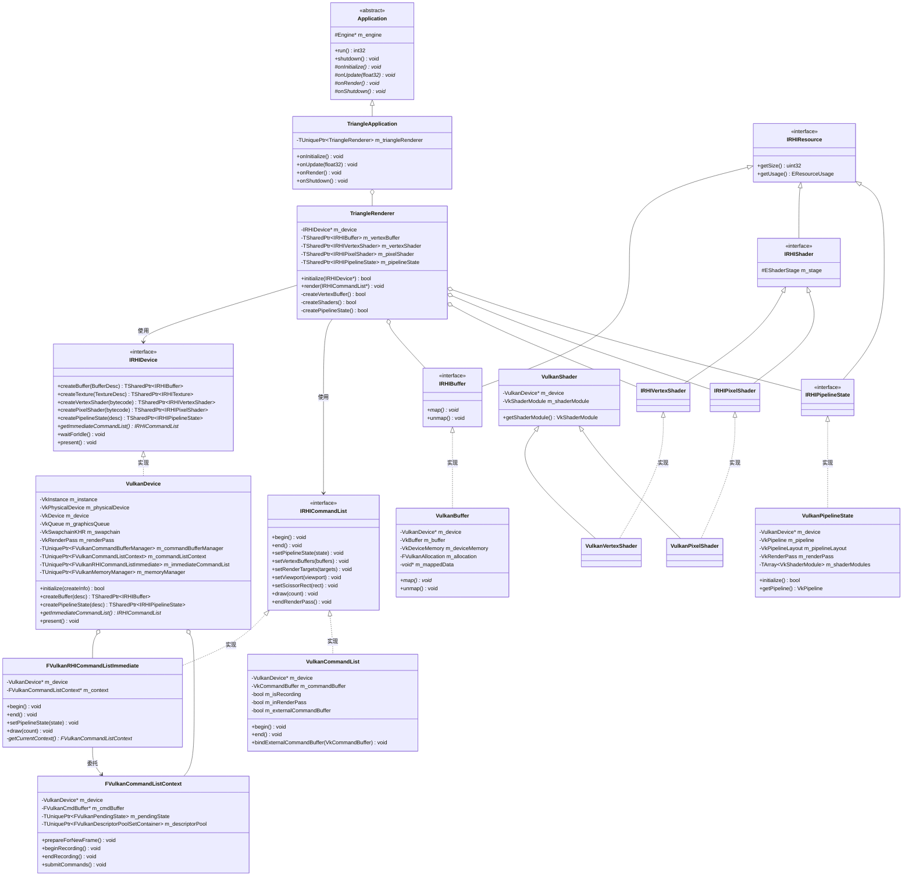
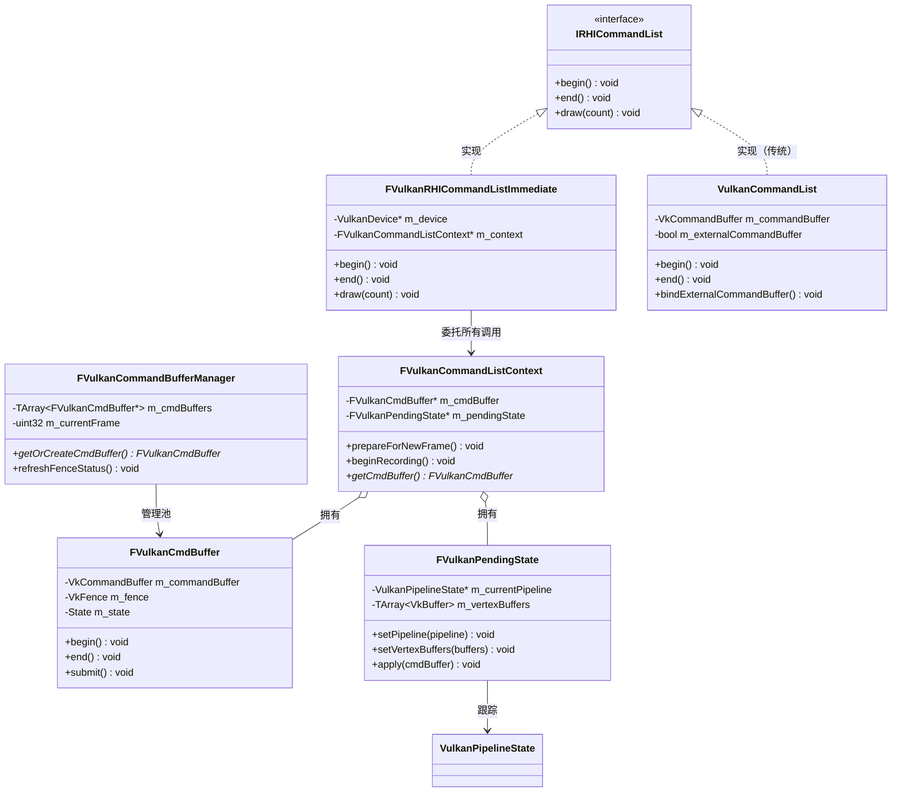
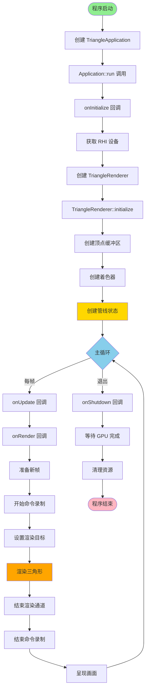
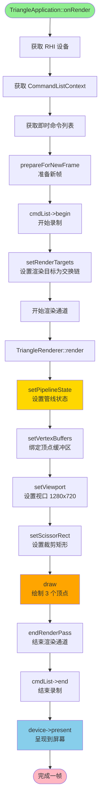
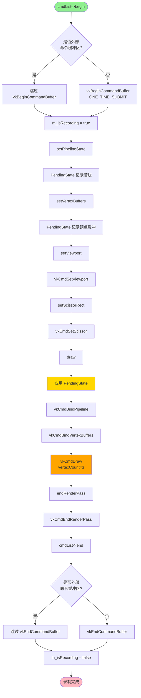
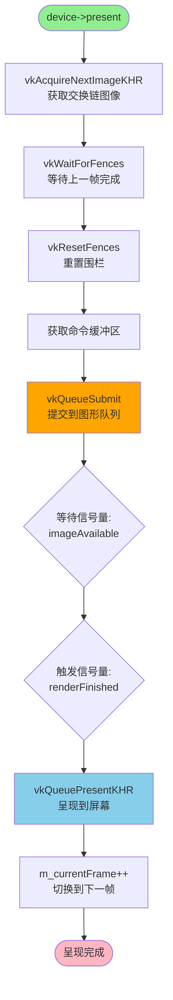

# MonsterRender 三角形渲染流程详解

## 文档概述

本文档详细分析 MonsterRender 引擎中三角形渲染的完整流程，包括应用层、RHI 抽象层和 Vulkan 实现层的架构设计。文档参考 UE5 的 RHI 架构模式，展示了现代图形引擎的分层设计理念。

**文档版本**: 1.0  
**创建日期**: 2025-11-19  
**涉及组件**: TriangleApplication, TriangleRenderer, VulkanRHI  

---

## 目录

1. [架构概览](#架构概览)
2. [核心类分析](#核心类分析)
3. [UML 类图](#uml-类图)
4. [渲染流程图](#渲染流程图)
5. [详细流程分析](#详细流程分析)
6. [Vulkan RHI 架构](#vulkan-rhi-架构)
7. [内存管理](#内存管理)
8. [性能优化](#性能优化)

---

## 架构概览

MonsterRender 引擎采用三层架构设计，完全遵循 UE5 的 RHI 模式：

```
┌─────────────────────────────────────────────────┐
│           应用层 (Application Layer)              │
│   TriangleApplication, TriangleRenderer         │
└───────────────────┬─────────────────────────────┘
                    │ 使用 RHI 接口
┌───────────────────▼─────────────────────────────┐
│         RHI 抽象层 (RHI Abstraction)             │
│   IRHIDevice, IRHICommandList, IRHIBuffer...    │
└───────────────────┬─────────────────────────────┘
                    │ 平台特定实现
┌───────────────────▼─────────────────────────────┐
│        Vulkan 实现层 (Vulkan Backend)            │
│   VulkanDevice, VulkanCommandList, ...          │
└─────────────────────────────────────────────────┘
```

### 设计原则

1. **抽象与实现分离**: 应用层代码完全不依赖 Vulkan，通过 RHI 接口调用
2. **工厂模式**: 所有资源通过 IRHIDevice 工厂创建
3. **RAII 资源管理**: 使用智能指针（TSharedPtr, TUniquePtr）管理资源生命周期
4. **命令列表模式**: 参考 D3D12/Vulkan 的命令录制与提交模式
5. **UE5 风格架构**: 遵循 UE5 的命名规范和设计模式

---

## 核心类分析

### 1. TriangleApplication

**职责**: 管理应用程序生命周期和渲染循环

**文件位置**:
- `Source/TriangleApplication.cpp`

**关键成员**:
```cpp
class TriangleApplication : public Application {
private:
    TUniquePtr<TriangleRenderer> m_triangleRenderer;
};
```

**生命周期方法**:
- `onInitialize()`: 初始化渲染器，创建三角形资源
- `onUpdate(float32 deltaTime)`: 更新逻辑（简单演示中未使用）
- `onRender()`: 每帧渲染调用
- `onShutdown()`: 清理资源

**特点**:
- 继承自 `Application` 基类，遵循引擎应用框架
- 使用 RAII 管理 `TriangleRenderer` 的生命周期
- 在 `onRender()` 中协调整个渲染流程

---

### 2. TriangleRenderer

**职责**: 管理三角形的渲染资源和绘制逻辑

**文件位置**:
- `Include/TriangleRenderer.h`
- `Source/TriangleRenderer.cpp`

**关键成员**:
```cpp
class TriangleRenderer {
private:
    RHI::IRHIDevice* m_device;                          // RHI 设备
    TSharedPtr<RHI::IRHIBuffer> m_vertexBuffer;         // 顶点缓冲区
    TSharedPtr<RHI::IRHIVertexShader> m_vertexShader;   // 顶点着色器
    TSharedPtr<RHI::IRHIPixelShader> m_pixelShader;     // 像素着色器
    TSharedPtr<RHI::IRHIPipelineState> m_pipelineState; // 管线状态
};
```

**顶点结构**:
```cpp
struct Vertex {
    float position[3];  // 位置 (x, y, z)
    float color[3];     // 颜色 (r, g, b)
};
```

**关键方法**:
1. `initialize(IRHIDevice* device)`: 初始化所有渲染资源
2. `createVertexBuffer()`: 创建并上传顶点数据
3. `createShaders()`: 加载并编译着色器
4. `createPipelineState()`: 创建图形管线状态对象
5. `render(IRHICommandList* cmdList)`: 录制绘制命令

---

### 3. IRHIDevice (RHI 设备接口)

**职责**: RHI 设备抽象，提供资源创建工厂

**文件位置**:
- `Include/RHI/IRHIDevice.h`

**关键接口**:
```cpp
class IRHIDevice {
public:
    // 资源创建
    virtual TSharedPtr<IRHIBuffer> createBuffer(const BufferDesc& desc) = 0;
    virtual TSharedPtr<IRHITexture> createTexture(const TextureDesc& desc) = 0;
    virtual TSharedPtr<IRHIVertexShader> createVertexShader(TSpan<const uint8> bytecode) = 0;
    virtual TSharedPtr<IRHIPixelShader> createPixelShader(TSpan<const uint8> bytecode) = 0;
    virtual TSharedPtr<IRHIPipelineState> createPipelineState(const PipelineStateDesc& desc) = 0;
    
    // 命令列表
    virtual TSharedPtr<IRHICommandList> createCommandList() = 0;
    virtual IRHICommandList* getImmediateCommandList() = 0;
    
    // 同步与呈现
    virtual void waitForIdle() = 0;
    virtual void present() = 0;
};
```

---

### 4. IRHICommandList (命令列表接口)

**职责**: 录制 GPU 命令

**文件位置**:
- `Include/RHI/IRHICommandList.h`

**关键接口**:
```cpp
class IRHICommandList {
public:
    // 命令录制控制
    virtual void begin() = 0;
    virtual void end() = 0;
    
    // 管线状态
    virtual void setPipelineState(TSharedPtr<IRHIPipelineState> pipelineState) = 0;
    
    // 资源绑定
    virtual void setVertexBuffers(uint32 startSlot, TSpan<TSharedPtr<IRHIBuffer>> vertexBuffers) = 0;
    virtual void setRenderTargets(TSpan<TSharedPtr<IRHITexture>> renderTargets, 
                                  TSharedPtr<IRHITexture> depthStencil = nullptr) = 0;
    
    // 视口和裁剪
    virtual void setViewport(const Viewport& viewport) = 0;
    virtual void setScissorRect(const ScissorRect& scissorRect) = 0;
    
    // 绘制命令
    virtual void draw(uint32 vertexCount, uint32 startVertexLocation = 0) = 0;
    virtual void endRenderPass() = 0;
};
```

---

### 5. VulkanDevice (Vulkan 设备实现)

**职责**: Vulkan 图形设备的实现类

**文件位置**:
- `Include/Platform/Vulkan/VulkanDevice.h`
- `Source/Platform/Vulkan/VulkanDevice.cpp`

**关键成员**:
```cpp
class VulkanDevice : public IRHIDevice {
private:
    // Vulkan 核心对象
    VkInstance m_instance;
    VkPhysicalDevice m_physicalDevice;
    VkDevice m_device;
    VkQueue m_graphicsQueue;
    VkQueue m_presentQueue;
    
    // 交换链
    VkSwapchainKHR m_swapchain;
    TArray<VkImage> m_swapchainImages;
    TArray<VkImageView> m_swapchainImageViews;
    TArray<VkFramebuffer> m_swapchainFramebuffers;
    
    // 渲染通道
    VkRenderPass m_renderPass;
    
    // 命令管理 (UE5 风格)
    TUniquePtr<FVulkanCommandBufferManager> m_commandBufferManager;
    TUniquePtr<FVulkanCommandListContext> m_commandListContext;
    TUniquePtr<FVulkanRHICommandListImmediate> m_immediateCommandList;
    
    // 内存管理器
    TUniquePtr<FVulkanMemoryManager> m_memoryManager;
    
    // 同步对象
    TArray<VkSemaphore> m_imageAvailableSemaphores;
    TArray<VkSemaphore> m_renderFinishedSemaphores;
    TArray<VkFence> m_inFlightFences;
};
```

**初始化流程**:
1. `createInstance()`: 创建 Vulkan 实例
2. `setupDebugMessenger()`: 设置调试回调
3. `createSurface()`: 创建窗口表面
4. `selectPhysicalDevice()`: 选择物理 GPU
5. `createLogicalDevice()`: 创建逻辑设备
6. `createSwapchain()`: 创建交换链
7. `createRenderPass()`: 创建渲染通道
8. `createFramebuffers()`: 创建帧缓冲
9. `createCommandPool()`: 创建命令池
10. `createSyncObjects()`: 创建同步对象

---

### 6. VulkanCommandList (Vulkan 命令列表)

**职责**: Vulkan 命令缓冲区的封装

**文件位置**:
- `Include/Platform/Vulkan/VulkanCommandList.h`
- `Source/Platform/Vulkan/VulkanCommandList.cpp`

**关键成员**:
```cpp
class VulkanCommandList : public IRHICommandList {
private:
    VulkanDevice* m_device;
    VkCommandBuffer m_commandBuffer;
    
    // 状态跟踪
    bool m_isRecording;
    bool m_inRenderPass;
    bool m_externalCommandBuffer;  // 是否使用外部命令缓冲区
    
    TSharedPtr<IRHIPipelineState> m_currentPipelineState;
    TArray<TSharedPtr<IRHITexture>> m_boundRenderTargets;
};
```

**特点**:
- 支持外部命令缓冲区绑定（UE5 模式）
- 状态跟踪防止无效操作
- 自动管理渲染通道生命周期

---

### 7. FVulkanRHICommandListImmediate (UE5 风格即时命令列表)

**职责**: UE5 风格的"即时"命令列表（实际上是延迟的）

**文件位置**:
- `Include/Platform/Vulkan/VulkanRHICommandList.h`
- `Source/Platform/Vulkan/VulkanRHICommandList.cpp`

**架构要点**:
- 名为"Immediate"但实际是延迟命令录制
- 所有命令委托给 `FVulkanCommandListContext`
- 不维护自己的录制状态，完全依赖上下文
- 多个"即时"命令列表可以存在，但每帧只有一个活动

**设计模式**: Facade（外观）模式

---

### 8. FVulkanCommandListContext (每帧命令列表上下文)

**职责**: 管理每帧的命令录制上下文

**文件位置**:
- `Include/Platform/Vulkan/VulkanCommandListContext.h`
- `Source/Platform/Vulkan/VulkanCommandListContext.cpp`

**核心组件**:
```cpp
class FVulkanCommandListContext {
private:
    FVulkanCmdBuffer* m_cmdBuffer;                              // 命令缓冲区
    TUniquePtr<FVulkanPendingState> m_pendingState;            // 待处理状态
    TUniquePtr<FVulkanDescriptorPoolSetContainer> m_descriptorPool; // 描述符池
};
```

**关键方法**:
- `prepareForNewFrame()`: 准备新帧，重置状态
- `beginRecording()`: 开始录制命令
- `endRecording()`: 结束录制
- `submitCommands()`: 提交命令到 GPU

**UE5 对应**: `FVulkanCommandListContext` 类似 UE5 中的同名类

---

### 9. VulkanPipelineState (管线状态对象)

**职责**: 封装 Vulkan 图形管线状态

**文件位置**:
- `Include/Platform/Vulkan/VulkanPipelineState.h`
- `Source/Platform/Vulkan/VulkanPipelineState.cpp`

**核心对象**:
```cpp
class VulkanPipelineState : public IRHIPipelineState {
private:
    VkPipeline m_pipeline;                          // Vulkan 管线对象
    VkPipelineLayout m_pipelineLayout;              // 管线布局
    VkRenderPass m_renderPass;                      // 兼容的渲染通道
    TArray<VkDescriptorSetLayout> m_descriptorSetLayouts; // 描述符集布局
    TArray<VkShaderModule> m_shaderModules;         // 着色器模块
};
```

**创建步骤**:
1. `createShaderModules()`: 从字节码创建着色器模块
2. `createPipelineLayout()`: 创建管线布局（描述符和推送常量）
3. `createRenderPass()`: 创建或获取兼容的渲染通道
4. `createGraphicsPipeline()`: 组合所有状态创建图形管线

---

### 10. VulkanBuffer (缓冲区实现)

**职责**: Vulkan 缓冲区和显存管理

**文件位置**:
- `Include/Platform/Vulkan/VulkanBuffer.h`
- `Source/Platform/Vulkan/VulkanBuffer.cpp`

**核心成员**:
```cpp
class VulkanBuffer : public IRHIBuffer {
private:
    VkBuffer m_buffer;                    // Vulkan 缓冲区句柄
    VkDeviceMemory m_deviceMemory;        // 设备内存（传统方式）
    FVulkanAllocation m_allocation;       // UE5 风格内存分配
    void* m_mappedData;                   // 映射指针
    bool m_usesMemoryManager;             // 是否使用内存管理器
};
```

**内存管理策略**:
- 支持两种模式：直接分配和内存管理器分配
- CPU 可访问缓冲区使用 `VK_MEMORY_PROPERTY_HOST_VISIBLE_BIT`
- 支持持久映射和临时映射

---

### 11. VulkanShader (着色器实现)

**职责**: 着色器模块封装

**文件位置**:
- `Include/Platform/Vulkan/VulkanShader.h`
- `Source/Platform/Vulkan/VulkanShader.cpp`

**类层次**:
```
VulkanShader (基类)
├── VulkanVertexShader (顶点着色器)
└── VulkanPixelShader (像素/片段着色器)
```

**核心功能**:
- 从 SPIR-V 字节码创建 `VkShaderModule`
- 提供着色器反射数据（未来增强）
- 自动清理 Vulkan 资源

---

## UML 类图

### 整体架构类图



### 命令列表架构详细图



---

## 渲染流程图

### 主循环流程



### 三角形渲染详细流程



### Vulkan 命令录制详细流程



### VulkanDevice::present 呈现流程



---

## 详细流程分析

### 1. 初始化阶段

#### 1.1 应用程序初始化

```cpp
// main.cpp
int main(int argc, char** argv) {
    auto app = createApplication();  // 创建 TriangleApplication
    return app->run();                // 进入主循环
}

// TriangleApplication::onInitialize()
void TriangleApplication::onInitialize() {
    // 1. 获取 RHI 设备（由 Engine 创建）
    auto* device = getEngine()->getRHIDevice();
    
    // 2. 创建三角形渲染器
    m_triangleRenderer = MakeUnique<TriangleRenderer>();
    
    // 3. 初始化渲染器
    if (!m_triangleRenderer->initialize(device)) {
        MR_LOG_ERROR("Failed to initialize triangle renderer");
        requestExit();
    }
}
```

#### 1.2 TriangleRenderer 资源创建

```cpp
bool TriangleRenderer::initialize(IRHIDevice* device) {
    m_device = device;
    
    // 按顺序创建资源
    return createVertexBuffer() &&    // 步骤 1
           createShaders() &&          // 步骤 2
           createPipelineState();      // 步骤 3
}
```

**步骤 1: 创建顶点缓冲区**

```cpp
bool TriangleRenderer::createVertexBuffer() {
    // 定义三角形顶点（NDC 坐标）
    TArray<Vertex> vertices = {
        {{0.0f, -0.5f, 0.0f}, {1.0f, 0.0f, 0.0f}},  // 底部中心 - 红色
        {{0.5f,  0.5f, 0.0f}, {0.0f, 1.0f, 0.0f}},  // 右上 - 绿色
        {{-0.5f, 0.5f, 0.0f}, {0.0f, 0.0f, 1.0f}}   // 左上 - 蓝色
    };
    
    // 创建缓冲区描述
    BufferDesc desc;
    desc.size = sizeof(Vertex) * vertices.size();
    desc.usage = EResourceUsage::VertexBuffer;
    desc.cpuAccessible = true;  // 需要上传数据
    
    // 通过 RHI 工厂创建
    m_vertexBuffer = m_device->createBuffer(desc);
    
    // 上传顶点数据到 GPU
    void* mappedData = m_vertexBuffer->map();
    std::memcpy(mappedData, vertices.data(), desc.size);
    m_vertexBuffer->unmap();
    
    return true;
}
```

**底层 Vulkan 实现 (VulkanBuffer)**:

```cpp
// VulkanDevice::createBuffer
TSharedPtr<IRHIBuffer> VulkanDevice::createBuffer(const BufferDesc& desc) {
    auto buffer = MakeShared<VulkanBuffer>(this, desc);
    if (!buffer->initialize()) {
        return nullptr;
    }
    return buffer;
}

// VulkanBuffer::initialize
bool VulkanBuffer::initialize() {
    // 1. 创建 VkBuffer
    VkBufferCreateInfo bufferInfo{};
    bufferInfo.sType = VK_STRUCTURE_TYPE_BUFFER_CREATE_INFO;
    bufferInfo.size = m_desc.size;
    bufferInfo.usage = VK_BUFFER_USAGE_VERTEX_BUFFER_BIT;
    bufferInfo.sharingMode = VK_SHARING_MODE_EXCLUSIVE;
    
    vkCreateBuffer(device, &bufferInfo, nullptr, &m_buffer);
    
    // 2. 查询内存需求
    VkMemoryRequirements memReqs;
    vkGetBufferMemoryRequirements(device, m_buffer, &memReqs);
    
    // 3. 分配内存（CPU 可见）
    VkMemoryAllocateInfo allocInfo{};
    allocInfo.allocationSize = memReqs.size;
    allocInfo.memoryTypeIndex = findMemoryType(
        memReqs.memoryTypeBits,
        VK_MEMORY_PROPERTY_HOST_VISIBLE_BIT | VK_MEMORY_PROPERTY_HOST_COHERENT_BIT
    );
    
    vkAllocateMemory(device, &allocInfo, nullptr, &m_deviceMemory);
    
    // 4. 绑定内存到缓冲区
    vkBindBufferMemory(device, m_buffer, m_deviceMemory, 0);
    
    return true;
}
```

**步骤 2: 加载着色器**

```cpp
bool TriangleRenderer::createShaders() {
    // 读取预编译的 SPIR-V 字节码
    TArray<uint8> vsSpv = ShaderCompiler::readFileBytes("Shaders/Triangle.vert.spv");
    TArray<uint8> psSpv = ShaderCompiler::readFileBytes("Shaders/Triangle.frag.spv");
    
    // 通过 RHI 创建着色器
    m_vertexShader = m_device->createVertexShader(TSpan(vsSpv));
    m_pixelShader = m_device->createPixelShader(TSpan(psSpv));
    
    return m_vertexShader && m_pixelShader;
}
```

**底层 Vulkan 实现**:

```cpp
// VulkanDevice::createVertexShader
TSharedPtr<IRHIVertexShader> VulkanDevice::createVertexShader(TSpan<const uint8> bytecode) {
    return MakeShared<VulkanVertexShader>(this, bytecode);
}

// VulkanShader 构造函数
VulkanShader::VulkanShader(VulkanDevice* device, EShaderStage stage, TSpan<const uint8> bytecode) {
    // 创建 VkShaderModule
    VkShaderModuleCreateInfo createInfo{};
    createInfo.sType = VK_STRUCTURE_TYPE_SHADER_MODULE_CREATE_INFO;
    createInfo.codeSize = bytecode.size();
    createInfo.pCode = reinterpret_cast<const uint32*>(bytecode.data());
    
    vkCreateShaderModule(device->getDevice(), &createInfo, nullptr, &m_shaderModule);
}
```

**步骤 3: 创建管线状态**

```cpp
bool TriangleRenderer::createPipelineState() {
    // 配置管线状态描述
    PipelineStateDesc desc;
    desc.vertexShader = m_vertexShader;
    desc.pixelShader = m_pixelShader;
    desc.primitiveTopology = EPrimitiveTopology::TriangleList;
    
    // 光栅化状态
    desc.rasterizerState.fillMode = EFillMode::Solid;
    desc.rasterizerState.cullMode = ECullMode::None;  // 不剔除
    
    // 深度模板（禁用）
    desc.depthStencilState.depthEnable = false;
    
    // 混合状态（禁用）
    desc.blendState.blendEnable = false;
    
    // 渲染目标格式（必须匹配交换链）
    desc.renderTargetFormats.push_back(EPixelFormat::B8G8R8A8_SRGB);
    
    // 创建管线
    m_pipelineState = m_device->createPipelineState(desc);
    return m_pipelineState != nullptr;
}
```

**底层 Vulkan 实现 (VulkanPipelineState)**:

```cpp
bool VulkanPipelineState::initialize() {
    // 1. 创建着色器阶段
    VkPipelineShaderStageCreateInfo vertStage{};
    vertStage.sType = VK_STRUCTURE_TYPE_PIPELINE_SHADER_STAGE_CREATE_INFO;
    vertStage.stage = VK_SHADER_STAGE_VERTEX_BIT;
    vertStage.module = m_vertexShader->getShaderModule();
    vertStage.pName = "main";
    
    VkPipelineShaderStageCreateInfo fragStage{};
    fragStage.stage = VK_SHADER_STAGE_FRAGMENT_BIT;
    fragStage.module = m_pixelShader->getShaderModule();
    // ...
    
    // 2. 顶点输入状态
    VkVertexInputBindingDescription binding{};
    binding.binding = 0;
    binding.stride = sizeof(Vertex);  // 24 字节
    binding.inputRate = VK_VERTEX_INPUT_RATE_VERTEX;
    
    TArray<VkVertexInputAttributeDescription> attributes(2);
    // 位置属性
    attributes[0].location = 0;
    attributes[0].binding = 0;
    attributes[0].format = VK_FORMAT_R32G32B32_SFLOAT;
    attributes[0].offset = 0;
    
    // 颜色属性
    attributes[1].location = 1;
    attributes[1].binding = 0;
    attributes[1].format = VK_FORMAT_R32G32B32_SFLOAT;
    attributes[1].offset = 12;
    
    VkPipelineVertexInputStateCreateInfo vertexInputInfo{};
    vertexInputInfo.vertexBindingDescriptionCount = 1;
    vertexInputInfo.pVertexBindingDescriptions = &binding;
    vertexInputInfo.vertexAttributeDescriptionCount = 2;
    vertexInputInfo.pVertexAttributeDescriptions = attributes.data();
    
    // 3. 输入装配状态
    VkPipelineInputAssemblyStateCreateInfo inputAssembly{};
    inputAssembly.topology = VK_PRIMITIVE_TOPOLOGY_TRIANGLE_LIST;
    inputAssembly.primitiveRestartEnable = VK_FALSE;
    
    // 4. 视口和裁剪（动态状态）
    VkPipelineViewportStateCreateInfo viewportState{};
    viewportState.viewportCount = 1;
    viewportState.scissorCount = 1;
    // 使用动态状态，运行时设置
    
    // 5. 光栅化状态
    VkPipelineRasterizationStateCreateInfo rasterizer{};
    rasterizer.polygonMode = VK_POLYGON_MODE_FILL;
    rasterizer.cullMode = VK_CULL_MODE_NONE;
    rasterizer.frontFace = VK_FRONT_FACE_CLOCKWISE;
    rasterizer.lineWidth = 1.0f;
    
    // 6. 多重采样（禁用）
    VkPipelineMultisampleStateCreateInfo multisampling{};
    multisampling.rasterizationSamples = VK_SAMPLE_COUNT_1_BIT;
    
    // 7. 颜色混合
    VkPipelineColorBlendAttachmentState colorBlendAttachment{};
    colorBlendAttachment.blendEnable = VK_FALSE;
    colorBlendAttachment.colorWriteMask = 
        VK_COLOR_COMPONENT_R_BIT | VK_COLOR_COMPONENT_G_BIT |
        VK_COLOR_COMPONENT_B_BIT | VK_COLOR_COMPONENT_A_BIT;
    
    VkPipelineColorBlendStateCreateInfo colorBlending{};
    colorBlending.attachmentCount = 1;
    colorBlending.pAttachments = &colorBlendAttachment;
    
    // 8. 动态状态
    TArray<VkDynamicState> dynamicStates = {
        VK_DYNAMIC_STATE_VIEWPORT,
        VK_DYNAMIC_STATE_SCISSOR
    };
    
    VkPipelineDynamicStateCreateInfo dynamicState{};
    dynamicState.dynamicStateCount = dynamicStates.size();
    dynamicState.pDynamicStates = dynamicStates.data();
    
    // 9. 管线布局（空，无资源绑定）
    VkPipelineLayoutCreateInfo pipelineLayoutInfo{};
    pipelineLayoutInfo.setLayoutCount = 0;
    pipelineLayoutInfo.pushConstantRangeCount = 0;
    
    vkCreatePipelineLayout(device, &pipelineLayoutInfo, nullptr, &m_pipelineLayout);
    
    // 10. 创建图形管线
    VkGraphicsPipelineCreateInfo pipelineInfo{};
    pipelineInfo.sType = VK_STRUCTURE_TYPE_GRAPHICS_PIPELINE_CREATE_INFO;
    pipelineInfo.stageCount = 2;
    pipelineInfo.pStages = {&vertStage, &fragStage};
    pipelineInfo.pVertexInputState = &vertexInputInfo;
    pipelineInfo.pInputAssemblyState = &inputAssembly;
    pipelineInfo.pViewportState = &viewportState;
    pipelineInfo.pRasterizationState = &rasterizer;
    pipelineInfo.pMultisampleState = &multisampling;
    pipelineInfo.pDepthStencilState = nullptr;
    pipelineInfo.pColorBlendState = &colorBlending;
    pipelineInfo.pDynamicState = &dynamicState;
    pipelineInfo.layout = m_pipelineLayout;
    pipelineInfo.renderPass = m_device->getRenderPass();
    pipelineInfo.subpass = 0;
    
    vkCreateGraphicsPipelines(device, VK_NULL_HANDLE, 1, &pipelineInfo, 
                             nullptr, &m_pipeline);
    
    return m_pipeline != VK_NULL_HANDLE;
}
```

---

### 2. 渲染阶段（每帧）

#### 2.1 帧开始

```cpp
void TriangleApplication::onRender() {
    auto* device = getEngine()->getRHIDevice();
    auto* vulkanDevice = static_cast<VulkanDevice*>(device);
    auto* context = vulkanDevice->getCommandListContext();
    auto* cmdList = device->getImmediateCommandList();
    
    // 1. 准备新帧（UE5 模式）
    context->prepareForNewFrame();
}
```

**底层实现**:

```cpp
void FVulkanCommandListContext::prepareForNewFrame() {
    // 1. 从管理器获取或创建命令缓冲区
    m_cmdBuffer = m_manager->getOrCreateCmdBuffer();
    
    // 2. 刷新围栏状态
    m_manager->refreshFenceStatus();
    
    // 3. 等待命令缓冲区可用
    if (m_cmdBuffer->getState() == FVulkanCmdBuffer::State::Submitted) {
        m_cmdBuffer->waitForFence();
    }
    
    // 4. 重置命令缓冲区
    m_cmdBuffer->reset();
    
    // 5. 重置待处理状态
    m_pendingState->reset();
    
    // 6. 重置描述符池
    m_descriptorPool->reset();
}
```

#### 2.2 命令录制

```cpp
// 2. 开始录制
cmdList->begin();

// 3. 设置渲染目标（交换链图像）
TArray<TSharedPtr<IRHITexture>> renderTargets;  // 空 = 使用交换链
cmdList->setRenderTargets(TSpan(renderTargets), nullptr);
```

**setRenderTargets 实现**:

```cpp
void VulkanCommandList::setRenderTargets(
    TSpan<TSharedPtr<IRHITexture>> renderTargets,
    TSharedPtr<IRHITexture> depthStencil) 
{
    // 如果为空，使用交换链的当前帧缓冲
    VkRenderPass renderPass = m_device->getRenderPass();
    VkFramebuffer framebuffer = m_device->getCurrentFramebuffer();
    VkExtent2D extent = m_device->getSwapchainExtent();
    
    // 开始渲染通道
    VkRenderPassBeginInfo renderPassInfo{};
    renderPassInfo.sType = VK_STRUCTURE_TYPE_RENDER_PASS_BEGIN_INFO;
    renderPassInfo.renderPass = renderPass;
    renderPassInfo.framebuffer = framebuffer;
    renderPassInfo.renderArea.offset = {0, 0};
    renderPassInfo.renderArea.extent = extent;
    
    // 清除颜色
    VkClearValue clearColor = {{{0.0f, 0.0f, 0.0f, 1.0f}}};
    renderPassInfo.clearValueCount = 1;
    renderPassInfo.pClearValues = &clearColor;
    
    vkCmdBeginRenderPass(m_commandBuffer, &renderPassInfo, 
                        VK_SUBPASS_CONTENTS_INLINE);
    
    m_inRenderPass = true;
}
```

#### 2.3 三角形绘制

```cpp
// 4. 渲染三角形
m_triangleRenderer->render(cmdList);

void TriangleRenderer::render(IRHICommandList* cmdList) {
    // 1. 设置管线状态
    cmdList->setPipelineState(m_pipelineState);
    
    // 2. 绑定顶点缓冲区
    TArray<TSharedPtr<IRHIBuffer>> vertexBuffers = {m_vertexBuffer};
    cmdList->setVertexBuffers(0, TSpan(vertexBuffers));
    
    // 3. 设置视口
    Viewport viewport(1280.0f, 720.0f);
    cmdList->setViewport(viewport);
    
    // 4. 设置裁剪矩形
    ScissorRect scissor;
    scissor.left = 0;
    scissor.top = 0;
    scissor.right = 1280;
    scissor.bottom = 720;
    cmdList->setScissorRect(scissor);
    
    // 5. 绘制三角形
    cmdList->draw(3);  // 3 个顶点
}
```

**draw 调用实现**:

```cpp
void VulkanCommandList::draw(uint32 vertexCount, uint32 startVertexLocation) {
    ensureRecording("draw");
    
    // 应用待处理状态（管线、顶点缓冲等）
    updateAndBindDescriptorSets();
    
    // 绑定管线
    auto* vulkanPipeline = static_cast<VulkanPipelineState*>(m_currentPipelineState.get());
    VkPipeline pipeline = vulkanPipeline->getPipeline();
    vkCmdBindPipeline(m_commandBuffer, VK_PIPELINE_BIND_POINT_GRAPHICS, pipeline);
    
    // 绑定顶点缓冲
    auto* vulkanBuffer = static_cast<VulkanBuffer*>(m_vertexBuffer.get());
    VkBuffer vkBuffer = vulkanBuffer->getBuffer();
    VkDeviceSize offset = 0;
    vkCmdBindVertexBuffers(m_commandBuffer, 0, 1, &vkBuffer, &offset);
    
    // 执行绘制
    vkCmdDraw(m_commandBuffer, vertexCount, 1, startVertexLocation, 0);
}
```

#### 2.4 结束渲染

```cpp
// 5. 结束渲染通道
cmdList->endRenderPass();

// 6. 结束命令录制
cmdList->end();

// 7. 呈现
device->present();
```

**present 实现**:

```cpp
void VulkanDevice::present() {
    uint32 imageIndex = m_currentImageIndex;
    uint32 currentFrame = m_currentFrame % MAX_FRAMES_IN_FLIGHT;
    
    // 1. 获取交换链图像（如果还没有）
    if (imageIndex == UINT32_MAX) {
        VkResult result = vkAcquireNextImageKHR(
            m_device, m_swapchain, UINT64_MAX,
            m_imageAvailableSemaphores[currentFrame],
            VK_NULL_HANDLE, &imageIndex
        );
        m_currentImageIndex = imageIndex;
    }
    
    // 2. 等待上一帧完成
    vkWaitForFences(m_device, 1, &m_inFlightFences[currentFrame], 
                   VK_TRUE, UINT64_MAX);
    vkResetFences(m_device, 1, &m_inFlightFences[currentFrame]);
    
    // 3. 提交命令缓冲区
    VkSubmitInfo submitInfo{};
    submitInfo.sType = VK_STRUCTURE_TYPE_SUBMIT_INFO;
    
    VkSemaphore waitSemaphores[] = {m_imageAvailableSemaphores[currentFrame]};
    VkPipelineStageFlags waitStages[] = {VK_PIPELINE_STAGE_COLOR_ATTACHMENT_OUTPUT_BIT};
    submitInfo.waitSemaphoreCount = 1;
    submitInfo.pWaitSemaphores = waitSemaphores;
    submitInfo.pWaitDstStageMask = waitStages;
    
    VkCommandBuffer cmdBuffer = m_commandListContext->getCmdBuffer()->getCommandBuffer();
    submitInfo.commandBufferCount = 1;
    submitInfo.pCommandBuffers = &cmdBuffer;
    
    VkSemaphore signalSemaphores[] = {m_renderFinishedSemaphores[currentFrame]};
    submitInfo.signalSemaphoreCount = 1;
    submitInfo.pSignalSemaphores = signalSemaphores;
    
    vkQueueSubmit(m_graphicsQueue, 1, &submitInfo, m_inFlightFences[currentFrame]);
    
    // 4. 呈现到屏幕
    VkPresentInfoKHR presentInfo{};
    presentInfo.sType = VK_STRUCTURE_TYPE_PRESENT_INFO_KHR;
    presentInfo.waitSemaphoreCount = 1;
    presentInfo.pWaitSemaphores = signalSemaphores;
    
    VkSwapchainKHR swapchains[] = {m_swapchain};
    presentInfo.swapchainCount = 1;
    presentInfo.pSwapchains = swapchains;
    presentInfo.pImageIndices = &imageIndex;
    
    vkQueuePresentKHR(m_presentQueue, &presentInfo);
    
    // 5. 更新帧索引
    m_currentFrame++;
}
```

---

## Vulkan RHI 架构

### 1. RHI 分层架构

MonsterRender 的 RHI 架构完全参考 UE5 的设计：

```
应用层 API (Application Layer)
    ↓ 调用
RHI 接口层 (RHI Interface Layer)
    - IRHIDevice
    - IRHICommandList
    - IRHIBuffer
    - IRHITexture
    - IRHIPipelineState
    ↓ 实现
平台实现层 (Platform Implementation)
    - VulkanDevice
    - VulkanCommandList / FVulkanRHICommandListImmediate
    - VulkanBuffer
    - VulkanTexture
    - VulkanPipelineState
    ↓ 调用
Vulkan API (底层图形 API)
    - VkInstance
    - VkDevice
    - VkCommandBuffer
    - VkBuffer
    - VkImage
    - VkPipeline
```

### 2. UE5 风格命令列表架构

MonsterRender 采用 UE5 的命令列表架构，包含以下关键组件：

#### 2.1 FVulkanRHICommandListImmediate（外观层）

- **职责**: 提供 RHI 接口，但不直接管理命令录制
- **模式**: Facade（外观）模式
- **特点**: 
  - 名为"Immediate"但实际是延迟执行
  - 所有调用委托给 `FVulkanCommandListContext`
  - 不维护自己的状态

#### 2.2 FVulkanCommandListContext（上下文层）

- **职责**: 管理每帧的命令录制上下文
- **组件**:
  - `FVulkanCmdBuffer`: 实际的 Vulkan 命令缓冲区
  - `FVulkanPendingState`: 待应用的渲染状态
  - `FVulkanDescriptorPoolSetContainer`: 每帧的描述符池
- **生命周期**: 每帧调用 `prepareForNewFrame()` 重置

#### 2.3 FVulkanCommandBufferManager（管理层）

- **职责**: 管理命令缓冲区池
- **功能**:
  - 创建和回收命令缓冲区
  - 跟踪围栏状态
  - 实现多帧缓冲（双缓冲/三缓冲）

#### 2.4 FVulkanCmdBuffer（执行层）

- **职责**: 封装单个 `VkCommandBuffer`
- **状态机**:
  ```
  Initial -> Recording -> Executable -> Submitted -> Completed -> Initial
  ```
- **特点**:
  - 关联 `VkFence` 用于同步
  - 可重用（通过重置）

### 3. 命令录制流程（UE5 模式）

```
应用调用
    ↓
FVulkanRHICommandListImmediate::draw()
    ↓ 委托
FVulkanCommandListContext::draw()
    ↓ 更新状态
FVulkanPendingState::setXXX()
    ↓ 应用到
FVulkanCmdBuffer::recordCommand()
    ↓ 调用
vkCmdDraw()
```

### 4. 资源管理策略

#### 4.1 智能指针使用

- `TSharedPtr<T>`: 共享所有权（资源、管线状态等）
- `TUniquePtr<T>`: 独占所有权（管理器、上下文等）
- `T*`: 非拥有引用（设备指针等）

#### 4.2 生命周期管理

```cpp
// 应用层：独占拥有
TUniquePtr<TriangleRenderer> m_triangleRenderer;

// 渲染器：共享拥有（可被多个管线状态引用）
TSharedPtr<IRHIVertexShader> m_vertexShader;
TSharedPtr<IRHIPipelineState> m_pipelineState;

// 设备层：非拥有引用（不负责生命周期）
IRHIDevice* m_device;
```

### 5. 同步机制

#### 5.1 CPU-GPU 同步

```cpp
// 使用围栏 (Fence)
VkFence m_inFlightFences[MAX_FRAMES_IN_FLIGHT];

// 每帧等待上一次使用该槽位的帧完成
vkWaitForFences(device, 1, &m_inFlightFences[currentFrame], VK_TRUE, UINT64_MAX);
```

#### 5.2 GPU-GPU 同步

```cpp
// 使用信号量 (Semaphore)
VkSemaphore m_imageAvailableSemaphores[MAX_FRAMES_IN_FLIGHT];  // 图像可用
VkSemaphore m_renderFinishedSemaphores[MAX_FRAMES_IN_FLIGHT];  // 渲染完成

// 等待图像可用 → 渲染 → 触发渲染完成
submitInfo.pWaitSemaphores = &m_imageAvailableSemaphores[currentFrame];
submitInfo.pSignalSemaphores = &m_renderFinishedSemaphores[currentFrame];
```

### 6. 内存管理（UE5 风格）

#### 6.1 FVulkanMemoryManager

```cpp
class FVulkanMemoryManager {
public:
    // 分配内存
    FVulkanAllocation* Allocate(
        VkDeviceSize size, 
        uint32 memoryTypeBits,
        VkMemoryPropertyFlags properties
    );
    
    // 释放内存
    void Free(FVulkanAllocation* allocation);
    
    // 内存碎片整理
    void Defragment();
};
```

#### 6.2 子分配策略

- 大块分配：直接从 Vulkan 分配（>= 64MB）
- 小块分配：从内存池子分配（< 64MB）
- 线性分配器：用于临时资源（每帧重置）

---

## 内存管理

### 1. 显存分配策略

#### 1.1 传统方式（VulkanBuffer 早期实现）

```cpp
// 每个缓冲区独立分配内存
VkDeviceMemory m_deviceMemory;
vkAllocateMemory(device, &allocInfo, nullptr, &m_deviceMemory);
vkBindBufferMemory(device, m_buffer, m_deviceMemory, 0);
```

**缺点**:
- 调用次数过多（Vulkan 驱动限制通常为 4096 次）
- 内存碎片严重
- 管理复杂

#### 1.2 UE5 风格子分配（推荐）

```cpp
// 从内存管理器分配
FVulkanMemoryManager* memoryManager = m_device->getMemoryManager();
m_allocation = memoryManager->Allocate(size, memoryTypeBits, properties);

// 绑定子分配的内存
vkBindBufferMemory(device, m_buffer, 
                   m_allocation.DeviceMemory, 
                   m_allocation.Offset);
```

**优点**:
- 减少分配次数
- 降低碎片
- 自动对齐
- 支持内存池

### 2. 内存类型选择

```cpp
uint32 VulkanBuffer::findMemoryType(uint32 typeFilter, VkMemoryPropertyFlags properties) {
    VkPhysicalDeviceMemoryProperties memProperties;
    vkGetPhysicalDeviceMemoryProperties(m_device->getPhysicalDevice(), &memProperties);
    
    for (uint32 i = 0; i < memProperties.memoryTypeCount; i++) {
        if ((typeFilter & (1 << i)) &&
            (memProperties.memoryTypes[i].propertyFlags & properties) == properties) {
            return i;
        }
    }
    
    return UINT32_MAX;
}
```

**常见内存类型**:

| 用途 | 属性 | 说明 |
|------|------|------|
| 顶点缓冲（上传） | HOST_VISIBLE + HOST_COHERENT | CPU 可直接写入 |
| 顶点缓冲（优化） | DEVICE_LOCAL | GPU 本地内存，需 Transfer |
| Uniform 缓冲 | HOST_VISIBLE + HOST_COHERENT | 每帧更新 |
| Staging 缓冲 | HOST_VISIBLE | 用于数据传输 |

### 3. 映射和上传

```cpp
void* VulkanBuffer::map() {
    if (!m_mappedData) {
        vkMapMemory(m_device->getDevice(), m_deviceMemory, 0, m_desc.size, 0, &m_mappedData);
    }
    return m_mappedData;
}

void VulkanBuffer::unmap() {
    if (m_mappedData) {
        vkUnmapMemory(m_device->getDevice(), m_deviceMemory);
        m_mappedData = nullptr;
    }
}
```

**持久映射 vs 临时映射**:

```cpp
// 持久映射（推荐用于频繁更新）
void* data = buffer->map();
// 保持映射状态，每帧更新
memcpy(data, newData, size);
// 不调用 unmap

// 临时映射（用于一次性上传）
void* data = buffer->map();
memcpy(data, vertices, size);
buffer->unmap();
```

---

## 性能优化

### 1. 命令缓冲区池化

```cpp
class FVulkanCommandBufferManager {
private:
    TArray<FVulkanCmdBuffer*> m_freeCmdBuffers;   // 空闲池
    TArray<FVulkanCmdBuffer*> m_activeCmdBuffers; // 活跃池
    
public:
    FVulkanCmdBuffer* getOrCreateCmdBuffer() {
        // 优先从空闲池获取
        if (!m_freeCmdBuffers.empty()) {
            auto* cmd = m_freeCmdBuffers.back();
            m_freeCmdBuffers.pop_back();
            return cmd;
        }
        
        // 创建新的
        return createNewCmdBuffer();
    }
};
```

### 2. 管线状态缓存

```cpp
class VulkanPipelineCache {
private:
    TMap<uint64, TSharedPtr<VulkanPipelineState>> m_cache;
    
public:
    TSharedPtr<VulkanPipelineState> getOrCreatePipelineState(const PipelineStateDesc& desc) {
        uint64 hash = calculateHash(desc);
        
        // 查找缓存
        auto it = m_cache.find(hash);
        if (it != m_cache.end()) {
            return it->second;  // 缓存命中
        }
        
        // 创建新管线
        auto pipeline = MakeShared<VulkanPipelineState>(m_device, desc);
        pipeline->initialize();
        m_cache[hash] = pipeline;
        return pipeline;
    }
};
```

### 3. 描述符池管理

```cpp
class FVulkanDescriptorPoolSetContainer {
private:
    TArray<VkDescriptorPool> m_pools;
    VkDescriptorPool m_currentPool;
    uint32 m_allocatedSets;
    
public:
    VkDescriptorSet allocateDescriptorSet(VkDescriptorSetLayout layout) {
        // 如果当前池已满，创建新池
        if (m_allocatedSets >= MAX_SETS_PER_POOL) {
            createNewPool();
        }
        
        // 从当前池分配
        VkDescriptorSetAllocateInfo allocInfo{};
        allocInfo.descriptorPool = m_currentPool;
        allocInfo.descriptorSetCount = 1;
        allocInfo.pSetLayouts = &layout;
        
        VkDescriptorSet set;
        vkAllocateDescriptorSets(m_device, &allocInfo, &set);
        m_allocatedSets++;
        return set;
    }
    
    void reset() {
        // 重置所有池
        for (auto pool : m_pools) {
            vkResetDescriptorPool(m_device, pool, 0);
        }
        m_allocatedSets = 0;
    }
};
```

### 4. 双缓冲/三缓冲

```cpp
// VulkanDevice
static constexpr uint32 MAX_FRAMES_IN_FLIGHT = 2;  // 双缓冲

TArray<VkSemaphore> m_imageAvailableSemaphores;  // [2]
TArray<VkSemaphore> m_renderFinishedSemaphores;  // [2]
TArray<VkFence> m_inFlightFences;                // [2]

uint32 currentFrame = m_currentFrame % MAX_FRAMES_IN_FLIGHT;
```

**优势**:
- CPU 和 GPU 并行工作
- 减少等待时间
- 提高帧率稳定性

### 5. 批量绘制

```cpp
// 差：每个三角形一个 draw call
for (auto& tri : triangles) {
    cmdList->setPipelineState(tri.pipeline);
    cmdList->setVertexBuffers(0, {tri.vertexBuffer});
    cmdList->draw(3);
}

// 好：合并到一个缓冲区
cmdList->setPipelineState(sharedPipeline);
cmdList->setVertexBuffers(0, {combinedVertexBuffer});
cmdList->draw(triangles.size() * 3);  // 一次绘制所有三角形

// 更好：实例化渲染
cmdList->drawInstanced(3, triangles.size());
```

### 6. 内存对齐

```cpp
// Vulkan 要求内存对齐
VkPhysicalDeviceProperties deviceProps;
vkGetPhysicalDeviceProperties(physicalDevice, &deviceProps);

uint32 minAlignment = deviceProps.limits.minUniformBufferOffsetAlignment;  // 通常 256 字节
uint32 alignedSize = (size + minAlignment - 1) & ~(minAlignment - 1);
```

### 7. 异步资源创建

```cpp
// 在后台线程创建管线状态
std::thread([device, desc]() {
    auto pipeline = device->createPipelineState(desc);
    // 管线创建完成后通知主线程
}).detach();
```

---

## 总结

### 架构特点

1. **完全参考 UE5**: 采用 UE5 的 RHI 分层架构和命名规范
2. **抽象与实现分离**: 应用层代码不依赖 Vulkan
3. **工厂模式**: 统一的资源创建接口
4. **RAII 资源管理**: 自动化内存管理
5. **命令列表模式**: 延迟执行，支持并行录制

### 关键技术

1. **UE5 风格命令列表**: `FVulkanRHICommandListImmediate` + `FVulkanCommandListContext`
2. **每帧命令缓冲管理**: `FVulkanCommandBufferManager`
3. **子分配内存管理**: `FVulkanMemoryManager`
4. **管线状态缓存**: 避免重复创建
5. **双缓冲机制**: CPU-GPU 并行

### 渲染流程总结

```
初始化阶段:
  创建设备 → 创建资源 (顶点缓冲、着色器) → 创建管线状态

渲染循环 (每帧):
  1. prepareForNewFrame()       - 准备新帧
  2. begin()                    - 开始命令录制
  3. setRenderTargets()         - 设置渲染目标，开始渲染通道
  4. setPipelineState()         - 设置管线
  5. setVertexBuffers()         - 绑定顶点缓冲
  6. setViewport/Scissor()      - 设置视口和裁剪
  7. draw()                     - 绘制
  8. endRenderPass()            - 结束渲染通道
  9. end()                      - 结束命令录制
  10. present()                 - 提交并呈现

清理阶段:
  waitForIdle() → 销毁资源 → 销毁设备
```

### 文件清单

#### 应用层
- `Source/TriangleApplication.cpp` - 应用主类
- `Include/TriangleRenderer.h` - 三角形渲染器声明
- `Source/TriangleRenderer.cpp` - 三角形渲染器实现

#### RHI 抽象层
- `Include/RHI/IRHIDevice.h` - 设备接口
- `Include/RHI/IRHICommandList.h` - 命令列表接口
- `Include/RHI/IRHIResource.h` - 资源接口（Buffer, Texture, Shader等）

#### Vulkan 实现层
- `Include/Platform/Vulkan/VulkanDevice.h` - Vulkan 设备
- `Include/Platform/Vulkan/VulkanRHICommandList.h` - UE5 风格即时命令列表
- `Include/Platform/Vulkan/VulkanCommandListContext.h` - 命令列表上下文
- `Include/Platform/Vulkan/VulkanCommandList.h` - 传统命令列表
- `Include/Platform/Vulkan/VulkanPipelineState.h` - 管线状态
- `Include/Platform/Vulkan/VulkanShader.h` - 着色器
- `Include/Platform/Vulkan/VulkanBuffer.h` - 缓冲区
- `Include/Platform/Vulkan/FVulkanMemoryManager.h` - 内存管理器

### 下一步优化方向

1. **多线程命令录制**: 支持并行录制多个命令列表
2. **GPU Driven Rendering**: 间接绘制、GPU 剔除
3. **Bindless Resources**: 无绑定渲染技术
4. **Mesh Shader**: 使用现代图形管线
5. **Ray Tracing**: 光线追踪支持

---

**文档结束**

