# MonsterRender Vulkan RHI 架构图解

## 文档概述

本文档使用图表可视化 MonsterRender 引擎的 Vulkan RHI 架构，包括类关系图、流程图和时序图。

**文档版本**: 1.0  
**创建日期**: 2025-11-19

---

## 目录

1. [系统架构图](#系统架构图)
2. [类关系图](#类关系图)
3. [渲染流程图](#渲染流程图)
4. [时序图](#时序图)
5. [状态机图](#状态机图)

---

## 系统架构图

### 1. 整体分层架构

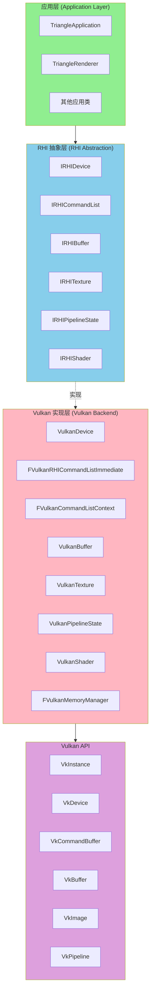

### 2. 命令列表系统架构

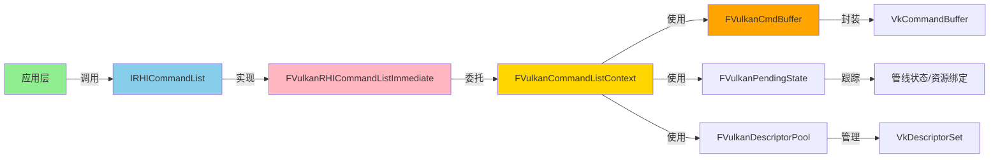

---

## 类关系图

### 1. RHI 接口层次结构

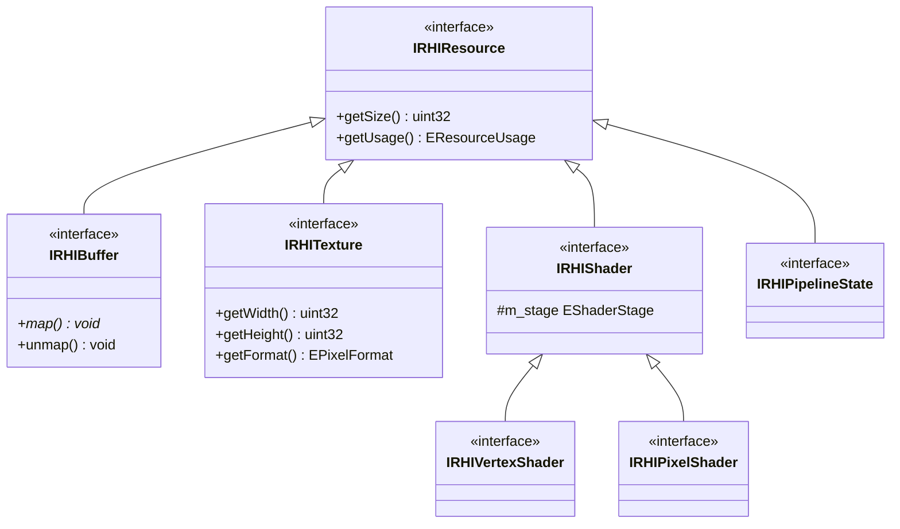

### 2. Vulkan 实现类层次

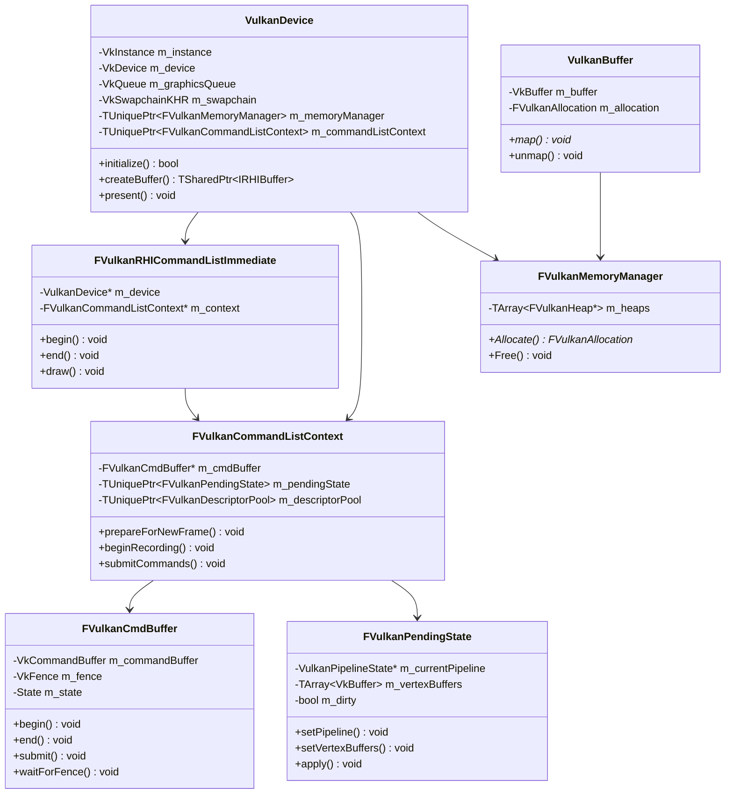

### 3. 应用层类关系

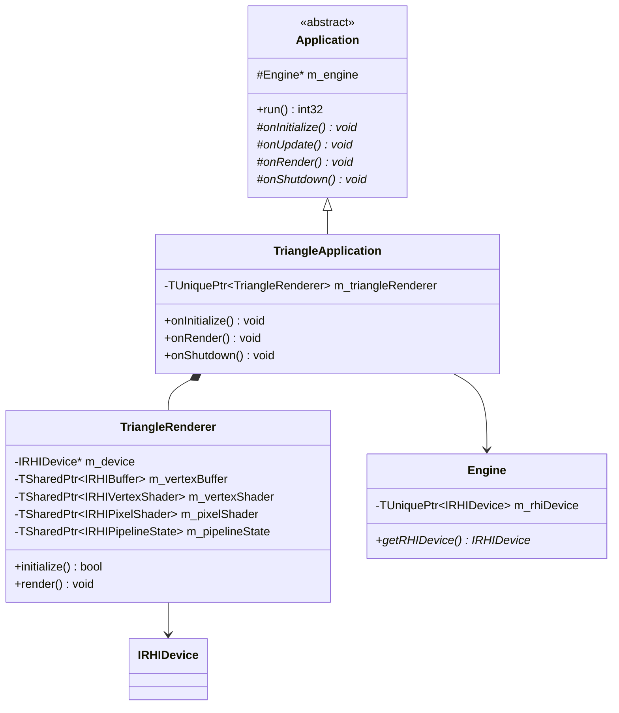

---

## 渲染流程图

### 1. 完整渲染循环

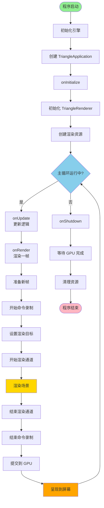

### 2. 三角形渲染详细流程

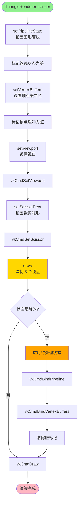

### 3. 资源创建流程

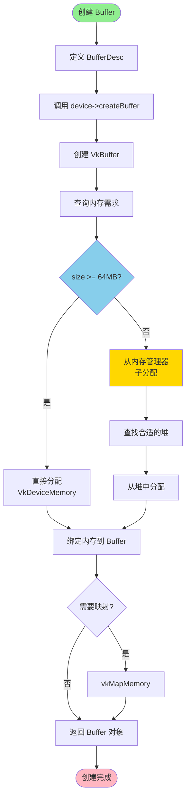

### 4. 管线状态创建流程

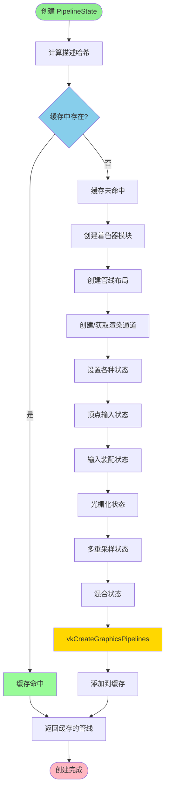

---

## 时序图

### 1. 帧渲染时序

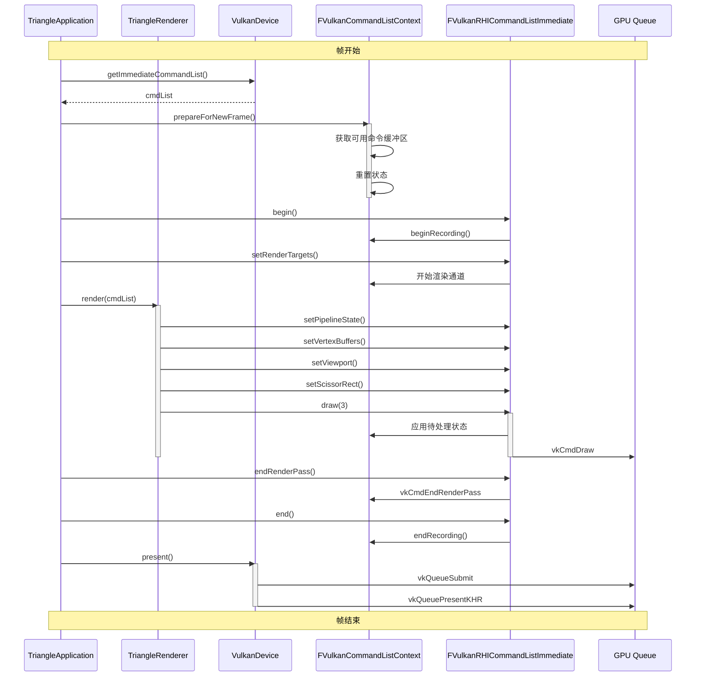

### 2. 资源创建时序

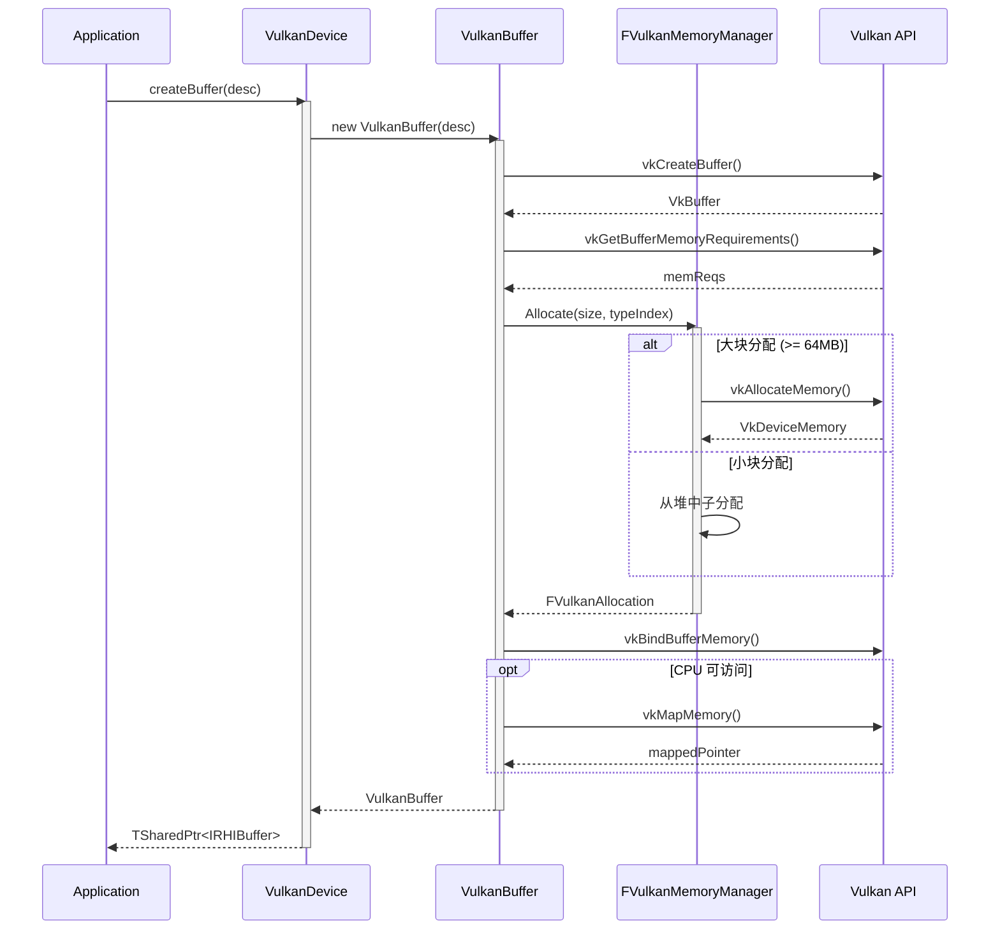

### 3. 同步时序（双缓冲）

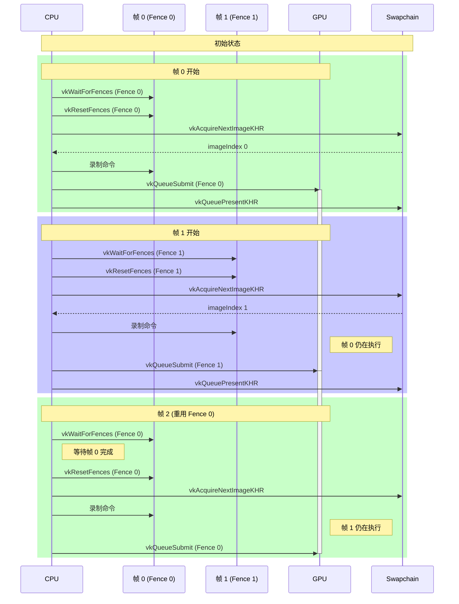

---

## 状态机图

### 1. 命令缓冲区状态机

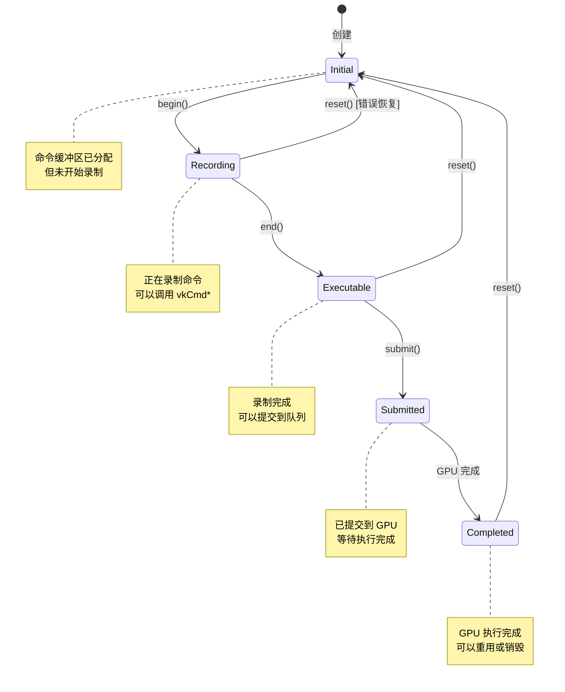

### 2. 渲染通道状态机

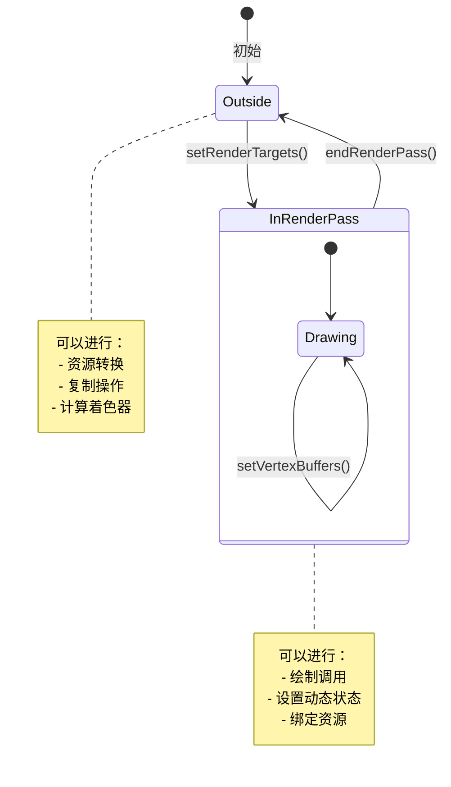

### 3. 资源状态转换

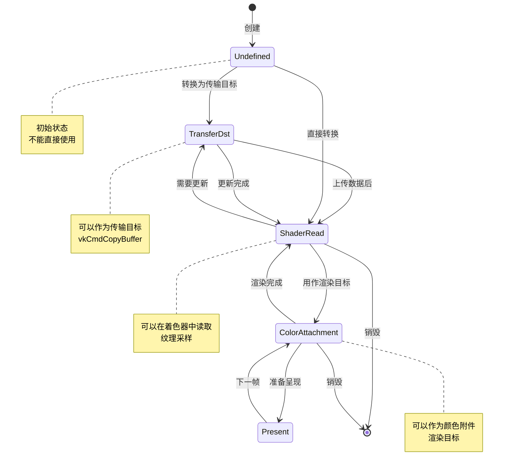

---

## 性能分析图

### 1. 帧时间分解

```mermaid
gantt
    title 典型帧时间分解 (60 FPS = 16.67ms)
    dateFormat X
    axisFormat %L ms
    
    section CPU
    应用逻辑         :0, 2
    命令录制         :2, 4
    资源更新         :4, 1
    
    section GPU
    等待             :0, 3
    顶点处理         :3, 2
    光栅化           :5, 3
    片段着色         :8, 4
    混合输出         :12, 1
    
    section 呈现
    交换链等待       :13, 2
    扫描输出         :15, 1.67
```

### 2. 内存分配策略对比

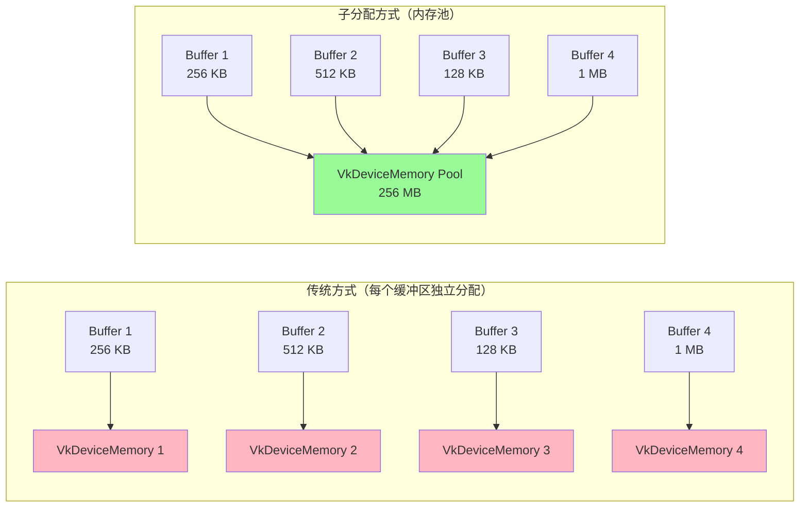

**对比**:
- **传统方式**: 4 次 VkDeviceMemory 分配，容易达到驱动限制
- **子分配**: 1 次大块分配，内部管理多个缓冲区

---

## 总结

### 关键架构图

1. **系统分层**: 应用层 → RHI 抽象 → Vulkan 实现 → Vulkan API
2. **命令列表**: FVulkanRHICommandListImmediate → FVulkanCommandListContext → FVulkanCmdBuffer
3. **资源管理**: IRHIDevice (工厂) → VulkanBuffer/Texture → FVulkanMemoryManager

### 关键流程

1. **渲染循环**: 准备帧 → 录制命令 → 提交 → 呈现
2. **资源创建**: 描述 → Vulkan 对象 → 内存分配 → 绑定
3. **同步机制**: 围栏（CPU-GPU）+ 信号量（GPU-GPU）

### 设计模式

1. **抽象工厂**: IRHIDevice 创建各种资源
2. **外观模式**: FVulkanRHICommandListImmediate 简化接口
3. **对象池**: 命令缓冲区、描述符集重用
4. **状态模式**: 命令缓冲区状态转换

---

**文档结束**

