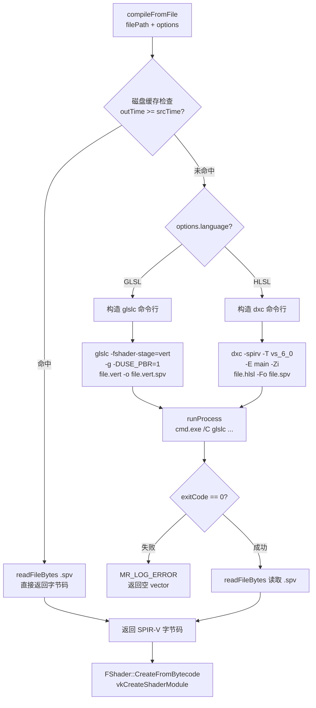
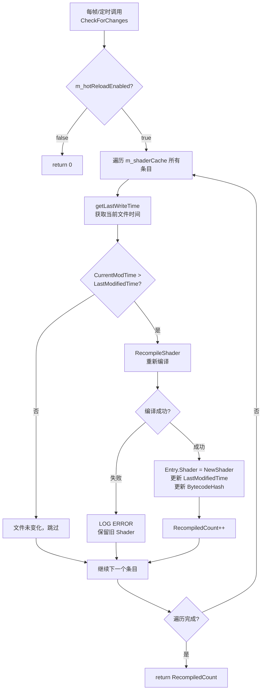
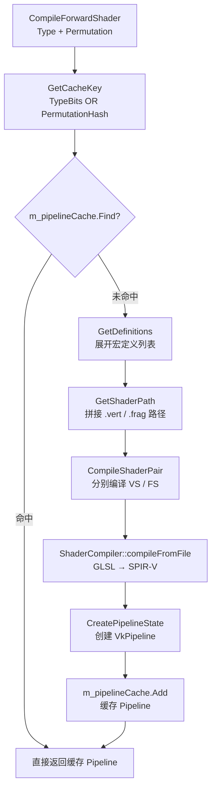
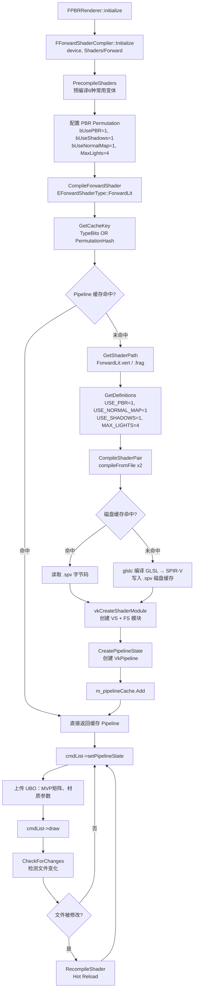

# MonsterEngine Shader 管理与编译开发文档

> 参考 UE5：`FShaderCompilingManager`、`FShaderCompiler`
> 相关源码：`ShaderManager.h/cpp`、`ShaderCompiler.h/cpp`、`ForwardShaderCompiler.h/cpp`

---

## 一、整体架构概览

### 1.1 系统分层

```
┌──────────────────────────────────────────────────────────┐
│              应用层 / 渲染器层                             │
│   FPBRRenderer / CubeSceneApplication / ForwardRenderer  │
└─────────────────────────┬────────────────────────────────┘
                          │
         ┌────────────────┴───────────────┐
         ▼                                ▼
┌─────────────────────┐      ┌───────────────────────────┐
│   FShaderManager    │      │  FForwardShaderCompiler   │
│  （通用 Shader 管理）│      │  （Forward 渲染专用）      │
│  - 编译 & 内存缓存   │      │  - Permutation 管理        │
│  - Hot Reload       │      │  - Pipeline 缓存           │
│  - 默认 Shader      │      │  - 预编译常用变体           │
└──────────┬──────────┘      └──────────┬────────────────┘
           └─────────────┬──────────────┘
                         │ compileFromFile()
                         ▼
         ┌──────────────────────────────┐
         │  ShaderCompiler（底层工具类） │
         │  - GLSL → glslc → SPIR-V    │
         │  - HLSL → dxc   → SPIR-V    │
         │  - 磁盘缓存（.spv 文件）      │
         │  - runProcess() 子进程调用    │
         └──────────────┬───────────────┘
                        ▼
         ┌──────────────────────────────┐
         │   RHI 层                     │
         │   vkCreateShaderModule()     │
         │   FShader::CreateFromBytecode│
         └──────────────────────────────┘
```

### 1.2 代码结构图

```
MonsterEngine/
├── Include/
│   ├── Core/
│   │   └── ShaderCompiler.h           ← 底层编译器接口（glslc/dxc）
│   ├── Engine/Shader/
│   │   └── ShaderManager.h            ← 通用 Shader 管理器
│   └── Renderer/
│       └── ForwardShaderCompiler.h    ← Forward 渲染 Shader 编译器
└── Source/
    ├── Core/
    │   └── ShaderCompiler.cpp         ← 子进程调用、磁盘缓存
    ├── Engine/Shader/
    │   └── ShaderManager.cpp          ← 编译、内存缓存、Hot Reload
    └── Renderer/
        └── ForwardShaderCompiler.cpp  ← Permutation 管理、Pipeline 缓存
```

---

## 二、UML 类图

```
┌──────────────────────────────────────────────────────────────┐
│                <<Singleton>> FShaderManager                  │
├──────────────────────────────────────────────────────────────┤
│ - m_device: IRHIDevice*                                      │
│ - m_shaderCache: TMap<FName, FShaderCacheEntry>              │
│ - m_shaderDirectory: String                                  │
│ - m_includePaths: TArray<String>                             │
│ - m_defaultVertexShader: TSharedPtr<FVertexShader>           │
│ - m_errorShader: TSharedPtr<FPixelShader>                    │
│ - m_hotReloadEnabled: bool                                   │
├──────────────────────────────────────────────────────────────┤
│ + Get(): FShaderManager&                                     │
│ + Initialize(Device): bool                                   │
│ + CompileVertexShader(path,entry,defs): FVertexShader*       │
│ + CompilePixelShader(path,entry,defs): FPixelShader*         │
│ + CreateShaderFromBytecode(bytecode,freq): FShader*          │
│ + GetCachedShader(name): FShader*                            │
│ + CheckForChanges(): int32                                   │
│ + RecompileShader(name): bool                                │
│ - CompileShaderInternal(options): FShader*                   │
└──────────────────────────────────────────────────────────────┘
         │ 1 ──── * FShaderCacheEntry
         ▼
┌──────────────────────────────────────────────────────────────┐
│                    FShaderCacheEntry                         │
├──────────────────────────────────────────────────────────────┤
│ + Shader: TSharedPtr<FShader>                                │
│ + SourcePath: String                                         │
│ + LastModifiedTime: uint64   ← Hot Reload 时间戳基准         │
│ + BytecodeHash: uint64                                       │
│ + bValid: bool                                               │
└──────────────────────────────────────────────────────────────┘

┌──────────────────────────────────────────────────────────────┐
│           <<Singleton>> FForwardShaderCompiler               │
├──────────────────────────────────────────────────────────────┤
│ - m_device: IRHIDevice*                                      │
│ - m_shaderDirectory: String                                  │
│ - m_pipelineCache: TMap<uint64, IRHIPipelineState*>          │
├──────────────────────────────────────────────────────────────┤
│ + CompileForwardShader(type,perm): IRHIPipelineState*        │
│ + GetCachedPipeline(type,perm): IRHIPipelineState*           │
│ + PrecompileShaders(): int32                                 │
│ - CompileShaderPair(vs,fs,defs,...): bool                    │
│ - GetCacheKey(type,perm): uint64                             │
└──────────────────────────────────────────────────────────────┘
         │ uses
         ▼
┌──────────────────────────────────────────────────────────────┐
│               FForwardShaderPermutation                      │
├──────────────────────────────────────────────────────────────┤
│ + bUseNormalMap:1  bUsePBR:1  bUseShadows:1  bUseCSM:1      │
│ + bUseAlphaTest:1  bUseSkinning:1  bUseInstancing:1          │
│ + MaxLights:4                                                │
├──────────────────────────────────────────────────────────────┤
│ + GetHash(): uint32                                          │
│ + GetDefinitions(): TArray<TPair<String,String>>             │
└──────────────────────────────────────────────────────────────┘

┌──────────────────────────────────────────────────────────────┐
│               ShaderCompiler（静态工具类）                    │
├──────────────────────────────────────────────────────────────┤
│ + compileFromFile(path, options): vector<uint8>              │
│ + readFileBytes(path): vector<uint8>                         │
│ + getLastWriteTime(path): uint64                             │
│ - runProcess(exe, args, ...): bool                           │
│ - getTemporarySpirvPath(path): String   → path + ".spv"      │
│ - getStageArgGLSLC(stage): String       → "vert" / "frag"    │
│ - getStageArgDXC(stage): String         → "vs_6_0"/"ps_6_0" │
└──────────────────────────────────────────────────────────────┘
```

---

## 三、GLSL → SPIR-V 编译流程

### 3.1 编译流程图



### 3.2 阶段参数映射

| 着色器阶段 | glslc 参数 | dxc 参数 |
|-----------|-----------|---------|
| Vertex    | `vert`    | `vs_6_0` |
| Fragment  | `frag`    | `ps_6_0` |
| Compute   | `comp`    | `cs_6_0` |

### 3.3 关键代码段

**磁盘缓存检查（Source/Core/ShaderCompiler.cpp）：**

```cpp
String outPath = getTemporarySpirvPath(filePath);  // filePath + ".spv"
uint64 srcTime = getLastWriteTime(filePath);
uint64 outTime = getLastWriteTime(outPath);
if (outTime && outTime >= srcTime) {
    return readFileBytes(outPath);  // 直接复用缓存，跳过编译
}
```

**GLSL 编译命令构造：**

```cpp
// glslc -fshader-stage=vert -g -DUSE_PBR=1 shader.vert -o shader.vert.spv
args.push_back("-fshader-stage=" + getStageArgGLSLC(options.stage));
if (options.generateDebugInfo) args.push_back("-g");
for (auto& def : options.definitions) args.push_back("-D" + def);
args.push_back(filePath);
args.push_back("-o");
args.push_back(outPath);
```

**HLSL 编译命令构造：**

```cpp
// dxc -spirv -T vs_6_0 -E main shader.hlsl -Fo shader.spv -Zi
args.push_back("-spirv");
args.push_back("-E"); args.push_back(options.entryPoint);
args.push_back("-T"); args.push_back(getStageArgDXC(options.stage));
if (options.generateDebugInfo) args.push_back("-Zi");
```

**子进程启动（Windows 平台）：**

```cpp
// 通过 cmd.exe /C 调用编译器，借助 PATH 查找 glslc/dxc
String fullCmd = "cmd.exe /C " + cmd;
CreateProcessA(nullptr, fullCmd.data(), nullptr, nullptr,
               FALSE, CREATE_NO_WINDOW, nullptr,
               workingDir.empty() ? nullptr : workingDir.c_str(), &si, &pi);
WaitForSingleObject(pi.hProcess, INFINITE);
DWORD code = 0;
GetExitCodeProcess(pi.hProcess, &code);
exitCode = static_cast<int>(code);
```

---

## 四、Hot Reload 机制

### 4.1 实现原理

```
Hot Reload 核心：文件修改时间戳比较

编译时记录：
  FShaderCacheEntry.LastModifiedTime = getLastWriteTime("Shaders/PBR.frag")
  → 例如：1708000000

每帧/定时检查：
  CurrentModTime = getLastWriteTime("Shaders/PBR.frag")
  if CurrentModTime > LastModifiedTime:
      → 文件被修改 → 触发 RecompileShader()
      → 新 Shader 替换旧 Shader（TSharedPtr 引用计数自动释放旧 VkShaderModule）
      → 更新 LastModifiedTime 基准
```

### 4.2 Hot Reload 流程图



### 4.3 关键代码段

**CheckForChanges 核心逻辑（Source/Engine/Shader/ShaderManager.cpp）：**

```cpp
int32 FShaderManager::CheckForChanges()
{
    if (!m_hotReloadEnabled) return 0;

    int32 RecompiledCount = 0;
    for (auto& Pair : m_shaderCache)
    {
        FShaderCacheEntry& Entry = Pair.Value;
        if (Entry.SourcePath.empty()) continue;

        uint64 CurrentModTime =
            MonsterRender::ShaderCompiler::getLastWriteTime(Entry.SourcePath);

        if (CurrentModTime > Entry.LastModifiedTime)
        {
            MR_LOG_DEBUG("FShaderManager: Detected change in '%s'", *Entry.SourcePath);
            if (RecompileShader(Pair.Key))
                RecompiledCount++;
        }
    }
    return RecompiledCount;
}
```

**RecompileShader 更新缓存条目：**

```cpp
bool FShaderManager::RecompileShader(const FName& Name)
{
    FShaderCacheEntry* Entry = m_shaderCache.Find(Name);
    TSharedPtr<FShader> OldShader = Entry->Shader;

    FShaderCompileOptions Options;
    Options.SourcePath  = Entry->SourcePath;
    Options.Frequency   = OldShader->GetFrequency();
    Options.IncludePaths = m_includePaths;

    TSharedPtr<FShader> NewShader = CompileShaderInternal(Options);
    if (!NewShader) return false;

    // 原子替换：TSharedPtr 自动释放旧 VkShaderModule
    Entry->Shader           = NewShader;
    Entry->BytecodeHash     = NewShader->GetBytecodeHash();
    Entry->LastModifiedTime =
        MonsterRender::ShaderCompiler::getLastWriteTime(Entry->SourcePath);
    return true;
}
```

**CacheShader 记录时间戳（首次编译基准）：**

```cpp
void FShaderManager::CacheShader(const FName& Name, TSharedPtr<FShader> Shader)
{
    FShaderCacheEntry Entry;
    Entry.Shader       = Shader;
    Entry.SourcePath   = Shader->GetSourcePath();
    Entry.BytecodeHash = Shader->GetBytecodeHash();
    Entry.bValid       = true;
    // 记录当前文件时间，作为 Hot Reload 的比较基准
    Entry.LastModifiedTime =
        MonsterRender::ShaderCompiler::getLastWriteTime(Entry.SourcePath);
    m_shaderCache.Add(Name, Entry);
}
```

---

## 五、Shader Permutation 系统

### 5.1 Permutation 概念

```
同一个 ForwardLit.frag 源文件，通过宏定义组合编译出多个变体：

变体1：USE_PBR=1, USE_NORMAL_MAP=1, USE_SHADOWS=1  → PBR + 法线贴图 + 阴影
变体2：USE_PBR=1, USE_NORMAL_MAP=0, USE_SHADOWS=0  → PBR 无法线贴图
变体3：USE_PBR=0, USE_SHADOWS=1                    → 非 PBR + 阴影

每种变体 = 独立的 SPIR-V 字节码 + 独立的 VkPipeline
Pipeline 缓存 Key = 高32位(ShaderType) | 低32位(PermutationHash)
```

### 5.2 FForwardShaderPermutation 位域设计

```cpp
// Include/Renderer/ForwardShaderCompiler.h
struct FForwardShaderPermutation
{
    uint32 bUseNormalMap : 1;   // bit 0
    uint32 bUsePBR       : 1;   // bit 1（默认开启）
    uint32 bUseShadows   : 1;   // bit 2（默认开启）
    uint32 bUseCSM       : 1;   // bit 3
    uint32 bUseAlphaTest : 1;   // bit 4
    uint32 bUseSkinning  : 1;   // bit 5
    uint32 bUseInstancing: 1;   // bit 6
    uint32 MaxLights     : 4;   // bit 7-10（最多16盏灯）

    uint32 GetHash() const {
        return (bUseNormalMap  << 0) | (bUsePBR        << 1) |
               (bUseShadows   << 2) | (bUseCSM         << 3) |
               (bUseAlphaTest << 4) | (bUseSkinning    << 5) |
               (bUseInstancing<< 6) | (MaxLights       << 7);
    }
};
```

### 5.3 Pipeline 缓存 Key 设计

```cpp
// Source/Renderer/ForwardShaderCompiler.cpp
uint64 FForwardShaderCompiler::GetCacheKey(
    EForwardShaderType Type,
    const FForwardShaderPermutation& Permutation) const
{
    // 高32位 = ShaderType，低32位 = PermutationHash
    uint64 TypeBits        = static_cast<uint64>(Type) << 32;
    uint64 PermutationBits = static_cast<uint64>(Permutation.GetHash());
    return TypeBits | PermutationBits;
}
```

### 5.4 Permutation → 宏定义展开

```cpp
// Source/Renderer/ForwardShaderCompiler.cpp
TArray<TPair<String, String>> FForwardShaderPermutation::GetDefinitions() const
{
    TArray<TPair<String, String>> Definitions;
    if (bUseNormalMap)  Definitions.Add({"USE_NORMAL_MAP", "1"});
    if (bUsePBR)        Definitions.Add({"USE_PBR",        "1"});
    if (bUseShadows)    Definitions.Add({"USE_SHADOWS",    "1"});
    if (bUseCSM)        Definitions.Add({"USE_CSM",        "1"});
    if (bUseAlphaTest)  Definitions.Add({"USE_ALPHA_TEST", "1"});
    if (bUseSkinning)   Definitions.Add({"USE_SKINNING",   "1"});
    if (bUseInstancing) Definitions.Add({"USE_INSTANCING", "1"});
    char buf[16]; sprintf_s(buf, 16, "%u", MaxLights);
    Definitions.Add({"MAX_LIGHTS", buf});
    // 最终传给 glslc：-DUSE_PBR=1 -DUSE_NORMAL_MAP=1 -DMAX_LIGHTS=4 ...
    return Definitions;
}
```

### 5.5 Permutation 编译流程图



### 5.6 预编译常用 Permutation

```cpp
// Source/Renderer/ForwardShaderCompiler.cpp
int32 FForwardShaderCompiler::PrecompileShaders()
{
    FForwardShaderPermutation DefaultPerm;  // bUsePBR=1, bUseShadows=1

    // 1. DepthOnly（最简变体）
    FForwardShaderPermutation DepthPerm;
    DepthPerm.bUsePBR = 0; DepthPerm.bUseShadows = 0;
    CompileForwardShader(EForwardShaderType::DepthOnly, DepthPerm);

    // 2. ForwardLit 默认（PBR + 阴影）
    CompileForwardShader(EForwardShaderType::ForwardLit, DefaultPerm);

    // 3. ForwardLit + 法线贴图
    FForwardShaderPermutation NormalMapPerm = DefaultPerm;
    NormalMapPerm.bUseNormalMap = 1;
    CompileForwardShader(EForwardShaderType::ForwardLit, NormalMapPerm);

    // 4. ShadowDepth（阴影贴图生成）
    CompileForwardShader(EForwardShaderType::ShadowDepth, DepthPerm);

    // 5. Skybox
    FForwardShaderPermutation SkyboxPerm;
    SkyboxPerm.bUsePBR = 0; SkyboxPerm.bUseShadows = 0;
    CompileForwardShader(EForwardShaderType::Skybox, SkyboxPerm);

    // 6. Transparent（复用 ForwardLit 源文件）
    CompileForwardShader(EForwardShaderType::Transparent, DefaultPerm);
}
```

---

## 六、OpenGL 与 Vulkan 的 Shader 兼容

### 6.1 兼容策略

```
MonsterEngine Shader 兼容方案：

源码层：统一使用 GLSL（#version 450）
         │
         ├─ Vulkan 路径：
         │    glslc 编译 → SPIR-V 字节码
         │    vkCreateShaderModule(device, spirvCode)
         │    绑定到 VkPipeline
         │
         └─ OpenGL 路径：
              方案A（OpenGL 4.5-）：直接传 GLSL 源码
                glShaderSource + glCompileShader
              方案B（OpenGL 4.6+）：传 SPIR-V
                glShaderBinary(GL_SPIR_V_BINARY) + glSpecializeShader
```

### 6.2 GLSL 兼容写法规范

```glsl
// ✅ 兼容写法（Vulkan + OpenGL 均支持）
#version 450
layout(location = 0) in  vec3 inPosition;
layout(location = 0) out vec4 outColor;
layout(binding = 0) uniform UBO { mat4 mvp; } ubo;
layout(binding = 1) uniform sampler2D albedoMap;

// ❌ 仅 Vulkan 支持（OpenGL 无此概念）
layout(push_constant) uniform PushConstants { vec4 data; };

// ❌ 旧版 OpenGL（已废弃，不可用于 Vulkan）
gl_FragColor = vec4(1.0);  // 应改为 layout(location=0) out vec4 outColor
```

### 6.3 两条后端路径对比

| 特性 | Vulkan 路径 | OpenGL 路径（方案A） |
|------|------------|---------------------|
| 输入格式 | SPIR-V 字节码 | GLSL 源码字符串 |
| 编译时机 | 离线（glslc） | 运行时（驱动编译） |
| 跨平台一致性 | 高（SPIR-V 标准化） | 低（驱动差异大） |
| 调试支持 | RenderDoc / SPIR-V Tools | glGetShaderInfoLog |
| API 调用 | vkCreateShaderModule | glShaderSource + glCompileShader |

---

## 七、两级缓存架构

### 7.1 缓存层次图

```
调用 CompileVertexShader("PBR.vert")
         │
         ▼
┌──────────────────────────────────────────────────────┐
│  Level 1：内存缓存（FShaderManager）                  │
│  TMap<FName, FShaderCacheEntry>                      │
│  命中 → 直接返回 VkShaderModule                      │
│  延迟：~0（纯内存哈希查找）                           │
└──────────────────────────┬───────────────────────────┘
                           │ 未命中
                           ▼
┌──────────────────────────────────────────────────────┐
│  Level 2：磁盘缓存（ShaderCompiler）                  │
│  shader.vert.spv 文件（时间戳比较）                   │
│  命中 → readFileBytes 读取 .spv                      │
│  延迟：~1-5ms（文件 IO）                              │
└──────────────────────────┬───────────────────────────┘
                           │ 未命中 / 源文件更新
                           ▼
┌──────────────────────────────────────────────────────┐
│  Level 3：实时编译（glslc / dxc 子进程）              │
│  延迟：~100-500ms                                    │
│  结果写入 .spv 文件 → 更新磁盘缓存                    │
│  结果存入 m_shaderCache → 更新内存缓存                │
└──────────────────────────────────────────────────────┘
```

### 7.2 FForwardShaderCompiler 的 Pipeline 缓存

```
FForwardShaderCompiler 额外维护一层 Pipeline 缓存：

TMap<uint64, TSharedPtr<IRHIPipelineState>> m_pipelineCache

Key = GetCacheKey(Type, Permutation) = TypeBits | PermutationHash

命中 → 直接返回 VkPipeline（避免重复创建 Pipeline 的高开销）
未命中 → CompileShaderPair → CreatePipelineState → 缓存
```

---

## 八、以 PBR Shader 为例说明使用流程

### 8.1 PBR Shader 文件结构

```
Shaders/
├── Forward/
│   ├── ForwardLit.vert    ← PBR 顶点着色器
│   └── ForwardLit.frag    ← PBR 片段着色器（含 USE_PBR/USE_NORMAL_MAP/USE_SHADOWS 分支）
├── DepthOnly.vert / .frag ← 深度预通道
├── ShadowDepth.vert/.frag ← 阴影贴图生成
├── Skybox.vert / .frag    ← 天空盒
└── Common/
    └── PBRFunctions.glsl  ← BRDF 公共函数库
```

### 8.2 PBR 完整使用流程图



### 8.3 PBR Permutation 配置代码

```cpp
// PBR Helmet 渲染使用的 Permutation 配置
FForwardShaderPermutation PBRPermutation;
PBRPermutation.bUsePBR       = 1;   // 开启 PBR 光照（Cook-Torrance BRDF）
PBRPermutation.bUseNormalMap = 1;   // 开启法线贴图
PBRPermutation.bUseShadows   = 1;   // 开启阴影
PBRPermutation.bUseCSM       = 0;   // 不使用级联阴影
PBRPermutation.MaxLights     = 4;   // 最多 4 盏灯

// 编译并获取 Pipeline（首次编译后自动缓存）
auto Pipeline = FForwardShaderCompiler::Get().CompileForwardShader(
    EForwardShaderType::ForwardLit, PBRPermutation);

// 渲染时直接使用缓存（O(1) 哈希查找）
auto CachedPipeline = FForwardShaderCompiler::Get().GetCachedPipeline(
    EForwardShaderType::ForwardLit, PBRPermutation);
```

### 8.4 PBR Shader 内部宏分支（GLSL 示意）

```glsl
// Shaders/Forward/ForwardLit.frag（简化示意）
#version 450

#ifdef USE_NORMAL_MAP
    vec3 normalSample = texture(normalTexture, texCoord).rgb * 2.0 - 1.0;
    vec3 N = normalize(TBN * normalSample);
#else
    vec3 N = normalize(fragNormal);
#endif

#ifdef USE_PBR
    // Cook-Torrance BRDF
    vec3 F0 = mix(vec3(0.04), baseColor, metallic);
    vec3 Lo = vec3(0.0);
    for (int i = 0; i < MAX_LIGHTS; ++i) {
        vec3  H = normalize(V + L);
        float D = DistributionGGX(N, H, roughness);
        float G = GeometrySmith(N, V, L, roughness);
        vec3  F = FresnelSchlick(max(dot(H, V), 0.0), F0);
        vec3 specular = (D * G * F) / (4.0 * NdotV * NdotL + 0.001);
        Lo += (kD * baseColor / PI + specular) * radiance * NdotL;
    }
#else
    vec3 Lo = baseColor * max(dot(N, L), 0.0);
#endif

#ifdef USE_SHADOWS
    float shadow = texture(shadowMap, shadowCoord).r;
    Lo *= shadow;
#endif
    outColor = vec4(Lo + ambient, 1.0);
```

### 8.5 默认 Shader 与 Error Shader

```cpp
// Source/Engine/Shader/ShaderManager.cpp
// 默认顶点着色器（内嵌 GLSL，编译失败时兜底）
static const char* DefaultVertexShaderSource = R"(
#version 450
layout(location = 0) in vec3 inPosition;
layout(binding = 0) uniform UBO { mat4 model; mat4 view; mat4 proj; } ubo;
void main() {
    gl_Position = ubo.proj * ubo.view * ubo.model * vec4(inPosition, 1.0);
}
)";

// Error Shader：洋红色棋盘格，可视化编译失败的 Shader
static const char* ErrorPixelShaderSource = R"(
#version 450
layout(location = 1) in vec2 fragTexCoord;
layout(location = 0) out vec4 outColor;
void main() {
    float checker = mod(
        floor(fragTexCoord.x * 10.0) + floor(fragTexCoord.y * 10.0), 2.0);
    vec3 color = mix(vec3(1.0, 0.0, 1.0), vec3(0.0), checker);
    outColor = vec4(color, 1.0);
}
)";
```

---

## 九、RHI 面试高频题（Top 5）

---

### Q1：Vulkan 为什么使用 SPIR-V 而不是直接使用 GLSL？

**【核心考点】**：SPIR-V 的设计动机、驱动解耦、编译一致性

**【结构化回答】**

**背景问题：**
- OpenGL 时代，GLSL 编译器内嵌在 GPU 驱动中，不同厂商（NVIDIA/AMD/Intel）的编译器行为不一致，同一段 GLSL 代码在不同平台上可能产生不同结果，甚至出现 Bug。
- 驱动内置编译器的编译质量参差不齐，且无法被应用层控制。

**SPIR-V 的解决方案：**

| 维度 | GLSL（OpenGL） | SPIR-V（Vulkan） |
|------|---------------|----------------|
| 编译位置 | GPU 驱动内部（运行时） | 离线工具（glslc/dxc） |
| 跨平台一致性 | 低（驱动差异大） | 高（标准化中间码） |
| 编译速度 | 运行时编译，影响启动 | 离线预编译，运行时直接加载 |
| 调试支持 | 有限 | SPIR-V Tools / RenderDoc 完整支持 |
| 多语言支持 | 仅 GLSL | GLSL/HLSL/Slang 均可编译到 SPIR-V |

**MonsterEngine 的实践：**
```
GLSL 源码 → glslc（离线）→ SPIR-V 字节码 → vkCreateShaderModule（运行时）
HLSL 源码 → dxc（离线）  → SPIR-V 字节码 → vkCreateShaderModule（运行时）
```
通过 `ShaderCompiler::compileFromFile` 封装这一过程，并用时间戳缓存避免重复编译。

---

### Q2：Shader 的 Hot Reload 是如何实现的？有什么注意事项？

**【核心考点】**：文件监控、线程安全、资源替换时机

**【结构化回答】**

**实现原理（三步）：**

1. **记录基准时间戳**：首次编译时，`CacheShader()` 调用 `getLastWriteTime()` 记录源文件的修改时间到 `FShaderCacheEntry.LastModifiedTime`。

2. **定时检测变化**：每帧或定时调用 `CheckForChanges()`，遍历所有缓存条目，比较当前文件时间与基准时间戳。

3. **原子替换**：检测到变化后调用 `RecompileShader()`，编译成功后用 `TSharedPtr` 替换旧 Shader，引用计数自动释放旧的 `VkShaderModule`。

**注意事项：**
- **线程安全**：`CheckForChanges()` 应在渲染线程调用，避免在 GPU 使用 Shader 时替换。
- **替换时机**：应在帧边界（非绘制命令执行期间）替换，防止 GPU 访问已销毁的 `VkShaderModule`。
- **编译失败保护**：`RecompileShader()` 编译失败时保留旧 Shader，不影响正常渲染。
- **依赖追踪**：当前实现仅监控直接源文件，若 `#include` 的头文件变化则无法检测（可扩展为递归依赖追踪）。

---

### Q3：Shader Permutation 是什么？如何避免 Permutation 爆炸？

**【核心考点】**：变体管理、编译时间、内存占用

**【结构化回答】**

**什么是 Permutation：**
同一个 Shader 源文件通过不同宏定义组合编译出多个功能变体。例如 `ForwardLit.frag` 有 7 个 Feature 开关，理论上最多 2^7 = 128 种变体。

**Permutation 爆炸的危害：**
- 编译时间急剧增加（每种变体需独立编译）
- 内存占用增大（每种变体对应独立的 VkPipeline）
- 磁盘缓存膨胀

**MonsterEngine 的控制策略：**

```cpp
// 1. 位域压缩：用 uint32 位域表示所有 Feature，GetHash() 生成唯一 Key
struct FForwardShaderPermutation {
    uint32 bUsePBR : 1;
    uint32 bUseShadows : 1;
    // ...
    uint32 GetHash() const { return (bUsePBR << 1) | (bUseShadows << 2) | ...; }
};

// 2. 按需编译：只编译实际用到的 Permutation，不预编译所有组合
auto Pipeline = CompileForwardShader(EForwardShaderType::ForwardLit, Permutation);

// 3. 预编译常用变体：PrecompileShaders() 只编译 6 种高频变体
// 4. Pipeline 缓存：相同 Key 直接复用，避免重复创建
```

**进一步优化方向（UE5 的做法）：**
- **静态分支消除**：用模板特化替代 `#ifdef`，让编译器消除死代码。
- **Uber Shader**：所有 Feature 合并到一个 Shader，运行时通过 UBO 控制分支（牺牲 GPU 性能换编译时间）。
- **按需异步编译**：后台线程编译，主线程先用 Fallback Shader 渲染。

---

### Q4：RHI 层的 Pipeline State Object（PSO）是什么？为什么要缓存它？

**【核心考点】**：PSO 的组成、创建开销、缓存策略

**【结构化回答】**

**PSO 的组成：**
```
VkPipeline（PSO）包含：
  ├─ VkShaderModule（VS + FS）
  ├─ 顶点输入布局（VkVertexInputState）
  ├─ 图元拓扑（VkInputAssemblyState）
  ├─ 光栅化状态（VkRasterizationState）：填充模式、剔除模式
  ├─ 深度/模板状态（VkDepthStencilState）
  ├─ 混合状态（VkColorBlendState）
  ├─ Viewport / Scissor
  └─ RenderPass 兼容性
```

**为什么要缓存：**
- `vkCreateGraphicsPipelines()` 是 Vulkan 中最昂贵的 API 调用之一，耗时可达 **数十到数百毫秒**（驱动内部需要编译 SPIR-V 到 GPU 机器码）。
- 若每帧重新创建 PSO，会导致严重卡顿。

**MonsterEngine 的 PSO 缓存：**
```cpp
// FForwardShaderCompiler 用 uint64 Key 缓存 Pipeline
// Key = 高32位(ShaderType) | 低32位(PermutationHash)
TMap<uint64, TSharedPtr<IRHIPipelineState>> m_pipelineCache;

// 查找：O(1) 哈希表
auto* Cached = m_pipelineCache.Find(CacheKey);
if (Cached) return *Cached;  // 命中，零开销
```

**进一步优化（UE5 PSO Cache）：**
- 将 PSO 序列化到磁盘（`.upipelinecache` 文件），下次启动直接加载，避免首帧卡顿。
- 异步 PSO 编译：后台线程预热，主线程先用简化 PSO 渲染。

---

### Q5：描述 MonsterEngine 的 Shader 编译完整链路，从源文件到 GPU 执行。

**【核心考点】**：全链路理解、各层职责

**【结构化回答】**

```
完整链路（以 PBR Shader 为例）：

1. 应用层调用
   FForwardShaderCompiler::CompileForwardShader(ForwardLit, PBRPermutation)

2. Permutation 展开
   GetDefinitions() → USE_PBR=1, USE_NORMAL_MAP=1, USE_SHADOWS=1, MAX_LIGHTS=4

3. 路径解析
   GetShaderPath() → Shaders/Forward/ForwardLit.vert / .frag

4. 底层编译（ShaderCompiler::compileFromFile）
   ├─ 检查磁盘缓存：ForwardLit.vert.spv 时间戳 >= 源文件？
   ├─ 命中 → 直接读取 .spv 字节码（~2ms）
   └─ 未命中 → 启动子进程：
       cmd.exe /C glslc -fshader-stage=vert
                        -DUSE_PBR=1 -DUSE_NORMAL_MAP=1
                        ForwardLit.vert -o ForwardLit.vert.spv
       WaitForSingleObject → 读取 .spv（~200ms）

5. RHI 层创建
   FShader::CreateFromBytecode(device, spirvBytecode)
   → vkCreateShaderModule(device, &moduleInfo, nullptr, &shaderModule)

6. Pipeline 创建
   CreatePipelineState(VS_Module, FS_Module)
   → vkCreateGraphicsPipelines(device, pipelineCache, 1, &pipelineInfo, ...)
   → 驱动内部将 SPIR-V 编译为 GPU 机器码（~100ms）

7. 渲染时使用
   cmdList->setPipelineState(pipeline)
   → vkCmdBindPipeline(commandBuffer, VK_PIPELINE_BIND_POINT_GRAPHICS, pipeline)
   → GPU 执行顶点/片段着色器
```

---

## 十、优化方法面试背诵逐字稿

> **题目方向**：请介绍一下你们引擎的 Shader 管理系统，以及你做了哪些优化？

---

**【逐字稿】**

我们引擎的 Shader 管理系统分为三个层次。

**第一层是底层编译器 `ShaderCompiler`**，它负责将 GLSL 或 HLSL 源码编译成 SPIR-V 字节码。具体实现是通过 `CreateProcessA` 启动 `glslc` 或 `dxc` 子进程，传入阶段参数和宏定义，等待编译完成后读取生成的 `.spv` 文件。为了避免每次启动都重新编译，我们实现了**基于文件修改时间戳的磁盘缓存**：每次编译前比较源文件和 `.spv` 文件的修改时间，如果 `.spv` 比源文件新，就直接复用，跳过子进程调用。这把热路径的编译开销从 200ms 降到了 2ms 左右的文件 IO。

**第二层是 `FShaderManager`**，它在内存中维护一个 `TMap<FName, FShaderCacheEntry>` 的 Shader 缓存。编译成功的 Shader 会被缓存起来，下次请求同名 Shader 时直接返回已有的 `VkShaderModule`，延迟接近零。同时，`FShaderManager` 还实现了 **Hot Reload 机制**：每帧调用 `CheckForChanges()`，遍历缓存中所有条目，比较源文件的当前修改时间和首次编译时记录的基准时间戳，一旦检测到变化就触发重编译，用 `TSharedPtr` 原子替换旧 Shader，引用计数自动释放旧的 `VkShaderModule`，整个过程对渲染线程透明。

**第三层是 `FForwardShaderCompiler`**，它专门管理 Forward 渲染管线的 Shader。这里引入了 **Shader Permutation 系统**：用一个位域结构体 `FForwardShaderPermutation` 表示所有 Feature 开关，比如是否开启 PBR、法线贴图、阴影等，通过 `GetHash()` 生成一个 `uint32` 哈希值，再与 Shader 类型组合成 `uint64` 的 Pipeline 缓存 Key。这样，相同的 Shader 类型加相同的 Feature 组合，只需创建一次 `VkPipeline`，后续直接从 `TMap` 中 O(1) 查找返回。

**在优化方面，我们主要做了以下几点：**

第一，**三级缓存**：内存缓存（零延迟）→ 磁盘缓存（文件 IO）→ 实时编译（子进程），大幅减少重复编译开销。

第二，**预编译常用变体**：在初始化阶段调用 `PrecompileShaders()`，提前编译 DepthOnly、ForwardLit、ForwardLit+NormalMap、ShadowDepth、Skybox、Transparent 这 6 种最常用的 Permutation，避免运行时首次使用时的卡顿。

第三，**Pipeline 缓存**：`vkCreateGraphicsPipelines` 是 Vulkan 中最昂贵的调用之一，耗时可达数百毫秒。我们用 `uint64` Key 缓存所有已创建的 Pipeline，相同配置直接复用，彻底消除重复创建的开销。

第四，**Error Shader 兜底**：编译失败时自动回退到内嵌的洋红色棋盘格 Error Shader，保证渲染不中断，同时提供直观的视觉反馈，方便开发时定位问题。

**如果进一步优化，我会考虑以下方向：**

一是**异步编译**：将 `glslc` 子进程调用移到后台线程，主线程先用 Fallback Shader 渲染，编译完成后无缝切换，彻底消除首帧卡顿。

二是**PSO 序列化**：将编译好的 `VkPipeline` 序列化到磁盘（参考 UE5 的 PSO Cache），下次启动直接加载 GPU 机器码，跳过驱动内部的 SPIR-V 编译阶段。

三是**依赖追踪**：当前 Hot Reload 只监控直接源文件，如果 `#include` 的公共头文件变化则无法检测。可以在编译时解析 `#include` 依赖树，对所有依赖文件建立监控。

四是**Permutation 裁剪**：分析实际使用的 Feature 组合，对从未使用的 Permutation 进行静态裁剪，减少编译时间和内存占用。

---

