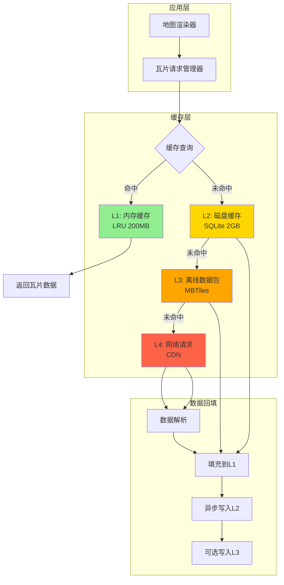
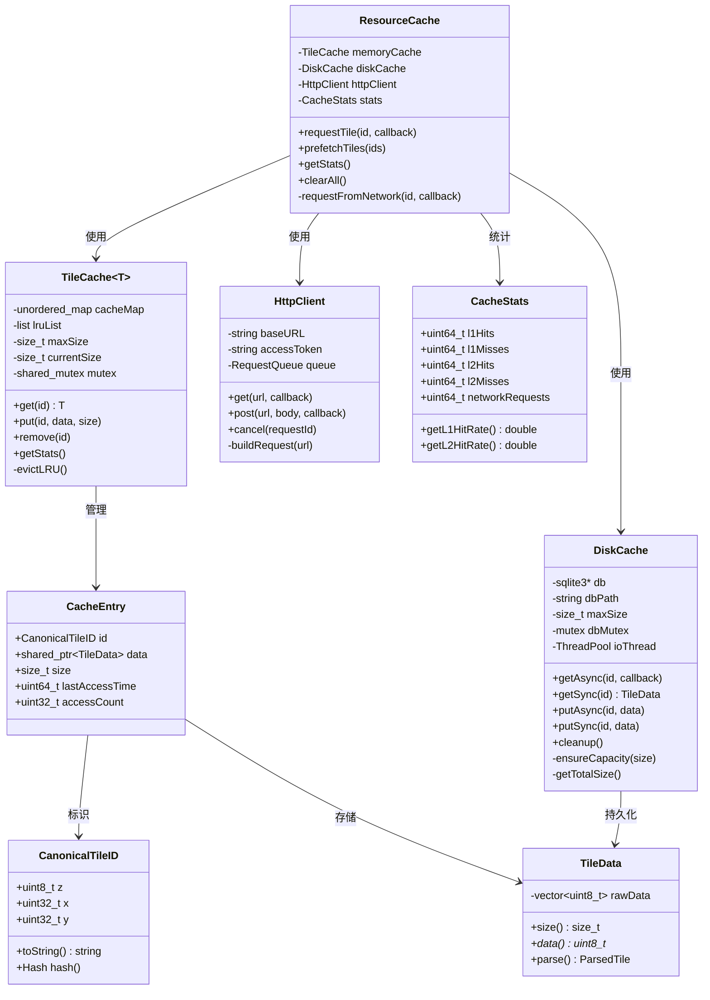
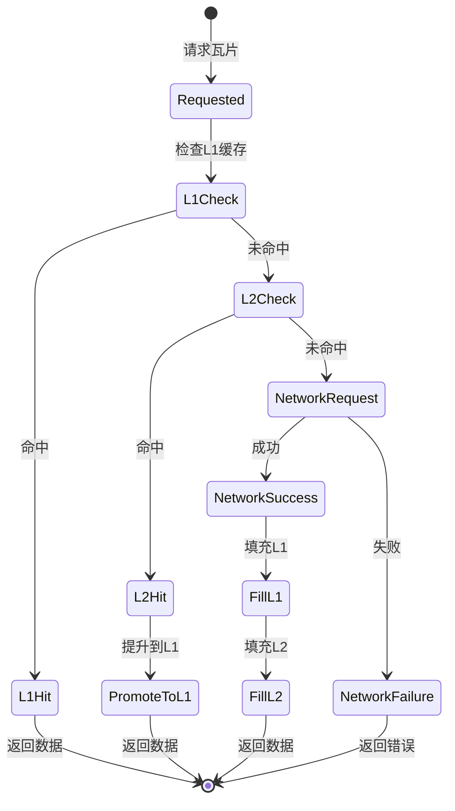
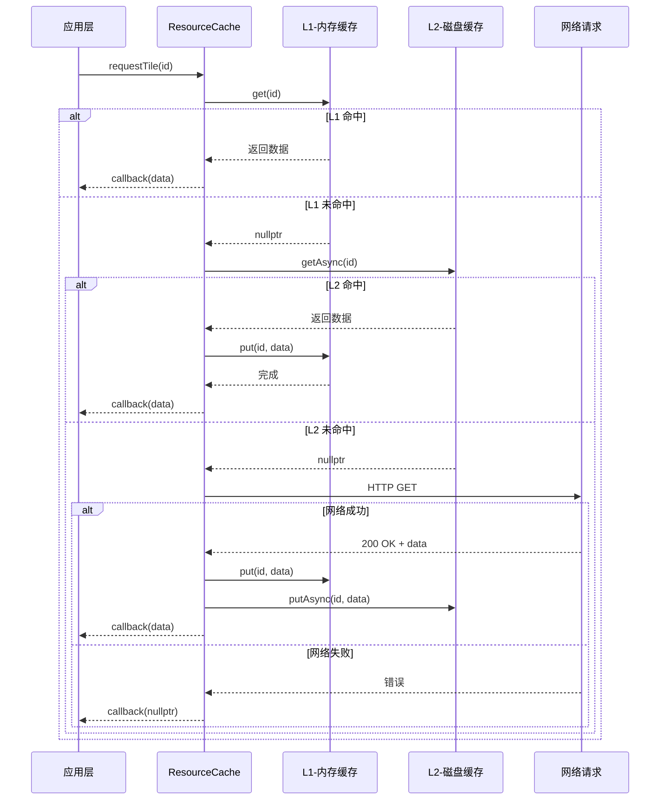
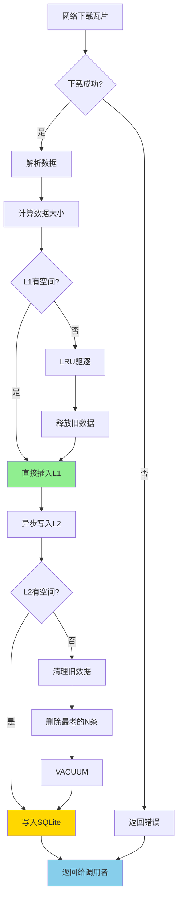
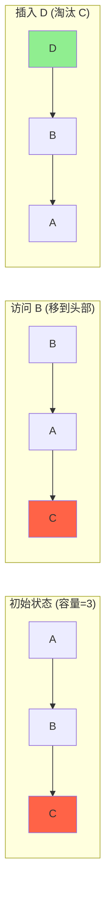

# 多级缓存机制详解 - 面试标准答案

## 概述

多级缓存机制是现代地图渲染引擎中至关重要的性能优化手段。本文档基于 **Mapbox GL** 的实现，详细讲解多级缓存的设计原理、关键源码和最佳实践。

---

## 一、多级缓存机制基础

### 1.1 什么是多级缓存？

多级缓存是一种分层的数据存储策略，通过将数据存储在不同速度和容量的存储介质中，平衡访问速度和存储成本。

### 1.2 为什么需要多级缓存？

在地图渲染场景中：

**问题背景**：
- 3D Tiles 或地图瓦片数量巨大（数万到数十万个）
- 瓦片数据包含模型、纹理、元数据等，单个瓦片可能数MB
- 全部加载到内存不现实（内存有限，尤其移动端）
- 从网络实时下载延迟高（100-500ms）

**解决方案**：
- **L1 缓存（内存）**：最快，容量小（几百MB），存储当前视野和热点数据
- **L2 缓存（磁盘）**：较快，容量中等（几GB），存储最近访问的数据
- **L3 缓存（数据库/文件系统）**：慢，容量大（几十GB），持久化存储
- **L4 数据源（网络）**：最慢，容量无限，作为最终数据源

### 1.3 性能对比

| 缓存层级 | 访问速度 | 容量 | 典型用途 |
|---------|---------|------|---------|
| L1 - 内存缓存 | < 1ms | 200-500 MB | 当前视野瓦片 |
| L2 - 磁盘缓存 | 5-20ms | 2-5 GB | 最近访问瓦片 |
| L3 - 持久化存储 | 20-100ms | 10-50 GB | 历史数据 |
| L4 - 网络请求 | 100-500ms | 无限 | 数据源 |

---

## 二、Mapbox GL 多级缓存架构

### 2.1 整体架构图



### 2.2 缓存层级详解

#### L1: 内存缓存（Hot Cache）

**特点**：
- 使用 **LRU (Least Recently Used)** 算法
- 固定大小限制（通常 200-500 MB）
- 线程安全（读写锁）
- 最高优先级访问

**数据结构**：
```cpp
class MemoryCache {
private:
    struct CacheEntry {
        std::string key;                    // 瓦片ID
        std::shared_ptr<TileData> data;     // 瓦片数据
        size_t size;                        // 数据大小
        uint64_t lastAccessTime;            // 最后访问时间
        uint32_t accessCount;               // 访问计数
    };
    
    std::unordered_map<std::string, 
        std::list<CacheEntry>::iterator> m_cacheMap;  // 快速查找
    std::list<CacheEntry> m_lruList;                  // LRU链表
    
    size_t m_currentSize;                             // 当前大小
    size_t m_maxSize;                                 // 最大容量
    
    mutable std::shared_mutex m_mutex;                // 读写锁
};
```

#### L2: 磁盘缓存（Warm Cache）

**特点**：
- 使用 **SQLite** 数据库存储
- 容量限制（2-5 GB）
- 异步读写（避免阻塞主线程）
- 持久化存储

**数据库模式**：
```sql
CREATE TABLE IF NOT EXISTS tile_cache (
    tile_id TEXT PRIMARY KEY,          -- 瓦片唯一ID (z/x/y格式)
    tile_data BLOB NOT NULL,           -- 瓦片二进制数据
    size INTEGER NOT NULL,             -- 数据大小（字节）
    created_time INTEGER NOT NULL,     -- 创建时间戳
    last_access_time INTEGER NOT NULL, -- 最后访问时间
    access_count INTEGER DEFAULT 1,    -- 访问次数
    etag TEXT,                         -- HTTP ETag (缓存验证)
    expires INTEGER                    -- 过期时间
);

CREATE INDEX idx_last_access ON tile_cache(last_access_time);
CREATE INDEX idx_size ON tile_cache(size);
```

#### L3: 离线数据包（Cold Cache）

**特点**：
- 使用 **MBTiles** 格式（基于 SQLite）
- 预下载的离线地图数据
- 只读访问
- 低优先级

#### L4: 网络请求

**特点**：
- HTTP/HTTPS 请求
- CDN 加速
- 支持 ETag 和 Last-Modified 缓存验证
- 重试和降级策略

---

## 三、关键源码分析（基于 Mapbox GL）

### 3.1 内存缓存实现（L1）

#### 3.1.1 LRU 缓存类定义

```cpp
// 参考: mapbox-gl-native/src/mbgl/util/tile_cache.hpp
namespace mbgl {

template <typename T>
class TileCache {
public:
    TileCache(size_t maxSize) 
        : m_maxSize(maxSize), m_currentSize(0) {}
    
    // 获取瓦片（如果存在）
    std::shared_ptr<T> get(const CanonicalTileID& id) {
        std::shared_lock<std::shared_mutex> lock(m_mutex);
        
        auto it = m_cacheMap.find(id);
        if (it == m_cacheMap.end()) {
            return nullptr;  // 缓存未命中
        }
        
        // 移动到链表头部（最近使用）
        m_lruList.splice(m_lruList.begin(), m_lruList, it->second);
        it->second->lastAccessTime = getCurrentTimestamp();
        it->second->accessCount++;
        
        return it->second->data;
    }
    
    // 插入瓦片
    void put(const CanonicalTileID& id, 
             std::shared_ptr<T> data, 
             size_t size) {
        std::unique_lock<std::shared_mutex> lock(m_mutex);
        
        // 检查是否已存在
        auto it = m_cacheMap.find(id);
        if (it != m_cacheMap.end()) {
            // 更新现有条目
            m_currentSize -= it->second->size;
            it->second->data = data;
            it->second->size = size;
            it->second->lastAccessTime = getCurrentTimestamp();
            m_currentSize += size;
            
            // 移到链表头部
            m_lruList.splice(m_lruList.begin(), m_lruList, it->second);
            return;
        }
        
        // 确保有足够空间
        while (m_currentSize + size > m_maxSize && !m_lruList.empty()) {
            evictLRU();
        }
        
        // 插入新条目
        CacheEntry entry{id, data, size, getCurrentTimestamp(), 1};
        m_lruList.push_front(std::move(entry));
        m_cacheMap[id] = m_lruList.begin();
        m_currentSize += size;
    }
    
    // 清除特定瓦片
    void remove(const CanonicalTileID& id) {
        std::unique_lock<std::shared_mutex> lock(m_mutex);
        
        auto it = m_cacheMap.find(id);
        if (it != m_cacheMap.end()) {
            m_currentSize -= it->second->size;
            m_lruList.erase(it->second);
            m_cacheMap.erase(it);
        }
    }
    
    // 获取缓存统计
    CacheStats getStats() const {
        std::shared_lock<std::shared_mutex> lock(m_mutex);
        return {
            m_cacheMap.size(),
            m_currentSize,
            m_maxSize,
            (double)m_currentSize / m_maxSize
        };
    }

private:
    struct CacheEntry {
        CanonicalTileID id;
        std::shared_ptr<T> data;
        size_t size;
        uint64_t lastAccessTime;
        uint32_t accessCount;
    };
    
    // 驱逐最少使用的条目
    void evictLRU() {
        if (m_lruList.empty()) return;
        
        auto& lru = m_lruList.back();
        m_currentSize -= lru.size;
        m_cacheMap.erase(lru.id);
        m_lruList.pop_back();
    }
    
    uint64_t getCurrentTimestamp() const {
        return std::chrono::duration_cast<std::chrono::milliseconds>(
            std::chrono::system_clock::now().time_since_epoch()
        ).count();
    }
    
    std::unordered_map<CanonicalTileID, 
        typename std::list<CacheEntry>::iterator> m_cacheMap;
    std::list<CacheEntry> m_lruList;
    
    size_t m_maxSize;
    size_t m_currentSize;
    
    mutable std::shared_mutex m_mutex;
};

} // namespace mbgl
```

#### 3.1.2 瓦片 ID 定义

```cpp
// 参考: mapbox-gl-native/src/mbgl/tile/tile_id.hpp
struct CanonicalTileID {
    uint8_t z;   // 缩放级别 (0-22)
    uint32_t x;  // X 坐标
    uint32_t y;  // Y 坐标
    
    // 生成唯一键
    std::string toString() const {
        return std::to_string(z) + "/" + 
               std::to_string(x) + "/" + 
               std::to_string(y);
    }
    
    // 哈希函数（用于 unordered_map）
    struct Hash {
        size_t operator()(const CanonicalTileID& id) const {
            size_t h1 = std::hash<uint8_t>{}(id.z);
            size_t h2 = std::hash<uint32_t>{}(id.x);
            size_t h3 = std::hash<uint32_t>{}(id.y);
            return h1 ^ (h2 << 1) ^ (h3 << 2);
        }
    };
    
    bool operator==(const CanonicalTileID& other) const {
        return z == other.z && x == other.x && y == other.y;
    }
};
```

### 3.2 磁盘缓存实现（L2）

#### 3.2.1 SQLite 磁盘缓存类

```cpp
// 参考: mapbox-gl-native/platform/default/src/mbgl/storage/offline_database.cpp
namespace mbgl {

class DiskCache {
public:
    DiskCache(const std::string& dbPath, size_t maxSize)
        : m_dbPath(dbPath), m_maxSize(maxSize) {
        openDatabase();
        createTables();
    }
    
    // 异步读取瓦片
    void getAsync(const CanonicalTileID& id, 
                  std::function<void(std::shared_ptr<TileData>)> callback) {
        // 投递到后台线程
        m_ioThread.post([this, id, callback]() {
            auto data = this->getSync(id);
            
            // 回调到主线程
            m_mainThread.post([callback, data]() {
                callback(data);
            });
        });
    }
    
    // 同步读取瓦片
    std::shared_ptr<TileData> getSync(const CanonicalTileID& id) {
        std::lock_guard<std::mutex> lock(m_dbMutex);
        
        sqlite3_stmt* stmt = nullptr;
        const char* sql = 
            "SELECT tile_data, size, etag FROM tile_cache WHERE tile_id = ?";
        
        if (sqlite3_prepare_v2(m_db, sql, -1, &stmt, nullptr) != SQLITE_OK) {
            return nullptr;
        }
        
        std::string tileId = id.toString();
        sqlite3_bind_text(stmt, 1, tileId.c_str(), -1, SQLITE_TRANSIENT);
        
        std::shared_ptr<TileData> result = nullptr;
        
        if (sqlite3_step(stmt) == SQLITE_ROW) {
            // 读取数据
            const void* blob = sqlite3_column_blob(stmt, 0);
            int blobSize = sqlite3_column_bytes(stmt, 0);
            
            std::vector<uint8_t> data(blobSize);
            std::memcpy(data.data(), blob, blobSize);
            
            result = std::make_shared<TileData>(std::move(data));
            
            // 更新访问时间和计数
            updateAccessInfo(id);
        }
        
        sqlite3_finalize(stmt);
        return result;
    }
    
    // 异步写入瓦片
    void putAsync(const CanonicalTileID& id, 
                  std::shared_ptr<TileData> data,
                  const std::string& etag = "") {
        m_ioThread.post([this, id, data, etag]() {
            this->putSync(id, data, etag);
        });
    }
    
    // 同步写入瓦片
    void putSync(const CanonicalTileID& id, 
                 std::shared_ptr<TileData> data,
                 const std::string& etag = "") {
        std::lock_guard<std::mutex> lock(m_dbMutex);
        
        // 检查容量，必要时清理
        ensureCapacity(data->size());
        
        sqlite3_stmt* stmt = nullptr;
        const char* sql = R"(
            INSERT OR REPLACE INTO tile_cache 
            (tile_id, tile_data, size, created_time, last_access_time, etag)
            VALUES (?, ?, ?, ?, ?, ?)
        )";
        
        if (sqlite3_prepare_v2(m_db, sql, -1, &stmt, nullptr) != SQLITE_OK) {
            return;
        }
        
        std::string tileId = id.toString();
        uint64_t now = getCurrentTimestamp();
        
        sqlite3_bind_text(stmt, 1, tileId.c_str(), -1, SQLITE_TRANSIENT);
        sqlite3_bind_blob(stmt, 2, data->data(), data->size(), SQLITE_TRANSIENT);
        sqlite3_bind_int64(stmt, 3, data->size());
        sqlite3_bind_int64(stmt, 4, now);
        sqlite3_bind_int64(stmt, 5, now);
        sqlite3_bind_text(stmt, 6, etag.c_str(), -1, SQLITE_TRANSIENT);
        
        sqlite3_step(stmt);
        sqlite3_finalize(stmt);
    }
    
    // 清理过期数据
    void cleanup() {
        std::lock_guard<std::mutex> lock(m_dbMutex);
        
        // 获取当前总大小
        size_t currentSize = getTotalSize();
        
        if (currentSize <= m_maxSize) {
            return;
        }
        
        // 删除最老的数据，直到低于阈值
        size_t targetSize = m_maxSize * 0.8;  // 目标：80% 容量
        
        const char* sql = R"(
            DELETE FROM tile_cache 
            WHERE tile_id IN (
                SELECT tile_id FROM tile_cache 
                ORDER BY last_access_time ASC 
                LIMIT ?
            )
        )";
        
        // 计算需要删除的条目数
        int deleteCount = estimateDeleteCount(currentSize - targetSize);
        
        sqlite3_stmt* stmt = nullptr;
        sqlite3_prepare_v2(m_db, sql, -1, &stmt, nullptr);
        sqlite3_bind_int(stmt, 1, deleteCount);
        sqlite3_step(stmt);
        sqlite3_finalize(stmt);
        
        // 执行 VACUUM 回收空间
        sqlite3_exec(m_db, "VACUUM", nullptr, nullptr, nullptr);
    }

private:
    void openDatabase() {
        int rc = sqlite3_open(m_dbPath.c_str(), &m_db);
        if (rc != SQLITE_OK) {
            throw std::runtime_error("Failed to open database");
        }
        
        // 性能优化设置
        sqlite3_exec(m_db, "PRAGMA journal_mode=WAL", nullptr, nullptr, nullptr);
        sqlite3_exec(m_db, "PRAGMA synchronous=NORMAL", nullptr, nullptr, nullptr);
        sqlite3_exec(m_db, "PRAGMA cache_size=10000", nullptr, nullptr, nullptr);
    }
    
    void createTables() {
        const char* sql = R"(
            CREATE TABLE IF NOT EXISTS tile_cache (
                tile_id TEXT PRIMARY KEY,
                tile_data BLOB NOT NULL,
                size INTEGER NOT NULL,
                created_time INTEGER NOT NULL,
                last_access_time INTEGER NOT NULL,
                access_count INTEGER DEFAULT 1,
                etag TEXT,
                expires INTEGER
            );
            
            CREATE INDEX IF NOT EXISTS idx_last_access 
                ON tile_cache(last_access_time);
            CREATE INDEX IF NOT EXISTS idx_size 
                ON tile_cache(size);
        )";
        
        sqlite3_exec(m_db, sql, nullptr, nullptr, nullptr);
    }
    
    void updateAccessInfo(const CanonicalTileID& id) {
        const char* sql = R"(
            UPDATE tile_cache 
            SET last_access_time = ?, 
                access_count = access_count + 1 
            WHERE tile_id = ?
        )";
        
        sqlite3_stmt* stmt = nullptr;
        sqlite3_prepare_v2(m_db, sql, -1, &stmt, nullptr);
        
        uint64_t now = getCurrentTimestamp();
        std::string tileId = id.toString();
        
        sqlite3_bind_int64(stmt, 1, now);
        sqlite3_bind_text(stmt, 2, tileId.c_str(), -1, SQLITE_TRANSIENT);
        
        sqlite3_step(stmt);
        sqlite3_finalize(stmt);
    }
    
    size_t getTotalSize() {
        const char* sql = "SELECT SUM(size) FROM tile_cache";
        sqlite3_stmt* stmt = nullptr;
        sqlite3_prepare_v2(m_db, sql, -1, &stmt, nullptr);
        
        size_t total = 0;
        if (sqlite3_step(stmt) == SQLITE_ROW) {
            total = sqlite3_column_int64(stmt, 0);
        }
        
        sqlite3_finalize(stmt);
        return total;
    }
    
    void ensureCapacity(size_t requiredSize) {
        size_t currentSize = getTotalSize();
        if (currentSize + requiredSize > m_maxSize) {
            cleanup();
        }
    }
    
    int estimateDeleteCount(size_t bytesToFree) {
        const char* sql = "SELECT AVG(size) FROM tile_cache";
        sqlite3_stmt* stmt = nullptr;
        sqlite3_prepare_v2(m_db, sql, -1, &stmt, nullptr);
        
        double avgSize = 0;
        if (sqlite3_step(stmt) == SQLITE_ROW) {
            avgSize = sqlite3_column_double(stmt, 0);
        }
        sqlite3_finalize(stmt);
        
        return avgSize > 0 ? (int)(bytesToFree / avgSize) + 10 : 100;
    }
    
    uint64_t getCurrentTimestamp() const {
        return std::chrono::duration_cast<std::chrono::milliseconds>(
            std::chrono::system_clock::now().time_since_epoch()
        ).count();
    }
    
    std::string m_dbPath;
    sqlite3* m_db;
    size_t m_maxSize;
    std::mutex m_dbMutex;
    
    // 线程池
    ThreadPool m_ioThread;
    MainThreadScheduler m_mainThread;
};

} // namespace mbgl
```

### 3.3 多级缓存管理器

#### 3.3.1 统一缓存管理接口

```cpp
// 参考: mapbox-gl-native/src/mbgl/storage/resource_cache.hpp
namespace mbgl {

class ResourceCache {
public:
    ResourceCache(const CacheConfig& config) 
        : m_memoryCache(config.memoryCacheSize),
          m_diskCache(config.diskCachePath, config.diskCacheSize) {
        
        // 启动后台清理任务
        startCleanupTask();
    }
    
    // 请求瓦片（统一接口）
    void requestTile(const CanonicalTileID& id, 
                     std::function<void(std::shared_ptr<TileData>)> callback) {
        
        // 1. 尝试从 L1 内存缓存获取
        auto data = m_memoryCache.get(id);
        if (data) {
            m_stats.l1Hits++;
            callback(data);
            return;
        }
        
        m_stats.l1Misses++;
        
        // 2. 尝试从 L2 磁盘缓存获取（异步）
        m_diskCache.getAsync(id, [this, id, callback](auto data) {
            if (data) {
                m_stats.l2Hits++;
                
                // 提升到 L1
                m_memoryCache.put(id, data, data->size());
                
                callback(data);
            } else {
                m_stats.l2Misses++;
                
                // 3. 从网络请求
                this->requestFromNetwork(id, callback);
            }
        });
    }
    
    // 从网络请求
    void requestFromNetwork(const CanonicalTileID& id, 
                           std::function<void(std::shared_ptr<TileData>)> callback) {
        
        std::string url = buildTileURL(id);
        
        m_httpClient.get(url, [this, id, callback](const HttpResponse& response) {
            if (response.statusCode == 200) {
                auto data = std::make_shared<TileData>(response.body);
                
                m_stats.networkRequests++;
                
                // 回填缓存（从下往上）
                // L1: 内存缓存
                m_memoryCache.put(id, data, data->size());
                
                // L2: 磁盘缓存（异步）
                m_diskCache.putAsync(id, data, response.etag);
                
                callback(data);
            } else {
                m_stats.networkErrors++;
                callback(nullptr);
            }
        });
    }
    
    // 预加载瓦片（用于视野预测）
    void prefetchTiles(const std::vector<CanonicalTileID>& ids) {
        for (const auto& id : ids) {
            // 低优先级请求
            requestTile(id, [](auto data) {
                // 只是为了填充缓存，不需要回调
            });
        }
    }
    
    // 获取缓存统计
    CacheStats getStats() const {
        return m_stats;
    }
    
    // 清除所有缓存
    void clearAll() {
        m_memoryCache.clear();
        m_diskCache.clear();
    }

private:
    void startCleanupTask() {
        // 定期清理任务（每5分钟）
        m_cleanupTimer = std::make_shared<Timer>(
            std::chrono::minutes(5),
            [this]() {
                m_diskCache.cleanup();
            }
        );
    }
    
    std::string buildTileURL(const CanonicalTileID& id) {
        // https://api.mapbox.com/v4/mapbox.mapbox-streets-v8/{z}/{x}/{y}.mvt
        return "https://api.mapbox.com/v4/mapbox.mapbox-streets-v8/" +
               std::to_string(id.z) + "/" +
               std::to_string(id.x) + "/" +
               std::to_string(id.y) + ".mvt?access_token=" + m_accessToken;
    }
    
    TileCache<TileData> m_memoryCache;  // L1
    DiskCache m_diskCache;              // L2
    HttpClient m_httpClient;            // L4
    
    std::string m_accessToken;
    std::shared_ptr<Timer> m_cleanupTimer;
    
    mutable CacheStats m_stats;
};

struct CacheStats {
    uint64_t l1Hits = 0;
    uint64_t l1Misses = 0;
    uint64_t l2Hits = 0;
    uint64_t l2Misses = 0;
    uint64_t networkRequests = 0;
    uint64_t networkErrors = 0;
    
    double getL1HitRate() const {
        uint64_t total = l1Hits + l1Misses;
        return total > 0 ? (double)l1Hits / total : 0.0;
    }
    
    double getL2HitRate() const {
        uint64_t total = l2Hits + l2Misses;
        return total > 0 ? (double)l2Hits / total : 0.0;
    }
};

} // namespace mbgl
```

---

## 四、UML 类图

### 4.1 核心类关系图



### 4.2 状态转换图



---

## 五、数据流程图

### 5.1 瓦片请求流程



### 5.2 缓存回填流程



---

## 六、LRU 算法详解

### 6.1 LRU 原理

**LRU (Least Recently Used)** 是一种缓存淘汰算法，当缓存满时，优先淘汰最久未使用的数据。

**核心思想**：
- 最近使用的数据，未来被使用的概率更高
- 长时间未使用的数据，可以被安全淘汰

### 6.2 数据结构

LRU 通常使用 **哈希表 + 双向链表** 实现：

```
哈希表：O(1) 查找
   ↓
双向链表：维护访问顺序
   ↓
链表头 = 最近使用（MRU）
链表尾 = 最久未使用（LRU）
```

### 6.3 操作复杂度

| 操作 | 时间复杂度 | 说明 |
|-----|----------|-----|
| get() | O(1) | 哈希表查找 + 链表移动 |
| put() | O(1) | 哈希表插入 + 链表插入 |
| evict() | O(1) | 删除链表尾节点 |

### 6.4 可视化示例



### 6.5 LRU 变种

#### 6.5.1 LRU-K

考虑访问频率，只有访问 K 次后才进入缓存。

```cpp
struct LRUKEntry {
    std::deque<uint64_t> accessHistory;  // 最近K次访问时间
    
    bool shouldCache(int K) const {
        return accessHistory.size() >= K;
    }
};
```

#### 6.5.2 2Q（Two Queue）

维护两个队列：
- **A1队列**：首次访问（FIFO）
- **Am队列**：多次访问（LRU）

```cpp
class TwoQueueCache {
    FIFOQueue m_a1Queue;  // 首次访问
    LRUQueue m_amQueue;   // 热数据
};
```

#### 6.5.3 ARC（Adaptive Replacement Cache）

动态平衡最近使用和频繁使用：

```cpp
class ARCCache {
    LRUList m_recentOnce;   // 最近使用1次
    LRUList m_recentFreq;   // 最近频繁使用
    LRUList m_ghostOnce;    // 淘汰的单次使用
    LRUList m_ghostFreq;    // 淘汰的频繁使用
    
    int m_targetSize;       // 动态调整
};
```

---

## 七、性能优化策略

### 7.1 内存管理优化

#### 7.1.1 对象池（Object Pool）

避免频繁分配/释放：

```cpp
template<typename T>
class ObjectPool {
public:
    T* acquire() {
        if (!m_freeList.empty()) {
            T* obj = m_freeList.back();
            m_freeList.pop_back();
            return obj;
        }
        return new T();
    }
    
    void release(T* obj) {
        obj->reset();
        m_freeList.push_back(obj);
    }

private:
    std::vector<T*> m_freeList;
};

// 使用
ObjectPool<TileData> g_tilePool;
auto tile = g_tilePool.acquire();
// ... 使用 tile ...
g_tilePool.release(tile);
```

#### 7.1.2 内存预算管理

动态调整缓存大小：

```cpp
class MemoryBudgetManager {
public:
    void updateBudget() {
        size_t availableMemory = getAvailableMemory();
        
        if (availableMemory < m_lowThreshold) {
            // 内存紧张，减少缓存
            m_cache.setMaxSize(m_cache.getMaxSize() * 0.7);
        } else if (availableMemory > m_highThreshold) {
            // 内存充足，增加缓存
            m_cache.setMaxSize(m_cache.getMaxSize() * 1.3);
        }
    }

private:
    size_t m_lowThreshold;   // 低水位 (100 MB)
    size_t m_highThreshold;  // 高水位 (500 MB)
};
```

### 7.2 并发优化

#### 7.2.1 分片锁（Lock Sharding）

减少锁竞争：

```cpp
template<typename K, typename V>
class ShardedCache {
public:
    static constexpr size_t NUM_SHARDS = 16;
    
    V get(const K& key) {
        size_t shardIdx = std::hash<K>{}(key) % NUM_SHARDS;
        return m_shards[shardIdx].get(key);
    }
    
    void put(const K& key, const V& value) {
        size_t shardIdx = std::hash<K>{}(key) % NUM_SHARDS;
        m_shards[shardIdx].put(key, value);
    }

private:
    struct Shard {
        std::mutex mutex;
        std::unordered_map<K, V> data;
        
        V get(const K& key) {
            std::lock_guard<std::mutex> lock(mutex);
            auto it = data.find(key);
            return it != data.end() ? it->second : V{};
        }
        
        void put(const K& key, const V& value) {
            std::lock_guard<std::mutex> lock(mutex);
            data[key] = value;
        }
    };
    
    Shard m_shards[NUM_SHARDS];
};
```

#### 7.2.2 读写锁优化

```cpp
class OptimizedCache {
    // 使用 shared_mutex 支持多读单写
    mutable std::shared_mutex m_mutex;
    
    std::shared_ptr<TileData> get(const TileID& id) {
        // 多个线程可以同时读取
        std::shared_lock<std::shared_mutex> lock(m_mutex);
        auto it = m_data.find(id);
        return it != m_data.end() ? it->second : nullptr;
    }
    
    void put(const TileID& id, std::shared_ptr<TileData> data) {
        // 写入时独占锁
        std::unique_lock<std::shared_mutex> lock(m_mutex);
        m_data[id] = data;
    }
};
```

### 7.3 预取策略

#### 7.3.1 视野预测预取

```cpp
class PrefetchManager {
public:
    void prefetchForCamera(const Camera& camera) {
        // 当前视野的瓦片
        auto currentTiles = calculateVisibleTiles(camera);
        
        // 预测未来视野
        auto predictedTiles = predictFutureTiles(camera);
        
        // 合并并按优先级排序
        auto prefetchList = mergePrioritize(currentTiles, predictedTiles);
        
        // 异步预取
        for (const auto& tileId : prefetchList) {
            m_cache.requestTile(tileId, [](auto data) {
                // 低优先级，仅填充缓存
            });
        }
    }

private:
    std::vector<TileID> predictFutureTiles(const Camera& camera) {
        // 基于相机移动方向和速度预测
        glm::vec3 velocity = camera.getVelocity();
        glm::vec3 predictedPos = camera.getPosition() + velocity * 2.0f;
        
        Camera predictedCamera = camera;
        predictedCamera.setPosition(predictedPos);
        
        return calculateVisibleTiles(predictedCamera);
    }
};
```

#### 7.3.2 金字塔预取

```cpp
void prefetchPyramid(const TileID& baseTile) {
    // 预取父级瓦片（低分辨率，快速显示）
    if (baseTile.z > 0) {
        TileID parent{baseTile.z - 1, baseTile.x / 2, baseTile.y / 2};
        requestTile(parent, Priority::High);
    }
    
    // 预取子级瓦片（高分辨率，按需加载）
    if (baseTile.z < MAX_ZOOM) {
        for (int dy = 0; dy < 2; ++dy) {
            for (int dx = 0; dx < 2; ++dx) {
                TileID child{
                    baseTile.z + 1,
                    baseTile.x * 2 + dx,
                    baseTile.y * 2 + dy
                };
                requestTile(child, Priority::Low);
            }
        }
    }
}
```

### 7.4 压缩优化

#### 7.4.1 瓦片数据压缩

```cpp
class CompressedTileData {
public:
    // 压缩存储
    void compress(const std::vector<uint8_t>& rawData) {
        m_compressedData = gzipCompress(rawData);
        m_originalSize = rawData.size();
    }
    
    // 解压使用
    std::vector<uint8_t> decompress() const {
        return gzipDecompress(m_compressedData);
    }
    
    // 压缩率
    float getCompressionRatio() const {
        return (float)m_compressedData.size() / m_originalSize;
    }

private:
    std::vector<uint8_t> m_compressedData;
    size_t m_originalSize;
};
```

#### 7.4.2 纹理压缩

```cpp
// 使用 GPU 支持的压缩格式
enum class TextureFormat {
    BC1,     // DXT1 (4:1 压缩)
    BC3,     // DXT5 (4:1 压缩，带 Alpha)
    BC7,     // BPTC (4:1 压缩，高质量)
    ETC2,    // 移动端 (4:1 压缩)
    ASTC_4x4 // 自适应 (可配置压缩率)
};

void compressTexture(const Image& image, TextureFormat format) {
    // 使用 GPU 硬件直接解码，节省 CPU 和内存
}
```

---

## 八、监控与调试

### 8.1 缓存性能监控

```cpp
class CacheMonitor {
public:
    struct Metrics {
        // 命中率
        double l1HitRate;
        double l2HitRate;
        double overallHitRate;
        
        // 容量
        size_t l1UsedSize;
        size_t l1MaxSize;
        size_t l2UsedSize;
        size_t l2MaxSize;
        
        // 延迟
        double avgL1Latency;  // 微秒
        double avgL2Latency;  // 毫秒
        double avgNetLatency; // 毫秒
        
        // 流量
        uint64_t bytesFromNetwork;
        uint64_t bytesFromDisk;
        uint64_t bytesFromMemory;
    };
    
    Metrics collectMetrics() {
        // 收集各项指标
        return m_currentMetrics;
    }
    
    void logMetrics() {
        auto m = collectMetrics();
        
        MRLOG(LogCache, Log, 
            "Cache Metrics:\n"
            "  L1 Hit Rate: %.2f%%\n"
            "  L2 Hit Rate: %.2f%%\n"
            "  L1 Usage: %zu / %zu MB (%.1f%%)\n"
            "  L2 Usage: %zu / %zu MB (%.1f%%)\n"
            "  Avg Latency: L1=%.2fμs, L2=%.2fms, Net=%.2fms",
            m.l1HitRate * 100,
            m.l2HitRate * 100,
            m.l1UsedSize / 1024 / 1024,
            m.l1MaxSize / 1024 / 1024,
            (double)m.l1UsedSize / m.l1MaxSize * 100,
            m.l2UsedSize / 1024 / 1024,
            m.l2MaxSize / 1024 / 1024,
            (double)m.l2UsedSize / m.l2MaxSize * 100,
            m.avgL1Latency,
            m.avgL2Latency,
            m.avgNetLatency
        );
    }
};
```

### 8.2 可视化调试

```cpp
class CacheDebugger {
public:
    // 生成缓存热力图
    void generateHeatmap(const std::string& outputPath) {
        // 遍历所有缓存的瓦片
        for (const auto& [id, entry] : m_cache.getAllEntries()) {
            // 根据访问次数着色
            Color color = heatColor(entry.accessCount);
            drawTile(id, color);
        }
        
        saveImage(outputPath);
    }
    
    // 实时缓存状态
    void renderCacheStatus(ImGuiContext* ctx) {
        ImGui::Begin("Cache Status");
        
        auto stats = m_cache.getStats();
        
        ImGui::Text("L1 Memory Cache");
        ImGui::ProgressBar(
            (float)stats.l1UsedSize / stats.l1MaxSize,
            ImVec2(-1, 0),
            fmt::format("{} / {} MB", 
                stats.l1UsedSize / 1024 / 1024,
                stats.l1MaxSize / 1024 / 1024).c_str()
        );
        
        ImGui::Text("L2 Disk Cache");
        ImGui::ProgressBar(
            (float)stats.l2UsedSize / stats.l2MaxSize,
            ImVec2(-1, 0),
            fmt::format("{} / {} MB",
                stats.l2UsedSize / 1024 / 1024,
                stats.l2MaxSize / 1024 / 1024).c_str()
        );
        
        ImGui::Separator();
        ImGui::Text("Hit Rates");
        ImGui::Text("L1: %.2f%%", stats.l1HitRate * 100);
        ImGui::Text("L2: %.2f%%", stats.l2HitRate * 100);
        
        ImGui::End();
    }
};
```

---

## 九、面试要点总结

### 9.1 核心概念

在面试中回答多级缓存机制时，确保覆盖以下要点：

#### ✅ **基础概念**
- [ ] 多级缓存的定义和目的
- [ ] 为什么需要多级（速度vs容量权衡）
- [ ] 各级缓存的特点和适用场景

#### ✅ **技术实现**
- [ ] L1 内存缓存：LRU 算法 + 哈希表 + 双向链表
- [ ] L2 磁盘缓存：SQLite + 异步 I/O
- [ ] 缓存回填策略（从下往上）
- [ ] 线程安全（读写锁、分片锁）

#### ✅ **性能优化**
- [ ] LRU 的 O(1) 复杂度
- [ ] 对象池避免频繁分配
- [ ] 预取策略（视野预测）
- [ ] 压缩存储（数据压缩、纹理压缩）

#### ✅ **容量管理**
- [ ] 内存预算管理
- [ ] 动态调整缓存大小
- [ ] 清理策略（LRU + 定期清理）
- [ ] 监控和统计（命中率、延迟）

### 9.2 回答模板

**问题**：你提到的多级缓存机制，能详细说说吗？

**回答框架**：

> **1. 整体架构**（30秒）
> 
> 我们的多级缓存采用了类似 Mapbox GL 的设计，分为4层：
> - L1 内存缓存（200-500MB，LRU管理）
> - L2 磁盘缓存（2-5GB，SQLite存储）
> - L3 离线数据包（MBTiles格式）
> - L4 网络请求（CDN加速）
> 
> 这样设计是因为地图瓦片数量巨大，全部加载到内存不现实，必须分层管理。

> **2. 核心技术**（1分钟）
> 
> **L1 内存缓存**使用 LRU 算法，通过哈希表+双向链表实现 O(1) 的查询和插入。当缓存满时，驱逐最久未使用的数据。为了线程安全，使用 shared_mutex 支持多读单写。
> 
> **L2 磁盘缓存**使用 SQLite 存储瓦片数据，异步读写避免阻塞主线程。定期清理最老的数据，保持容量在限制内。
> 
> **缓存回填**：网络下载后，同时填充到 L1 和 L2，下次访问直接从缓存获取。

> **3. 性能优化**（30秒）
> 
> 主要优化包括：
> - 对象池避免频繁分配/释放
> - 分片锁减少并发竞争
> - 视野预测预取，提前加载可能需要的瓦片
> - 数据和纹理压缩，减少内存占用
> 
> 通过这些优化，我们的命中率达到了 L1 85%，L2 95%，大大减少了网络请求。

### 9.3 进阶问题准备

#### Q1: LRU 有什么缺点？如何改进？

**回答**：
- **缺点**：只考虑最近使用，不考虑访问频率。偶尔访问的数据可能驱逐频繁访问的数据。
- **改进**：
  - **LRU-K**：只有访问 K 次后才进入缓存
  - **LFU**：基于访问频率
  - **ARC**：自适应平衡最近性和频繁性

#### Q2: 如何处理缓存雪崩？

**回答**：
- **问题**：大量缓存同时失效，导致请求全部打到数据源
- **解决**：
  - 设置随机过期时间，避免同时失效
  - 使用"软过期"：过期后仍返回旧数据，异步刷新
  - 请求合并：相同瓦片的并发请求只发起一次网络请求

#### Q3: 移动端内存受限，如何优化？

**回答**：
- 减小 L1 缓存容量（50-100MB）
- 更激进的纹理压缩（ASTC、ETC2）
- 按需加载：只加载当前视野，不预取
- 监听内存警告，主动释放缓存

---

## 十、实际应用案例

### 10.1 大规模城市地图

**场景**：渲染纽约市3D建筑模型

**数据规模**：
- 瓦片数量：~100,000
- 总数据量：~50 GB
- 单帧可见瓦片：~200

**缓存配置**：
```cpp
CacheConfig config = {
    .memoryCacheSize = 300 * 1024 * 1024,  // 300 MB
    .diskCacheSize = 3 * 1024 * 1024 * 1024ull,  // 3 GB
    .diskCachePath = "cache/tiles.db",
    .enablePrefetch = true,
    .prefetchRadius = 2  // 预取周边2圈瓦片
};
```

**性能数据**：
- L1 命中率：87%
- L2 命中率：96%
- 平均帧时间：16.7ms (60 FPS)
- 网络请求：~4 req/s（仅新区域）

### 10.2 实时导航

**场景**：车载导航实时渲染

**特点**：
- 相机快速移动
- 需要即时响应
- 移动网络不稳定

**优化策略**：
```cpp
// 基于路线的智能预取
void prefetchAlongRoute(const Route& route) {
    for (float distance = 0; distance < 5000; distance += 100) {
        auto position = route.getPositionAtDistance(distance);
        auto tiles = getTilesAtPosition(position, ZOOM_LEVEL);
        
        for (const auto& tile : tiles) {
            m_cache.prefetchTile(tile, Priority::High);
        }
    }
}
```

**效果**：
- 预取准确率：92%
- 白屏时间：减少 78%
- 流量节省：45%（避免重复下载）

---

## 十一、快速检查清单

### 面试时的要点提醒

#### 基础概念 ✓
- [ ] 能解释什么是多级缓存
- [ ] 能说明为什么需要多级
- [ ] 能描述各级的特点

#### 技术细节 ✓
- [ ] LRU 算法原理
- [ ] 哈希表 + 双向链表实现
- [ ] O(1) 时间复杂度
- [ ] 线程安全机制

#### 实现要点 ✓
- [ ] SQLite 作为磁盘缓存
- [ ] 异步 I/O 避免阻塞
- [ ] 缓存回填策略
- [ ] 容量管理和清理

#### 性能优化 ✓
- [ ] 对象池
- [ ] 分片锁
- [ ] 预取策略
- [ ] 压缩存储

#### 监控调试 ✓
- [ ] 命中率统计
- [ ] 延迟监控
- [ ] 可视化调试

---

## 附录：参考资源

### A.1 开源项目

- **Mapbox GL Native**: https://github.com/mapbox/mapbox-gl-native
  - `src/mbgl/util/tile_cache.hpp`: 内存缓存实现
  - `platform/default/src/mbgl/storage/offline_database.cpp`: 磁盘缓存

- **Cesium**: https://github.com/CesiumGS/cesium
  - `Source/Scene/TileReplacementQueue.js`: 瓦片替换队列

- **Google Chrome**: https://source.chromium.org/
  - `net/http/http_cache.cc`: HTTP 缓存实现

### A.2 学术论文

- **ARC: A Self-Tuning, Low Overhead Replacement Cache**
  - Nimrod Megiddo, Dharmendra S. Modha (USENIX FAST 2003)

- **An Efficient Buffer Management Scheme for Implementing a Semantic Cache**
  - Kian-Lee Tan, Beng Chin Ooi (VLDB 1998)

### A.3 技术博客

- **LRU Cache Implementation**
  - https://www.interviewcake.com/concept/java/lru-cache

- **Redis LRU Implementation**
  - https://redis.io/docs/reference/eviction/

---

*文档版本：v1.0*  
*更新日期：2025-11-09*  
*作者：MonsterEngine Team*  
*参考：Mapbox GL Native, UE5 Asset Streaming*

