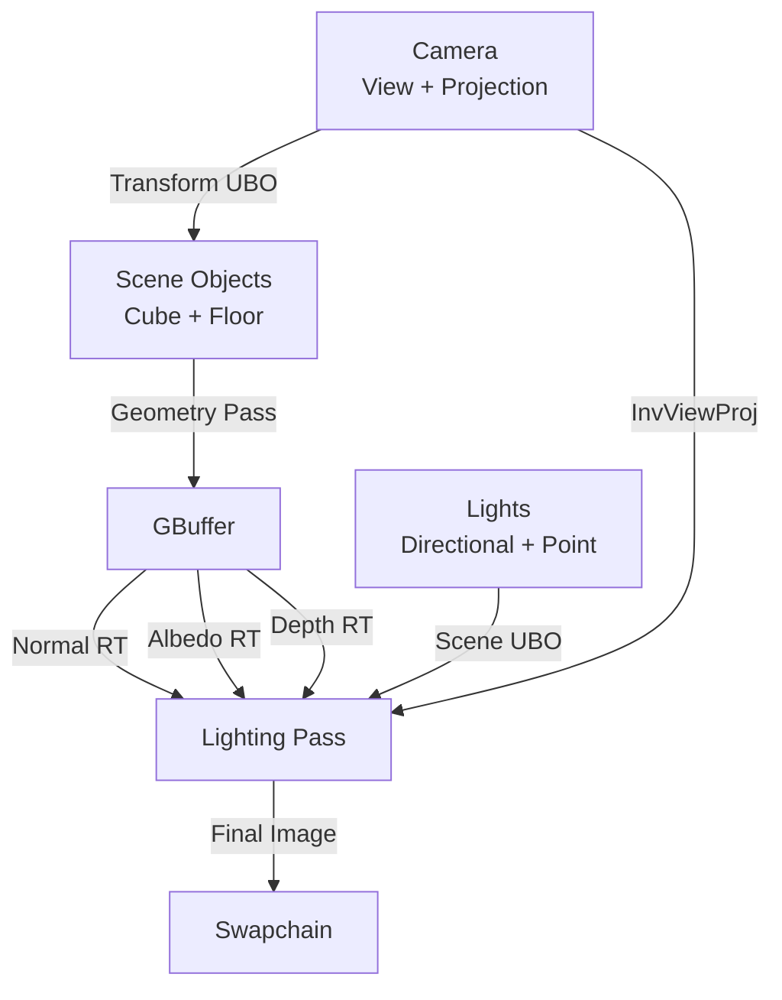

# MonsterEngine 延迟渲染学习笔记

> 学习方法：费曼学习法 + 自顶向下渐进式阅读
> 学习时间：2026-04-25
> 目标：深入理解延迟渲染的实现原理和代码细节

---

## 📖 第一层：概念理解（What & Why）

### 1.1 什么是延迟渲染？

**用简单的话解释**：
延迟渲染（Deferred Rendering）是一种将"几何处理"和"光照计算"分离的渲染技术。

**类比**：
- **传统前向渲染**：像是边做饭边上菜，每道菜（物体）做好后立即计算调料（光照）
- **延迟渲染**：像是先把所有食材（几何信息）准备好放在台面上（GBuffer），然后统一调味（光照计算）

### 1.2 为什么需要延迟渲染？

**前向渲染的问题**：
```
场景有 100 个物体，10 个光源
前向渲染：100 物体 × 10 光源 = 1000 次光照计算
延迟渲染：只对屏幕可见像素计算光照，假设屏幕 1920×1080 = 2,073,600 像素
           但每个像素只计算一次所有光照 = 2,073,600 次（与物体数量无关！）
```

**优势**：
1. **光源数量不受限**：光照计算只与屏幕像素数相关
2. **避免过度绘制**：只处理最终可见的像素
3. **统一光照模型**：所有光照在同一个 Pass 中计算

**劣势**：
1. **内存占用大**：需要存储 GBuffer（多张纹理）
2. **不支持透明物体**：透明物体仍需前向渲染
3. **带宽消耗高**：需要读写多张 GBuffer 纹理

---

## 🏗️ 第二层：架构设计（How - 宏观）

### 2.1 MonsterEngine 延迟渲染架构

```
┌─────────────────────────────────────────────────────────────┐
│                  CubeSceneApplication                        │
│  (应用层：管理场景、相机、光照、渲染器)                          │
└────────────────────┬────────────────────────────────────────┘
                     │ 调用
                     ▼
┌─────────────────────────────────────────────────────────────┐
│                  FDeferredRenderer                           │
│  (延迟渲染器：管理 GBuffer、Pipeline、UBO)                      │
│                                                              │
│  ┌──────────────┐  ┌──────────────┐  ┌──────────────┐      │
│  │  GBuffer     │  │  Pipelines   │  │  UBOs        │      │
│  │  - Normal    │  │  - Geometry  │  │  - Transform │      │
│  │  - Albedo    │  │  - Lighting  │  │  - Scene     │      │
│  │  - Depth     │  └──────────────┘  └──────────────┘      │
│  └──────────────┘                                           │
└────────────────────┬────────────────────────────────────────┘
                     │ 使用
                     ▼
┌─────────────────────────────────────────────────────────────┐
│                  RDG (Render Dependency Graph)               │
│  (渲染图系统：管理 Pass 依赖和资源生命周期)                      │
│                                                              │
│  Pass 1: Geometry Pass (写 GBuffer)                         │
│  Pass 2: Lighting Pass (读 GBuffer，写 Swapchain)           │
└────────────────────┬────────────────────────────────────────┘
                     │ 执行
                     ▼
┌─────────────────────────────────────────────────────────────┐
│                  RHI (Vulkan Backend)                        │
│  (底层图形 API：执行实际的 GPU 命令)                            │
└─────────────────────────────────────────────────────────────┘
```

### 2.2 两个核心 Pass

#### **Pass 1: Geometry Pass (几何通道)**
- **输入**：场景中的所有不透明物体（Cube、Floor）
- **输出**：GBuffer（3 张纹理）
  - `Normal RT` (RGBA32F)：世界空间法线 + 保留通道
  - `Albedo RT` (RGBA8)：基础颜色 + Alpha
  - `Depth RT` (D24S8)：深度 + 模板
- **Shader**：`deferred_geometry.vert` + `deferred_geometry.frag`
- **Pipeline**：MRT (Multiple Render Targets) 配置

#### **Pass 2: Lighting Pass (光照通道)**
- **输入**：GBuffer（3 张纹理） + Scene UBO（光源信息）
- **输出**：Swapchain（最终屏幕图像）
- **Shader**：`deferred_lighting.vert` + `deferred_lighting.frag`
- **Pipeline**：全屏三角形，无顶点缓冲

### 2.3 数据流图



---

## 🔍 第三层：核心实现（How - 微观）

### 3.1 文件结构

```
Engine/Deferred/
├── DeferredUniformTypes.h    // UBO 数据结构定义
└── FDeferredRenderer.h/cpp   // 延迟渲染器实现

Shaders/Deferred/
├── deferred_geometry.vert    // 几何 Pass 顶点着色器
├── deferred_geometry.frag    // 几何 Pass 片段着色器
├── deferred_lighting.vert    // 光照 Pass 顶点着色器
└── deferred_lighting.frag    // 光照 Pass 片段着色器

CubeSceneApplication.h/cpp
├── initializeDeferredRenderer()  // 初始化延迟渲染器
└── renderWithDeferred()          // 延迟渲染主循环
```

### 3.2 关键数据结构

#### **TransformUBO (每个物体)**
```cpp
struct TransformUBO {
    FMatrix44f Model;      // 模型矩阵 (4x4)
    FMatrix44f View;       // 视图矩阵 (4x4)
    FMatrix44f Projection; // 投影矩阵 (4x4)
    FVector4f  CameraPos;  // 相机位置 (xyz) + padding (w)
};
// 总大小：4×16 + 4×16 + 4×16 + 4 = 196 bytes
```

#### **SceneUBO (全局，每帧一次)**
```cpp
struct SceneUBO {
    FMatrix44f InvViewProj;        // 逆视图投影矩阵 (用于位置重建)
    FVector4f  CameraPos;          // 相机位置
    FVector4f  DirLightDir;        // 方向光方向 (xyz) + 0
    FVector4f  DirLightColor;      // 方向光颜色 (rgb) + 强度 (a)
    FVector4f  PointLightPosRadius;// 点光源位置 (xyz) + 半径 (w)
    FVector4f  PointLightColor;    // 点光源颜色 (rgb) + 强度 (a)
    float      AmbientFactor;      // 环境光系数
    float      _padding[3];        // 对齐到 16 字节
};
// 总大小：4×16 + 6×16 + 16 = 176 bytes
```

#### **GBuffer 结构**
```cpp
struct FGBuffer {
    TSharedPtr<IRHITexture> NormalTarget;  // RGBA32F (法线)
    TSharedPtr<IRHITexture> AlbedoTarget;  // RGBA8 (颜色)
    TSharedPtr<IRHITexture> DepthTarget;   // D24S8 (深度)
};
```

---

## 📝 第四层：代码阅读清单

### 阶段 1：理解数据结构（10分钟）
- [ ] `DeferredUniformTypes.h` - UBO 定义
- [ ] `FDeferredRenderer.h` - 类接口

### 阶段 2：理解初始化流程（15分钟）
- [ ] `FDeferredRenderer::Initialize()` - 创建 GBuffer
- [ ] `FDeferredRenderer::LoadShaders()` - 加载 Shader
- [ ] `FDeferredRenderer::CreatePipelines()` - 创建管线

### 阶段 3：理解渲染流程（20分钟）
- [ ] `CubeSceneApplication::renderWithDeferred()` - 主渲染循环
- [ ] Geometry Pass 实现
- [ ] Lighting Pass 实现

### 阶段 4：理解 Shader（15分钟）
- [ ] `deferred_geometry.vert/frag` - 几何 Pass
- [ ] `deferred_lighting.vert/frag` - 光照 Pass

---

## 🎯 学习检查点

完成每个阶段后，尝试回答以下问题：

### 阶段 1 检查点
1. TransformUBO 为什么需要 Model、View、Projection 三个矩阵？
2. SceneUBO 中的 InvViewProj 矩阵有什么用？
3. GBuffer 为什么选择 RGBA32F、RGBA8、D24S8 这三种格式？

### 阶段 2 检查点
1. GBuffer 的分辨率是如何确定的？
2. Geometry Pipeline 为什么需要配置 MRT？
3. Lighting Pipeline 为什么不需要顶点缓冲？

### 阶段 3 检查点
1. 为什么 Geometry Pass 要遍历所有物体？
2. Lighting Pass 如何从深度重建世界坐标？
3. RDG 如何保证 Pass 的执行顺序？

### 阶段 4 检查点
1. Geometry Fragment Shader 如何输出到多个 RT？
2. Lighting Vertex Shader 如何生成全屏三角形？
3. Lighting Fragment Shader 如何计算 Phong 光照？

---

## 📚 推荐学习资源

1. **LearnOpenGL - Deferred Shading**
   https://learnopengl.com/Advanced-Lighting/Deferred-Shading

2. **UE5 源码参考**
   - `DeferredShadingRenderer.cpp`
   - `BasePassRendering.cpp`

3. **Vulkan Tutorial - Deferred Rendering**
   https://vulkan-tutorial.com/

---

## 下一步：开始阅读代码！
