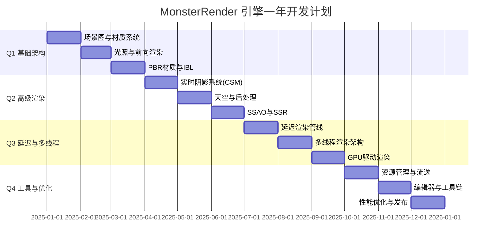
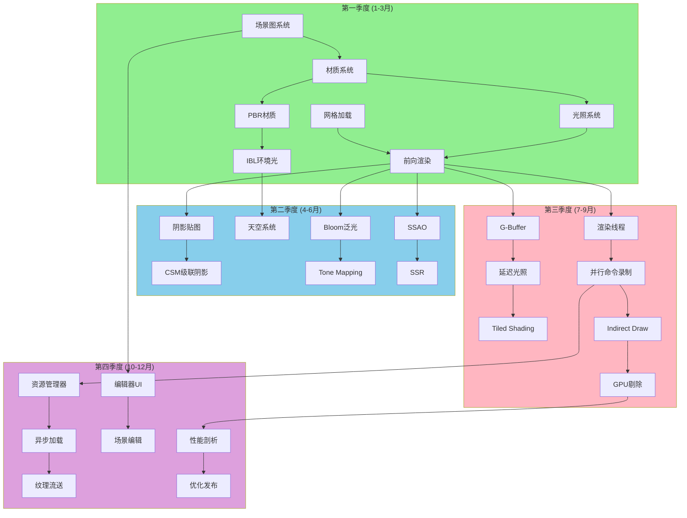
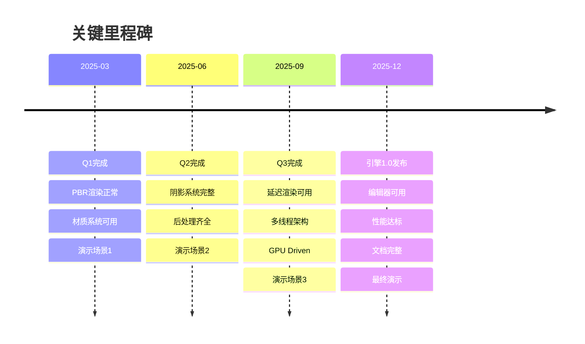
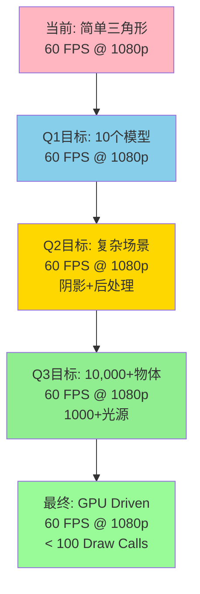
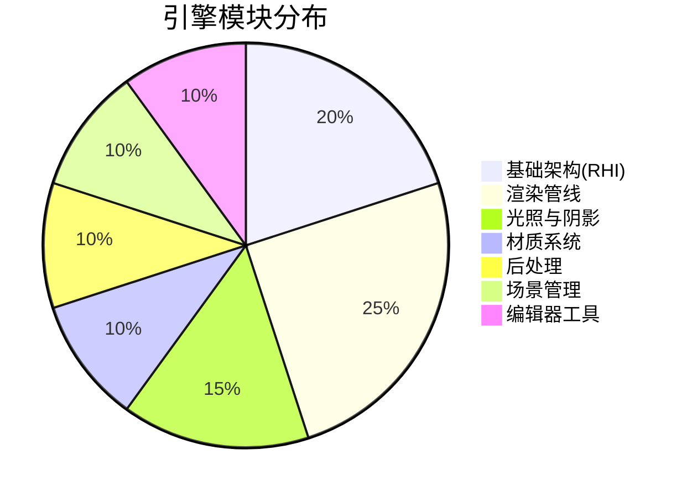

# MonsterRender 开发路线图（可视化）

## 📅 整体时间线



---

## 🗺️ 功能依赖关系图



---

## 🎯 核心里程碑



---

## 📊 季度功能概览

### Q1: 基础渲染架构 (1-3月)

```
┌─────────────────────────────────────────┐
│         基础渲染管线                     │
├─────────────────────────────────────────┤
│ ✓ 场景图系统                            │
│ ✓ 材质系统 (Material + MaterialInstance)│
│ ✓ 网格加载 (OBJ, glTF)                  │
│ ✓ 光照系统 (3种光源)                    │
│ ✓ 前向渲染管线                          │
│ ✓ PBR材质 (Cook-Torrance)               │
│ ✓ IBL环境光照                           │
└─────────────────────────────────────────┘
    ↓
演示: 10个不同材质的PBR球体
```

### Q2: 高级渲染特性 (4-6月)

```
┌─────────────────────────────────────────┐
│         阴影与后处理                     │
├─────────────────────────────────────────┤
│ ✓ 阴影贴图 (PCF软阴影)                  │
│ ✓ CSM级联阴影 (3-4层)                   │
│ ✓ 程序化天空 (Rayleigh散射)             │
│ ✓ Bloom泛光                             │
│ ✓ Tone Mapping (ACES)                   │
│ ✓ SSAO环境光遮蔽                        │
│ ✓ SSR屏幕空间反射                       │
└─────────────────────────────────────────┘
    ↓
演示: 室外大场景 + 动态昼夜
```

### Q3: 延迟渲染与性能 (7-9月)

```
┌─────────────────────────────────────────┐
│      延迟管线 + 多线程 + GPU驱动         │
├─────────────────────────────────────────┤
│ ✓ G-Buffer (4+ RT)                      │
│ ✓ 延迟光照                              │
│ ✓ Tiled/Clustered Shading               │
│ ✓ 游戏/渲染线程分离                      │
│ ✓ 并行命令录制 (3-4线程)                │
│ ✓ Indirect Drawing                      │
│ ✓ GPU Scene + GPU剔除                   │
└─────────────────────────────────────────┘
    ↓
演示: 10,000+物体 + 1000+光源 @ 60 FPS
```

### Q4: 工具链与发布 (10-12月)

```
┌─────────────────────────────────────────┐
│       编辑器 + 优化 + 发布               │
├─────────────────────────────────────────┤
│ ✓ 资源管理器 (异步加载)                 │
│ ✓ 纹理流送系统                          │
│ ✓ 编辑器UI (ImGui)                      │
│ ✓ 场景编辑器                            │
│ ✓ 材质编辑器                            │
│ ✓ 性能剖析与优化                        │
│ ✓ 文档与示例                            │
└─────────────────────────────────────────┘
    ↓
发布: MonsterRender 1.0
```

---

## 🔧 技术栈演进

```mermaid
graph LR
    subgraph 现在["已完成 (2024)"]
        N1[基础RHI]
        N2[Vulkan后端]
        N3[窗口系统]
        N4[三角形渲染]
    end
    
    subgraph Q1["Q1目标"]
        Q1_1[场景图]
        Q1_2[材质系统]
        Q1_3[PBR]
    end
    
    subgraph Q2["Q2目标"]
        Q2_1[CSM阴影]
        Q2_2[后处理]
        Q2_3[SSAO/SSR]
    end
    
    subgraph Q3["Q3目标"]
        Q3_1[延迟渲染]
        Q3_2[多线程]
        Q3_3[GPU Driven]
    end
    
    subgraph Q4["Q4目标"]
        Q4_1[编辑器]
        Q4_2[流送]
        Q4_3[优化]
    end
    
    现在 --> Q1
    Q1 --> Q2
    Q2 --> Q3
    Q3 --> Q4
    
    style 现在 fill:#90EE90
    style Q1 fill:#87CEEB
    style Q2 fill:#FFD700
    style Q3 fill:#FFB6C1
    style Q4 fill:#DDA0DD
```



---

## 📈 性能目标演进



---

## 🎨 渲染管线演进

### 当前状态

```
简单前向渲染
    ↓
设置渲染目标
    ↓
绘制三角形
    ↓
呈现
```

### Q1 结束

```
前向渲染管线
    ↓
深度预通道
    ↓
不透明物体 (PBR)
    ↓
天空盒
    ↓
透明物体
    ↓
后处理
```

### Q2 结束

```
前向渲染 + 阴影
    ↓
阴影贴图Pass (CSM)
    ↓
深度预通道
    ↓
不透明物体 (PBR + 阴影)
    ↓
天空盒
    ↓
透明物体
    ↓
后处理 (Bloom + TM + SSAO)
```

### Q3 结束

```
延迟渲染管线
    ↓
阴影贴图Pass
    ↓
几何Pass → G-Buffer
    ↓
光照Pass (Tiled)
    ↓
天空盒
    ↓
透明物体 (前向)
    ↓
后处理
```

### 最终状态 (Q4)

```
优化的混合管线
    ↓
GPU剔除 (Compute)
    ↓
阴影Pass (GPU Driven)
    ↓
几何Pass → G-Buffer
    ↓
光照Pass (Clustered)
    ↓
天空 + 大气散射
    ↓
前向Pass (透明+特效)
    ↓
后处理链 (完整)
    ↓
UI叠加
```

---

## 🧩 模块完成度



---

## 🚦 开发优先级

### 必须完成 (P0)

```
✓ 场景图系统
✓ 材质系统
✓ PBR渲染
✓ 阴影系统 (至少基础版)
✓ 前向/延迟渲染
✓ 多线程架构
✓ 基础后处理
```

### 重要 (P1)

```
✓ CSM级联阴影
✓ Tiled Shading
✓ GPU Driven渲染
✓ 资源流送
✓ 性能优化
```

### 可选 (P2)

```
○ SSR反射
○ Clustered Shading
○ 虚拟纹理
○ 材质编辑器
○ 动态GI
```

---

## 📅 每月关键交付物

| 月份 | 核心交付 | 演示场景 | 文档 |
|------|---------|---------|------|
| **1月** | 场景图 + 材质系统 | 多个静态模型 | 架构文档 |
| **2月** | 光照系统 + 前向渲染 | 多光源场景 | 光照文档 |
| **3月** | PBR + IBL | PBR材质球 | 材质文档 |
| **4月** | 阴影系统 (CSM) | 室外场景 + 阴影 | 阴影文档 |
| **5月** | 天空 + 后处理 | 昼夜循环 | 后处理文档 |
| **6月** | SSAO + SSR | 完整前向管线 | Q2总结 |
| **7月** | 延迟渲染 | G-Buffer可视化 | 延迟渲染文档 |
| **8月** | 多线程架构 | 性能对比 | 多线程文档 |
| **9月** | GPU Driven | 10,000+物体 | GPU Driven文档 |
| **10月** | 资源流送 | 大场景无卡顿 | 流送文档 |
| **11月** | 编辑器 | 可视化编辑 | 编辑器手册 |
| **12月** | 最终优化 | 最终演示 | 完整文档 |

---

## 🎓 学习曲线


---

## 🏁 完成指标

### 技术指标

- ✅ 前向渲染管线完整
- ✅ 延迟渲染管线完整
- ✅ PBR材质系统
- ✅ CSM阴影
- ✅ 后处理链 (5+ 效果)
- ✅ 多线程渲染
- ✅ GPU Driven (10,000+ 物体)

### 性能指标

- ✅ 60 FPS @ 1080p (中等场景)
- ✅ < 100 Draw Calls (GPU Driven)
- ✅ < 16ms 帧时间
- ✅ CPU 利用率 > 70%

### 可用性指标

- ✅ 基础编辑器可用
- ✅ 场景可实时编辑
- ✅ 材质可调整
- ✅ 热重载正常

### 文档指标

- ✅ 架构文档完整
- ✅ API文档齐全
- ✅ 教程 >= 5篇
- ✅ 示例项目 >= 3个

---

## 🎯 成功案例

### 参考引擎

1. **The Forge**
   - 多平台RHI抽象
   - GPU Driven架构

2. **Filament**
   - PBR材质系统
   - 后处理管线

3. **Hazel Engine**
   - 编辑器架构
   - 实时预览

4. **Lumix Engine**
   - 场景图设计
   - 资源管理

---

## 📞 需要帮助时

### 技术问题

- **图形API**: Khronos Forums, Vulkan Discord
- **渲染技术**: Graphics Programming Discord
- **架构设计**: Reddit r/gamedev

### 学习资源

- **LearnOpenGL**: 基础渲染
- **UE5源码**: 架构参考
- **GPU Gems**: 算法实现
- **SIGGRAPH**: 前沿技术

---

## 🚀 立即开始

### 本周任务 (Week 1)

1. ✅ 阅读一年开发计划
2. ⬜ 设计场景图类结构
3. ⬜ 实现 Scene 和 SceneNode
4. ⬜ 创建第一个测试场景

### 本月目标 (1月)

- 完成场景图系统
- 实现材质系统基础
- 能加载和显示多个模型

### 季度目标 (Q1)

- PBR渲染正常工作
- 前向渲染管线完整
- 演示场景可展示

---

**祝你开发顺利！按照计划逐步推进，一年后你将拥有一个现代化的渲染引擎！** 🎉

---

**相关文档**:
- 详细计划: `MonsterRender_一年开发计划.md`
- 当前架构: `引擎的架构和设计.md`
- Vulkan实现: `@Vulkan/三角形渲染流程详解.md`

