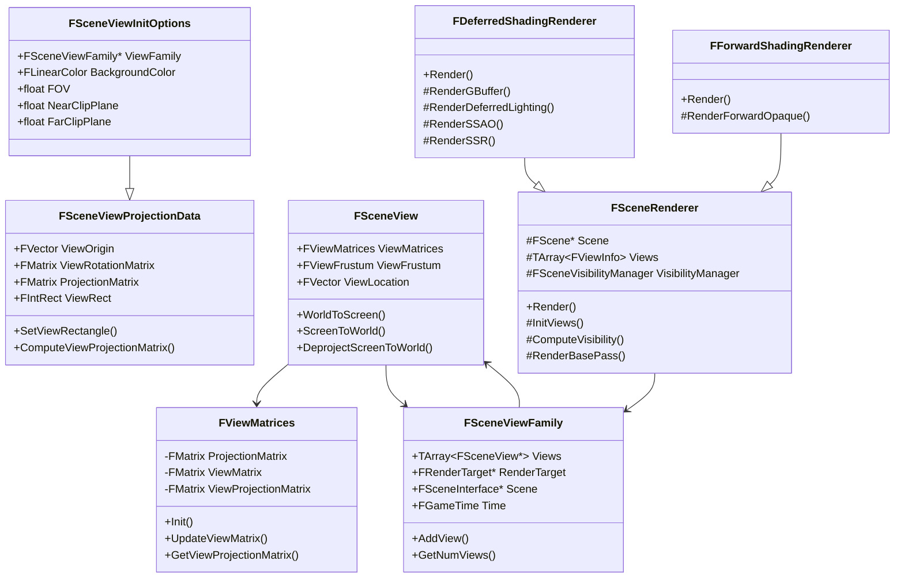
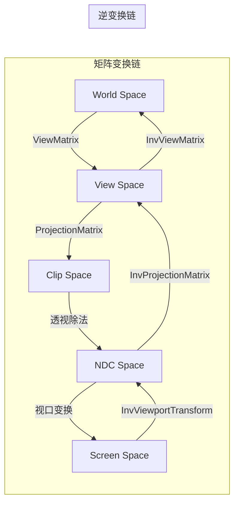
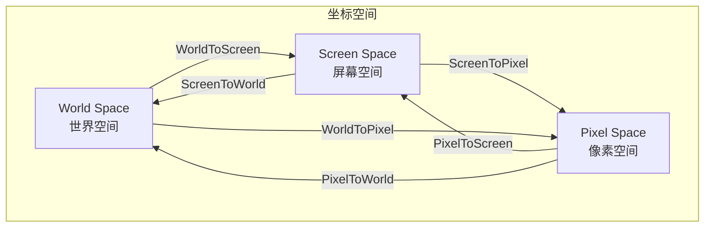
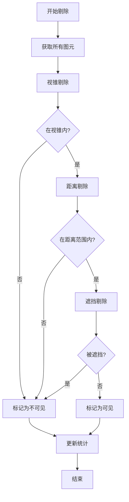
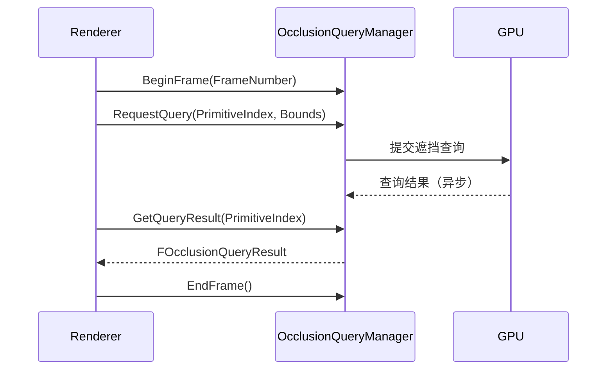
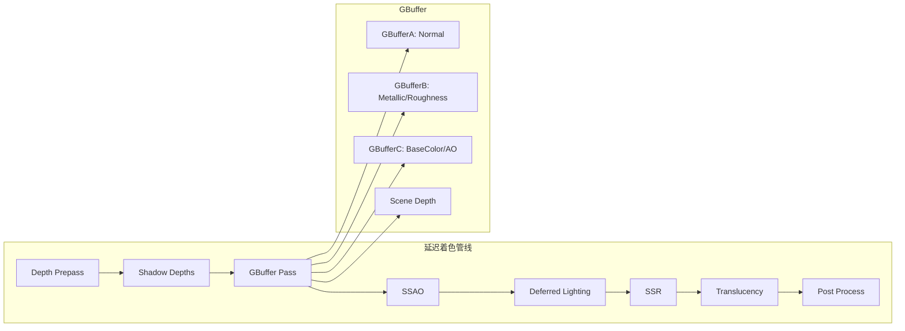
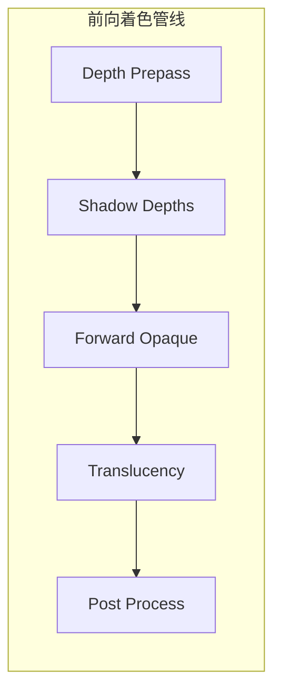
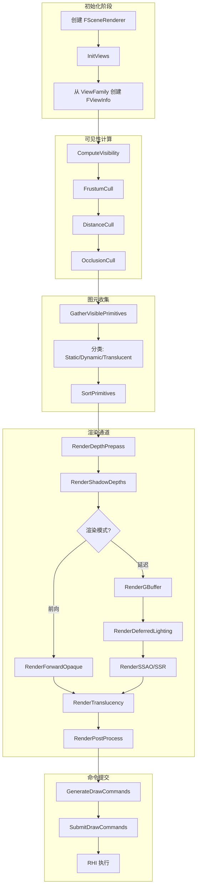
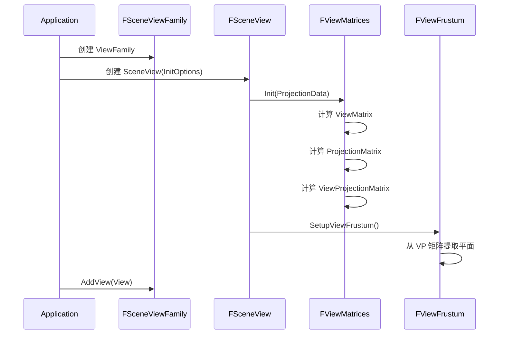

# MonsterEngine 视图系统、剔除系统与渲染器集成开发文档

## 目录

1. [概述](#概述)
2. [架构设计](#架构设计)
3. [代码结构](#代码结构)
4. [视图系统](#视图系统)
5. [剔除系统](#剔除系统)
6. [渲染器集成](#渲染器集成)
7. [核心流程](#核心流程)
8. [关键代码段](#关键代码段)
9. [扩展指南](#扩展指南)

---

## 概述

MonsterEngine 的视图系统、剔除系统和渲染器集成模块参考了 UE5 的架构设计，提供了完整的场景渲染管线支持。主要功能包括：

- **视图系统**：管理相机视图、矩阵变换、坐标转换
- **剔除系统**：视锥剔除、距离剔除、遮挡剔除
- **渲染器集成**：延迟着色、前向着色渲染管线

---

## 架构设计

### 整体架构图

```
┌─────────────────────────────────────────────────────────────────────────┐
│                           MonsterEngine 渲染架构                          │
├─────────────────────────────────────────────────────────────────────────┤
│                                                                         │
│  ┌─────────────────┐    ┌─────────────────┐    ┌─────────────────┐     │
│  │   FSceneView    │    │ FSceneViewFamily│    │   FGameTime     │     │
│  │   (场景视图)     │◄───│   (视图家族)     │───►│   (时间信息)     │     │
│  └────────┬────────┘    └────────┬────────┘    └─────────────────┘     │
│           │                      │                                      │
│           ▼                      ▼                                      │
│  ┌─────────────────┐    ┌─────────────────┐                            │
│  │  FViewMatrices  │    │  FRenderTarget  │                            │
│  │  (视图矩阵)      │    │  (渲染目标)      │                            │
│  └────────┬────────┘    └────────┬────────┘                            │
│           │                      │                                      │
│           ▼                      ▼                                      │
│  ┌─────────────────────────────────────────────────────────────┐       │
│  │                    FSceneRenderer (场景渲染器)                │       │
│  │  ┌─────────────────────┐  ┌─────────────────────┐          │       │
│  │  │FDeferredShadingRenderer│  │FForwardShadingRenderer│          │       │
│  │  │    (延迟着色渲染器)    │  │   (前向着色渲染器)    │          │       │
│  │  └─────────────────────┘  └─────────────────────┘          │       │
│  └─────────────────────────────────────────────────────────────┘       │
│           │                                                             │
│           ▼                                                             │
│  ┌─────────────────────────────────────────────────────────────┐       │
│  │              FSceneVisibilityManager (可见性管理器)            │       │
│  │  ┌───────────────┐ ┌───────────────┐ ┌───────────────────┐  │       │
│  │  │FFrustumCuller │ │FDistanceCuller│ │FOcclusionQueryMgr │  │       │
│  │  │  (视锥剔除器)  │ │ (距离剔除器)  │ │  (遮挡查询管理器)  │  │       │
│  │  └───────────────┘ └───────────────┘ └───────────────────┘  │       │
│  └─────────────────────────────────────────────────────────────┘       │
│           │                                                             │
│           ▼                                                             │
│  ┌─────────────────┐                                                   │
│  │ IRHICommandList │                                                   │
│  │   (RHI命令列表)  │                                                   │
│  └─────────────────┘                                                   │
│                                                                         │
└─────────────────────────────────────────────────────────────────────────┘
```

### 类继承关系 UML 图



---

## 代码结构

### 文件组织

```
MonsterEngine/
├── Include/Engine/
│   ├── ConvexVolume.h      # 凸体积类（视锥体表示）
│   ├── SceneView.h         # 场景视图管理
│   ├── SceneVisibility.h   # 可见性和剔除系统
│   └── SceneRenderer.h     # 场景渲染器
│
└── Source/Engine/
    ├── ConvexVolume.cpp    # 凸体积实现
    ├── SceneView.cpp       # 场景视图实现
    ├── SceneVisibility.cpp # 可见性系统实现
    └── SceneRenderer.cpp   # 渲染器实现
```

### 头文件类定义一览

| 头文件 | 类/结构体 | 说明 |
|--------|-----------|------|
| `ConvexVolume.h` | `FOutcode` | 相交测试结果 |
| | `FConvexVolume` | 基础凸体积类 |
| | `FViewFrustum` | 视锥体特化类 |
| `SceneView.h` | `FIntRect` | 整数矩形（视口定义） |
| | `FSceneViewProjectionData` | 投影数据 |
| | `FViewMatrices` | 视图变换矩阵集合 |
| | `FSceneViewInitOptions` | 视图初始化选项 |
| | `FSceneView` | 场景视图类 |
| | `FGameTime` | 时间信息 |
| | `FSceneViewFamily` | 视图家族类 |
| `SceneVisibility.h` | `FPrimitiveVisibilityState` | 图元可见性状态 |
| | `FPrimitiveFadingState` | 距离淡入淡出状态 |
| | `FPrimitiveCullingFlags` | 剔除标志 |
| | `FViewVisibilityResult` | 可见性结果 |
| | `FFrustumCuller` | 视锥剔除器 |
| | `FDistanceCuller` | 距离剔除器 |
| | `FOcclusionQueryManager` | 遮挡查询管理器 |
| | `FSceneVisibilityManager` | 场景可见性管理器 |
| `SceneRenderer.h` | `ERenderPass` | 渲染通道类型 |
| | `ERenderPassFlags` | 渲染通道标志 |
| | `FViewInfo` | 扩展视图信息 |
| | `FMeshDrawCommand` | 网格绘制命令 |
| | `FSceneRenderer` | 基础场景渲染器 |
| | `FDeferredShadingRenderer` | 延迟着色渲染器 |
| | `FForwardShadingRenderer` | 前向着色渲染器 |
| | `FRenderTarget` | 渲染目标接口 |

---

## 视图系统

### 视图矩阵管理

`FViewMatrices` 类管理所有视图变换所需的矩阵：



#### 关键代码：矩阵初始化

```cpp
// Include/Engine/SceneView.h - FViewMatrices::Init()
void Init(const FSceneViewProjectionData& ProjectionData)
{
    ViewOrigin = ProjectionData.ViewOrigin;
    ProjectionMatrix = ProjectionData.ProjectionMatrix;
    
    // 计算视图矩阵：平移 + 旋转
    ViewMatrix = FMatrix::MakeTranslation(-ViewOrigin) * ProjectionData.ViewRotationMatrix;
    
    // 计算逆矩阵
    InvProjectionMatrix = ProjectionMatrix.Inverse();
    InvViewMatrix = ViewMatrix.Inverse();
    
    // 计算组合矩阵
    ViewProjectionMatrix = ViewMatrix * ProjectionMatrix;
    InvViewProjectionMatrix = InvProjectionMatrix * InvViewMatrix;
    
    // 计算平移后的视图矩阵（用于精度优化）
    PreViewTranslation = -ViewOrigin;
    TranslatedViewMatrix = ProjectionData.ViewRotationMatrix;
    TranslatedViewProjectionMatrix = TranslatedViewMatrix * ProjectionMatrix;
}
```

### 坐标变换

`FSceneView` 提供完整的坐标变换功能：



#### 关键代码：世界坐标到屏幕坐标

```cpp
// Source/Engine/SceneView.cpp
FVector4 FSceneView::WorldToScreen(const FVector& WorldPoint) const
{
    return ViewMatrices.GetViewProjectionMatrix().TransformFVector4(
        FVector4(WorldPoint, 1.0f)
    );
}

FVector FSceneView::ScreenToWorld(const FVector4& ScreenPoint) const
{
    FVector4 WorldPoint = ViewMatrices.GetInvViewProjectionMatrix()
        .TransformFVector4(ScreenPoint);
    
    if (FMath::Abs(WorldPoint.W) > MR_SMALL_NUMBER)
    {
        return FVector(
            WorldPoint.X / WorldPoint.W,
            WorldPoint.Y / WorldPoint.W,
            WorldPoint.Z / WorldPoint.W
        );
    }
    
    return FVector::ZeroVector;
}
```

### 视图家族

`FSceneViewFamily` 管理一组共享渲染目标的视图：

```cpp
// Include/Engine/SceneView.h
class FSceneViewFamily
{
public:
    TArray<const FSceneView*> Views;  // 视图数组
    FRenderTarget* RenderTarget;       // 共享渲染目标
    FSceneInterface* Scene;            // 场景接口
    FGameTime Time;                    // 时间信息
    uint32 FrameNumber;                // 帧号
    
    // 添加视图
    void AddView(const FSceneView* View)
    {
        Views.Add(View);
    }
};
```

---

## 剔除系统

### 剔除流程



### 视锥剔除

#### 视锥体平面提取

从 ViewProjection 矩阵提取 6 个裁剪平面：

```cpp
// Include/Engine/ConvexVolume.h - FConvexVolume::Init()
void Init(const FMatrix& ViewProjectionMatrix, bool bUseNearPlane = true)
{
    Planes.Empty(6);
    
    // Left plane: Row3 + Row0
    FPlane LeftPlane;
    LeftPlane.X = ViewProjectionMatrix.M[0][3] + ViewProjectionMatrix.M[0][0];
    LeftPlane.Y = ViewProjectionMatrix.M[1][3] + ViewProjectionMatrix.M[1][0];
    LeftPlane.Z = ViewProjectionMatrix.M[2][3] + ViewProjectionMatrix.M[2][0];
    LeftPlane.W = ViewProjectionMatrix.M[3][3] + ViewProjectionMatrix.M[3][0];
    LeftPlane = LeftPlane.GetNormalized();
    Planes.Add(LeftPlane);

    // Right plane: Row3 - Row0
    FPlane RightPlane;
    RightPlane.X = ViewProjectionMatrix.M[0][3] - ViewProjectionMatrix.M[0][0];
    // ... 类似处理其他平面
    
    // Top, Bottom, Near, Far 平面类似提取
}
```

#### 包围盒相交测试

```cpp
// Include/Engine/ConvexVolume.h
bool IntersectBox(const FVector& Origin, const FVector& Extent) const
{
    for (const FPlane& Plane : Planes)
    {
        // 计算包围盒在平面法线方向的投影半径
        float PushOut = FMath::Abs(Plane.X * Extent.X) +
                        FMath::Abs(Plane.Y * Extent.Y) +
                        FMath::Abs(Plane.Z * Extent.Z);
        
        // 计算中心点到平面的距离
        float Distance = Plane.X * Origin.X + Plane.Y * Origin.Y +
                        Plane.Z * Origin.Z - Plane.W;
        
        // 如果完全在平面外侧，则不相交
        if (Distance > PushOut)
        {
            return false;
        }
    }
    return true;
}
```

### 距离剔除

```cpp
// Include/Engine/SceneVisibility.h - FDistanceCuller
bool ShouldCull(const FBoxSphereBounds& Bounds, 
                float MinDrawDistance, 
                float MaxDrawDistance) const
{
    float DistanceSquared = (Bounds.Origin - ViewOrigin).SizeSquared();
    float ScaledMaxDistance = MaxDrawDistance * MaxDrawDistanceScale;

    // 检查最小距离
    if (MinDrawDistance > 0.0f && 
        DistanceSquared < FMath::Square(MinDrawDistance))
    {
        return true;
    }

    // 检查最大距离
    if (MaxDrawDistance > 0.0f && 
        DistanceSquared > FMath::Square(ScaledMaxDistance))
    {
        return true;
    }

    return false;
}
```

### 遮挡剔除



#### 关键代码：遮挡查询管理

```cpp
// Include/Engine/SceneVisibility.h
class FOcclusionQueryManager
{
public:
    static constexpr int32 MaxPendingQueries = 4096;
    
    void BeginFrame(uint32 FrameNumber);
    void EndFrame();
    
    // 请求遮挡查询
    bool RequestQuery(int32 PrimitiveIndex, const FBoxSphereBounds& Bounds);
    
    // 获取查询结果
    bool GetQueryResult(int32 PrimitiveIndex, FOcclusionQueryResult& OutResult) const;
    
    // 检查上一帧是否可见
    bool WasVisibleLastFrame(int32 PrimitiveIndex) const;

private:
    TArray<int32> PendingQueries;
    TMap<int32, FOcclusionQueryResult> QueryResults;
    uint32 CurrentFrameNumber = 0;
};
```

---

## 渲染器集成

### 渲染通道类型

```cpp
// Include/Engine/SceneRenderer.h
enum class ERenderPass : uint8
{
    DepthPrepass,   // 深度预通道（Early-Z）
    BasePass,       // 基础通道（GBuffer/Forward）
    ShadowDepth,    // 阴影深度通道
    Lighting,       // 光照通道（延迟）
    Translucency,   // 半透明通道
    PostProcess,    // 后处理通道
    Debug,          // 调试可视化通道
    Num
};
```

### 延迟着色渲染管线



#### 关键代码：延迟着色渲染

```cpp
// Source/Engine/SceneRenderer.cpp
void FDeferredShadingRenderer::Render(IRHICommandList& RHICmdList)
{
    if (!Scene) return;

    // 初始化视图
    InitViews();
    ComputeVisibility();
    GatherVisiblePrimitives();
    SortPrimitives();

    // 延迟渲染管线
    RenderDepthPrepass(RHICmdList);
    RenderShadowDepths(RHICmdList);
    RenderGBuffer(RHICmdList);
    RenderSSAO(RHICmdList);
    RenderDeferredLighting(RHICmdList);
    RenderSSR(RHICmdList);
    RenderTranslucency(RHICmdList);
    RenderPostProcess(RHICmdList);
}

void FDeferredShadingRenderer::RenderGBuffer(IRHICommandList& RHICmdList)
{
    // GBuffer 渲染到多个渲染目标:
    // - GBufferA: World Normal (RGB), Per-object data (A)
    // - GBufferB: Metallic (R), Specular (G), Roughness (B), Shading Model (A)
    // - GBufferC: Base Color (RGB), AO (A)
    // - Scene Depth
    
    for (int32 ViewIndex = 0; ViewIndex < Views.Num(); ++ViewIndex)
    {
        TArray<FMeshDrawCommand> DrawCommands;
        GenerateDrawCommands(ViewIndex, ERenderPass::BasePass, DrawCommands);
        SubmitDrawCommands(RHICmdList, DrawCommands);
    }
}
```

### 前向着色渲染管线



#### 关键代码：前向着色渲染

```cpp
// Source/Engine/SceneRenderer.cpp
void FForwardShadingRenderer::Render(IRHICommandList& RHICmdList)
{
    if (!Scene) return;

    InitViews();
    ComputeVisibility();
    GatherVisiblePrimitives();
    SortPrimitives();

    // 前向渲染管线
    RenderDepthPrepass(RHICmdList);
    RenderShadowDepths(RHICmdList);
    RenderForwardOpaque(RHICmdList);
    RenderTranslucency(RHICmdList);
    RenderPostProcess(RHICmdList);
}
```

### 绘制命令生成与排序

```cpp
// Include/Engine/SceneRenderer.h
struct FMeshDrawCommand
{
    FPrimitiveSceneInfo* PrimitiveSceneInfo;
    FPrimitiveSceneProxy* PrimitiveSceneProxy;
    int32 MaterialIndex;
    int32 MeshElementIndex;
    uint64 SortKey;  // 排序键
    int32 NumInstances;
    int32 FirstInstance;

    void ComputeSortKey();
    bool operator<(const FMeshDrawCommand& Other) const
    {
        return SortKey < Other.SortKey;
    }
};

// 排序键组成:
// Bits 63-48: Material ID (材质批处理)
// Bits 47-32: Mesh element index
// Bits 31-0:  Distance (前后排序)
```

---

## 核心流程

### 完整渲染流程



### 视图初始化流程



---

## 关键代码段

### 1. 视锥体平面提取

```cpp
// Include/Engine/ConvexVolume.h
void FConvexVolume::Init(const FMatrix& ViewProjectionMatrix, bool bUseNearPlane)
{
    Planes.Empty(6);
    
    // Left plane: M[row][3] + M[row][0]
    FPlane LeftPlane;
    LeftPlane.X = ViewProjectionMatrix.M[0][3] + ViewProjectionMatrix.M[0][0];
    LeftPlane.Y = ViewProjectionMatrix.M[1][3] + ViewProjectionMatrix.M[1][0];
    LeftPlane.Z = ViewProjectionMatrix.M[2][3] + ViewProjectionMatrix.M[2][0];
    LeftPlane.W = ViewProjectionMatrix.M[3][3] + ViewProjectionMatrix.M[3][0];
    LeftPlane = LeftPlane.GetNormalized();
    Planes.Add(LeftPlane);

    // Right plane: M[row][3] - M[row][0]
    FPlane RightPlane;
    RightPlane.X = ViewProjectionMatrix.M[0][3] - ViewProjectionMatrix.M[0][0];
    RightPlane.Y = ViewProjectionMatrix.M[1][3] - ViewProjectionMatrix.M[1][0];
    RightPlane.Z = ViewProjectionMatrix.M[2][3] - ViewProjectionMatrix.M[2][0];
    RightPlane.W = ViewProjectionMatrix.M[3][3] - ViewProjectionMatrix.M[3][0];
    RightPlane = RightPlane.GetNormalized();
    Planes.Add(RightPlane);

    // Top plane: M[row][3] - M[row][1]
    // Bottom plane: M[row][3] + M[row][1]
    // Near plane: M[row][2]
    // Far plane: M[row][3] - M[row][2]
    // ... 类似处理
}
```

### 2. 可见性计算主流程

```cpp
// Source/Engine/SceneVisibility.cpp
void FSceneVisibilityManager::ComputeVisibility(
    const FScene& Scene,
    const FSceneView& View,
    FViewVisibilityResult& OutResult)
{
    const TArray<FPrimitiveSceneInfo*>& Primitives = Scene.GetPrimitives();
    int32 NumPrimitives = Primitives.Num();
    
    // 初始化结果
    OutResult.Init(NumPrimitives);
    
    // 1. 视锥剔除
    FrustumCull(Scene, View, OutResult);
    
    // 2. 距离剔除
    DistanceCull(Scene, View, OutResult);
    
    // 3. 遮挡剔除
    OcclusionCull(Scene, View, OutResult);
    
    ++CurrentFrameNumber;
}

void FSceneVisibilityManager::FrustumCull(
    const FScene& Scene,
    const FSceneView& View,
    FViewVisibilityResult& OutResult)
{
    FFrustumCuller Culler(View.ViewFrustum);
    const TArray<FPrimitiveBounds>& Bounds = Scene.GetPrimitiveBounds();
    
    for (int32 i = 0; i < Bounds.Num(); ++i)
    {
        const FBoxSphereBounds& PrimBounds = Bounds[i].BoxSphereBounds;
        
        if (Culler.IsVisible(PrimBounds))
        {
            OutResult.SetVisible(i);
        }
        else
        {
            ++OutResult.NumFrustumCulled;
        }
    }
}
```

### 3. 渲染器主循环

```cpp
// Source/Engine/SceneRenderer.cpp
void FSceneRenderer::Render(IRHICommandList& RHICmdList)
{
    if (!Scene)
    {
        MR_LOG(LogSceneRenderer, Warning, "Cannot render: no scene");
        return;
    }

    // 初始化视图
    InitViews();

    // 计算可见性
    ComputeVisibility();

    // 收集可见图元
    GatherVisiblePrimitives();

    // 排序图元
    SortPrimitives();

    // 渲染通道
    RenderDepthPrepass(RHICmdList);
    RenderShadowDepths(RHICmdList);
    RenderBasePass(RHICmdList);
    RenderLighting(RHICmdList);
    RenderTranslucency(RHICmdList);
    RenderPostProcess(RHICmdList);

    MR_LOG(LogSceneRenderer, Verbose, 
           "Frame %u rendered with %d views", FrameNumber, Views.Num());
}
```

### 4. 图元分类与收集

```cpp
// Source/Engine/SceneRenderer.cpp
void FSceneRenderer::GatherVisiblePrimitives()
{
    const TArray<FPrimitiveSceneInfo*>& AllPrimitives = Scene->GetPrimitives();
    
    for (int32 ViewIndex = 0; ViewIndex < Views.Num(); ++ViewIndex)
    {
        FViewInfo& ViewInfo = Views[ViewIndex];
        
        ViewInfo.VisibleStaticPrimitives.Empty();
        ViewInfo.VisibleDynamicPrimitives.Empty();
        ViewInfo.VisibleTranslucentPrimitives.Empty();
        
        for (int32 PrimitiveIndex = 0; PrimitiveIndex < AllPrimitives.Num(); ++PrimitiveIndex)
        {
            if (!ViewInfo.VisibilityResult.IsVisible(PrimitiveIndex))
                continue;
            
            FPrimitiveSceneInfo* PrimitiveInfo = AllPrimitives[PrimitiveIndex];
            FPrimitiveSceneProxy* Proxy = PrimitiveInfo->GetProxy();
            
            // 获取视图相关性
            FPrimitiveViewRelevance ViewRelevance = Proxy->GetViewRelevance(&ViewInfo);
            
            // 分类图元
            if (ViewRelevance.bHasTranslucency)
            {
                ViewInfo.VisibleTranslucentPrimitives.Add(PrimitiveInfo);
            }
            else if (ViewRelevance.bStaticRelevance)
            {
                ViewInfo.VisibleStaticPrimitives.Add(PrimitiveInfo);
            }
            else if (ViewRelevance.bDynamicRelevance)
            {
                ViewInfo.VisibleDynamicPrimitives.Add(PrimitiveInfo);
            }
        }
    }
}
```

### 5. 半透明排序

```cpp
// Source/Engine/SceneRenderer.cpp
void FSceneRenderer::SortPrimitives()
{
    for (int32 ViewIndex = 0; ViewIndex < Views.Num(); ++ViewIndex)
    {
        FViewInfo& ViewInfo = Views[ViewIndex];
        
        // 半透明物体从后向前排序
        if (ViewInfo.VisibleTranslucentPrimitives.Num() > 1)
        {
            const FVector ViewOrigin = ViewInfo.ViewLocation;
            
            ViewInfo.VisibleTranslucentPrimitives.Sort(
                [&ViewOrigin](const FPrimitiveSceneInfo* A, 
                              const FPrimitiveSceneInfo* B)
                {
                    FPrimitiveSceneProxy* ProxyA = A->GetProxy();
                    FPrimitiveSceneProxy* ProxyB = B->GetProxy();
                    
                    float DistA = (ProxyA->GetBounds().Origin - ViewOrigin).SizeSquared();
                    float DistB = (ProxyB->GetBounds().Origin - ViewOrigin).SizeSquared();
                    
                    return DistA > DistB; // 从后向前
                });
        }
    }
}
```

---

## 扩展指南

### 添加新的剔除方法

1. 在 `SceneVisibility.h` 中定义新的剔除器类：

```cpp
class FCustomCuller
{
public:
    bool ShouldCull(const FBoxSphereBounds& Bounds) const;
};
```

2. 在 `FSceneVisibilityManager` 中添加调用：

```cpp
void FSceneVisibilityManager::ComputeVisibility(...)
{
    FrustumCull(Scene, View, OutResult);
    DistanceCull(Scene, View, OutResult);
    CustomCull(Scene, View, OutResult);  // 新增
    OcclusionCull(Scene, View, OutResult);
}
```

### 添加新的渲染通道

1. 在 `ERenderPass` 枚举中添加新类型：

```cpp
enum class ERenderPass : uint8
{
    // ... 现有通道
    CustomPass,  // 新增
    Num
};
```

2. 在渲染器中实现新通道：

```cpp
class FCustomRenderer : public FSceneRenderer
{
protected:
    virtual void RenderCustomPass(IRHICommandList& RHICmdList);
};
```

### 自定义可见性查询

实现 `ICustomVisibilityQuery` 接口：

```cpp
class FMyVisibilityQuery : public ICustomVisibilityQuery
{
public:
    virtual bool IsVisible(int32 VisibilityId, 
                          const FBoxSphereBounds& Bounds) override
    {
        // 自定义可见性逻辑
        return true;
    }
    
    virtual void PrepareForFrame(const FSceneView& View) override
    {
        // 每帧准备工作
    }
};

// 使用
VisibilityManager.SetCustomVisibilityQuery(&MyQuery);
```

---

## 参考资料

- UE5 源码路径: `E:\UnrealEngine\Engine\Source\Runtime\Renderer\`
- 相关文件:
  - `SceneView.h` / `SceneView.cpp`
  - `SceneVisibility.cpp`
  - `SceneRendering.h` / `SceneRendering.cpp`
  - `DeferredShadingRenderer.h` / `DeferredShadingRenderer.cpp`

---

*文档版本: 1.0*  
*最后更新: 2024年*  
*作者: MonsterEngine 开发团队*
